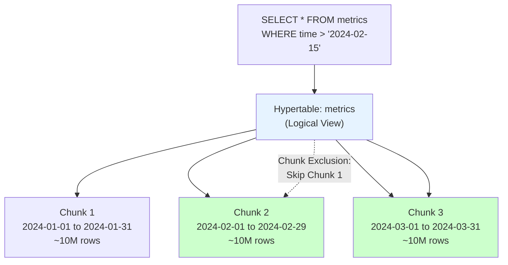
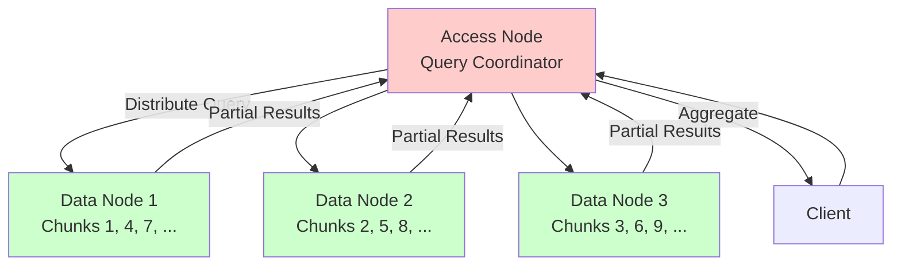

# 06. TimescaleDB: PostgreSQL for Time-Series Data

## 1. Introduction

TimescaleDB is **not a separate database**—it's a **PostgreSQL extension** that transforms PostgreSQL into a high-performance time-series database. You get all of PostgreSQL's power (ACID, SQL, JOINs, indexes) plus time-series superpowers: automatic partitioning, columnar compression, continuous aggregates, and retention policies.

This hybrid nature is TimescaleDB's killer feature. Unlike InfluxDB or Prometheus (purpose-built time-series databases with custom query languages), TimescaleDB speaks **standard SQL**. Your existing PostgreSQL tools, ORMs, and knowledge transfer directly. But unlike raw PostgreSQL (which struggles with billions of time-series rows), TimescaleDB can handle **petabytes** of time-series data efficiently.

**What Makes TimescaleDB Different**: TimescaleDB introduces **hypertables**—logical tables that are transparently partitioned into **chunks** based on time. When you `INSERT` a metric with `timestamp = 2024-01-15`, TimescaleDB automatically routes it to the correct chunk (e.g., the chunk for January 2024). When you `SELECT`, TimescaleDB queries only relevant chunks (chunk exclusion, similar to partition pruning in other databases).

**Industry Adoption**: TimescaleDB powers monitoring at Comcast (billions of IoT metrics), financial analytics at Coinbase, and infrastructure monitoring at countless companies. It's chosen when you need **time-series performance** but want to keep **PostgreSQL compatibility** (and avoid lock-in to proprietary time-series databases).

**The Trade-off**: TimescaleDB inherits PostgreSQL's limitations: it's not designed for horizontal sharding (though TimescaleDB Cloud offers multi-node clustering). For truly massive scale (trillions of metrics across dozens of nodes), Cassandra or InfluxDB might be better. But for most use cases (tens of billions of metrics on a single powerful server), TimescaleDB is ideal.

---

## 2. Core Architecture

TimescaleDB extends PostgreSQL with **hypertables** and **chunks**.



### Hypertables and Chunks

**Hypertable**: A virtual table spanning multiple chunks. You interact with it like a normal table:
```sql
CREATE TABLE metrics (
  time TIMESTAMPTZ NOT NULL,
  device_id INT,
  cpu FLOAT,
  memory FLOAT
);

-- Convert to hypertable
SELECT create_hypertable('metrics', 'time');
```

**Chunks**: Physical PostgreSQL tables that store data for specific time ranges. TimescaleDB automatically creates chunks (default: 7-day intervals). For a year of data, you have ~52 chunks.

**Chunk Exclusion**: When you query `WHERE time > '2024-06-01'`, PostgreSQL's planner **skips chunks** for January-May (partition pruning). Instead of scanning 365 days of data, it scans only June-December.

### Replication and Consensus

TimescaleDB **inherits PostgreSQL's replication** (see `Database/01_PostgreSQL.md` for details):
- **Streaming Replication**: Primary + standbys (1 writer, N readers)
- **Logical Replication**: Selective table replication
- **Patroni + etcd**: For automatic failover (consensus-based HA, see `Coordination/01_Raft_Consensus_Algorithm.md`)

**Read Replicas for Time-Series**: Time-series workloads are often **read-heavy** (dashboards querying metrics). Configure **hot standby** replicas:
```sql
-- On standby, enable read-only queries
hot_standby = on
```

Clients can **read from standbys** (reducing load on primary) while writes go to the primary. Example: Grafana dashboards query standbys; ingestion writes to primary.

---

## 3. How It Works: Compression, Continuous Aggregates, and Retention

### A. Columnar Compression

Time-series data is highly compressible (e.g., CPU metrics for 1000 servers might be similar values). TimescaleDB uses **columnar compression** on old chunks.

**How It Works**:
1. **Row-Based Storage** (default): New data is inserted as rows (PostgreSQL's normal heap storage). Fast for writes and recent queries.
2. **Compression Policy**: After data is older than X days (e.g., 7 days), compress it.
   ```sql
   SELECT add_compression_policy('metrics', INTERVAL '7 days');
   ```
3. **Columnar Format**: Compressed chunks store data column-by-column (similar to Parquet). All `cpu` values are stored together (enabling delta encoding, RLE, etc.).

**Compression Algorithms**:
- **Delta-of-Delta**: For timestamps. Store first timestamp, then deltas between consecutive timestamps (timestamps in time-series are often evenly spaced, e.g., every 10 seconds).
- **Gorilla**: For floating-point values (XOR encoding). If consecutive values are similar (e.g., `cpu = 23.4, 23.5, 23.6`), Gorilla stores only the XOR differences.
- **Dictionary Encoding**: For strings (e.g., `device_id`). Map unique values to integers.

**Compression Ratio**: Typical time-series data compresses **10-100×**. A 1 TB uncompressed table might become 10-100 GB compressed.

**Trade-off**: Compressed chunks are **read-only**. You can't UPDATE or DELETE compressed data (you must decompress the chunk first, which is slow). This is fine for time-series (append-only workloads).

### B. Continuous Aggregates

**Problem**: You have 10 billion metrics (`INSERT` every second). A dashboard queries `SELECT AVG(cpu) FROM metrics WHERE time > now() - INTERVAL '1 day' GROUP BY time_bucket('5 minutes', time)`. This aggregates 17,280 rows per query (86,400 seconds / 5 minutes). Slow.

**Continuous Aggregates**: Precompute and materialize the aggregation:
```sql
CREATE MATERIALIZED VIEW cpu_5min
WITH (timescaledb.continuous) AS
SELECT time_bucket('5 minutes', time) AS bucket,
       device_id,
       AVG(cpu) AS avg_cpu
FROM metrics
GROUP BY bucket, device_id;
```

**How It Works**:
1. TimescaleDB **incrementally updates** the materialized view as new data arrives (every minute by default, configurable via `refresh_lag`).
2. Queries against `cpu_5min` are **instant** (no aggregation needed, just index scans).
3. For recent data (not yet materialized), TimescaleDB **combines** the materialized view with raw data (transparent to the user).

**Background Refresh Policy**:
```sql
SELECT add_continuous_aggregate_policy('cpu_5min',
  start_offset => INTERVAL '1 month',
  end_offset => INTERVAL '1 minute',
  schedule_interval => INTERVAL '1 minute');
```

### C. Retention Policies

Time-series data often has limited value after, say, 90 days. TimescaleDB automates deletion:
```sql
SELECT add_retention_policy('metrics', INTERVAL '90 days');
```

**How It Works**:
- Every day (configurable), TimescaleDB **drops entire chunks** older than 90 days.
- Dropping a chunk is **instant** (just `DROP TABLE chunk_123`, no row-by-row deletion like `DELETE FROM metrics WHERE time < ...`).

**Storage Savings**: If you ingest 1 TB/month and retain 3 months, your disk usage is ~3 TB (instead of growing indefinitely).

### D. On-Disk Storage Structure

TimescaleDB chunks are **PostgreSQL tables**, so they use PostgreSQL's storage format (see `Database/01_PostgreSQL.md`):
- **Heap storage**: 8 KB pages, TOAST for large values
- **B-tree indexes**: On `time` (for fast range queries)

**Compressed Chunks**:
- **Columnar format**: Instead of row-based heap, compressed chunks use a columnar layout.
- **Segment Files**: Each column is stored in segments (e.g., `cpu` column stored separately from `memory` column).
- **File Structure**:
  ```
  tablespace/database/
  ├── chunk_1 (uncompressed, row-based heap)
  ├── chunk_2_compressed (columnar)
  │   ├── time.seg (delta-of-delta compressed)
  │   ├── device_id.seg (dictionary encoded)
  │   ├── cpu.seg (Gorilla compressed)
  │   └── memory.seg (Gorilla compressed)
  └── ...
  ```

**Compression Metadata Table**:
TimescaleDB stores compression metadata in `_timescaledb_internal.compressed_chunk_stats`:
- Which chunks are compressed
- Compression ratio
- Decompression status

---

## 4. Deep Dive: Chunk Management and Distributed Hypertables

### Multi-Node (Distributed Hypertables)

TimescaleDB Cloud (and self-hosted multi-node setups) support **distributed hypertables**—sharding chunks across multiple PostgreSQL nodes.



**Sharding Strategy**: Chunks are distributed **round-robin** across data nodes (or by `space_dimension` like `device_id` for even distribution).

**Query Execution**: The access node (coordinator) sends queries to all data nodes, each node scans its local chunks, and the access node aggregates results.

**Replication**: Each data node is a PostgreSQL instance with its own streaming replication (primary + standbys). Writes go to data node primaries; reads can be served by data node standbys.

---

## 5. End-to-End Walkthrough: Life of a Metric

Let's trace: `INSERT INTO metrics (time, device_id, cpu) VALUES ('2024-07-15 10:30:00', 42, 75.3);`

### Step 1: Chunk Routing

TimescaleDB's **chunk dispatch** logic:
1. Extract the `time` value: `2024-07-15 10:30:00`
2. Determine which chunk range contains this timestamp (e.g., Chunk 28: July 8-14, Chunk 29: July 15-21)
3. Route the INSERT to Chunk 29

### Step 2: Write to Chunk (PostgreSQL Table)

Chunk 29 is a normal PostgreSQL table. The INSERT follows PostgreSQL's normal write path:
1. Append to **WAL**
2. Write to **shared buffers** (in-memory)
3. Eventual flush to disk by checkpointer

### Step 3: Index Update

TimescaleDB creates a **B-tree index** on `(time DESC, device_id)` for each chunk. The new row is added to the index.

### Step 4: Replication (if configured)

If you have streaming replication, the primary sends the WAL to standbys. Standbys apply the write to their copy of Chunk 29.

### Step 5: Compression (later)

After 7 days (compression policy), TimescaleDB's background worker:
1. Locks Chunk 29 (read-only)
2. Converts it to columnar format (delta-of-delta for `time`, Gorilla for `cpu`)
3. Drops the old row-based chunk, replacing it with the compressed version
4. Updates metadata (`compressed_chunk_stats`)

**Storage Reduction**: Chunk 29 was 500 MB (row-based). After compression: 20 MB (Gorilla + delta-of-delta = 25× compression).

---

## 6. Failure Scenarios: The Senior View

### Scenario A: The Chunk Explosion (Too Many Chunks)

**Symptom**: Queries slow down over time. `EXPLAIN` shows planning time is 5 seconds (longer than query execution time).

**The Mechanism**:

You set `chunk_time_interval = 1 hour`. For 1 year of data, that's **8,760 chunks**. PostgreSQL's planner must check each chunk's time range (chunk exclusion logic) for every query. For a query `WHERE time > '2024-06-01'`, the planner checks 8,760 constraints → slow planning.

**The Fix**:

**Option 1**: Increase `chunk_time_interval`:
```sql
SELECT set_chunk_time_interval('metrics', INTERVAL '7 days');
```
Now you have ~52 chunks per year (manageable).

**Option 2**: Use `timescaledb.max_chunks_per_insert` to limit chunk creation.

---

### Scenario B: The Compression Backlog

**Symptom**: Disk usage keeps growing despite compression policy. Compression jobs fail with `ERROR: could not extend file`.

**The Mechanism**:

Compression is **I/O-intensive**. If you're ingesting 10 GB/day and compressing takes 12 hours per day's worth of data, compression falls behind. After 30 days, you have 300 GB uncompressed (should be 30 GB compressed).

**The Fix**:

**Option 1**: Increase compression worker parallelism:
```sql
ALTER SYSTEM SET timescaledb.max_compression_jobs = 4;
```

**Option 2**: Compress older chunks first:
```sql
SELECT compress_chunk(i, if_not_compressed => true)
FROM show_chunks('metrics', older_than => INTERVAL '14 days') i;
```

---

## 7. Performance Tuning

**Chunk Interval**: Choose based on ingest rate and query patterns:
- High ingest (1M rows/sec): 1-day chunks
- Medium ingest (10K rows/sec): 7-day chunks
- Low ingest (100 rows/sec): 30-day chunks

**Compression**: Enable for all time-series tables (10-100× storage savings).

**Continuous Aggregates**: Precompute common dashboard queries (5-minute rollups, hourly averages).

**Index Tuning**: Create indexes on `(time DESC, other_columns)` for fast recent-data queries.

**Parallel Query**: Enable for large scans:
```sql
SET max_parallel_workers_per_gather = 4;
```

---

## 8. Constraints and Limitations

**Single-Node Scaling**: Self-hosted TimescaleDB is limited by one server's capacity (~10-100TB). Beyond that, use distributed hypertables (TimescaleDB Cloud) or shard manually.

**No Time Travel**: Unlike some databases, compressed chunks can't be updated/deleted efficiently (read-only after compression).

**PostgreSQL Overhead**: Inherits PostgreSQL's connection overhead (use pgBouncer for >1000 connections).

---

## 9. When to Use?

| Use Case | TimescaleDB | InfluxDB | Prometheus | Cassandra | PostgreSQL |
| :--- | :---: | :---: | :---: | :---: | :---: |
| **Time-Series Optimized** | ✅ | ✅ | ✅ | ⚠️ | ❌ |
| **SQL + JOINs** | ✅ | ❌ | ❌ | ❌ | ✅ |
| **Compression (10-100×)** | ✅ | ⚠️ | ✅ | ❌ | ❌ |
| **Horizontal Sharding** | ⚠️ (Cloud) | ⚠️ | ❌ | ✅ | ❌ |
| **PostgreSQL Ecosystem** | ✅ | ❌ | ❌ | ❌ | ✅ |

Choose TimescaleDB when you need time-series performance but want PostgreSQL compatibility (SQL, JOINs, ecosystem). Avoid TimescaleDB if you need horizontal sharding at massive scale (use Cassandra) or if you're already invested in Prometheus/InfluxDB.

---

## 10. Production Checklist

1. [ ] **Chunk Interval**: Set to 7 days for typical workloads
2. [ ] **Compression**: Enable with `add_compression_policy('table', INTERVAL '7 days')`
3. [ ] **Retention**: Set up `add_retention_policy` to drop old data
4. [ ] **Continuous Aggregates**: Precompute common dashboard queries
5. [ ] **Replication**: Deploy 1 primary + 2 hot standbys (read replicas)
6. [ ] **Monitoring**: Track chunk count, compression ratio, query planning time
7. [ ] **Backups**: Use `pg_dump` or continuous archiving (WAL-E/WAL-G)
8. [ ] **Connection Pooling**: Deploy pgBouncer for >100 clients
9. [ ] **Indexes**: Create B-tree indexes on `(time DESC, device_id)` for fast queries
10. [ ] **Resource Limits**: Set `shared_buffers = 25% RAM`, `work_mem = 64MB` (PostgreSQL tuning)
