# Understanding Asynchronous Programming in Python (`asyncio`)

This guide explains `asyncio`, Python's framework for asynchronous programming, using simple analogies to make it easy for first-year engineering students to grasp.

---

## The Core Idea: Why `async`/`await`?

Imagine your program's execution as a single-lane road.

- **Synchronous (Blocking):** If a very slow truck (like a **network request**, reading a **huge file**, or talking to a **database**) enters the lane, *everyone else* behind it has to stop and wait until that truck clears the lane. Your entire road is blocked.

- **Asynchronous (Non-Blocking):** With `async`/`await`, it's like the slow truck can temporarily pull over to the side of the road. While it's waiting for its slow operation to complete, other cars (other tasks) can continue down the main lane. When the truck is ready to move again, it signals, and the manager (the **Event Loop**) puts it back in the lane when clear.

This approach is incredibly useful for **I/O-bound tasks** – operations where your program spends most of its time *waiting* for external systems (like networks, disks, or APIs) rather than doing heavy calculations.

---

## Key Players in `asyncio`

### 1. The `async def` Function (The "Async" Task)

- **What it is:** A special kind of function in Python, defined with `async def`. It's known as a **Coroutine**.
- **How it works:** When you call an `async def` function, it *doesn't run immediately*. Instead, it gives you a "Coroutine Object" – essentially a promise to do work later.
- **Analogy:** A customer in a restaurant saying, "I'm ready to order, but I know my food might take a while."

```python
import asyncio

async def fetch_data():
    print("Starting data fetch...")
    await asyncio.sleep(2) # Simulate waiting for network data
    print("Data fetch complete!")
    return "My data"
```

---

### 2. The `await` Keyword (The "Pause & Yield" Signal)

- **What it is:** A keyword that can only be used inside an `async def` function.
- **How it works:** When a coroutine hits an `await` expression, it tells the Event Loop: "I'm going to wait for this operation (like `asyncio.sleep` or a network call) to finish. Please, go run other tasks in the meantime. Come back to me when this operation is done."
- **Analogy:** A customer giving a hand signal: "I've ordered my pizza. It'll take time. Manager, go help others. Alert me when it's ready!"

```python
async def my_main_task():
    print("Program starts.")
    result = await fetch_data()
    print(f"Received: {result}")
    print("Program ends.")
```

---

### 3. The Event Loop (The Smart Manager)

- **What it is:** The central "orchestrator" of `asyncio`. It's typically a single-threaded loop.
- **How it works:**
    - It maintains a list of "ready" coroutines (tasks that can currently run).
    - It maintains a list of "waiting" coroutines (tasks that are paused, waiting for an await operation to complete).
    - When a coroutine awaits, it moves from "ready" to "waiting".
    - It constantly checks with the operating system (using efficient mechanisms like `epoll` on Linux) if any I/O operations have completed.
    - When an awaited operation completes, the Event Loop moves the corresponding coroutine back from "waiting" to "ready".

- **Analogy:** The manager with a whiteboard, constantly checking who's ready, who's waiting, and getting alerts from the kitchen (OS) when orders are done.

```python
async def main():
    print("Main task starts.")
    await fetch_data()
    print("Main task continues after data fetch.")

if __name__ == "__main__":
    asyncio.run(main())
```

---

### 4. Tasks (Scheduled Coroutines)

- **What they are:** A `Task` is an object that wraps a coroutine and schedules it to run on the Event Loop.
- **How they work:** Use `asyncio.create_task()` to run multiple coroutines concurrently.
- **Analogy:** You give the manager (Event Loop) multiple "order slips" (Tasks), and the manager will juggle them efficiently.

```python
async def download_image(name, delay):
    print(f"[{name}] Starting download...")
    await asyncio.sleep(delay)
    print(f"[{name}] Download finished!")
    return f"Image {name} downloaded"

async def orchestrate_downloads():
    print("Starting multiple downloads concurrently...")

    task1 = asyncio.create_task(download_image("Pic A", 3))
    task2 = asyncio.create_task(download_image("Pic B", 1))
    task3 = asyncio.create_task(download_image("Pic C", 2))

    results = await asyncio.gather(task1, task2, task3)

    print("All downloads complete!")
    print(f"Results: {results}")

if __name__ == "__main__":
    import time
    start_time = time.time()
    asyncio.run(orchestrate_downloads())
    end_time = time.time()
    print(f"Total time taken: {end_time - start_time:.2f} seconds")
```

**Expected Output:**

```
Starting multiple downloads concurrently...
[Pic A] Starting download...
[Pic B] Starting download...
[Pic C] Starting download...
[Pic B] Download finished!
[Pic C] Download finished!
[Pic A] Download finished!
All downloads complete!
Results: ['Image Pic A downloaded', 'Image Pic B downloaded', 'Image Pic C downloaded']
Total time taken: ~3.00 seconds
```

---

## How It All Fits Together: The Flow

1. **Define `async def` Functions:** Write your I/O-bound operations as coroutines.
2. **`await` for Pauses:** Use `await` when waiting for external operations.
3. **Create Tasks:** Use `asyncio.create_task()` for concurrent execution.
4. **Start the Event Loop:** Use `asyncio.run()`.



## When to Use `asyncio`

- I/O-bound applications: Web servers, API clients, web scraping, message queues.
- High concurrency: Handle many requests without many threads.
- Event-driven systems.

---

## When **Not** to Use `asyncio`

- CPU-bound tasks: Use `multiprocessing` instead.
- Simple, sequential scripts: Adds unnecessary complexity.
- Synchronous libraries: Hard to integrate without async versions (though `asyncio.to_thread()` can help).

---

By understanding these core concepts, you're well on your way to building efficient and scalable asynchronous applications in Python!
