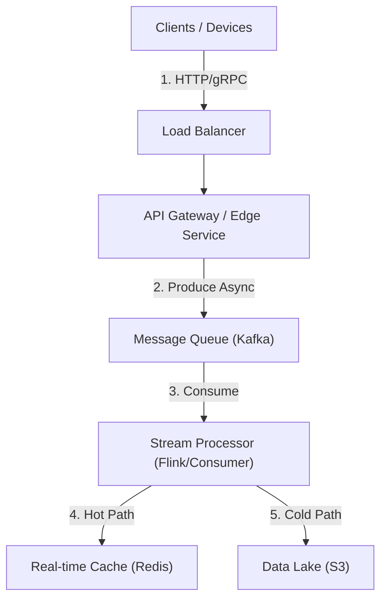

# 01. Ingestion / Aggregation

## 1. Detailed Overview
The **Ingestion & Aggregation** subsystem is the "Front Door" of data processing. Its primary purpose is to decouple **Producers** (unreliable mobile apps, millions of sensors) from **Consumers** (sensitive internal databases).
**Why do we need it?** Without this layer, a traffic spike from a marketing push would directly hit your database, causing a "Thundering Herd" outage. This system absorbs the shock (buffering) and organizes the chaos (normalization).

**Real-world Examples**:
- **Uber**: Ingests GPS points every 5s from 5M drivers. It bridges the gap between unreliable mobile networks and the core trip matching engine.
- **Datadog**: Accepts metrics from millions of servers. If the backend is slow, it must queue data, not drop it.

## 2. Requirements & Reasoning

### Functional
- **Protocol Agnostic Ingestion**:
    - *Requirement*: Support HTTP (Web), gRPC (Mobile), and MQTT (IoT).
    - *Why*: Different clients have different constraints. IoT devices need low-overhead MQTT; browsers speak HTTP.
- **Buffering (The Shock Absorber)**:
    - *Requirement*: Persist incoming data before processing.
    - *Why*: If downstream processors crash, we shouldn't lose the user's data. We need a "write-ahead log".
- **Pre-Aggregation**:
    - *Requirement*: Convert "100 clicks" into "1 click count event with value=100".
    - *Why*: Drastically reduces storage costs and query latency for the analytics layer.

### Non-Functional
- **High Write Availability (AP over CP)**:
    - *Reasoning*: For ingestion, it is better to accept a duplicate event than to reject a user's data. We prioritize **Availability**. We can deduplicate later (at read time).
- **Scalability**:
    - *Reasoning*: Traffic often grows 10x during events (Black Friday). The system must scale horizontally (add more stateless gateway nodes) without downtime.
- **Low Latency**:
    - *Target*: < 50ms ack to client.
    - *Why*: Mobile clients shouldn't freeze waiting for the server to say "Got it".

## 3. Interface Design

### Ingestion Gateway API
We maintain a lean facade. The heavy lifting happens asynchronously.

```protobuf
service EventGateway {
  // Fire-and-forget style. We return "Accepted" as soon as it hits Kafka.
  rpc SubmitEvents(BatchEventRequest) returns (AckResponse);
}

message BatchEventRequest {
  string source_id = 1; // e.g., "device_123"
  repeated Event events = 2; // Batching saves network RTT
}
```

## 4. Data Model

### The Immutable Log
We don't "update" data here. We only "append".
**Why?** Updating records in place (like in MySQL) requires locking and seeking on disk (Random I/O). Appending to a log is Sequential I/O, which is ~100x faster.

*   **Partition Key**: Crucial choice.
    *   `UserID`: Ensures all events for User A go to Partition 1. *Benefit*: Strict ordering for that user. *Risk*: Hot Partition (Justin Bieber problem).
    *   `Random`: Distributes load perfectly. *Benefit*: Max throughput. *Risk*: No ordering guarantees.

## 5. High-Level Design



### Component Breakdown
1.  **API Gateway**:
    - *Role*: Protocol termination (SSL), Auth, and Basic Validation.
    - *Why not direct to Kafka?*: We don't want to expose internal Kafka topics to the public internet. The Gateway acts as a security shield.
2.  **Message Queue (Kafka)**:
    - *Role*: Durable Buffer.
    - *Why*: Decouples speed. Producers write at 100k/sec. Consumers read at 50k/sec. Kafka holds the buildup.
3.  **Stream Processor (Flink)**:
    - *Role*: The "Brain".
    - *Why*: We need stateful logic (Windowing) to aggregate "Sum of last 5 mins". Flink handles weirdness like "Event arrived 2 mins late" better than a simple script.

## 6. Deep Dive & Core Problems

### A. Backpressure Handling
**Scenario**: The Database is slow. The Stream Processor cannot write.
**What happens?** The Stream Processor stops committing "reads" to Kafka. The Lag grows.
**The Fix**:
1.  **Queue**: Kafka absorbs the lag. We have disk space for days of retention.
2.  **Shedding**: If Kafka fills up, the **Gateway** must start returning `HTTP 429 Too Many Requests`.
3.  *Why*: It is better to reject new data strictly than to crash the entire internal backend (Cascading Failure).

### B. Hot Partitions (The "Celebrity" Issue)
**Problem**: We partition by `UserID` to keep order. User "Bieber" generates 1000x more events. Partition 4 becomes overloaded and slow.
**Solution**: **Salting**.
- Instead of key `Bieber`, we detect he is a "Hot User".
- We assign keys `Bieber#1`, `Bieber#2` ... `Bieber#10`.
- This spreads his data across 10 partitions.
- *Trade-off*: We lose strict ordering across the 10 sub-keys, and we must re-aggregate them on read.

### C. Delivery Semantics (Why "Exactly-Once" is hard)
- **At-most-once**: Fire and forget. *Risk*: Data loss. Good for IoT Sensor temp.
- **At-least-once**: Retry until success. *Risk*: Duplicates.
- **Exactly-once**: Flink provides this end-to-end, but it's expensive (2-Phase Commit).
- *Choice*: Usually, **At-least-once + Idempotent Consumers** is the sweet spot.
    - *Meaning*: We allow duplicates in the queue, but the database (Consumer) checks `if request_id exists` before writing.

## 7. Technology Choices

| Component | Standard Choice | Why we chose it (The "Why") | Alternatives considered |
| :--- | :--- | :--- | :--- |
| **Buffer** | **Apache Kafka** | We need **Disk-based persistence**. If consumers are down for 4 hours, Kafka keeps the data safe on disk. RabbitMQ is mostly memory-based and risks data loss during crashes. | **Pulsar** (Better for complex queuing), **RabbitMQ** (Lower latency, less throughput) |
| **Processing** | **Apache Flink** | Flink handles **State management** (checkpoints) better than others. If a node crashes, Flink can restore the "Count so far" from RocksDB/S3. | **Spark Streaming** (Micro-batching adds latency) |
| **Gateway** | **Envoy / Go** | Need high concurrency (Async I/O) to handle 100k connection/sec. Java threads are too heavy. | **Nginx** (Harder to script complex logic) |

## 8. Summary Checklist
- [ ] **Throughput**: Can we handle 10M events/sec? (Yes, via Sharding/Partitioning).
- [ ] **Reliability**: What if a node crashes? (Kafka replication + Flink Checkpoints).
- [ ] **Backpressure**: Do we crash or degrade gracefully? (HTTP 429).
