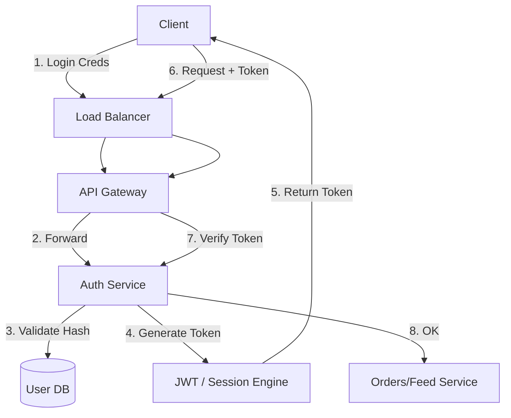

# 02. User & Identity

## 1. Detailed Overview
The **User & Identity** subsystem is the "Source of Truth" for who a user is. It isn't just a database of names; it is the **Gatekeeper**.
**Why strictness matters**: If the Feed service fails, people are bored. If Identity fails, people are hacked, or the company is sued (GDPR). This system prioritizes **Consistency and Security** over almost everything else.

**Real-world Examples**:
- **Auth0**: An entire company dedicated to "Identity as a Service" because building it securely is hard.
- **Google Sign-In**: Federated identity, delegating the complex "password storage" problem to Google.

## 2. Requirements & Reasoning

### Functional
- **Authentication (AuthN)**: "Are you who you say you are?" (Passwords, MFA, Magic Links).
- **Authorization (AuthZ)**: "Are you allowed to do this?" (RBAC - Role Based Access Control).
- **Session Management**:
    - *Requirement*: Don't ask for a password on every click.
    - *Why*: User Experience (UX). We need a temporary artifact (Session/Token) to cache trustworthiness.

### Non-Functional
- **Security (The #1 Priority)**:
    - *Reasoning*: Hashing must be slow (Bcrypt) to prevent brute-force attacks. Tokens must be signed to prevent tampering.
- **Read Availability**:
    - *Reasoning*: Every single request (View Profile, Buy Item) hits this service to check the token. If Identity is down effectively the **entire site is down**.
- **Consistency**:
    - *Reasoning*: If I change my password, all my old sessions on other devices must die immediately.

## 3. Interface Design

### Identity API

```protobuf
service IdentityService {
  // Returns a short-lived Access Token + Long-lived Refresh Token
  rpc Login(LoginRequest) returns (TokenPair);
  
  // Validates the Access Token (often internal only)
  rpc Verify(Token) returns (Claims);
  
  // High-value action: Revoke all tokens for this user
  rpc Logout(UserID) returns (Ack);
}
```

## 4. Data Model

### The Relational Truth
We use **Relational SQL** (Postgres) here.
**Why?** User data is highly structured and relational. Users have many Roles. Roles have many Permissions. Integrity constraints (`FOREIGN KEY`) prevent "Orphaned permissions". NoSQL offers flexibility we don't need here.

**Table: Users**
- `id`: PK (UUID - prevents enumeration attacks, unlike Auto-Increment Integers).
- `email`: Indexed, Unique.
- `password_hash`: **Never** plain text.
- `salt`: Random string per user. *Why?* Prevents Rainbow Table attacks where hackers pre-compute hashes for "password123".

## 5. High-Level Design



### Component Breakdown
1.  **Auth Service**: Central authority. It holds the "Private Key" to sign JWTs. No one else can sign.
2.  **User DB**: Read-Heavy, Write-Rare.
    - *Scaling*: We can heavily cache user profiles, but we generally **do not cache** password hashes to reduce attack surface.
3.  **Token Store (Redis)**: Used for "Blocklists". If a user is banned, we put their `jti` (Token ID) here.

## 6. Deep Dive & Core Problems

### A. JWT vs Session IDs (The Great Debate)
**Session IDs**:
- **Mechanism**: Server stores `SessionID=123` in Redis. Client sends 123.
- **Why use it?**: **Immediate Revocation**. If 123 is deleted from Redis, the user is logged out instantly.
- **Why avoid it?**: **Latency**. Every API call requires a Redis lookup.

**JWT (JSON Web Tokens)**:
- **Mechanism**: Stateless. Server signs `{"user": "A", "exp": "1h"}`.
- **Why use it?**: **Performance**. The OrderService can validate the signature locally (CPU only) without calling a DB/Redis.
- **Why avoid it?**: **Revocation is hard**. If I ban User A, their 1-hour token is still mathematically valid for 59 mins.
- **Staff-Level Solution**: **Short Access Token (15m) + Long Refresh Token (7d)**.
    - Access Token allows offline logic for 15 mins.
    - Refresh Token requires a DB check every 15 mins.
    - This balances Performance vs Security.

### B. Global Consistency (Geo-Replication)
**Problem**: User registers in USA. Tries to login in Europe 1 second later.
**If we use Async Replication**: Europe DB might not have the user yet. Login fails.
**Solution**: Sticky Routing or Spanner.
- **Sticky Routing**: Always route `User-X` to the USA shard.
- **Google Spanner**: True global consistency (using Atomic Clocks), but expensive.

### C. Password Storage Evolution
- **MD5/SHA1**: Fast. **Unsafe**. GPU can guess billions/sec.
- **Bcrypt/Argon2**: Configurable "Work Factor". We *want* it to be slow. Taking 200ms to hash a password is fine for a user (1 login/day), but terrible for a hacker (trying 1M passwords).

## 7. Technology Choices

| Component | Standard Choice | Why we chose it (The "Why") | Alternatives considered |
| :--- | :--- | :--- | :--- |
| **Database** | **PostgreSQL** | Rigid schema, ACID compliance is critical for account data. Robust ecosystem for Auth plugins. | **MongoDB** (Too loose; risk of data integrity issues with permissions) |
| **Cache** | **Redis** | Fastest kv-store for Session usage. Supports `TTL` to auto-logout users after inactivity. | **Memcached** (Lack of persistence) |
| **Pass Hashing**| **Argon2 / Bcrypt** | Memory-hard algorithms. Makes GPU acceleration by hackers ineffective. | **PBKDF2** (Older standard), **SHA-256** (Too fast, unsafe) |

## 8. Summary Checklist
- [ ] **Revocation**: How do you ban a user *now*? (Redis Blocklist).
- [ ] **Security**: Are we using Salts + Slow Hashes?
- [ ] **Scale**: How to handle 100M logins? (Read Replicas, Caching profiles).
