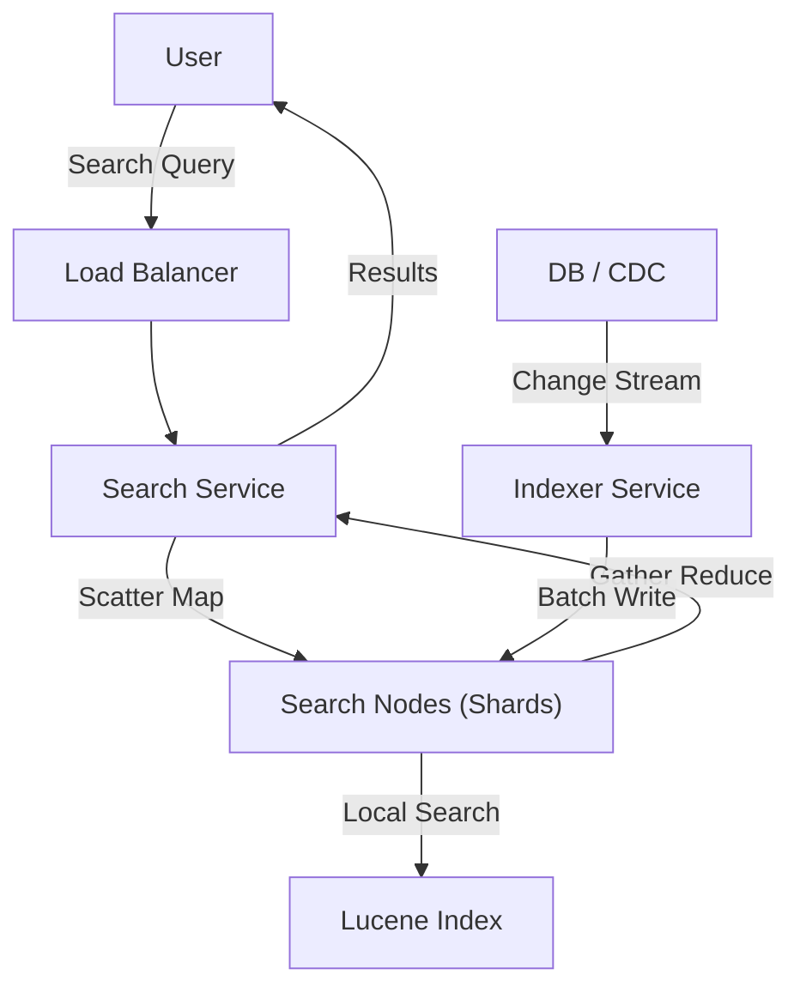

# 03. Search & Indexing

## 1. Detailed Overview
The **Search & Indexing** subsystem is about finding a needle in a haystack. While a Database is good at "Get Row ID=5", it is terrible at "Find rows where the description contains 'fast' and 'red'".
**Why separate Search from DB?**
The Access Patterns are opposite. DBs optimize for **Writes and Transactions**. Search optimizes for **Reads and Fuzzy Matching**. We replicate data from the DB to a specialized "Inverted Index" to enable this.

**Real-world Examples**:
- **Amazon**: You type "Laptop", it searches 500M products, filters by "Prime", and ranks by "Sales".
- **Log Management (ELK)**: "Find all error logs from the last 5 mins". The sheer volume of text makes `grep` impossible.

## 2. Requirements & Reasoning

### Functional
- **Full-Text Search**:
    - *Requirement*: Match "Run" to "Running" (Stemming).
    - *Why*: Exact matching is frustrating. Humans are imprecise.
- **Fuzzy Search**:
    - *Requirement*: "iphnoe" -> "iphone".
    - *Why*: Typo tolerance increases conversion rates significantly.
- **Ranking**:
    - *Requirement*: The "Best" result must be #1.
    - *Why*: Users rarely go to Page 2. Irrelevant results = lost revenue.

### Non-Functional
- **Low Latency (The 200ms Rule)**:
    - *Reasoning*: Search is interactive. If it takes 2s, the user assumes the site is broken.
- **Near-Real-Time (NRT) Ingestion**:
    - *Reasoning*: If I create a post, I expect to search for it immediately. We can tolerate a 1-second delay, but not 10 minutes.
- **High Throughput**:
    - *Reasoning*: Search is often the most hit Endpoint (more than Checkout).

## 3. Interface Design

### Search API

```protobuf
service SearchService {
  // Complex query structure needed
  rpc Search(SearchRequest) returns (SearchResponse);
}

message SearchRequest {
  string query = 1; // "Red shoes"
  repeated Filter filters = 2; // price < 50
  SortOrder sort = 3; // Relevance vs Price
  int32 page = 4;
}
```

## 4. Data Model

### The Inverted Index (The Magic)
A traditional DB looks like: `Doc1 -> "Blue Sky"`.
An Inverted Index looks like: `Blue -> [Doc1]`.
**Why?**
It changes the complexity of "Find documents with Blue" from **O(N)** (scan every doc) to **O(1)** (lookup key "Blue").

### Document Store
Once we know `Doc1` matches, we need the actual JSON content to display. This is stored in a "Forward Index" or Document Store, usually alongside the Inverted Index in Lucene.

## 5. High-Level Design



### Component Breakdown
1.  **Indexer Service**:
    - *Role*: The Writer. It tokenizes text ("Running" -> "Run").
    - *Why*: We decouple writing from reading. Indexing is CPU intensive; we don't want it to slow down search queries.
2.  **Search Shards (Scatter-Gather)**:
    - *Role*: Distributed storage.
    - *Pattern*:
        1.  **Scatter**: Send query to *all* nodes.
        2.  **Gather**: Each node returns Top 10. Coordinator merges to find the Global Top 10.
    - *Why*: We can't fit the whole internet on one machine. We split the data (Sharding).
3.  **Coordinator**:
    - *Role*: The interface that aggregates results.

## 6. Deep Dive & Core Problems

### A. Near Real-Time (NRT) Indexing
**Problem**: Writing to disk is slow (fsync).
**Solution**: **Memory Buffers**.
1.  Write new document to a RAM buffer.
2.  Data in RAM is searchable *immediately* (1 sec latency).
3.  Flush RAM to Disk periodically (Commits).
**Trade-off**: If the node crashes, RAM data is lost?
**Mitigation**: **Write Ahead Log (WAL)**. Use a simple append-only file on disk for durability, but use RAM for searchability.

### B. Sharding: Document vs Term Partitioning
**Option 1: Document Partitioning (Split by Doc ID)**
- Doc 1 goes to Node A. Doc 2 goes to Node B.
- *Query*: Must ask **ALL** nodes (Scatter-Gather).
- *Result*: Higher Query latency (limited by slowest node), but perfect load balancing of index size. **Standard Choice**.

**Option 2: Term Partitioning (Split by Word)**
- "Apple" goes to Node A. "Banana" goes to Node B.
- *Query*: If searching "Apple", ask only Node A.
- *Result*: Fast queries. **Terrible Hotspots**. If everyone searches "Apple", Node A dies. Rarely used for general search.

### C. Relevance Scoring (TF-IDF / BM25)
How do we know Doc A is "more relevant" than Doc B?
- **TF (Term Frequency)**: How many times does "Blue" appear in Doc A? (More is better).
- **IDF (Inverse Document Frequency)**: How rare is "Blue"?
    - If I search "The Beatles", "The" is common (Low IDF, ignore it). "Beatles" is rare (High IDF, important).
- **BM25**: A modern, tuned version of TF-IDF that prevents "keyword stuffing" (repeating "Blue" 1000 times doesn't help infinitely).

## 7. Technology Choices

| Component | Standard Choice | Why we chose it (The "Why") | Alternatives considered |
| :--- | :--- | :--- | :--- |
| **Search Engine** | **Elasticsearch / Opensearch** | Mature, distributed nature handles the "Scatter-Gather" for us. Logic is built on Lucene. | **Solr** (Older, XML-based config is painful), **Vespa** (Better for ML/AI ranking but steeper learning curve) |
| **Indexing Lib** | **Apache Lucene** | The industry standard for Inverted Indexes. Extremely optimized for Java. | **Bleve** (Go), **Tantivy** (Rust - faster strictly, but ecosystem is smaller) |
| **Sync** | **Kafka + Connect** | Reliable pipe from DB to Search. Ensures we don't miss updates. | **Dual Write** (App writes to DB and ES. Risk of inconsistency if one fails) |

## 8. Summary Checklist
- [ ] **Sharding**: Discuss Document Partitioning.
- [ ] **Delay**: Acknowledge that Search is "Eventually Consistent" (NRT).
- [ ] **Scoring**: Mention BM25 or TF-IDF.
- [ ] **Scale**: Why do we need scatter-gather? (Index size).
