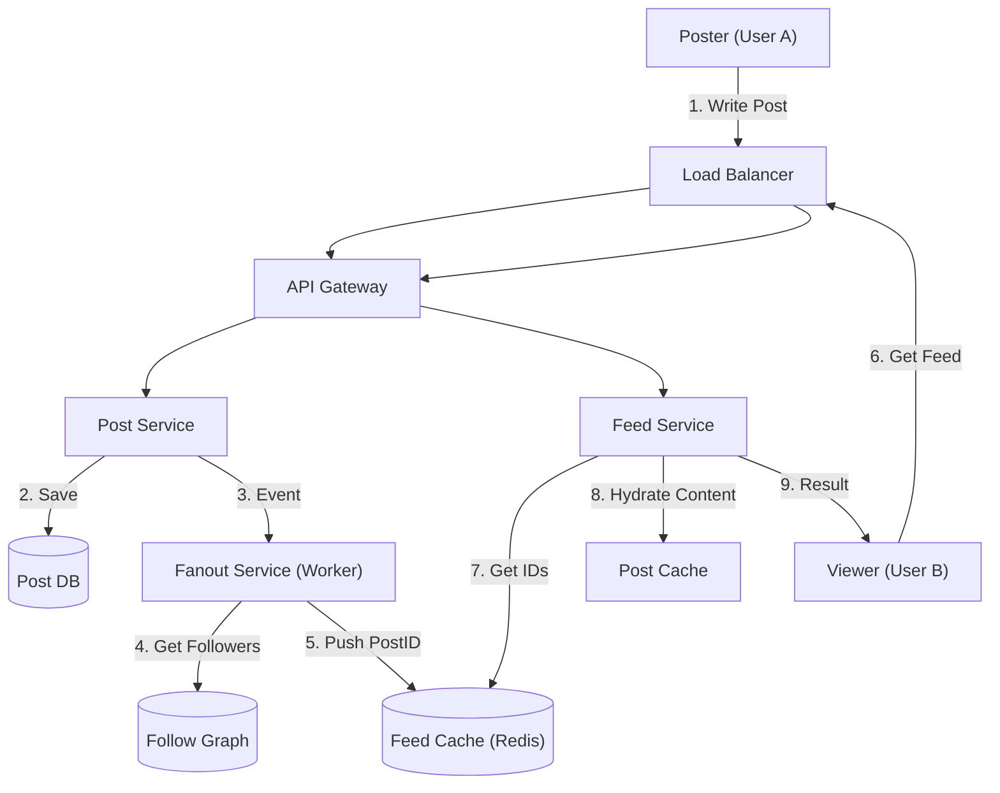

# 04. Feed / Timeline

## 1. Detailed Overview
The **Feed / Timeline** subsystem is the engagement engine of social platforms. It aggregates content from entities a user follows (Friends, Pages, Topics) into a coherent stream.
**Why is it hard?** The Scale.
- **Read skew**: People read feeds 100x more than they post.
- **Fan-out**: When "Justin Bieber" posts, we must deliver that post to 100 Million followers. This "Fan-out" problem creates massive write pressure.

**Real-world Examples**:
- **Instagram/Facebook**: Algorithmic ranking (showing what you *like*, not just what's new).
- **Twitter (X)**: Real-time, text-heavy, high velocity.
- **LinkedIn**: Professional network updates, blending "Connections" and "Recommended" content.

## 2. Requirements & Reasoning

### Functional
- **Timeline Generation**:
    - *Requirement*: "Show me posts from people I follow".
    - *Why*: This is the core product value.
- **Ranking (Algorithmic Feed)**:
    - *Requirement*: Sort by "Relevance", not just "Time".
    - *Why*: Chronological feeds are noisy. If I follow 1000 people, I'll miss my best friend's wedding photo because 900 brands posted spam. Ranking fixes retention.
- **Mutable Posts**:
    - *Requirement*: Edits and Deletes must reflect instantly.
    - *Why*: If I delete an embarrassing photo, it must disappear from *everyone's* feed immediately.

### Non-Functional
- **Read Latency (200ms)**:
    - *Reasoning*: The feed is the "Home Page". It must load instantly. We cannot run complex SQL joins (`SELECT * FROM posts WHERE user_id IN (SELECT followee FROM follows...)`) at read time for active users.
- **Eventual Consistency**:
    - *Reasoning*: If my friend posts, it's okay if I see it 5 seconds later. We prioritize Availability/Latency over strict consistency.
- **Hybrid Fan-out**:
    - *Reasoning*: We need different architectural strategies for "Normal Users" vs "Celebrities" to balance storage cost vs compute cost.

## 3. Interface Design

### Feed API

```protobuf
service FeedService {
  // The heavy read operation
  rpc GetNewsFeed(FeedRequest) returns (FeedResponse);
  
  // Publishing is simple, fan-out is async
  rpc CreatePost(PostRequest) returns (PostID);
}

message FeedRequest {
  string user_id = 1;
  string cursor = 2; // Pagination Token (don't use Offset!)
  int32 limit = 3;
}
```

## 4. Data Model

### Relational (Source of Truth)
We need a durable store for posts and graph relationships.
- **Graph DB (Neo4j/TAO)**: Best for `Follows` relationships (User -> Follows -> User).
- **Cassandra/DynamoDB**: Best for `Posts` content (Write-heavy, ID-based lookups).

### Feed Cache (The Optimization)
To meet the 200ms read target, we **pre-compute** the timeline.
- **Technology**: Redis (Sorted Sets `ZSET`).
- **Key**: `user_feed:{viewer_id}`
- **Value**: List of `PostID` sorted by Score/Time. `[ID_100, ID_99, ID_50...]`.
- **Why?**: Reading a pre-built list from Redis is O(1).

## 5. High-Level Design



### Component Breakdown
1.  **Fanout Service**: The workhorse.
    - Runs asynchronously (via Kafka).
    - Fetches followers.
    - Inserts `PostID` into every follower's Redis list.
2.  **Feed Service**: The Reader.
    - Just grabs the ID list from Redis.
    - Fetches the actual content (Text, Image URL) from a `PostCache` (Memcached) in parallel (called **Hydration**).
    - *Why Hydrate later?*: We store only IDs in the Feed Cache to save RAM. Content is stored once in a separate cache.

## 6. Deep Dive & Core Problems

### A. Push vs Pull (The Fan-out Design Pattern)
**Push Model (Fan-out on Write)**:
- *How*: When I post, write to all my followers' feeds.
- *Pro*: **Read is O(1)**. Extremely fast.
- *Con*: **Write Amplification**. If Bieber has 100M followers, 1 post = 100M Redis writes. This causes huge "lag".

    > **Why 600M READS ≠ 600M WRITES?**
    > 1. **Reads are cheaper than writes**: Redis reads are O(1) memory-only. Writes involve replication, persistence (AOF), and contention. (Cost: 1 Write ≈ 10 Reads).
    > 2. **Reads are spread over time**: 600M followers don't log in simultaneously. Writes happen in an instant "Fan-out" spike.
    > 3. **Caching kills reads**: Most reads hit local browser/CDN caches. Writes *must* hit the DB.
    > 4. **Amplification**: Push = 100M index updates. Pull = 1 row update.

**Pull Model (Fan-out on Read)**:
- *How*: When I read, query all my followings' recent posts and merge them in memory.
- *Pro*: No Storage cost. No write lag.
- *Con*: **Read is O(N)**. If I follow 2000 people, the query is slow and heavy.

**Staff Solution: Hybrid Model**:
- **Normal Users**: Use **Push**. Fast reads.
- **Celebrities (VIPs)**: Use **Pull**.
    - Bieber posts -> We write to DB (don't push).
    - You load feed -> We Fetch your Pushed Feed (Friends) + We Query Bieber's posts (Pull) -> Merge them.
- *Why*: Best of both worlds.

### B. Pagination: Offset vs Cursor
**Offset** (`LIMIT 10 OFFSET 50`):
- *Problem*: If a new post comes in while I'm reading, the list shifts. "Page 2" might duplicate the last item of "Page 1".
- *Problem*: Database performance degrades as Offset increases (skipping 1M rows is slow).
**Cursor** (`WHERE id < last_seen_id LIMIT 10`):
- *Solution*: Use the ID/Timestamp of the last item as a pointer.
- *Benefit*: Stable ordering, efficiently uses Index. **Always use Cursors for feeds**.

### C. Ranking Architecture
The architecture above assumes Chronological. For **Algorithmic**:
1.  **Candidate Gen**: Get top 1000 items from Friends + "Popular" + "Ads".
2.  **Scoring**: Run a lightweight ML model (Logistic Regression).
    - `Score = (0.5 * Recency) + (0.3 * Affinity) + (0.2 * Quality)`.
3.  **Re-Ranking**: Eliminate duplicates, enforce business rules ("Don't show 3 videos in a row").
4.  This happens *at Read Time* (or is pre-computed periodically).

## 7. Technology Choices

| Component | Standard Choice | Why we chose it (The "Why") | Alternatives considered |
| :--- | :--- | :--- | :--- |
| **Object Storage** | **Cassandra / ScyllaDB** | **Write Throughput**. Users generate billions of posts/likes. Cassandra handles writes efficiently and scales linearly. | **Postgres** (Hard to shard at this write volume) |
| **Feed Cache** | **Redis** | **ZSET (Sorted Set)** datatype is literally designed for Timelines (Value=ID, Score=Timestamp). | **Memcached** (No sorted list support) |
| **Messaging** | **Kafka** | Buffers the "Fan-out" jobs. If Bieber posts, the 100M tasks sit in Kafka, processed by workers at a sustainable rate. | |

## 8. Summary Checklist
- [ ] **Hybrid Fan-out**: The key scaling solution.
- [ ] **Hydration**: Store IDs in feed, content in separate cache.
- [ ] **Optimization**: Cursors over Offsets.
