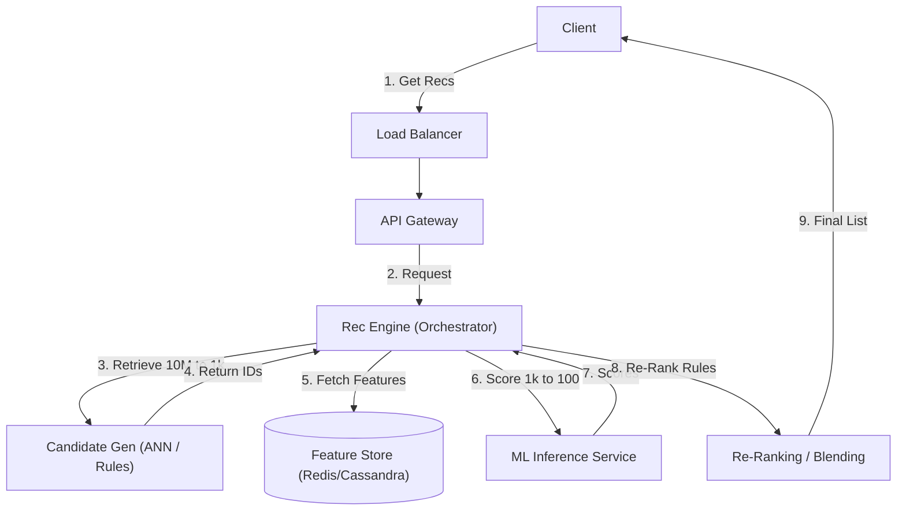

# 05. Ranking & Recommendation

## 1. Detailed Overview
The **Ranking & Recommendation** subsystem is the brain that decides *what* content a user sees. Unlike Search (where the user explicitly *asks*), Recommendations *anticipate* user needs.
**Why do we need it?**
Choice Paralysis. Spotify has 50 Million songs. If they just showed an alphabetical list, no one would listen. Recommendation filters the noise to surface the "Signal".

**Real-world Examples**:
- **TikTok**: The "For You" feed. 99% of app usage is driven by this.
- **Netflix**: Homepage personalization ("Because you watched...").
- **Amazon**: Cross-selling ("Frequently bought together").

## 2. Requirements & Reasoning

### Functional
- **Candidate Generation**:
    - *Requirement*: Rapidly filter "All Items" (1 Billion) to "Plausible Items" (1000).
    - *Why*: We cannot run heavy Neural Networks on 1 Billion items. It's too slow/expensive.
- **Scoring (The ML Model)**:
    - *Requirement*: Assign a probability score (`pClick` or `pBuy`) to each candidate.
    - *Why*: Maximizes the objective (Time Spent, Revenue).
- **Diversity / Business Rules**:
    - *Requirement*: "Don't show 10 Taylor Swift songs in a row". "Insert 1 Ad every 5 items".
    - *Why*: Good ML optimizes for the immediate click, but diversity optimizes for long-term retention.

### Non-Functional
- **Latency (The 200ms Budget)**:
    - *Reasoning*: The feed must load instantly. We have to fetch features, run the model, and sort—all in 200ms.
- **Freshness (Online Learning)**:
    - *Reasoning*: If I watch a "Cat Video", the *very next* refresh should show more cats. This "Feedback Loop" is addictive.
- **Explainability**:
    - *Reasoning*: "Why am I seeing this?" Debugging black-box AI is hard; we need tracing.

## 3. Interface Design

### RecSys API

```protobuf
service RecService {
  rpc GetRecommendations(RecRequest) returns (RecResponse);
}

message RecRequest {
  string user_id = 1;
  Context context = 2; // Device, Time, Location
  int32 limit = 3;
}

message RecResponse {
  repeated Item items = 1;
  string tracking_id = 2; // Used to join "Impressions" with "Clicks" later for training
}
```

## 4. Data Model

### The Feature Store
ML models don't understand "User Anmol". They understand Vectors and Numbers.
We need a **Feature Store** to serve these numbers in milliseconds.
- **User Features**: `{ avg_spend: 50, favorite_genre: "SciFi", last_10_clicks: [...] }`
- **Item Features**: `{ category: "Electronics", price: 100, embedding_vector: [0.1, 0.9, ...] }`

### The Feedback Log (Training Data)
- **Kafka Topic**: `UserEvents`.
- **Payload**: `{ user, item, event: "click", timestamp, tracking_id }`.
- **Why?**: This data trains the model tomorrow.

## 5. High-Level Design



### Component Breakdown
1.  **Candidate Generation (Retrieval Layer)**:
    - *Goal*: Recall (Don't miss good stuff). Speed.
    - *Tech*: **Vector Database (Milvus/Pinecone)** or **Collaborative Filtering**.
    - *Logic*: "Find items with DotProduct(UserVector, ItemVector) > 0.8".
2.  **Scoring (Ranking Layer)**:
    - *Goal*: Precision (Put the absolute best on top).
    - *Tech*: **XGBoost** or **TensorFlow/PyTorch** Model.
    - *Logic*: Input 200 features -> Output Probability (0.0 to 1.0).
3.  **Re-Ranking**:
    - *Goal*: Policy enforcement.
    - *Logic*: Deduplication, Bloom Filters (don't show what I've already bought), and Ad insertion.

## 6. Deep Dive & Core Problems

### A. The "Funnel" Architecture
**Why can't we just rank everything?**
- **Compute Cost**. Running a Deep Neural Network (DNN) costs e.g., 0.1ms per item.
- 10 Million items * 0.1ms = 1 Million ms = 16 minutes. Too slow.
- **Solution: Funnel**.
    - **Retrieval**: Cheap heuristic (ANN/Inverted Index). 10M -> 1000 items. (Cost: 10ms).
    - **Ranking**: Expensive Model. 1000 -> 100 items. (Cost: 100ms).
    - **Re-ranking**: Business Logic. 100 -> 20 items. (Cost: 5ms).

### B. Vector Embeddings & ANN
**Concept**: We represent users and items as vectors in n-dimensional space (e.g., 128 dimensions). Close vectors = Similar semantic meaning.
- **Approximate Nearest Neighbor (ANN)**:
    - Exact search is O(N).
    - ANN (HNSW / FAISS) is O(log N). It trades 1% accuracy for 100x speed.
    - **Why**: Allows "Semantic Search" (matching meaning) rather than just "Keyword Search".

### C. The "Cold Start" Problem
**Problem**: A new user signs up. We have no history. Vector is empty. A new item is added. No one has clicked it.
**Solutions**:
- **For Users**: Ask "What genres do you like?" during onboarding. Use "Global Popularity" (Generic Fallback) until they click 5 things.
- **For Items**: Content-Based Filtering. Analyze the item description/image. "This is a SciFi book", so show it to SciFi lovers even if it has 0 clicks.
- **Bandits (Exploration)**: Deliberately show new, unrated items to a small % of users to gather data ("Exploit known good, Explore unknown").

## 7. Technology Choices

| Component | Standard Choice | Why we chose it (The "Why") | Alternatives considered |
| :--- | :--- | :--- | :--- |
| **Feature Store** | **Redis / Feast** | Low latency access to features is critical for inference. Only Key-Value is fast enough. | **Cassandra** (Good for batch features, slightly slower for point lookups) |
| **Vector DB** | **Milvus / Pinecone / FAISS** | Optimized for mathematical similarity search. Standard DBs can't do this efficiently. | **Elasticsearch** (Has vector support now, but less specialized) |
| **Compute** | **Spark** | Great for offline batch training of models. | **Flink** (For real-time feature calculation) |
| **Inference** | **Triton / TF Serving** | Optimized for batching requests to the GPU. | **TorchServe** |

## 8. Summary Checklist
- [ ] **The Funnel**: Always draw the 3 stages (Candidate -> Ranking -> Re-ranking).
- [ ] **Embeddings**: Mention Dot Product / Cosine Similarity.
- [ ] **Cold Start**: Have a strategy (Heuristics / Bandits).
- [ ] **Feature Store**: The bridge between Data Eng and ML.
