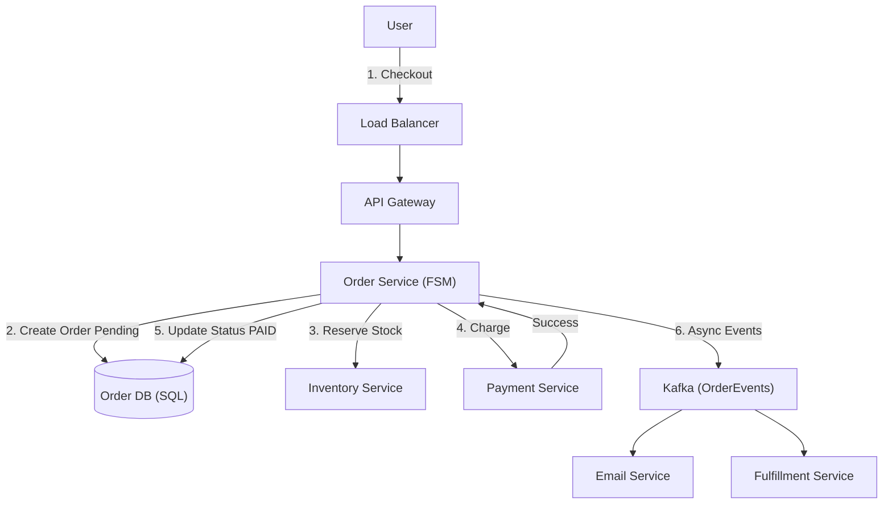

# 06. Order / Booking

## 1. Detailed Overview
The **Order / Booking** subsystem is the coordinator of commerce. It manages the lifecycle of a transaction from "I want this" to "I have it".
**Why is it complex?** It deals with money and physical reality.
- We cannot lose an order.
- We cannot charge a user twice.
- We cannot sell an item we don't have.
It requires **Strict Consistency (ACID)** and robust failure handling.

**Real-world Examples**:
- **Amazon**: Checkout pipeline.
- **Uber**: The "Trip" object (State: Request -> Matched -> Ongoing -> Completed).
- **Airbnb**: Booking a reservation (preventing double booking).

## 2. Requirements & Reasoning

### Functional
- **Cart vs Order**:
    - *Requirement*: Cart is temporary/throwaway. Order is immutable/legal record.
    - *Why*: Carts are high churn. Orders are high value.
- **State Management**:
    - *Requirement*: Move order through valid transitions (Created -> Paid -> Shipped).
    - *Why*: A "Shipped" order cannot move back to "Created". A State Machine enforces validity.
- **History**:
    - *Requirement*: User can see past orders forever.

### Non-Functional
- **ACID Consistency**:
    - *Reasoning*: Financial data must never be "Eventually Consistent". We need Transactions.
- **Idempotency**:
    - *Reasoning*: If the user clicks "Pay" and the wifi disconnects, they click again. We must charge them **exactly once**.
- **High Reliability**:
    - *Reasoning*: A lost order = Lost revenue + Angry Customer.

## 3. Interface Design

### Order API

```protobuf
service OrderService {
  // The critical "Buy" action
  rpc CreateOrder(OrderRequest) returns (OrderResponse);
  
  // Canceling is complex (may need to refund, restock)
  rpc CancelOrder(CancelRequest) returns (Ack);
}

message OrderRequest {
  string user_id = 1;
  repeated Item items = 2;
  string payment_token = 3;
  string idempotency_key = 4; // CRITICAL
}
```

## 4. Data Model

### The State Machine
We model the Order as a **Finite State Machine (FSM)**.
`Status` column is the most important field.
- **Transitions**:
    - `CREATED` + `PaySuccess` -> `PAID`
    - `PAID` + `ShipEvent` -> `SHIPPED`
    - `CREATED` + `PayFail` -> `CANCELLED`

### Database Schema (Relational)
- **Table: Orders**
    - `id`: PK
    - `user_id`: Index (fast history lookup)
    - `status`: ENUM
    - `version`: Integer (Optimistic Locking)
- **Table: OrderItems**
    - `order_id`: FK
    - `item_id`: FK
    - `price_snapshot`: (Store the price *at time of purchase*, not a link to the product, because product price changes).

## 5. High-Level Design



### Component Breakdown
1.  **Order Service**: The Orchestrator. It doesn't "do" the shipping or charging. It calls other services and tracks the result.
2.  **Order DB**: Single Source of Truth.
3.  **Kafka (Post-Processing)**:
    - *Why*: Once an order is PAID, we don't need to make the user wait for the Email to send or the Warehouse to print the label. We publish `OrderPaid` event and let downstream consumers handle it asynchronously.

## 6. Deep Dive & Core Problems

### A. Idempotency (The "Double Click" Problem)
**Scenario**: Client sends `CreateOrder`. Server charges card. Network dies. Client retries. Card charged twice.
**Solution**: **Idempotency Key**.
1.  Client generates UUID `req-123` and sends it.
2.  Server checks `IdempotencyTable`: "Have I seen `req-123`?"
3.  If **Yes**: Return the *cached response* (Order ID). Do not charge again.
4.  If **No**: Process, Charge, Save Result, Return.
**Scope**: The Key usually expires after 24h.

### B. Distributed Transactions (The Saga Pattern)
An Order touches 3 Microservices: Order, Inventory, Payment.
**Problem**: We can't wrap 3 different services in one database Transaction.
**Solution: Sagas**.
- **Choreography**: Order Service publishes "OrderCreated". Inventory listens -> Reserves -> Publishes "Reserved". Payment listens -> Charges.
    - *Pro*: Decoupled.
    - *Con*: Hard to debug circular events.
- **Orchestration (Recommended)**: Order Service explicitly calls: 1. Reserve, 2. Charge.
    - **Failure Handling (Compensation)**:
        - If Step 1 (Reserve) = OK
        - And Step 2 (Charge) = FAIL
        - User must trigger Step 3: **Release Inventory**. (Undo Step 1).
    - This "Forward Recovery" or "Backward Recovery" is the Saga pattern.

### C. Concurrency: Optimistic Locking
**Scenario**: 2 Admin tools try to update the order status at the same time.
**Solution**: `version` column.
- `UPDATE orders SET status='SHIPPED', version=6 WHERE id=100 AND version=5`
- If the row was already updated to v6 by someone else, this Query affects 0 rows.
- The Service throws `409 Conflict` and requires a retry.
- *Why*: Prevents "Last Write Wins" overwriting valid data.

## 7. Technology Choices

| Component | Standard Choice | Why we chose it (The "Why") | Alternatives considered |
| :--- | :--- | :--- | :--- |
| **Database** | **PostgreSQL / MySQL** | Strong ACID, Constraints, Transactions. The gold standard for ledgers. | **NoSQL** (Too risky for financial state, eventual consistency is bad here) |
| **Orchestrator** | **Temporal / Camunda** | Managing Sagas (retries, timeouts, compensation) by hand is brittle. These tools persist the *workflow state*. | **AWS Step Functions** |
| **Messaging** | **Kafka / SQS** | For the "Post-Order" async flow (Email, Shipping). | |

## 8. Summary Checklist
- [ ] **Idempotency**: The most important word in payments/orders.
- [ ] **Saga Pattern**: How to handle failure across microservices.
- [ ] **Optimistic Locking**: Handling concurrent updates safely.
- [ ] **State Machine**: Modeling the order lifecycle.
