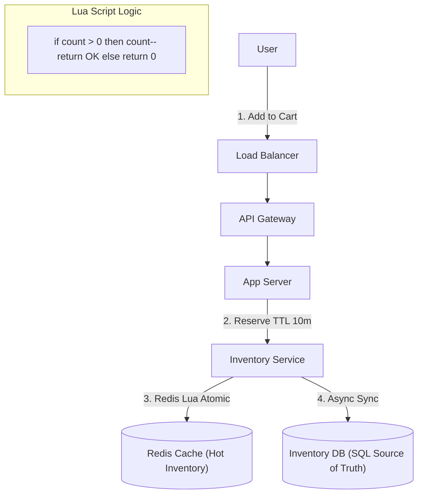

# 07. Inventory / Availability

## 1. Detailed Overview
The **Inventory** subsystem answers the questions: "How many do we have?" and "Can we sell this?".
**Why is it critical?**
- **Overselling**: Selling 11 tickets for 10 seats = Customer Service nightmare and potential refund fees.
- **Underselling**: Having stock but showing "Out of Stock" = Lost revenue.
The challenge is High Concurrency. If 10,000 users try to buy the last PlayStation 5 at the exact same second, only 1 should succeed.

**Real-world Examples**:
- **Ticketmaster**: Reserving a seat for 10 minutes while you pay.
- **Amazon**: "Only 3 left in stock".
- **Airline Booking**: Allocating seats on a specific flight.

## 2. Requirements & Reasoning

### Functional
- **Reservation**:
    - *Requirement*: Hold an item for `N` minutes.
    - *Why*: User needs time to enter credit card details. We can't sell the item to someone else during this window.
- **Deduction**:
    - *Requirement*: Permanently decrement stock on payment success.
- **Replenishment**:
    - *Requirement*: Handle returns/restocks correctly.

### Non-Functional
- **Strict Consistency**:
    - *Reasoning*: Inventory count must be atomic. No eventual consistency allowed for the "Buy" button.
- **High Throughput**:
    - *Reasoning*: Flash sales generate massive spikes. A standard SQL `UPDATE` row lock is too slow (bottleneck).
- **Latency**:
    - *Reasoning*: Checking stock happens on every Product Page Load. It must be fast (< 20ms).

## 3. Interface Design

### Inventory API

```protobuf
service InventoryService {
  // Returns true if reserved. Expired automatically after ttl_seconds.
  rpc ReserveItem(ReserveReq) returns (bool);
  
  // Confirms the reservation (Payment Success)
  rpc CommitReservation(id, quantity) returns (Ack);
  
  // Releases the reservation (Payment Failed / User Cancelled)
  rpc CancelReservation(id) returns (Ack);
}
```

## 4. Data Model

### The "Available vs Reserved" Model
We don't just store `Count = 10`. We store:
- `TotalStock`: 10
- `ReservedStock`: 2
- `Available`: `Total - Reserved` = 8.
**Why?**
This allows us to audit *who* is holding the stock. If a reservation expires, we simply decrement `ReservedStock`.

### Database Choice (Redis + Lua)
For Flash Sales, SQL is too slow.
**Why Redis?**
- Single-threaded execution means operations are atomic by default.
- **Lua Scripts**: We can bundle strict logic (`if available > 0 then decrement`) into one atomic operation that executes on the server. No network RTT race conditions.

## 5. High-Level Design



### Component Breakdown
1.  **Inventory Service**:
    - *Role*: The facade. Manages TTLs.
2.  **Redis (Hot Store)**:
    - *Role*: The actual counter.
    - *Key*: `item:{sku}:stock`.
    - *Logic*: All decrements happen here first.
3.  **SQL DB (Cold Store)**:
    - *Role*: Durability.
    - *Why*: Redis is in-memory. If it crashes, we lose the counts. We asynchronously write-back to SQL, or use Redis AOF (Append Only File) for durability.

## 6. Deep Dive & Core Problems

### A. The "Race Condition" in SQL
**Bad Approach**:
1. `current = SELECT stock FROM items WHERE id=1` (current=1)
2. `UPDATE items SET stock = current - 1`
**Problem**: Two transactions read `current=1` at the same time. Both write `0`. We sold 2 items but only had 1.
**Fix**: `UPDATE items SET stock = stock - 1 WHERE id=1 AND stock > 0`.
- This works, but **Row Locking** slows down the DB significantly during a Flash Sale (Thundering Herd).

### B. Redis Lua Scripting (The Staff Solution)
Instead of SQL locking:
1.  Load logic into Redis:
    ```lua
    local stock = redis.call('get', KEYS[1])
    if tonumber(stock) >= tonumber(ARGV[1]) then
        redis.call('decrby', KEYS[1], ARGV[1])
        return 1
    else
        return 0
    end
    ```
2.  Call it. **Atomic. Fast. No Locks.**

### C. Database Sync (Write-Back)
We updated Redis. When do we update PostgreSQL?
- **Sync**: Safe but slow. `Redis.decr()` -> `DB.update()`.
- **Async (Write-Behind)**: `Redis.decr()` -> Return Success. -> Background Worker updates DB.
    - *Risk*: If Redis crashes before Worker runs, DB is wrong.
    - *Mitigation*: Redis Persistence (AOF fsync every second). In extreme cases (selling iPhones), we typically accept the latency of **Sync** updates to the DB for the final checkout, but use Async for the "Add to Cart" reservation.

## 7. Technology Choices

| Component | Standard Choice | Why we chose it (The "Why") | Alternatives considered |
| :--- | :--- | :--- | :--- |
| **Hot Store** | **Redis** | Best-in-class support for atomic counters and Lua scripting. Essential for high-concurrency decrements. | **Memcached** (Simple integer decr is supported, but no complex conditional logic like "check if > 0 then decr" without CAS loops) |
| **Cold Store** | **PostgreSQL** | Relational integrity. Allows joining Inventory with Products and Suppliers. | **Cassandra** (Counter consistency is weaker; LWT (Lightweight Transactions) are slower than Redis) |

## 8. Summary Checklist
- [ ] **Atomicity**: Explain why `get` + `set` is bad.
- [ ] **Lua**: The magic word for Redis atomicity.
- [ ] **TTL**: Handling abandoned carts (auto-release stock).
