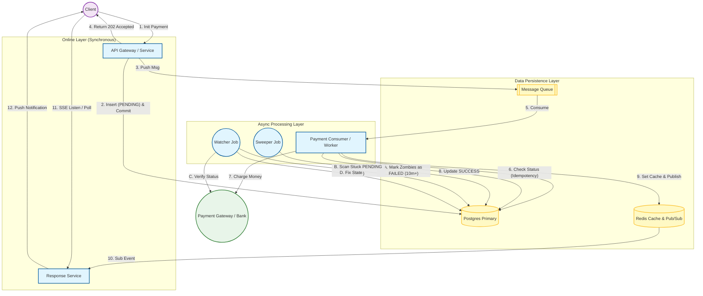

# 08. Payment & Billing

## 1. Detailed Overview
The **Payment & Billing** subsystem handles money movement. It is the most critical subsystem where "Reliability" and "Accuracy" trump "Performance" every time. 
**Why Strictness?**
- A lost user comment is annoying. A lost $1,000 transaction is a lawsuit.
- Engineers naturally optimize for speed. In Payments, you must optimize for **Correctness**.

**Real-world Examples**:
- **Stripe**: Payment Gateway (Processing cards).
- **Uber**: Charging the user after a ride.
- **Subscription Billing**: Netflix monthly charge.

## 2. Requirements & Reasoning

### Functional
- **Charge**:
    - *Requirement*: Capture funds from Credit Card / PayPal.
- **Refund**:
    - *Requirement*: Support partial and full refunds.
- **Ledger (Internal Accounting)**:
    - *Requirement*: Record every penny. `User Balance` is not just a number; it is the sum of a history of transactions.
    - *Why*: If a database corruption updates "Balance" to 0, we need the history to reconstruct the truth via replay.

### Non-Functional
- **Accuracy (Zero Floating Point Errors)**:
    - *Reasoning*: `0.1 + 0.2` in IEEE 754 floats is `0.300000000004`. In finance, those micro-pennies add up to millions. We MUST use **Integers** (cents) or **Decimal** types.
- **Idempotency (EXACTLY-ONCE)**:
    - *Reasoning*: Network timeouts are common. We must never charge a card twice for the same click.
- **Security (PCI-DSS)**:
    - *Reasoning*: We never store raw Credit Card numbers. It's a liability. We use **Tokens**.

## 3. Interface Design

### Payment API

```protobuf
service PaymentService {
  // Capture a payment intent
  // Idempotency Key is NOT optional here. It is mandatory.
  rpc Charge(ChargeRequest) returns (ChargeResponse);
  
  // Get transaction status
  rpc GetStatus(TransactionID) returns (TxStatus);
}

message ChargeRequest {
  string idempotency_key = 1; // "uuid-gen-by-client"
  int64 amount_cents = 2;     // Integer, never float. 1000 = $10.00
  string currency = 3;        // "USD"
  string payment_source = 4;  // Token from frontend (tok_visa)
}
```

## 4. Data Model

### The Double-Entry Ledger
This is a 500-year-old accounting principle.
**Do not** just have a table `User { id, balance }`.
**Do** have a table `LedgerEntries`.
*   **Structure**: Every transaction has TWO entries.
    *   Entry 1: Debit `UserAccount` $10.
    *   Entry 2: Credit `UberRevenueAccount` $10.
    *   **Invariant**: Sum of all entries in a transaction group MUST use 0.
*   **Why?**: Reliability. Money is neither created nor destroyed, only moved. If the sum != 0, we have a bug/fraud.

### Payment State Machine
`CREATED` -> `AUTHORIZED` -> `CAPTURED` -> `SETTLED` (or `FAILED`/`REFUNDED`).
Transitions are strictly enforced.

## 5. Comprehensive Architecture Design

This architecture combines **"Commit-Then-Publish"** for data safety, a **Hybrid (Push+Poll)** strategy for user experience, and **Background Workers (Watcher & Sweeper)** for fault tolerance.

### High-Level Architecture Diagram



> **Note**: This design prevents "Ghost Charges" (charging user but failing to record it) and "Double Charges" (charging twice due to retry Logic).

### End-to-End Data Flow

#### **Phase 1: Transaction Initiation (Synchronous)**
1. **Request:** Client sends `POST /pay`.
2. **Persistence:** The Service writes to **Postgres** with status `PENDING` and **Commits** the transaction. (This guarantees the record exists **before** we try to process it).
3. **Queueing:** The Service pushes the message to the **Queue**.
    * *If Queue Fails:* Retry 3x. If still failing, update DB to `FAILED` and return Error `500` to client.
4. **Ack:** Service returns `202 Accepted` to the Client.

#### **Phase 2: Processing (Asynchronous)**
5. **Pickup:** The **Consumer** reads the message from the Queue.
6. **Validation:** Consumer queries **Postgres**:
    * *Check:* Does the record exist? Is it `PENDING`?
    * *Result:* If `SUCCESS` or `FAILED`, drop message (Idempotency).
7. **Execution:** Consumer calls the **PSP** (Stripe/Bank).
8. **Completion:**
    * **DB Update:** Mark transaction as `SUCCESS`.
    * **Redis Update:** Set `status:{id}` = `SUCCESS` (TTL 1 hour).
    * **Publish:** Send event to Redis Channel `payment_updates`.

#### **Phase 3: User Notification (Hybrid Model)**
9. **Real-Time (SSE):** The **Response Service** (subscribed to Redis) receives the event and instantly pushes it to the Client via Server-Sent Events.
10. **Fallback (Poll):** If the Client doesn't receive an update in 5 seconds, it polls the **Response Service**, which checks Redis (fast) then DB (reliable) to confirm success.

#### **Phase 4: Reliability & Recovery (Background)**
11. **The Watcher (Recovery):** Runs every minute. Finds transactions stuck in `PENDING` for > 30s. It calls the PSP to check the *actual* status.
    * If PSP says "Success" → Update DB/Redis to `SUCCESS`. (Fixes network timeouts).
12. **The Sweeper (Cleanup):** Runs every 10 minutes. Finds transactions stuck in `PENDING` for > 10m.
    * Marks them `FAILED`. (Assumes process crash, zombie state, or unrecoverable error).

---

## 6. why This Design is "Production-Ready"

| Feature | Why it matters |
| --- | --- |
| **Commit-Then-Publish** | Eliminates the race condition where a Consumer tries to process a payment before the DB record exists. |
| **DB Validation in Consumer** | Prevents **Ghost Charges**. If the API fails or rolls back, the Consumer stops immediately because it finds no valid `PENDING` record. |
| **Hybrid Response** | **95%** of users get a "magic" instant experience via SSE. The **5%** with bad networks are saved by the polling fallback. |
| **Watcher + Sweeper** | Handles the "Unknown Unknowns" (Network timeouts, Server crashes, PSP outages) without human intervention. |
| **Redis Caching** | Protects your primary Postgres database from being hammered by millions of client polling requests. |

## 7. Technology Choices & Comparisons

### Database: Postgres (Relational) vs. DynamoDB vs. MongoDB
**Selection Rationale**:
We are evaluating three distinct database paradigms to serve as the **Primary System of Record** for all payment transactions and user balances. Any of these *could* theoretically be used, but they offer vastly different trade-offs:
*   **Postgres**: The candidate for a traditional **Relational (SQL)** architecture.
*   **MongoDB**: The candidate for a **Document-based (NoSQL)** architecture.
*   **DynamoDB**: The candidate for a **Key-Value / Serverless** architecture.

| Criteria | **PostgreSQL** (Chosen) | **MongoDB** (Cons) | **DynamoDB** (Cons) |
| :--- | :--- | :--- | :--- |
| **ACID Transactions** | **Native & Robust**. "Select For Update" locking is the gold standard for preventing race conditions (e.g. double spending). | Added in v4.0+, but performance cost is high. Locking is at the Document level, which is coarser than Row-level often needed. | Limited transactions (TransactWriteItems). expensive and stricter limits. |
| **Schema Strictness** | **Strict Types**. Money cannot be stored as a random string or float by accident. | **Schemaless**. Risk of 'data drift' (e.g., some records have `amount`, others `amt`). Requires manual strict validation rules. | Schemaless. Same risk as Mongo. |
| **Sharding & Scale** | **Hard**. Requires manual partitioning (e.g., `pg_partman`) or application-side sharding. Global replication is usually Read-Only vs Active-Active. | **Native**. Built-in Sharding and rebalancing. Easier to scale horizontally out of the box. | **Native & Global**. "Global Tables" offer Multi-Region Active-Active support with single-click setup. |
| **Financial Math** | **DECIMAL** type is first-class. | Prior to v3.4, stored decimals as floating point doubles (DANGEROUS). Now has Decimal128, but legacy risk exists. | Supports Numbers, but complex queries (aggregations) are harder than SQL. |
| **Joins/Reporting** | **Strong**. Finance needs "Join Users, Ledger, and Invoices". | `$lookup` exists but is slow for heavy reporting. Usually requires ETL to a Warehouse. | No Joins. Impossible for analytics without ETL. |
| **Conclusion** | **Winner**. We choose Postgres because **Correctness >> Scalability** for a Ledger. We solve scaling via functional partitioning (history vs hot) rather than risking consistency. | **Avoid**. The operational complexity of maintaining ACID in a distributed document store outweighs the benefits of schema flexibility. | **Avoid for Core Ledger**. Incredible for Scale, but the lack of flexible querying and strict locking makes "Balance Calculation" risky and complex. |

### Message Queue: Kafka vs. RabbitMQ vs. SQS
**Selection Rationale**:
*   **RabbitMQ**: Represents the classic **"Smart Broker" / Push-based** queue. It excels at complex routing and task management.
*   **Kafka**: Represents the industry standard for **Event Streaming / Pull-based**. It is chosen when throughput and replayability are paramount.
*   **SQS**: Represents the **Fully Managed / Serverless** option. It is the simplest to operate but has trade-offs in latency and features.

| Criteria | **RabbitMQ / ActiveMQ** | **Kafka** | **AWS SQS** |
| :--- | :--- | :--- | :--- |
| **Model** | **Push-based** (Smart broker, dumb consumer). Good for tasks. | **Pull-based** (Log). Good for high-throughput streaming. | **Polling**. Fully managed. |
| **Ordering** | Supported but can be tricky with parallel consumers. | **Guaranteed** within a partition. | Fifo queues available but lower throughput. |
| **Delivery Guarantee** | **Acknowledgments** are mature. Easy to implement "Retry Delay". | Offset management. "Retry" usually means a separate "Retry Topic". | Visibility timeouts handle retries naturally. |
| **Complexity** | Moderate. | High. Overkill for simple job queues. | Low (Managed). |
| **Conclusion** | **RabbitMQ or SQS** is often preferred for *Task Processing* (Charge this card) because individual task acknowledgment and "Dead Letter" handling is simpler than Kafka's stream-processing model. However, Kafka is better for *Reporting* (publishing Payment Succeeded events to Data Lake). | | |

## 8. Summary Checklist
- [ ] Shout "Idempotency Key" immediately.
- [ ] Explain "Double Entry Ledger".
- [ ] Ensure "Reconciliation" (Watcher/Sweeper) is part of the design.
- [ ] Mention "Compliance" (PCI-DSS) - Tokenization.
- [ ] Explain why **Commit-Then-Publish** is safer than Publish-Then-Commit.
