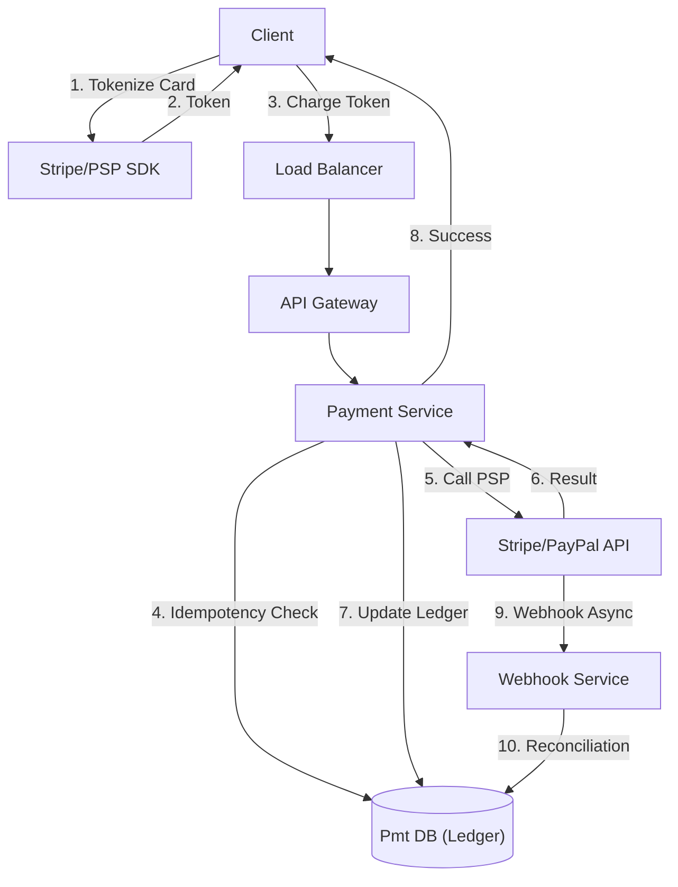

# 08. Payment & Billing

## 1. Detailed Overview
The **Payment & Billing** subsystem handles money movement. It is the most critical subsystem where "Reliability" and "Accuracy" trump "Performance" every time. 
**Why Strictness?**
- A lost user comment is annoying. A lost $1,000 transaction is a lawsuit.
- Engineers naturally optimize for speed. In Payments, you must optimize for **Correctness**.

**Real-world Examples**:
- **Stripe**: Payment Gateway (Processing cards).
- **Uber**: Charging the user after a ride.
- **Subscription Billing**: Netflix monthly charge.

## 2. Requirements & Reasoning

### Functional
- **Charge**:
    - *Requirement*: Capture funds from Credit Card / PayPal.
- **Refund**:
    - *Requirement*: Support partial and full refunds.
- **Ledger (Internal Accounting)**:
    - *Requirement*: Record every penny. `User Balance` is not just a number; it is the sum of a history of transactions.
    - *Why*: If a database corruption updates "Balance" to 0, we need the history to reconstruct the truth via replay.

### Non-Functional
- **Accuracy (Zero Floating Point Errors)**:
    - *Reasoning*: `0.1 + 0.2` in IEEE 754 floats is `0.300000000004`. In finance, those micro-pennies add up to millions. We MUST use **Integers** (cents) or **Decimal** types.
- **Idempotency (EXACTLY-ONCE)**:
    - *Reasoning*: Network timeouts are common. We must never charge a card twice for the same click.
- **Security (PCI-DSS)**:
    - *Reasoning*: We never store raw Credit Card numbers. It's a liability. We use **Tokens**.

## 3. Interface Design

### Payment API

```protobuf
service PaymentService {
  // Capture a payment intent
  // Idempotency Key is NOT optional here. It is mandatory.
  rpc Charge(ChargeRequest) returns (ChargeResponse);
  
  // Get transaction status
  rpc GetStatus(TransactionID) returns (TxStatus);
}

message ChargeRequest {
  string idempotency_key = 1; // "uuid-gen-by-client"
  int64 amount_cents = 2;     // Integer, never float. 1000 = $10.00
  string currency = 3;        // "USD"
  string payment_source = 4;  // Token from frontend (tok_visa)
}
```

## 4. Data Model

### The Double-Entry Ledger
This is a 500-year-old accounting principle.
**Do not** just have a table `User { id, balance }`.
**Do** have a table `LedgerEntries`.
*   **Structure**: Every transaction has TWO entries.
    *   Entry 1: Debit `UserAccount` $10.
    *   Entry 2: Credit `UberRevenueAccount` $10.
    *   **Invariant**: Sum of all entries in a transaction group MUST use 0.
*   **Why?**: Reliability. Money is neither created nor destroyed, only moved. If the sum != 0, we have a bug/fraud.

### Payment State Machine
`CREATED` -> `AUTHORIZED` -> `CAPTURED` -> `SETTLED` (or `FAILED`/`REFUNDED`).
Transitions are strictly enforced.

## 5. High-Level Design



### Component Breakdown
1.  **Payment Service**: Facade for PSPs. Stores the intent.
2.  **PSP (Payment Service Provider)**: Stripe/Braintree. Handles the actual banking network (Visa/Mastercard). WE DO NOT TALK TO VISA DIRECTLY.
3.  **Ledger Service**: Internal source of truth for finance.
4.  **Reconciliation Worker**: The "Safety Net" that runs at night.

## 6. Deep Dive & Core Problems

### A. Idempotency (The Holy Grail)
**The Key**: Client MUST generate a generic UUID `idempotency_key` and send it.
**Flow**:
1.  Start DB Transaction.
2.  Select `response` from `idempotency_table` where `key` = X.
3.  If found -> Return it (Do nothing).
4.  If not found -> Call Stripe -> Insert into `idempotency_table` -> Commit.
5.  *Edge Case*: What if I crash AFTER calling Stripe but BEFORE saving to DB?
    *   **Solution**: The **Reconciliation Job**.

### B. The Reconciliation Loop (The Safety Net)
**Problem**: Distributed systems drift.
- Stripe thinks tx `#123` is PAID.
- Our DB thinks tx `#123` is FAILED (because we timed out receiving the ack).
**Solution**:
1.  Nightly Job downloads "Settlement Report" file from Stripe.
2.  Iterate through report.
3.  Match against our DB.
4.  **Auto-Correct**: If Stripe says PAID, we essentially "Force Update" our DB to PAID.
5.  **Gap**: If Stripe has a tx we don't have at all -> Alert Finance Team (Potentially Fraud/Bug).

### C. Foreign Exchange (FX) & Floats
- **Float problem**: `0.1 + 0.2 = 0.3000000000004` errors accumulate.
- **Solution**: **ALWAYS USE INTEGERS**. Store `$10.50` as `1050` cents.
- **FX**: Store currency alongside amount. `(1000, "USD")`. Never perform math on mixed currencies `(1000, "USD") + (1000, "EUR")` without an explicit conversion event.

## 7. Technology Choices

| Component | Standard Choice | Why we chose it (The "Why") | Alternatives considered |
| :--- | :--- | :--- | :--- |
| **Database** | **PostgreSQL** | ACID is mandatory. NoSQL is risky for ledgers due to eventual consistency. Row-level locking in Postgres is mature. | **Oracle** (Traditional Banking uses this, but expensive), **DynamoDB** (Only with Transactions enabled, but relational modeling of a ledger is harder) |
| **Numeric Type** | **DECIMAL / BIGINT** | Precision. | NEVER `FLOAT` |
| **Job Runner** | **Airflow / Temporal** | Robust scheduling for reconciliation. We need "Retries" and "Dependency Management". | **Cron** (Too simple, no visibility on failure) |

## 8. Summary Checklist
- [ ] shout "Idempotency Key" immediately.
- [ ] explain "Double Entry Ledger".
- [ ] ensure "Reconciliation" is part of the design.
- [ ] mention "Compliance" (PCI-DSS) - Tokenization.
