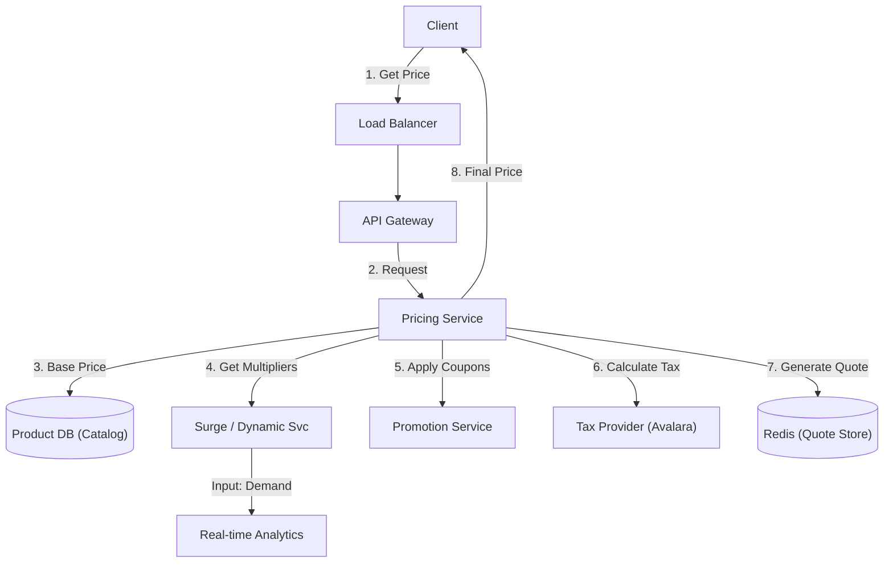

# 09. Pricing & Policy

## 1. Detailed Overview
The **Pricing & Policy** subsystem calculates "How much does this cost?". It handles base price, surge pricing, discounts, taxes, and dynamic rules.
**Why separate it from Payment?**
- **Complexity**: Calculating the price is often harder than charging the card.
- **Volatility**: Prices change every minute (Surge). Payments are static once authorized.
- **Read/Write Ratio**: Prices are *read* 100x more than they are *paid*. (Many people check the Uber price, few book).

**Real-world Examples**:
- **Uber**: Surge pricing (Base * Multiplier).
- **Airbnb**: "Smart Pricing" based on demand/seasonality.
- **E-commerce**: "Buy 1 Get 1 Free" or "20% off for Prime members".

## 2. Requirements & Reasoning

### Functional
- **Dynamic Rules**:
    - *Requirement*: Logic like "If raining, price + 10%".
    - *Why*: Business needs to adjust prices without redeploying code.
- **Coupons**:
    - *Requirement*: Validate "SUMMER2025" -> 20% off.
- **Taxation**:
    - *Requirement*: Calculate VAT/GST based on *user location* (Zip Code).
    - *Why*: Legal compliance.

### Non-Functional
- **Low Latency**:
    - *Reasoning*: Price appears on the Search/Home screen. It must load in < 50ms.
- **Explainability**:
    - *Reasoning*: If a user asks "Why is this $50?", Customer Support needs a breakdown (Base $20 + Tax $5 + Surge $25).
- **High Read Scale**:
    - *Reasoning*: Thundering herd when a sale starts.

## 3. Interface Design

### Pricing API

```protobuf
service PricingService {
  rpc CalculatePrice(PricingRequest) returns (PricingResponse);
}

message PricingRequest {
  string item_id = 1;
  string user_id = 2; // Needed for personalized discounts
  Context ctx = 3;    // Location, Time
}

message PricingResponse {
  Money total = 1;
  repeated LineItem breakdown = 2; // Base: $10, Surge: $2, Tax: $1
  string quote_id = 3; // Lock this price for 5 mins
}
```

## 4. Data Model

### The Quote (Locking the Price)
Prices are volatile. If I see $10, it shouldn't change to $15 when I click "Pay".
**Strategy**:
1.  **Generate Quote**: Calculate $10. Save to Cache with ID `quote_123`.
2.  **Expiration**: Set TTL to 5 minutes.
3.  **Checkout**: Frontend sends `quote_123`. Backend honors $10, even if the database now says $15.

### Rule Storage
Instead of hardcoding `if (user.isPrime) return 0.9`, we store rules in the DB.
- **Structure**: `Rule { ID, Conditions_JSON, Action_JSON, Priority }`
- **Example**: `Condition: { "weather": "rain" }`, `Action: { "multiplier": 1.1 }`

## 5. High-Level Design



### Component Breakdown
1.  **Pricing Engine**: Stateless calculator. Runs the pipeline (Base -> Surge -> Disco -> Tax).
2.  **Surge Service**: Aggregates real-time demand (e.g., number of open apps in area) to output a multiplier.
3.  **Quote Service**: Persists the calculated price for a session.
4.  **Tax Provider**: Usually a 3rd party API (Avalara/Stripe Tax) because tax laws are insane (vary by zip code).

## 6. Deep Dive & Core Problems

### A. The "Thundering Herd" on Price Updates
**Scenario**: "Flash Sale starts at 12:00". Price drops 50%.
**Problem**: 1 Million users refresh. Hitting DB 1M times/sec kills the DB.
**Solution**: **Tiered Caching**.
1.  **L1 Cache (Local Memory)**: Each App Server caches the price of "iPhone 15" for 5 seconds.
2.  **L2 Cache (Redis)**: Shared cache for 1 minute.
3.  **Jitter**: Don't expire all items at exactly 12:00:00. Expire them at 12:00:01, 12:00:05.

### B. Rule Engine Complexity (Decoupling)
Hardcoding logic scales poorly.
**Solution**: Use a **Rule Engine** (Drools, Open Policy Agent, or simple JSON expression evaluator).
- Store rules in DB.
- Load rules into Application Memory every 5 minutes.
- Evaluator runs in-memory: `if (ctx.weather == 'rain') apply(rule_15)`.
- *Benefit*: You can add a new "Holiday Sale" rule without deploying code.

### C. Precision (Recurring Theme)
Just like Payments, Pricing must use Integers.
However, intermediate calculations can be floats?
*   `$10 * 33% off` = `$3.333333`.
*   **Rule**: Perform math with high precision (Decimal), then **Round Down/Up** explicitly at the final step according to business policy (Floor/Ceiling).

## 7. Technology Choices

| Component | Standard Choice | Why we chose it (The "Why") | Alternatives considered |
| :--- | :--- | :--- | :--- |
| **Language** | **Go / Java** | Strong typing for currency math. Python's dynamic typing is risky for financial logic. | **Python** (Too slow for complex rule evaluation loops) |
| **Rule Engine** | **Common Expression Language (CEL)** | Safe, fast, memory-safe expression evaluation. Google standard. | **OPA (Rego)** (Good, but heavier), **Drools** (Very heavy Java enterprise tool) |
| **Cache** | **Redis** | Storing Price Quotes with TTLs. | |

## 8. Summary Checklist
- [ ] **Quote/Lock**: Explain how to prevent price changes during checkout.
- [ ] **Rule Engine**: Decoupling logic from code.
- [ ] **Surge**: Using real-time signals (Supply/Demand) to adjust base price.
