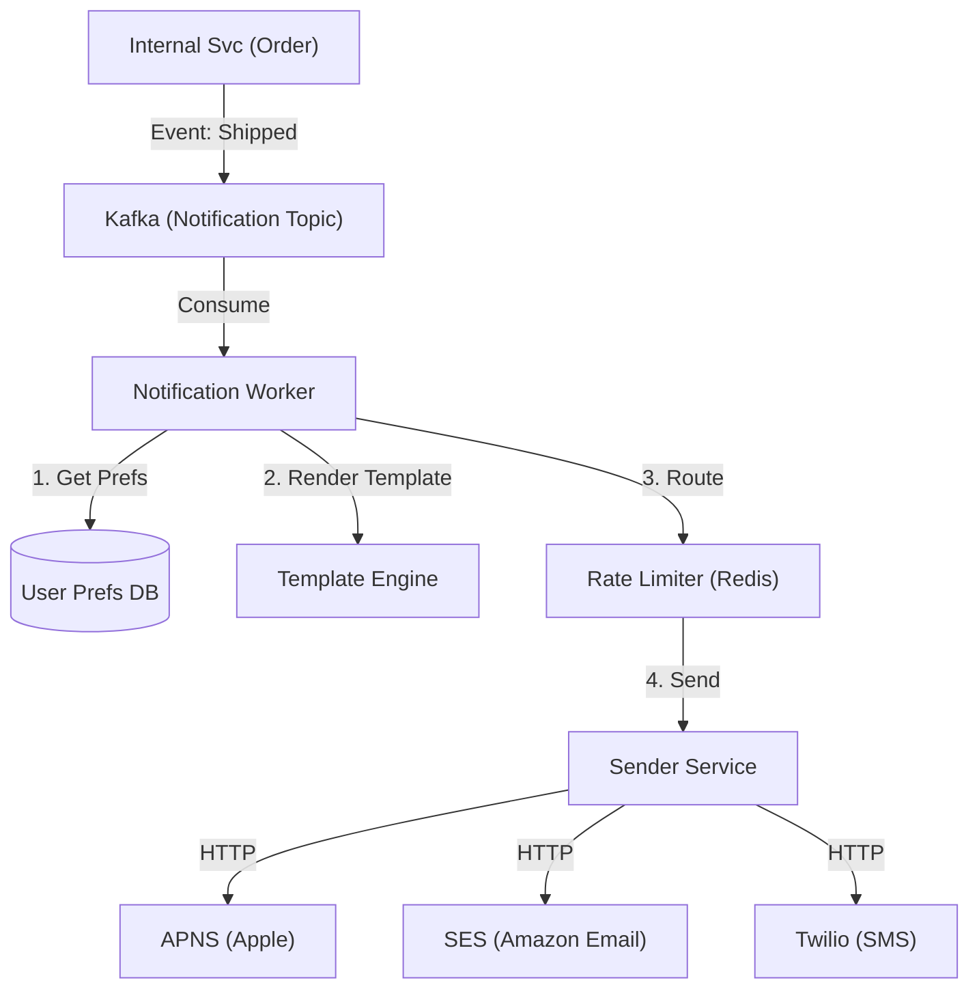

# 10. Notification & Messaging

## 1. Detailed Overview
The **Notification** subsystem is responsible for reaching users *outside* the application (Push, Email, SMS). The **Messaging/Chat** aspect handles user-to-user communication.
**Why separate them?**
- **Notifications** are "Fire-and-Forget", usually stateless, and tolerant of small delays.
- **Chat** is "Stateful", requires strict ordering, and needs persistent connections (WebSockets).
However, they share infrastructure (Queues, User Preferences).

**Real-world Examples**:
- **Notifications**: "Your driver has arrived" (Time sensitive), "Black Friday Sale" (Bulk marketing).
- **Messaging**: WhatsApp, Slack (Bi-directional).

## 2. Requirements & Reasoning

### Functional
- **Multi-Channel**:
    - *Requirement*: Support APNS (iOS), FCM (Android), Email (SES), SMS (Twilio).
    - *Why*: Users are on different devices. Platform abstraction is necessary.
- **User Preferences**:
    - *Requirement*: "Don't email me, only push". "Don't disturb me after 10PM".
    - *Why*: Respecting user privacy prevents app uninstalls.
- **Templating**:
    - *Requirement*: "Hi {name}, your order {id} is ready".
    - *Why*: Hardcoding strings is unmaintainable. We need localization (i18n).

### Non-Functional
- **Throughput (The "Breaking News" problem)**:
    - *Reasoning*: Sending a "Goal Scored!" notification to 10M fans must happen in < 1 minute.
- **Reliability (OTP)**:
    - *Reasoning*: "Your code is 1234". If this is lost, the user can't login. High priority delivery.
- **Rate Limiting**:
    - *Reasoning*: Don't accidentally spam a user 50 times in 1 minute.

## 3. Interface Design

### Notification API

```protobuf
service NotificationService {
  rpc Send(SendRequest) returns (Ack);
  rpc UpdatePreferences(PrefRequest) returns (Ack);
}

message SendRequest {
  string user_id = 1;
  string template_id = 2; // "order_shipped"
  map<string, string> args = 3; // { "id": "123" }
  Channel priority_channel = 4; // EMAIL, SMS, PUSH
}
```

## 4. Data Model

### Chat History (Write-Heavy)
Chat generates massive data.
- **Read/Write Ratio**: 1:1 (Unlike feeds).
- **Schema**:
    - `ChatID` (Partition Key)
    - `MessageID` (Sort Key - TimeUUID)
    - `Body`
- **Database**: **Cassandra / ScyllaDB**.
    - *Why*: We need fast writes. We fetch by partition (ChatID). We never join.

### Preferences
- **Table: UserPrefs**
- Simple Relational/Key-Value is fine.

## 5. High-Level Design



### Component Breakdown
1.  **Kafka**: Buffers the input. Essential for "Breaking News" where input > output capacity.
2.  **Notification Worker**: Stateless. Checks preferences ("Is user opted out?"), renders text ("Hello Bob").
3.  **Sender**: Handles the ugly details of 3rd party APIs (Retries, API Keys, Rate Limits).
4.  **WebSocket Gateway (For Chat)**: Stateful servers that hold open TCP connections to client phones for real-time delivery.

## 6. Deep Dive & Core Problems

### A. The "Breaking News" Problem (Thundering Herd)
**Problem**: Sending 10M pushes.
- Step 1: Query DB for 10M user tokens. (DB death).
- Step 2: Call Apple API 10M times. (Apple blocks us).
**Solution**:
1.  **Bulk APIs**: Use APNS/FCM HTTP/2 bulk endpoints (Send 1000 tokens in 1 request).
2.  **Sharded Workers**: Partition users by ID. Worker 1 handles User 0-1M, Worker 2 handles 1M-2M.
3.  **Prioritization**: "Breaking News" > "Marketing". Process the News topic with more workers.

### B. Chat: Real-time Delivery (Push vs Pull)
**Pull (Polling)**: Client asks "New messages?" every 5s.
- *Problem*: Batters the server. Latency is high (up to 5s).
**Push (WebSockets)**:
- Client maintains persistent TCP connection.
- Server pushes payload immediately.
- **Challenge**: State management. Which server holds the connection for User A?
    - *Solution*: Store mapping in Redis: `UserA -> GatewayNode_5`.
    - Routing: Msg for A -> Redis lookup -> GatewayNode_5 -> Push.

### C. 3rd Party Reliability
- Twilio might go down.
- **Design**:
    - **Circuit Breaker**: If Twilio fails 50% of requests, stop calling it for 1 min.
    - **Fallback**: If SMS fails, try Email.
    - **Dead Letter Queue (DLQ)**: Save failed messages to retry later manually.

## 7. Technology Choices

| Component | Standard Choice | Why we chose it (The "Why") | Alternatives considered |
| :--- | :--- | :--- | :--- |
| **Queue** | **Kafka / RabbitMQ** | Buffer notifications. Decouple internal services from external vendors. | |
| **Chat DB** | **Cassandra / ScyllaDB** | Facebook Messenger/Discord use this. Wide-column store optimized for "Append Only" history. | **Postgres** (Struggles with billions of rows of chat logs), **HBase** |
| **Push** | **Firebase (FCM)** | Cross-platform abstraction. We don't want to maintain separate code for iOS and Android protocols. | **OneSignal** (Wrapper around FCM/APNS) |

## 8. Summary Checklist
- [ ] **State**: Separate "Stateless Notification" from "Stateful Chat".
- [ ] **Thundering Herd**: How to handle 10M pushes (Bulk + Queue).
- [ ] **Reliability**: Fallbacks (SMS -> Email) and DLQs.
