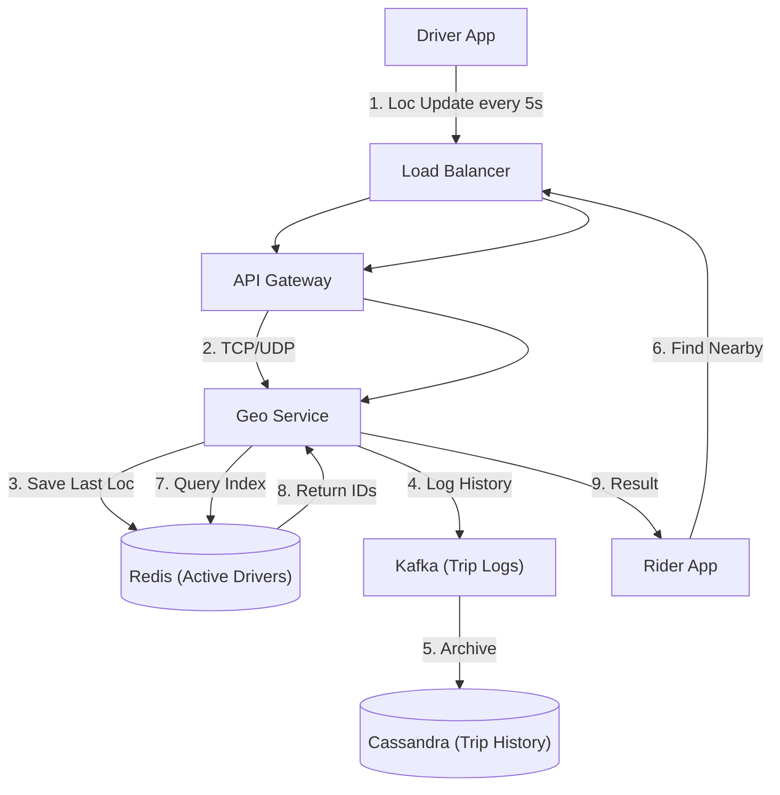

# 11. Geo-spatial & Location

## 1. Detailed Overview
The **Geo-spatial** subsystem handles location data and "Proximity Search". It answers "Where am I?" and "What is near me?".
**Why is it special?**
Standard databases (B-Trees) are 1-Dimensional. They can efficiently find `X > 5`.
They cannot efficienty find "Points within 5km of (Lat, Long)".
(Lat, Long) is 2-Dimensional data. Flattening 2D space into 1D for indexing is the core algorithmic challenge.

**Real-world Examples**:
- **Uber**: "Find drivers within 5km". (High frequency updates).
- **Yelp/Google Maps**: "Find restaurants inside this map viewport". (Static points).
- **Tinder**: "Passports in my city". (Radius search).

## 2. Requirements & Reasoning

### Functional
- **Location Updates (Telemetry)**:
    - *Requirement*: Ingest driver GPS every 5 seconds.
    - *Why*: Old data is useless. If a driver moves 1 block, the ETA changes.
- **kNN Search (Proximity)**:
    - *Requirement*: "Find the k=10 nearest drivers".
- **Geofencing**:
    - *Requirement*: "Alert if user enters Airport Zone".

### Non-Functional
- **High Write Throughput**:
    - *Reasoning*: 100k drivers * 1 update/5sec = 20k writes/sec. A standard Postgres instance will choke on this write load if we index every single update.
- **Low Read Latency**:
    - *Reasoning*: When I open the app, I expect to see cars instantly. < 100ms.
- **Freshness**:
    - *Reasoning*: The search index needs to reflect the update from 1 second ago. "Near Real-Time".

## 3. Interface Design

### Geo API

```protobuf
service GeoService {
  // Firehose of UDP/TCP packets
  rpc UpdateLocation(LocationUpdate) returns (Ack);
  
  // The expensive query
  rpc FindNearby(SearchRequest) returns (SearchResults);
}

message LocationUpdate {
  string entity_id = 1;
  double lat = 2;
  double long = 3;
}

message SearchRequest {
  double lat = 1;
  double long = 2;
  double radius_km = 3;
}
```

## 4. Data Model

### The Indexing Algorithms
How do we query 2D data?
1.  **Geohash (String)**:
    - *Concept*: Divide the world into a grid. `u4pruydqqvj`.
    - *Property*: Long shared prefix = Close proximity.
    - *Pros*: Easy to store in KV stores (Redis). `u4p` is a textual prefix search.
    - *Cons*: **Boundary Issues**. Two points can be 1 meter apart but have totally different hashes if they straddle a meridian.
2.  **Quadtree (Tree)**:
    - *Concept*: Recursively divide the square into 4 quadrants.
    - *Pros*: Dynamically adjusts resolution (more depth in cities, less in oceans).
    - *Cons*: Hard to update in real-time (Tree rebalancing).
3.  **Google S2 (Hilbert Curve)**:
    - *Concept*: Maps the 2D sphere onto a 1D curve mathematically.
    - *Pros*: Best mathematical properties for "Range queries". Used by Uber.

### Storage Strategy
- **Static Points (Restaurants)**: **PostGIS (R-Tree)** or **Elasticsearch**. Updates are rare. R-Trees are perfect.
- **Dynamic Points (Drivers)**: **Redis (Geohash)**. Optimized for high churn / rapid overwrites.

## 5. High-Level Design



### Component Breakdown
1.  **Geo Service**: Stateless. Handles protocol logic.
2.  **Redis (The Active Index)**:
    - Stores **ONLY** the latest location.
    - `GEOADD drivers 13.361 38.115 "DriverA"`
    - `GEORADIUS drivers 15 37 200 km`
    - *Why*: Redis is single-threaded RAM. Extremely fast for 20k writes/sec.
3.  **Cassandra (The History)**:
    - Stores the *trail*.
    - *Why*: For auditing, disputes ("Driver took a long route"), and Analytics. We don't need to query history in real-time.

## 6. Deep Dive & Core Problems

### A. Geohash Edge Cases (The Neighbor Search)
**Problem**: You are at the edge of a Geohash block. The closest driver is in the *next* block, which has a completely different string hash.
**Solution**:
- When querying for `9q9hv`, don't just query `9q9hv`.
- Calculate the **8 surrounding neighbors**.
- Query all 9 hashes.
- Redis `GEORADIUS` handles this natively. If building manually, you MUST query neighbors.

### B. High Frequency Updates (The Uber Scale)
**Problem**: 100k drivers * 1 update/5sec.
**Optimization 1: Adaptive Write**:
- If driver moves 1 meter? Don't send update.
- Only send if moved > 50 meters or > 10 seconds elapsed. ("Dead reckoning").
**Optimization 2: Ephemeral Storage**:
- Do NOT write every update to disk (DB).
- Write to **Memory (Redis)**.
- If Redis crashes, we lose location data for 5 seconds. **That's Okay**. Drivers will send a new update in 5 seconds.
- *Trade-off*: Durability is sacrificed for Speed.

### C. Static vs Dynamic Partitioning
- **Static**: "Partition 1 = New York".
    - *Pro*: Easy.
    - *Con*: New York has 100x more traffic than Wyoming. Hotspot.
- **Dynamic (Consistent Hashing)**:
    - Shard based on `DriverID`.
    - *Pro*: Even load.
    - *Con*: To find "Drivers near Lat/Long", you have to query *all shards* (Scatter-Gather).
- **Staff Choice**: For Geo, usually **Spatial Sharding** (Static/City-based) is preferred, with "Sub-sharding" logic for mega-cities (NY-1, NY-2).

## 7. Technology Choices

| Component | Standard Choice | Why we chose it (The "Why") | Alternatives considered |
| :--- | :--- | :--- | :--- |
| **Index Lib** | **Google S2** | Best library for mapping Sphere->1D. Handles poles and dateline better than Geohash. | **H3** (Uber's Hexagonal index - distinct advantage is equal distance between neighbors) |
| **Hot Storage** | **Redis** | Native GEO commands (`GEOADD`) are decent. In-memory speed is mandatory. | **Memcached** (No Geo support) |
| **Cold Storage** | **Cassandra / ScyllaDB** | Write-heavy history logs. | **Postgres** (Table bloat from updates would be unmanageable) |

## 8. Summary Checklist
- [ ] **Geohash vs Quadtree**: Know the difference.
- [ ] **S2/H3**: Mentioning these shows industry knowledge.
- [ ] **Write Load**: Explain why we don't use Postgres for live driver locations.
- [ ] **Neighbor Search**: The edge case of grid boundaries.
