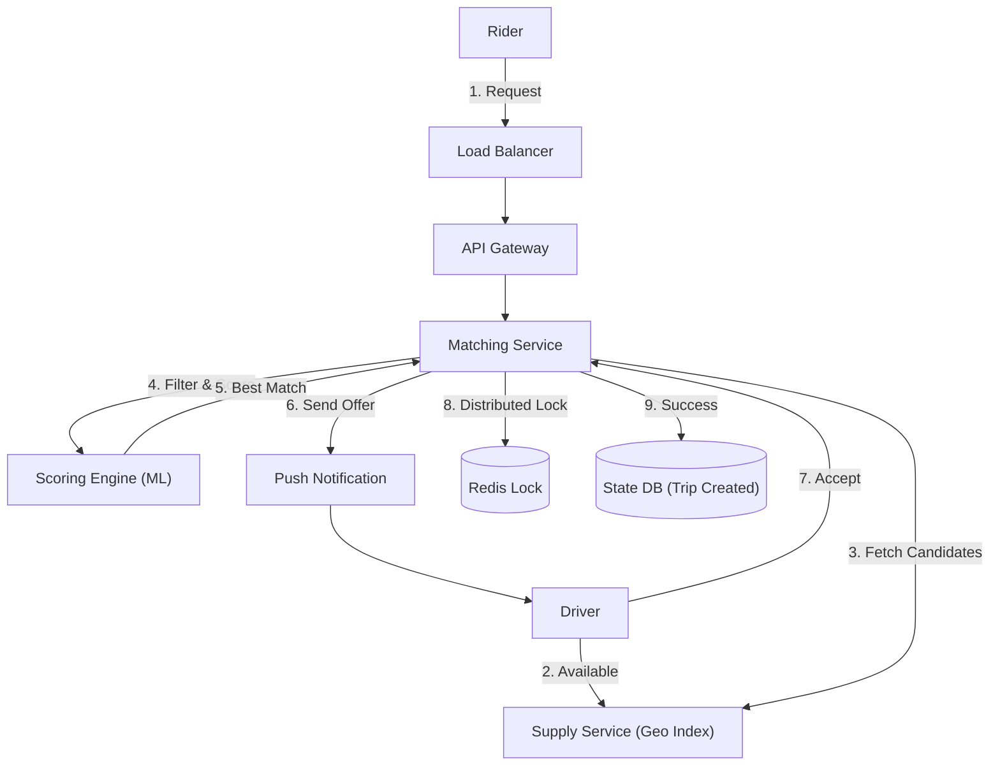

# 12. Matching / Optimization Engine

## 1. Detailed Overview
The **Matching Engine** is the heart of on-demand marketplaces. It pairs entities from a "Supply Pool" with a "Demand Pool" based on an Objective Function (Cost, Time, Quality).
**Why not just "Find Nearest"?**
Because "Nearest" isn't always "Best".
- Driver A is 1 min away from you, but 0.5 mins away from a VIP user.
- Assigning Driver A to YOU might make the VIP wait 10 mins.
- **Global Optimization** tries to minimize the average wait time for *everyone*.

**Real-world Examples**:
- **Uber/Lyft**: Match Rider with Driver (Minimize ETA).
- **DoorDash**: Match Order with Dasher (Minimize Food Coldness).
- **Ad Tech**: Match Ad Space with Bidder (Maximize Revenue).
- **Tinder**: Match User A with User B (Maximize compatibility).

## 2. Requirements & Reasoning

### Functional
- **Search (Discovery)**:
    - *Requirement*: Find candidate Drivers within 5km.
- **Scoring (Cost Function)**:
    - *Requirement*: Calculate a score for each pair. `Score = w1*Distance + w2*Rating + w3*ChurnProbability`.
- **Assignment**:
    - *Requirement*: Lock the pair. Send offer. Handle Accept/Reject.

### Non-Functional
- **Latency (The 1-Second Window)**:
    - *Reasoning*: Users stare at the "Finding your ride..." screen. If it takes 30s, they cancel.
- **Fairness**:
    - *Reasoning*: Don't starve drivers. Even if Driver X is slightly worse, give them a ride occasionally to keep them on the platform.
- **Concurrency**:
    - *Reasoning*: Driver A cannot be matched to User 1 and User 2 simultaneously.

## 3. Interface Design

### Matchmaker API

```protobuf
service MatchService {
  // Async request. Returns "Searching..." immediately.
  rpc RequestMatch(MatchRequest) returns (MatchStatus);
  
  // Driver responds to the push notification
  rpc AcceptMatch(MatchID) returns (Ack);
  rpc RejectMatch(MatchID) returns (Ack);
}

message MatchRequest {
  string requestor_id = 1;
  Location origin = 2; // Lat/Long
  Map constraints = 3; // "Need Wheelchair Access"
}
```

## 4. Data Model

### The Bipartite Graph
Matching is mathematically a **Bipartite Graph Matching** problem.
- **Set U**: Riders (Demand).
- **Set V**: Drivers (Supply).
- **Edges**: Possible matches with weights (Score).
- **Goal**: Select a subset of edges such that no node shares an edge (1:1 match) and Sum(Weights) is optimized.

### State Storage (Ephemeral)
We need to track the state of the "Offer".
- **Redis Key**: `offer:{match_id}` -> `{ driver_id, rider_id, status: "OFFERED", expires: 1690000000 }`
- **TTL**: 15 seconds. If Driver doesn't reply, TTL expires -> Trigger "Timeout" logic.

## 5. High-Level Design



### Component Breakdown
1.  **Supply Service**: Tracks active drivers (Geospatial Index).
2.  **Scoring Engine**: Compute intensive. Running the cost function `f(x)` on 100 candidates.
3.  **State Manager**: Tracks the lifecycle (SEARCHING -> OFFERED -> MATCHED). Handles heavy concurrency (Locking).

## 6. Deep Dive & Core Problems

### A. Greedy vs Global Optimization (Batched Matching)
**Greedy (FIFO)**:
- Logic: Rider A appears -> Find closest Driver -> Match immediately.
- *Pro*: Fast. Simple.
- *Con*: **Suboptimal**. It blindly takes the best resource now, screwing over future requests.

**Global (Batch Window)**:
- Logic:
    1.  Wait 5 seconds (The Accumulation Window).
    2.  Collect 100 active Riders and 200 active Drivers.
    3.  Build a Score Matrix (100x200).
    4.  Run **Hungarian Algorithm** or **Min-Cost Max-Flow**.
    5.  Assign pairs to maximize TOTAL utility.
- *Pro*: 20-30% efficiency gain (less driving empty).
- *Con*: User waits 5s before processing starts.

### B. Race Conditions (Double Booking)
**Scenario**: Two riders request. Both see Driver A as optimal.
- System sends offer to Driver A for Rider 1.
- System MUST NOT send offer to Driver A for Rider 2 until Rider 1 is rejected/timeout.
**Solution**: **Distributed Locking**.
- Acquire `Lock(DriverID)` in Redis before sending offer.
- If Lock fails, skip this driver and find the next best.

### C. Sticky Matching
- If Driver A rejects Rider X, we must find another driver.
- But in the next cycle, Driver A is *still* the closest. We shouldn't offer to them again.
- **Bloom Filter**: Store `RejectedDrivers:RiderX` set. Filter candidates against this set.

## 7. Technology Choices

| Component | Standard Choice | Why we chose it (The "Why") | Alternatives considered |
| :--- | :--- | :--- | :--- |
| **Language** | **Go / C++** | Scoring algorithms are CPU loops (Matrix math). Garbage collection in Java/Python can cause latency spikes. | **Python** (Too slow for the inner loop of matching) |
| **Locking** | **Redis (Redlock)** | We need fast, distributed locks with TTLs. Strict CP (Zookeeper) is too slow for the volume. | **Zookeeper** (Overkill/Too slow) |
| **Algorithm** | **H3 Grid + Hungarian** | Standard combinatorial optimization stack. | |

## 8. Summary Checklist
- [ ] **Greedy vs Global**: This is the core Staff-level distinction.
- [ ] **Batched Matching**: Explain the "Window".
- [ ] **Locking**: Preventing double-allocation.
- [ ] **Scoring**: It's not just distance. (Rating, earning fairness, destination filters).
