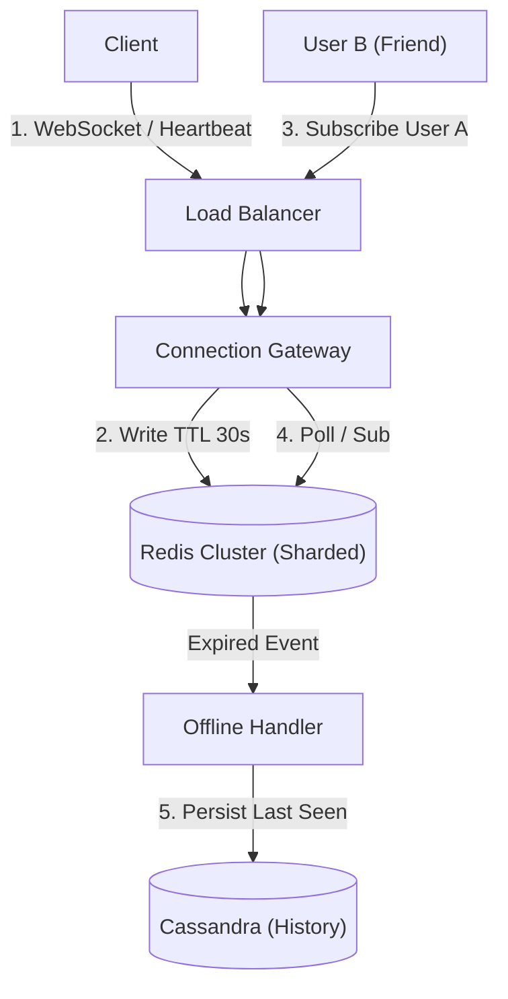

# 13. Presence & Session Management

## 1. Detailed Overview
The **Presence** subsystem answers: "Is User X online?". It feels simple ("Green Dot"), but at scale, it is a massive throughput challenge.
**Why is it hard?**
100 Million users. Each sends a "Heartbeat" every 10 seconds.
That's **10 Million writes per second**.
You cannot do 10M writes/sec to a SQL database. You need a specialized architecture.

**Real-world Examples**:
- **WhatsApp**: "Online", "Last seen at..."
- **Slack**: Green dot next to name.
- **Discord**: "Playing League of Legends" (Rich Presence).
- **Collaboration Tools**: "User A is editing cell B2".

## 2. Requirements & Reasoning

### Functional
- **Status Updates**:
    - *Requirement*: Detect Online/Offline/Idle.
- **Subscription**:
    - *Requirement*: "Tell me when my Friend X comes online".
- **Last Seen**:
    - *Requirement*: Persist "Last Active Time" for offline users.

### Non-Functional
- **Extreme Write Throughput**:
    - *Reasoning*: As calculated: 10M RPS for a large app.
- **Real-time Latency**:
    - *Reasoning*: If I go offline, my friend should see the grey dot in < 5s.
- **Ephemeral Consistency**:
    - *Reasoning*: It's okay if the dot flickers. We don't need strong consistency. We prioritize Throughput.

## 3. Interface Design

### Presence API

```protobuf
service PresenceService {
  // Client sends this every KeepAlive interval
  rpc Heartbeat(UserPresence) returns (Ack);
  
  // UI polls/subscribes to this
  rpc GetBulkStatus(List<UserID>) returns (Map<UserID, Status>);
  
  // Real-time stream of friends' changes
  rpc Subscribe(UserID) returns (stream StatusUpdate);
}
```

## 4. Data Model

### The Ephemeral Store (Redis)
We do not store "Online" status in the DB. We store it in RAM.
**Why?**
If the Presence Server crashes, everyone is effectively offline anyway. The state is tied to the active session.
- **Key**: `user:{id}:presence`
- **Value**: `{ status: "Online", last_beat: 12:00:01, server: "gateway-42" }`
- **TTL**: 30 seconds.

### The Persistent Store (Cassandra)
For "Last Seen At", we need disk storage.
- **Table**: `UserLastActive`
- **Why**: When a user goes offline (TTL expires), we write the timestamp here.

## 5. High-Level Design



### Component Breakdown
1.  **Connection Gateway**: Holds the long-lived WebSocket.
    - *Role*: Detects disconnects.
    - *Optimization*: Does not write to Redis on *every* heartbeat. Only prolongs the TTL every 20s to save bandwidth.
2.  **Redis Cluster**: The state holder. Sharded by UserID.
3.  **Discovery Service**: If User B wants to chat with User A, which Gateway is User A connected to? (Look up in Redis).

## 6. Deep Dive & Core Problems

### A. Heartbeat Strategy (Active vs Passive)
**Active (The Standard)**:
- Client sends "Ping" every 10s.
- Server sets Redis Key TTL = 30s.
- **Crash Handling**: If Client crashes (no logout packet), ping stops. 30s later, Redis key vanishes. Status becomes "Offline". **Self-healing**.

**Passive (TCP Keepalive)**:
- Rely on TCP connection state.
- *Problem*: Mobile networks are flaky. A connection can be "dead" but the TCP socket is still "open" due to a NAT timeout. Application-level Heartbeats are safer.

### B. The Fan-out Problem (The "Justin Bieber" Issue again)
**Scenario**: User A goes Online. User A has 5000 friends.
**Naive**: Notify all 5000 friends immediately.
- 1 Event -> 5000 Packets.
**Optimization 1: Lazy Load (Pull)**:
- When Friend B opens the app, *then* query User A's status. Don't push if B isn't looking.
**Optimization 2: Viewport Limits**:
- Only subscribe to the status of users *currently visible on screen* (e.g., the top 20 items in the chat list).

### C. Write Throughput Optimization
Even Redis can choke on 10M writes/sec.
**Solution**: **Gossip Protocol / Batching**.
- Gateway servers accumulate heartbeats in local memory buffers.
- Flush to Redis in batches every 1s.
- "User A, B, C, D are all still online".
- Reduces network calls by factor of 100.

## 7. Technology Choices

| Component | Standard Choice | Why we chose it (The "Why") | Alternatives considered |
| :--- | :--- | :--- | :--- |
| **State Store** | **Redis** | Native TTL support is the core mechanic. Extremely fast write speeds (100k/sec per core). | **Memcached** (Good, but Redis Cluster is easier to manage for sharding) |
| **Permanent Store** | **Cassandra** | High write throughput for "Last Seen" history logs. We don't need complex queries. | **DynamoDB** |
| **Protocol** | **WebSocket / MQTT** | Need bi-directional persistent connection. Keep-alive overhead is low. | **Long Polling** (Legacy, too much HTTP header overhead) |

## 8. Summary Checklist
- [ ] **Heartbeats & TTLs**: The standard pattern for presence.
- [ ] **Fan-out**: Push to active viewers only.
- [ ] **Ghost Connections**: Why we rely on TTLs instead of explicit "Logout".
