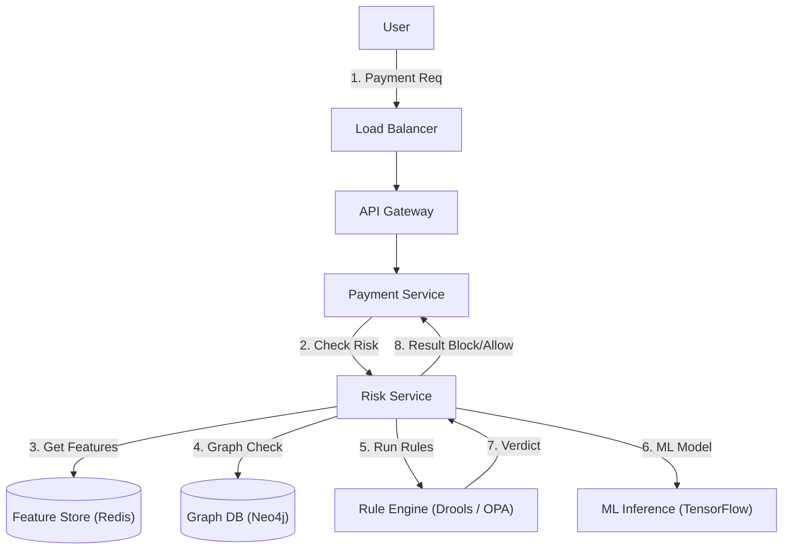

# 14. Risk, Compliance & Audit

## 1. Detailed Overview
The **Risk & Compliance** subsystem protects the platform from Bad Actors (Fraud) and Legal Liability (Audit).
**Why is it distinct?**
It is an adversarial environment.
- In Payment, users want to succeed.
- In Risk, users (fraudsters) are actively trying to bypass your logic.
- The system must change rules rapidly (minutes, not weeks) to react to new attack vectors.

**Real-world Examples**:
- **Stripe**: "Is this transaction fraudulent?" (Machine Learning).
- **Facebook**: "Is this post hate speech?" (Content Moderation).
- **Banking**: "Audit every change to User #123" (Regulatory Requirement).

## 2. Requirements & Reasoning

### Functional
- **Fraud Detection**:
    - *Requirement*: Score actions in real-time. (Approve/Reject/Challenge).
    - *Why*: Once money leaves the system (e.g., Crypto withdrawal), it is gone forever.
- **Audit Logging**:
    - *Requirement*: "Who changed what and when?" IMMUTABLE.
    - *Why*: If an admin account is hacked, we need to know exactly what they destroyed.
- **KYC (Know Your Customer)**:
    - *Requirement*: Verify Identity (Passport Upload).
- **GDPR / Right to be Forgotten**:
    - *Requirement*: Delete user data upon request.

### Non-Functional
- **Low Latency (The 200ms Limit)**:
    - *Reasoning*: Risk checks happen *during* checkout. If Risk takes 5s, conversion drops.
- **False Positive Handling**:
    - *Reasoning*: Blocking a calm, legitimate user is worse than letting 1 bad user through (sometimes). Depends on "Loss Aversion".
- **WORM Storage (Write Once Read Many)**:
    - *Reasoning*: Audit logs must be tamper-proof. Even DB As shouldn't be able to `DELETE` rows.

## 3. Interface Design

### Risk API

```protobuf
service RiskService {
  // Synchronous check during critical path
  rpc EvaluateAction(RiskRequest) returns (RiskVerdict);
  
  // Asynchronous ingest for post-event analysis
  rpc IngestSignals(Stream<Signal>) returns (Ack);
}

message RiskRequest {
  string action_type = 1; // "PAYMENT", "LOGIN"
  string user_id = 2;
  string ip_address = 3;
  string device_fingerprint = 4; // "iOS 15, IDFV=..."
  double amount = 5;
}

message RiskVerdict {
  string decision = 1; // APPROVE, REJECT, CHALLENGE (Trigger 2FA)
  double risk_score = 2; // 0.0 to 1.0
  repeated string reasons = 3; // "IP mismatch", "Velocity high"
}
```

## 4. Data Model

### The Feature Graph (Graph DB)
Risk is relational.
- "User A" is clean.
- "User B" is clean.
- But "User A" shares an IP with "User C" (Fraudster).
- And "User B" shares a Device with "User C".
- Conclusion: A and B are likely bad.
**Neo4j / Amazon Neptune** is perfect for this "Community Detection".

### Audit Log (Immutable)
- **Storage**: **S3 with Object Lock (Governance Mode)** or **Elasticsearch**.
- **Schema**: `{ timestamp, actor, action, resource, diff, signature }`.

## 5. High-Level Design



### Component Breakdown
1.  **Rule Engine (Determinism)**:
    - Hard logic: `IF amount > $10k THEN REJECT`.
    - *Why*: Some things are black and white (Sanctions list). Models are probabilistic; Rules are definite.
2.  **ML Model (Probability)**:
    - Soft logic: `P(Fraud) = 0.85`.
    - *Why*: Detects subtle patterns (e.g., fast typing speed + foreign IP) that rules miss.
3.  **Graph Network**: Finds hidden clusters of bad actors.

## 6. Deep Dive & Core Problems

### A. Sync vs Async Risk (The Latency Trade-off)
**Sync (Blocking)**:
- Used for: High stakes (Money out).
- Constraint: Must finish in 200ms.
- Tactic: Use fast rules + lightweight ML (Decision Trees).

**Async (Post-Processing)**:
- Used for: Content Moderation (Social Post).
- Constraint: Can take 5 mins.
- Tactic: Allow the post immediately -> Enqueue "Check Post" job -> Deep Learning (Computer Vision) -> If bad, **Takedown** later.
- *Why*: Keeps the UI snappy.

### B. Crypto-Shredding (GDPR)
**Problem**: GDPR says "Delete all data for User X".
- BUT: We have Audit Logs in S3 that are WORM (Immutable). We *cannot* delete the file.
**Solution**:
1.  Encrypt PII (Personally Identifiable Information) with a unique Key per User (`Key_UserX`).
2.  Store `Key_UserX` in a Key Management Service (KMS).
3.  Store encrypted data in S3.
4.  **To Delete**: Destroy `Key_UserX`.
5.  The data in S3 remains, but it is now garbage cyphertext forever. Effectively deleted.

### C. Shadow Mode (Testing without Firing)
**Problem**: You write a new rule: `Block if IP is from X`.
- If you deploy it, you might block 10,000 legitimate users (False Positives).
**Solution**: **Shadow Mode**.
- Run the rule in Prod.
- Log the result: "Would have blocked User A".
- **Do not actually block**.
- Analyze the logs for 1 week. Calculate Precision/Recall.
- If safe, flip the switch to "Active".

## 7. Technology Choices

| Component | Standard Choice | Why we chose it (The "Why") | Alternatives considered |
| :--- | :--- | :--- | :--- |
| **Rule Engine** | **Drools / Open Policy Agent (OPA)** | Separates "Business Logic" from Code. PMs can update JSON rules without Engineering deploying specific code. | **Hardcoded IF Statements** (Fragile, requires deploy to change logic) |
| **Graph DB** | **Neo4j** | Traversing "Shared IP" relationships is O(1) in Graph, but O(N^2) JOINs in SQL. | **Neptune** |
| **Feature Store** | **Redis** | "Count of payments in last hour". Needs fast increment/read. | |

## 8. Summary Checklist
- [ ] **Shadow Mode**: How to test rules safely.
- [ ] **Crypto-shredding**: The standard answer for "Immutable Deletion".
- [ ] **False Positives**: The business impact of being too strict.
- [ ] **Rules vs ML**: Why we need both.
