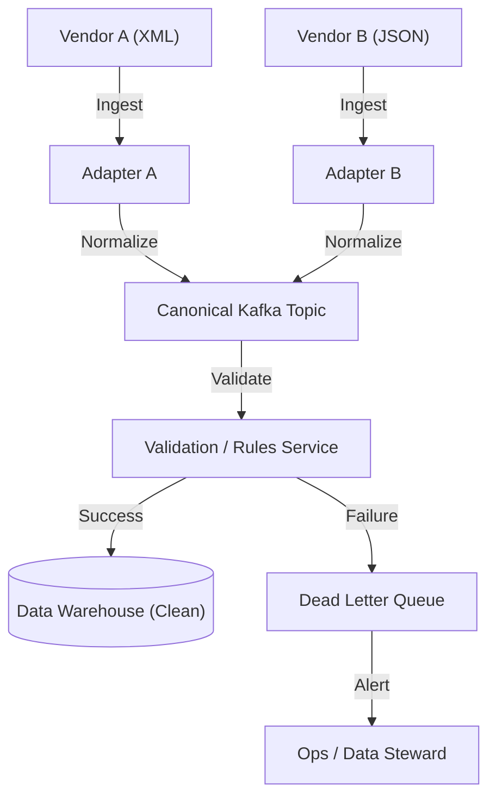

# 15. Data Normalization & Reconciliation

## 1. Detailed Overview
The **Normalization** subsystem ingests dirty, heterogeneous data from multiple sources and transforms it into a "Canonical Format" (Golden Record). **Reconciliation** ensures consistency.
**Why is it needed?**
- **Entropy**: Left alone, data becomes messy.
- **Integration**: Vendor A sends "Ph. 555-0100", Vendor B sends "+1 (555) 0100". If we don't normalize, we can't search or join.

**Real-world Examples**:
- **Travel Aggregators (Expedia)**: Ingesting flights from 500 airlines. Each has a different JSON schema.
- **Logistics**: Address standardization (Google Maps vs USPS format).
- **Fintech**: Reconciling our internal ledger `(Orders)` with the Bank's ledger `(Settlement Report)`.

## 2. Requirements & Reasoning

### Functional
- **Ingestion Adapters**:
    - *Requirement*: Handle CSV, XML, JSON, Protobuf.
- **Mapping/Transcoding**:
    - *Requirement*: `Source.gender="M"` -> `Target.gender="MALE"`.
- **Validation**:
    - *Requirement*: "Price must be > 0".
- **Identity Resolution**:
    - *Requirement*: Detect that "John Smith at 123 Main St" is the same person as "J. Smith at 123 Main Street".

### Non-Functional
- **Auditability**:
    - *Reasoning*: If a field changes, we must know *which* vendor changed it and when. Traceability.
- **Non-Destructive**:
    - *Reasoning*: Always keep the `RawPayload`. If our normalization logic has a bug, we need to re-run it against the raw data later.
- **Scale**:
    - *Reasoning*: Processing Terabytes of nightly dumps.

## 3. Interface Design

### Pipeline Data Structure

```protobuf
message IngestedRecord {
  string source_system = 1; // "Vendor_A"
  bytes raw_payload = 2;    // The original JSON/XML
  
  CanonicalRecord normalized = 3; // Populated after transformation
  repeated ValidationError errors = 4;
}

message CanonicalRecord {
  string uuid = 1;
  string standard_name = 2;
  Address standard_address = 3;
}
```

## 4. Data Model

### The "Golden Record"
We don't overwrite. We **Merge**.
- **Table**: `EntityProfiles`
- **Columns**: `ID`, `GoldenState (JSON)`, `SourceA_State`, `SourceB_State`.
- **Logic**: `Golden.phone = SourceA.phone (Trusted)`. `Golden.email = SourceB.email (Most Recent)`.
- **Reasoning**: This "Survivor-ship" logic allows us to pick the best attributes from different sources.

## 5. High-Level Design



### Component Breakdown
1.  **Adapters**: Specific code/config for each Source. Converts `XML` to `Internal Protobuf`.
2.  **Validator**: Checks business rules.
3.  **DLQ (Dead Letter Queue)**:
    - *Why*: If a record fails validation (`Age = -5`), we **do not crash**. We route it to a side-queue.
    - *Action*: Engineers review the DLQ, fix the data or the code, and **Replay** the message.

## 6. Deep Dive & Core Problems

### A. The "N+1" Adapter Problem
If we have 50 vendors, writing 50 Java classes is painful.
**Solution: DSL (Domain Specific Language)**.
- Write a YAML/JSON config:
  ```yaml
  - source: "price_val"
    target: "amount_cents"
    transform: "multiply(100)"
  ```
- *Benefit*: Non-engineers (Data Analysts) can commit new vendor configurations without touching the core pipeline code.

### B. Identity Resolution (Fuzzy Matching)
**Problem**: "Hilton Hotel" vs "Hilton Intl".
**Algorithm**:
- **Deterministic**: Match SSN, Email, ISBN. (High Confidence).
- **Probabilistic**: Match Name + ZipCode. Use **Jaro-Winkler** or **Levenshtein Distance**.
- **Blocking**: Don't compare every record with every record (O(N^2)). Only compare records within the same "Block" (e.g., Same Zip Code).

### C. Reconciliation (Drift Detection)
**Problem**: A bug caused us to drop 1% of updates.
**Solution**: Periodic Sweep.
- Compare `Count(Source)` vs `Count(warehouse)`.
- Compare `Sum(Amounts)`.
- If mismatch -> Alert.

## 7. Technology Choices

| Component | Standard Choice | Why we chose it (The "Why") | Alternatives considered |
| :--- | :--- | :--- | :--- |
| **ETL Engine** | **Apache Spark / Airflow** | Best for batch processing massive datasets. Spark handles the distributed compute. | **AWS Glue** (Serverless Spark - easier ops but higher cost at scale) |
| **Stream Proc** | **Kafka Streams / Flink** | If normalization must happen in real-time. | |
| **Schema Registry** | **Confluent Schema Registry** | Enforces the "Canonical Schema". Fails the pipeline if a vendor sends incompatible data. | |

## 8. Summary Checklist
- [ ] **DLQ**: How to handle bad data without stopping the pipe.
- [ ] **Idempotence**: Replaying the same file shouldn't dupe data.
- [ ] **Fuzzy Matching**: How to de-duplicate entities.
