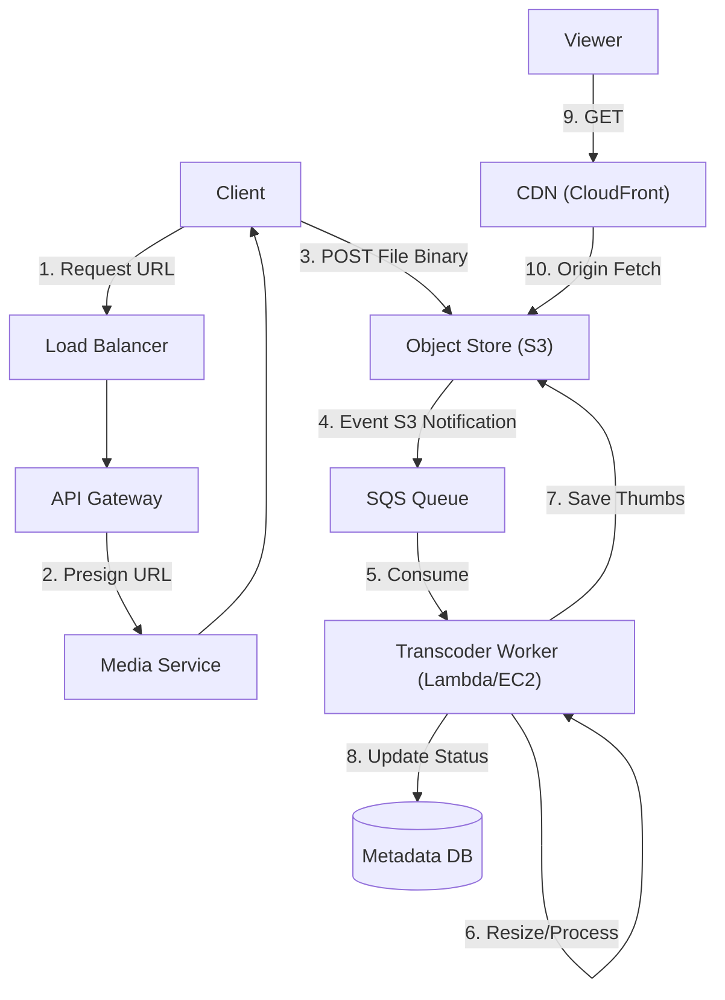

# 16. Media / Asset Management

## 1. Detailed Overview
The **Media** subsystem handles large binary files (Images, Videos, Documents).
**Core Rule**: BLOBs (Binary Large Objects) **do not belong in your database**.
Databases are optimized for structured rows (4KB). Storing a 5GB video in MySQL will fill the Transaction Log, kill cache locality, and crash the DB.
Media requires specialized Object Storage (S3) and specialized delivery (CDN).

**Real-world Examples**:
- **Instagram**: Image upload (filters, resizing).
- **YouTube**: Video transcoding (Raw -> 4k, 1080p, 720p HLS chunks).
- **Dropbox**: Reliable file storage.

## 2. Requirements & Reasoning

### Functional
- **Direct Upload**:
    - *Requirement*: Client uploads directly to Storage, bypassing the API server.
    - *Why*: API servers utilize expensive CPU/RAM. We don't want to block a thread for 5 minutes while a user uploads a video on 3G.
- **Processing (Transcoding)**:
    - *Requirement*: Resize images for thumbnails. Ensure videos play on mobile and web.
- **CDN Delivery**:
    - *Requirement*: Users in Japan should fetch content from a Tokyo server, not Virginia.

### Non-Functional
- **Durability (11 9's)**:
    - *Reasoning*: Users generally don't keep backups. If we lose their photos, we destroy trust.
- **Bandwidth Optimization**:
    - *Reasoning*: Bandwidth is the most expensive part of the cloud bill. Caching is mandatory.
- **Resumability**:
    - *Reasoning*: Network failures happen. Don't restart a 1GB upload from 0.

## 3. Interface Design

### Media API

```protobuf
service MediaService {
  // Step 1: Ask for permission to upload
  rpc RequestUpload(UploadMeta) returns (PresignedUrl);
  
  // Step 2: Client uploads to S3 URL...
  
  // Step 3: Notification (optional, usually handled by Event)
  rpc ConfirmUpload(FileID) returns (Ack);
}

message UploadMeta {
  string filename = 1;
  int64 size_bytes = 2;
  string mime_type = 3; // "image/jpeg"
  string check_sum = 4; // MD5 for verification
}
```

## 4. Data Model

### Metadata DB
We store the *pointer* to the file, not the file.
- **Table**: `Assets`
- **Columns**:
    - `AssetID` (PK)
    - `S3Bucket`, `S3Key` (Path)
    - `Size`, `MimeType`
    - `Status` (UPLOADING, PROCESSING, READY)
    - `ContentHash` (SHA256 - for deduplication)

### Object Storage
- **Path Structure**: `/bucket/user_id/date/uuid.jpg`
- *Why*: Prefixing with random UUIDs or UserIDs helps distribute load across S3 partitions (though S3 updated this, it's still good practice).

## 5. High-Level Design



### Component Breakdown
1.  **Pre-signed Service**: Secures S3. Generates a temporary URL (valid for 5 mins) that allows `PUT` access to a specific key.
2.  **Transcoder**: CPU intensive. Uses tools like **FFmpeg**.
    - *Scaling*: This is a perfect use case for **Serverless (Lambda)** or **Spot Instances** (Cheap, interruptible).
3.  **CDN**: Caches content at the edge (PoP).

## 6. Deep Dive & Core Problems

### A. The "Data through API" Anti-Pattern
**Naive**: Client -> Load Balancer -> API Server -> S3.
**Drawbacks**:
- **Buffers**: API Memory fills up holding chunks.
- **Cost**: You pay for Ingress/Egress bandwidth 2x (Client to API, API to S3).
- **Blocking**: Threads are tied up.
**Staff Solution**: **Pre-signed URLs**. The heavy data traffic goes `Client -> S3`. The API only handles 1kb of JSON metadata.

### B. Deduplication (Content Addressing)
**Scenario**: User A uploads `meme.jpg`. User B uploads the same `meme.jpg`.
**Optimization**:
1.  Calculate `SHA256` of file *before* upload.
2.  Check DB: "Do we have this hash?"
3.  **Yes**: Return success immediately. Link User B's Asset ID to the *existing* S3 path.
4.  **Benefit**: Instant upload speed. Saves storage costs.

### C. Resumable Uploads (Multipart)
For files > 100MB.
1.  Split file into 5MB chunks.
2.  Upload chunks in parallel.
3.  If Chunk 3 fails, retry only Chunk 3.
4.  Finalize: Tell S3 to merge chunks.

## 7. Technology Choices

| Component | Standard Choice | Why we chose it (The "Why") | Alternatives considered |
| :--- | :--- | :--- | :--- |
| **Storage** | **AWS S3 / GCS** | Industry standard. Cheap, durable, massive ecosystem of integrations (Lifecycle rules, Notifications). | **MinIO** (Self-hosted S3 compatible - good for on-prem, but operational headache) |
| **CDN** | **CloudFront / Cloudflare** | Mandatory for performance. Reduces latency from 200ms to 20ms. | |
| **Transcoder** | **FFmpeg** | The universal swiss-army knife of media. Open source, handles every codec. | **AWS MediaConvert** (Managed service, expensive but easy) |

## 8. Summary Checklist
- [ ] **Pre-signed URLs**: The critical pattern.
- [ ] **CDN Caching**: Explain Cache-Control headers.
- [ ] **Dedup**: Hashing content to save space.
- [ ] **Multipart**: Handling large failures.
