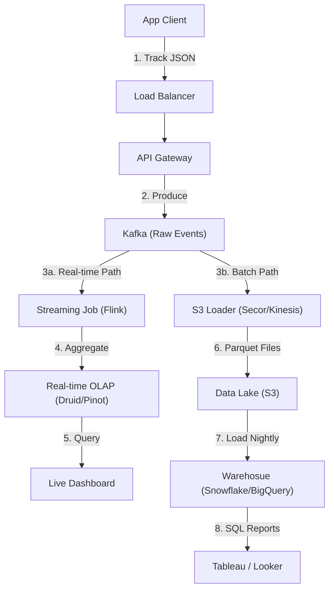

# 17. Analytics & Event Processing

## 1. Detailed Overview
The **Analytics** subsystem is the "Rearview Mirror" of the company. It answers "What happened?" (Reports) and "What is happening now?" (Real-time Dashboards).
**Why separate from the Main DB?**
- **OLTP vs OLAP**:
    - **OLTP (Users table)**: Optimized for "Get User ID=5". Row-oriented.
    - **OLAP (Analytics)**: Optimized for "Average age of all users". Column-oriented.
Running `SELECT AVG(cost)` on the Production Postgres DB will lock rows and bring the site down.

**Real-world Examples**:
- **Google Analytics**: Pageviews, Session duration.
- **Mixpanel**: "Funnel Analysis" (Did user click Signup -> Email -> Confirm?).
- **Datadog**: Infrastructure metrics (CPU usage).

## 2. Requirements & Reasoning

### Functional
- **Event Ingestion**:
    - *Requirement*: Capture "Click", "View", "Purchase" events.
- **Querying**:
    - *Requirement*: Slice and Dice. "Show me clicks by Country by Device Type".
- **Visualisation**:
    - *Requirement*: Line charts, Bar charts, Funnels.

### Non-Functional
- **Write Heavy**:
    - *Reasoning*: A user does 100 actions for every 1 transaction. Ingestion volume is massive (Billions/day).
- **Latency Tiers**:
    - *Real-time*: "How many people are on the site NOW?" (< 1 min).
    - *Batch*: "How much money did we make last month?" (24 hours ok).
- **Data Privacy**:
    - *Reasoning*: "Don't store Credit Card numbers in the analytics DB". Automatic PII redaction.

## 3. Interface Design

### Analytics API

```protobuf
service AnalyticsService {
  // Fire and forget
  rpc TrackEvent(Event) returns (Ack);
}

message Event {
  string event_name = 1; // "button_click"
  string user_id = 2;
  int64 timestamp = 3;
  map<string, string> properties = 4; // { "color": "blue", "screen": "home" }
}
```

## 4. Data Model

### Columnar Storage (The Secret Sauce)
Row Store (Postgres):
`[ID, Name, Age, City]` stored together on disk.
Column Store (ClickHouse/Snowflake):
`[Age, Age, Age...]` stored together.
**Why?**
- To calculate "Average Age", we only read the `Age` block. We skip Name and City entirely. 100x faster I/O.
- **Compression**: storing `[18, 18, 19, 18...]` compresses extremely well.

## 5. High-Level Design



### Component Breakdown
1.  **Kafka**: The unified log. Buffer.
2.  **Real-time Path (Speed Layer)**:
    - **Druid / ClickHouse**: Optimized for recent data queries.
    - *Trade-off*: More expensive RAM/CPU usage.
3.  **Batch Path (Serving Layer)**:
    - **Data Lake (S3)**: Cheap. Infinite retention.
    - **Snowflake**: Powerhouse for complex SQL joins over 5 years of data.
    - *Trade-off*: Data arrives with 1-hour to 1-day lag.

## 6. Deep Dive & Core Problems

### A. The Lambda Architecture
**Problem**: Real-time systems (Speed Layer) are approximate and can have bugs. Batch systems (Batch Layer) are accurate but slow.
**Solution**: **Run Both**.
- **Speed Layer**: Gives you the "Now". (Result A).
- **Batch Layer**: Re-computes everything tonight correctly. (Result B).
- **Query**: Merge Result A + Result B. Overwrite A with B when B becomes available.
- *Modern Trend*: **Kappa Architecture** (Just use Stream for everything) is replacing Lambda, but Lambda is still standard for complex joins.

### B. High Cardinality (The "User ID" Problem)
**Scenario**: "Group by browser" (Chrome, Firefox) -> Low Cardinality (Fast).
**Scenario**: "Group by UserID" (100 Million unique values).
**Problem**: Most OLAP databases choke on High Cardinality grouping.
**Solution**:
- **Pre-aggregation**: Don't store every raw click in Druid. Store `Rollup(Count, Minute)`.
- **HyperLogLog**: Use probabilistic data structures to count "Unique Users" with 99% accuracy using 12kb of RAM.

### C. Data Evolution (Schema Drift)
**Problem**: Dev changes `properties: { "price": "100" }` (String) to `properties: { "price": 100 }` (Int).
- **Result**: Pipeline crashes.
- **Solution**: **Dead Letter Queue (DLQ)**.
    - If parsing fails, dump raw JSON to S3 `error/` bucket.
    - Don't stop the pipeline.

## 7. Technology Choices

| Component | Standard Choice | Why we chose it (The "Why") | Alternatives considered |
| :--- | :--- | :--- | :--- |
| **Warehouse** | **Snowflake / BigQuery** | Serverless. Separation of Compute and Storage means you pay for query power only when running queries. | **Redshift** (Coupled storage/compute, harder to scale) |
| **Real-time DB** | **Apache Druid / ClickHouse** | Millisecond queries over billions of rows. True Columnar + Inverted Index. | **Elasticsearch** (Good for logs, but slower for numerical aggregation) |
| **Ingestion** | **Kafka** | The industry standard pipe. | |

## 8. Summary Checklist
- [ ] **Lambda Arch**: Batch + Speed layers.
- [ ] **Columnar**: Why Row-oriented SQL is bad for analytics.
- [ ] **HLL**: Counting unique items efficiently.
- [ ] **Schema Registry**: Managing changes in JSON structure.
