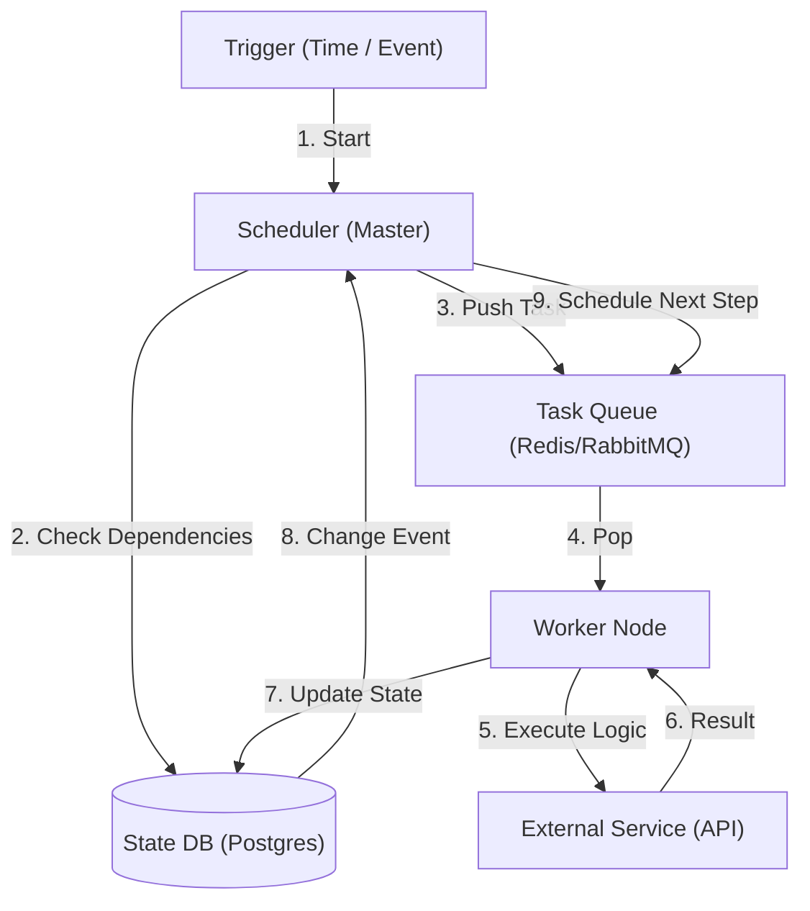

# 18. Workflow / Orchestration

## 1. Detailed Overview
The **Workflow** subsystem manages multi-step processes that take time (minutes to days) and can fail.
**Why not just use code?**
`func process() { step1(); step2(); step3(); }`
If the server crashes at `step2()`, checking "Did step 1 finish?" and "How do I retry step 2?" is hell.
Workflow engines persist the **State** of execution.

**Real-world Examples**:
- **ETL Pipelines**: Extract -> Transform -> Load.
- **E-commerce Fulfillment**: Order Placed -> Wait 20 mins -> Charge Card -> Email Warehouse -> Wait for Shipping Label -> Email User.
- **Video Processing**: Header Check -> Transcode -> Thumbnail -> Notify.

## 2. Requirements & Reasoning

### Functional
- **Dependency Management (DAG)**:
    - *Requirement*: "Run Step B only after Step A succeeds". "Run C and D in parallel".
- **Retries & Backoff**:
    - *Requirement*: If API fails, wait 5, 10, 20 seconds (Exponential Backoff).
- **Timeouts**:
    - *Requirement*: If Step A takes > 1 hour, kill it and alert.
- **History**:
    - *Requirement*: "Show me the logs for the run at 3:00 AM".

### Non-Functional
- **Durability**:
    - *Reasoning*: If the Orchestrator crashes, it must resume exactly where it left off (Checkpointing).
- **Scalability**:
    - *Reasoning*: Running 100k concurrent workflows (e.g., User Onboarding).

## 3. Interface Design

### Workflow Definition (DSL)
Usually YAML or Python Code.
```python
# Airflow Example
with DAG('order_processing', schedule='@daily') as dag:
    validate = PythonOperator(task_id='validate', ...)
    charge = PythonOperator(task_id='charge', ...)
    ship = PythonOperator(task_id='ship', ...)
    
    validate >> charge >> ship
```

## 4. Data Model

### The Task State
- **Table**: `WorkflowExecutions`
- **Columns**: `ExecutionID`, `CurrentStep`, `Status` (RUNNING, FAILED, SUCCESS), `Variables` (JSON Context).
- **Persistence**: Every state transition (`step1_success`) is a database commit.

## 5. High-Level Design



### Component Breakdown
1.  **Scheduler**: The brain. Decides *what* to run next based on the DAG graph.
2.  **State DB**: The memory. Stores "Node A is Done", "Node B is Pending".
3.  **Workers**: The muscle. Stateless containers that execute the actual Python/Java code.
4.  **Queue**: Buffer. Decouples scheduling from execution.

## 6. Deep Dive & Core Problems

### A. Airflow vs Temporal (Data vs App Workflows)
**Airflow (Data Pipelines)**:
- **Model**: "Scheduled Tasks".
- **Best for**: "Every night at 12am, run this SQL script".
- **Cons**: High latency. Not designed for "User clicked button -> trigger workflow".

**Temporal / Cadence (Microservice Orchestration)**:
- **Model**: "Event Driven".
- **Best for**: "User signup", "Payment Saga".
- **Pros**: Sub-second latency. Code-first (no YAML).
- **Magic**: You write sequential code, Temporal handles the crashes invisibly.
  `step1(); sleep(30 days); step2();` is valid code in Temporal.

### B. The "Split Brain" or Double Execution
**Problem**: Worker A picks up Task 1. Worker A freezes (GC pause). Scheduler thinks A is dead. Scheduler gives Task 1 to Worker B. Worker A wakes up.
**Result**: Task 1 runs twice.
**Solution**:
1.  **Idempotency**: Downstream API *must* handle dupes.
2.  **Leasing/Locking**: Worker A takes a "Lock" with TTL. It must heartbeat to keep the lock.

### C. Versioning
**Problem**: You change the workflow structure (Add Step 1.5).
- What happens to workflows currently running at Step 1?
**Solution**:
- **Versioning**: Run logic `v1` for old workflows, `v2` for new starts.
- **Migration**: Very hard. Usually better to drain `v1` and start `v2` fresh.

## 7. Technology Choices

| Component | Standard Choice | Why we chose it (The "Why") | Alternatives considered |
| :--- | :--- | :--- | :--- |
| **Data Orchestration** | **Apache Airflow** | Industry standard for ETL. Rich UI, huge plugin ecosystem. | **Prefect / Dagster** (Newer, better developer experience, but Airflow is entrenched) |
| **App Orchestration** | **Temporal** | Solves the "Saga Pattern" perfectly. Infinite scaling. "Durable Execution". | **AWS Step Functions** (Good, but vendor lock-in and JSON configs are annoying) |
| **Queue** | **Redis / RabbitMQ** | Fast task dispatch. | |

## 8. Summary Checklist
- [ ] **DAG**: Explain Directed Acyclic Graph.
- [ ] **Temporal**: Mentioning "Durable Execution" is a huge plus.
- [ ] **Idempotency**: Why retries shouldn't break things.
- [ ] **Backfill**: Rerunning history (ETL specific).
