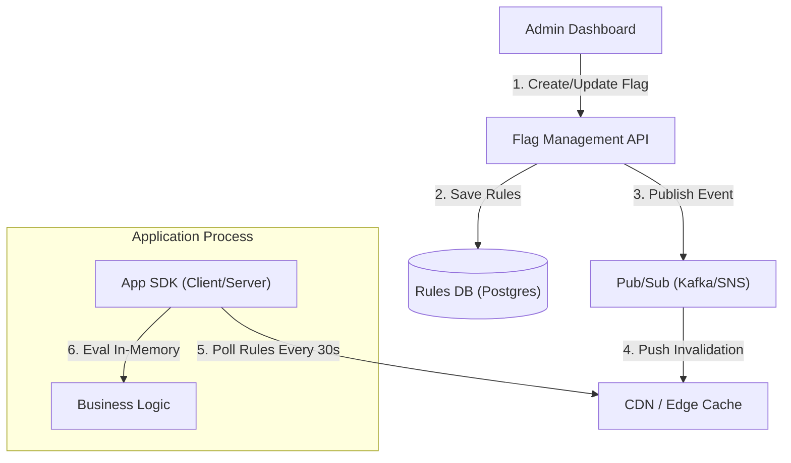

# 19. Feature Flags & Experiments

## 1. Detailed Overview
The **Feature Flag** subsystem allows you to modify system behavior without deploying new code. It is the core of **CI/CD** and **A/B Testing**.
**Why is it critical?**
- **Decoupling**: "Deploy" (move code to server) != "Release" (show feature to user).
- **Safety**: "Kill Switch". If the new checkout page has a bug, turn it off efficiently in 1 second. No rollback needed.
- **Growth**: "Show blue button to 50% users, red to 50%".

**Real-world Examples**:
- **LaunchDarkly**: Feature management as a service.
- **Facebook Gatekeeper**: The engine behind their "Move fast" culture.
- **Netflix**: Testing new algorithms on small user cohorts.

## 2. Requirements & Reasoning

### Functional
- **Boolean Flags**:
    - *Requirement*: `enable_new_ui = true/false`.
- **Multivariate Flags**:
    - *Requirement*: `button_color = "red" | "blue" | "green"`.
- **Targeting (Segmentation)**:
    - *Requirement*: "Enable only for Users in Canada". "Enable for Employee emails".
- **Percentage Rollout**:
    - *Requirement*: "Rollout to 1%, then 10%, then 100%".

### Non-Functional
- **Zero Latency**:
    - *Reasoning*: Flags are checked *everywhere* (in loops, in render). Evaluation must be microscopic (microseconds). **No Network Calls** per flag check.
- **Consistency**:
    - *Reasoning*: If User A sees "Red Button", they shouldn't see "Blue Button" on page refresh. Sticky assignment.
- **Reliability**:
    - *Reasoning*: If Flag Service is down, the app should default to "Safe Values" (False), not crash.

## 3. Interface Design

### SDK Design (Client Side)

```java
// Logic runs LOCALLY in memory
boolean showNewFeature = LDClient.variation("new-checkout", user, false);
if (showNewFeature) {
    renderNew();
} else {
    renderOld();
}
```

The SDK downloads the *rules*, not the *decision*.
SDK -> "Get Rules" -> Server returns `{"new-checkout": "IF country=CA THEN true"}`.
SDK -> Evaluates `user.country == CA` -> `true`.

## 4. Data Model

### Feature Rules
- **Rule Store**:
    - `FlagKey`: "new-checkout"
    - `Default`: false
    - `Rules`: `[ { "attr": "email", "op": "endsWith", "val": "@google.com", "res": true } ]`
    - `Rollout`: `20%`

## 5. High-Level Design



### Component Breakdown
1.  **Management API**: Where developers toggle switches.
2.  **CDN / Edge**: Distributes the rules JSON.
    - *Why*: We have 1 Million Clients. We can't have them all hitting the DB.
3.  **SDK**: The smart client. Handles Polling or Streaming updates.
    - *Evaluation*: Uses **MurmurHash** for percentage rollouts to ensure consistency without storage.

## 6. Deep Dive & Core Problems

### A. Implementing Percentage Rollouts (Stateless)
How do we show a feature to 10% of users without storing "User A = True" in a heavy database?
**Solution: Hashing**.
- Input: `FlagKey="new-ui"`, `UserID="user123"`.
- Hash: `Hash("new-ui" + "user123")` -> `Integer`.
- Modulo: `Integer % 100` -> `42`.
- Check: `Is 42 < 10`? No. Return False.
- **Consistency**: The math always yields 42. User A is consistently in the "False" bucket.
- **Scaling**: We can scale from 10% to 20% by changing the threshold check. Existing "True" users stay "True".

### B. Push vs Pull Updates
**Pull (Polling)**:
- SDK requests `/rules.json` every 30 seconds.
- *Pros*: Simple. Cacheable via CDN.
- *Cons*: Up to 30s delay in "Kill Switch".
**Push (Streaming)**:
- SDK holds SSE (Server Sent Events) connection.
- *Pros*: Instant updates.
- *Cons*: Expensive to maintain millions of connections.
- **Staff Choice**: **Hybrid**. Poll every minute. Use Push only for "Emergency Kill" high-priority channel.

### C. Technical Debt cleanup
**Problem**: Code is littered with `if (flag)`. Flags become stale.
**Solution**:
- **Staleness Metrics**: Track "When was this flag last evaluated to False?". If it's 100% True for 30 days, alert dev to delete the flag and the old code path.

## 7. Technology Choices

| Component | Standard Choice | Why we chose it (The "Why") | Alternatives considered |
| :--- | :--- | :--- | :--- |
| **Store** | **Postgres / DynamoDB** | Storage for rules. Reliability matters more than write speed (writes are rare). | **Zookeeper** (good for config, but harder to query for a dashboard) |
| **Distribution** | **CDN (Fastly/Cloudfront)** | Scale. Serving static JSON rule files is cheap and fast globally. | **Direct DB** (Will die under load) |
| **Algorithm** | **MurmurHash3** | Fast, deterministic hashing for rollouts. | |

## 8. Summary Checklist
- [ ] **Hashing**: Explain stateless consistent rollouts.
- [ ] **Decoupling**: Deploy != Release.
- [ ] **Latency**: Why local evaluation is mandatory.
- [ ] **Cleanup**: Managing flag debt.
