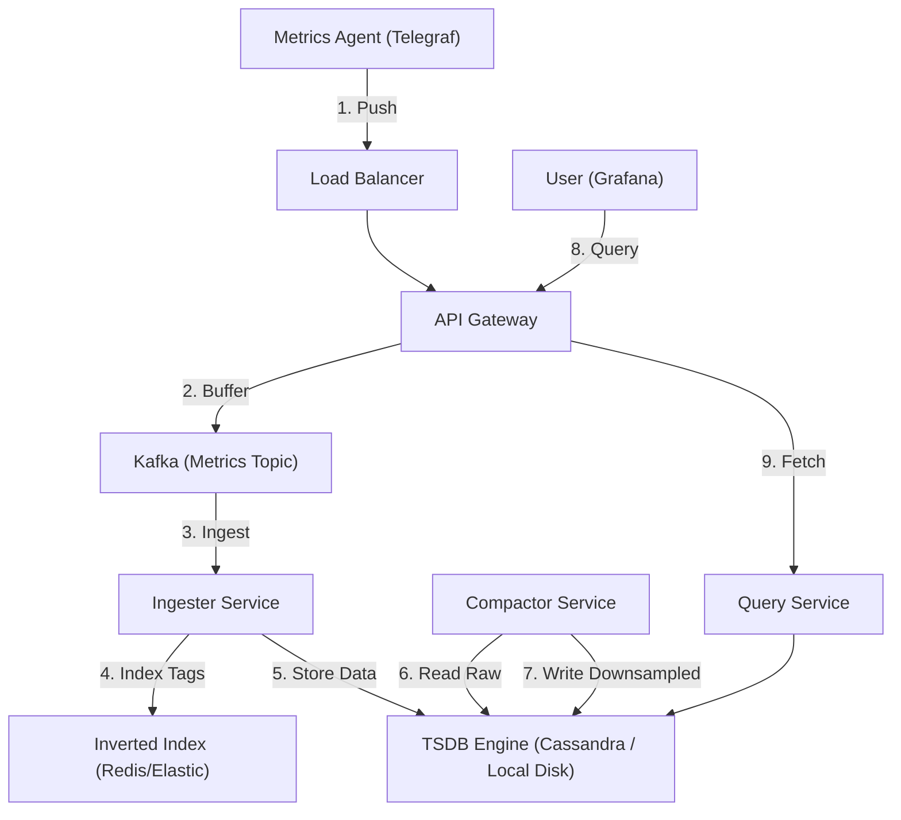

# 20. Time-Series Storage

## 1. Detailed Overview
The **Time-Series** subsystem handles data where specific time and ordering matters most (Metrics, Stock Prices, IoT Sensors).
**Why not MySQL?**
B-Trees are optimized for random updates. Time-series data is "Append Only" but massive volume (1M datapoints/sec).
We need **LSM Trees** (Log Structured Merge Trees) and specialized compression (Gorilla/Delta-of-Delta).

**Real-world Examples**:
- **Prometheus/Grafana**: Storing CPU loads.
- **Financial Tickers**: Storing stock price every millisecond.
- **Uber**: Storing GPS trails (Time + Location).

## 2. Requirements & Reasoning

### Functional
- **Ingestion**:
    - *Requirement*: High write throughput (Write-heavy).
- **Query**:
    - *Requirement*: Range queries. `SELECT avg(temp) WHERE time > now - 1h`.
- **Retention**:
    - *Requirement*: "Keep high-res data for 7 days, low-res for 1 year".

### Non-Functional
- **Compression**:
    - *Reasoning*: Storing `timestamp` (8 bytes) + `value` (8 bytes) * 1 Billion is expensive.
    - *Solution*: Store `timestamp` as `delta` from previous (1 bit). Storage shrinks by 10x.
- **Downsampling (Rollups)**:
    - *Reasoning*: A graph covering 1 year doesn't need 1-second resolution (31M points). It needs 1-day resolution (365 points).
    - *Action*: Auto-aggregate old data.

## 3. Interface Design

### TSDB API

```protobuf
service TimeSeriesDB {
  rpc Write(WriteRequest) returns (Ack);
  rpc Query(QueryRequest) returns (TimeSeriesData);
}

message DataPoint {
  int64 timestamp = 1;
  double value = 2;
  map<string, string> tags = 3; // { "host": "server-1", "dc": "us-east" }
}
```

## 4. Data Model

### Tags & Inverted Index
To support queries like `SELECT * WHERE region=us-east`, we need an index.
- **Table**: `SeriesIndex`
    - `Tag:region=us-east` -> List of Metrics IDs `[Metric_1, Metric_5]`.
- **Data Block**:
    - `Metric_1`: `[t1, v1], [t2, v2]...` (Compressed).

### Retention Policies
- **Raw**: 7 days.
- **5m_Avg**: 30 days.
- **1h_Avg**: 1 year.

## 5. High-Level Design



### Component Breakdown
1.  **Ingester**: Stateless. Parses points, looks up Tag IDs.
2.  **TSDB Engine**:
    - **Memory**: Stores the last 2 hours in RAM (Mutable).
    - **Disk**: Flushes to disk as immutable blocks (SSTables).
3.  **Compactor**: Background process. Merges small blocks into large blocks. Calculates averages for downsampling.

## 6. Deep Dive & Core Problems

### A. High Cardinality (The Prometheus Killer)
**Problem**:
- `cpu_usage{container_id="random-uuid"}`.
- If you spin up 1M containers a day, your Index grows to 1M entries.
- Searching the index becomes slow.
**Solution**:
- **Drop Tags**: Whitelist specific tags.
- **Time-bound Indices**: Create a fresh index every day. If usage is high today, it doesn't pollute tomorrow's index.

### B. Pull vs Push (Prometheus vs Datadog)
**Pull (Prometheus)**:
- Server connects to Client `http://client:9090/metrics`.
- *Pro*: Central control. Server knows if Client is down (connection fail).
- *Con*: Hard to scale. Server needs reachability to all IPs.
**Push (Datadog/Carbon)**:
- Client sends TCP to Server.
- *Pro*: Easy for short-lived jobs (Lambdas).
- *Con*: DDoSes the server.

### C. Compression (Gorilla Algorithm)
Facebook's Gorilla DB introduced efficient float compression.
- **XOR Compression**: The floating point value usually doesn't change much. `v1 XOR v2` has many zeros. Run-Length Encode the zeros.
- Result: 1.3 bytes per sample instead of 16 bytes.

## 7. Technology Choices

| Component | Standard Choice | Why we chose it (The "Why") | Alternatives considered |
| :--- | :--- | :--- | :--- |
| **Database** | **InfluxDB / TimescaleDB** | Specialized for time-series. Timescale uses Postgres ("Hypertables") which is nice for SQL enthusiasts. | **Prometheus** (Good for recent metrics, bad for long-term storage) |
| **Metrics Format** | **OpenTelemetry** | Cloud Native standard. | **StatsD** (Legacy) |
| **Storage** | **LSM Tree (RocksDB)** | Optimized for high write throughput. | **B-Tree** (Too much random I/O fragmentation) |

## 8. Summary Checklist
- [ ] **Cardinality**: The definition of "Too many tags".
- [ ] **Downsampling**: Aggregating old data to save space.
- [ ] **Push vs Pull**: The architectural difference.
- [ ] **LSM Tree**: Why append-only is best for metrics.
