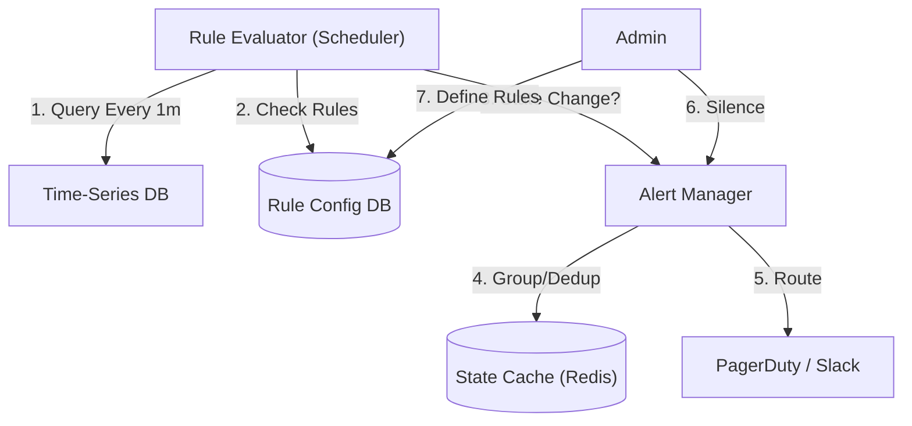

# 21. Alerting & Rule Engine

## 1. Detailed Overview
The **Alerting** subsystem watches the metrics (collected by the previous subsystem) and decides "Is this bad?".
**Why Separate?**
- **Reliability**: If the Dashboard (Grafana) is down, Alerting must still work.
- **Separation of Concerns**: Storing data (TSDB) is I/O heavy. Evaluating rules (Alerting) is CPU heavy.

**Real-world Examples**:
- **PagerDuty**: "Prod DB CPU > 90% for 5 mins".
- **Business Alert**: "Purchase Drop > 50% compared to last week".

## 2. Requirements & Reasoning

### Functional
- **Rule Definition**:
    - *Requirement*: Expression language (`avg(cpu) > 90`).
- **Notification Routing**:
    - *Requirement*: "Database Team" gets DB alerts. "Frontend Team" gets JS errors.
- **Silencing/Snoozing**:
    - *Requirement*: "Pause alerts during Maintenance Window".

### Non-Functional
- **False Positive Reduction**:
    - *Reasoning*: Buying a pager for a developer is easy. Preventing burnout from "Noise" is hard. (Flapping detection).
- **Latency**:
    - *Reasoning*: Detect outages in < 1 minute.
- **High Availability**:
    - *Reasoning*: The Alerting system needs to be *more* available than the system it monitors. (Watch the Watcher).

## 3. Interface Design

### Alert Config API

```protobuf
message AlertRule {
  string id = 1;
  string query = 2; // "avg_over_time(cpu[5m]) > 90"
  string duration = 3; // "for 5m" -> Wait for condition to persist
  string severity = 4; // P0, P1, P2
  repeated Contact route_to = 5; // { "email": "ops@..." }
}
```

## 4. Data Model

### The Rule State
- **State Store**: In-Memory (Redis).
- **Structure**: `{ rule_id: { state: "PENDING", start_time: 12:00 } }`.
- **Logic**:
    - Minute 1: CPU=95. State -> PENDING. (Start timer).
    - Minute 4: CPU=95. State -> PENDING.
    - Minute 6: CPU=95. `Diff > 5m`. State -> FIRING. Trigger Notification.
    - Minute 7: CPU=20. State -> OK.

## 5. High-Level Design



### Component Breakdown
1.  **Evaluator**: Queries the TSDB. "Is CPU > 90?".
2.  **Alert Manager**: The filter.
    - **Grouping**: Don't send 50 alerts for "Node 1 down", "Node 2 down"... Send 1 alert: "50 Nodes down".
    - **Inhibition**: If "Datacenter Down" is firing, suppress "Node 1 Down". (Root Cause filtering).
    - **Silencing**: Check maintenance windows.

## 6. Deep Dive & Core Problems

### A. Flapping (Hysteresis)
**Problem**: CPU oscillates 89 -> 91 -> 89 -> 91.
- Alert fires, resolves, fires, resolves. PagerDuty spam.
**Solution 1: Duration**: "Must be > 90 for **5 continuous minutes**".
**Solution 2: Hysteresis**:
- Trigger ON at 90.
- Trigger OFF at 80.
- (Like a Thermostat).

### B. "Missing Data" as an Alert
**Problem**: The metric agent crashes. Usage is `null` (not 0).
**Risk**: Silence implies health.
**Solution**: **Dead Man's Switch**.
- Alert if `count(metrics) == 0`.
- Always alert on "No Data" for critical services.

### C. Partitioning the Evaluator
**Problem**: 100,000 Rules. Can't eval all in 1 minute on one machine.
**Solution**: Sharding.
- Hash(RuleID) % N servers.
- **Reliability**: Running 2 independent evaluators (Replicas) is better.
    - *Con*: Duplicate alerts.
    - *Fix*: AlertManager handles deduplication. If Eval A and Eval B both say "Fire", AM sends only 1 notification.

## 7. Technology Choices

| Component | Standard Choice | Why we chose it (The "Why") | Alternatives considered |
| :--- | :--- | :--- | :--- |
| **Engine** | **Prometheus AlertManager** | Industry standard integration. Handles grouping/silencing natively. | **CloudWatch** (Locked to AWS), **Custom Python** (Bad idea - huge maintenance) |
| **State Store** | **Redis** | Fast read/write for "Current Alert State". | |
| **Notifications** | **PagerDuty** | Managing phone calls/SMS schedules is hard. Buy vs Build. | **OpsGenie** |

## 8. Summary Checklist
- [ ] **Grouping**: Essential for mass outages.
- [ ] **Hysteresis**: Preventing flapping.
- [ ] **Dead Man's Switch**: Alerting on silence.
- [ ] **Inhibition**: Don't page for symptoms if root cause is known.
