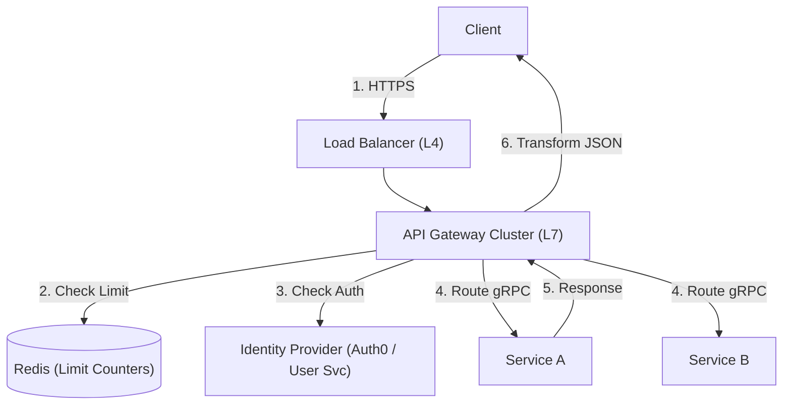

# 22. API Gateway & Rate Limiting

## 1. Detailed Overview
The **API Gateway** is the single entry point ("Facade") for all external traffic.
**Why do we need it?**
Without it, clients (Mobile/Web) couples directly to Microservices.
- If Service A moves to a new IP, Client breaks.
- If we want to add Auth, we have to implement it in Service A, B, and C (Dry violation).
The Gateway provides **Cross-Cutting Concerns**: Auth, Rate Limiting, SSL, Routing.

**Real-world Examples**:
- **AWS API Gateway / ALB**: Managed entry points.
- **Zuul / Kong**: Open source gateways.

## 2. Requirements & Reasoning

### Functional
- **Routing**: `/api/users` -> User Service. `/api/orders` -> Order Service.
- **Protocol Translation**: HTTP/JSON (External) -> gRPC (Internal).
- **Authentication**: Verify JWT at the door. Pass `X-User-ID` header to internal services.

### Non-Functional
- **Low Latency**:
    - *Reasoning*: Added overhead should be < 10ms.
- **High Availability**:
    - *Reasoning*: If Gateway dies, 100% of traffic stops.
- **Rate Limiting (Protection)**:
    - *Reasoning*: Prevent one malicious IP from starving the system.

## 3. Interface Design

### Config (Declarative)

```yaml
routes:
  - path: /api/v1/orders
    service: order-service
    auth: true
    rate_limit: 100_per_min
    timeout: 5s
```

## 4. Data Model

### Rate Limit State (Redis)
We need a shared counter across all Gateway nodes.
- **Key**: `ratelimit:{user_id}:{minute}`
- **Value**: `Count (Int)`
- **Algorithm**: Token Bucket or Fixed Window.

## 5. High-Level Design



### Component Breakdown
1.  **L4 Load Balancer**: Distributes TCP connections to L7 Gateways.
2.  **API Gateway (L7)**: Inspects HTTP headers.
    - **SSL Termination**: Decrypts HTTPS here. Internal traffic is HTTP (faster).
3.  **Service Registry (Consul/K8s DNS)**: How Gateway knows IP of "Service A".

## 6. Deep Dive & Core Problems

### A. Rate Limiting Algorithms
- **Fixed Window**: "100 reqs in 12:00-12:01".
    - *Problem*: Spike at 12:00:59 and 12:01:01 allows 200 reqs in 2 seconds.
- **Sliding Window Log**: Precise. Stores every timestamp.
    - *Problem*: High RAM usage.
- **Token Bucket**:
    - Bucket size 10. Refill 1 per sec.
    - *Pro*: Allows bursts (good for user experience) but limits sustained rate. **Standard Choice**.

### B. The "SPOF" Risk (Single Point of Failure)
The Gateway is a choke point.
**Solution**:
- **Clustering**: Run N instances.
- **Share Nothing**: Gateway should not hold state (except caching). Fetch Config from DB, Auth from Redis.
- **Circuit Breaking**: If Service A is failing (500 error), Gateway stops sending traffic ("Open Circuit") to fail fast and save the thread pool.

### C. Backend for Frontend (BFF)
**Problem**: Mobile App needs fewer fields than Web App.
**Solution**:
- Instead of one generic "Gateway", create specific aggregators.
- `Mobile-BFF` -> Calls User+Order, strips unused fields -> Returns small JSON.
- `Web-BFF` -> Calls User+Order, returns rich JSON.

## 7. Technology Choices

| Component | Standard Choice | Why we chose it (The "Why") | Alternatives considered |
| :--- | :--- | :--- | :--- |
| **Gateway** | **Envoy / Kong** | High performance (C++/Lua/Go). Feature rich (Retries, Obs). | **Nginx** (Great, but harder to obtain dynamic features without Plus), **Zuul** (Java-based, GC pauses) |
| **Protocol** | **gRPC (Internal)** | Binary protobuf is 10x smaller/faster than JSON. Strongly typed. | **REST** (Text heavy) |

## 8. Summary Checklist
- [ ] **Token Bucket**: Explain why it handles bursts better.
- [ ] **Circuit Breaker**: Preventing cascading failure.
- [ ] **SSL Termination**: Offloading CPU cost from microservices.
- [ ] **BFF**: Optimizing for different clients.
