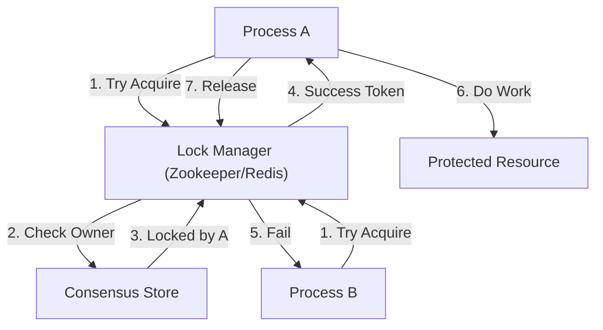

# 23. Distributed Lock & Coordination

## 1. Detailed Overview
The **Distributed Lock** subsystem ensures that only *one* process can perform a critical action at a time, even across a fleet of 1000 servers.
**Why do we need it?**
- **Correctness**: "Don't charge the user twice".
- **Efficiency**: "Don't run the cron job on all 10 servers".

**Real-world Examples**:
- **Leader Election**: Selecting one node to be the "Master" for partitioning.
- **Ticket Booking**: Preventing double-booking of a seat.

## 2. Requirements & Reasoning

### Functional
- **Mutual Exclusion**:
    - *Requirement*: If Process A has the lock, Process B must fail/wait.
- **Timeout (Lease)**:
    - *Requirement*: If Process A crashes holding the lock, the lock must Auto-Release (TTL).
    - *Why*: Otherwise the resource is deadlocked forever.

### Non-Functional
- **Consistency (CP System)**:
    - *Reasoning*: We cannot tolerate "Split Brain" (two people holding the lock). We prefer to return Error (Availability loss) than corrupt data (Consistency loss).
- **Latency**:
    - *Reasoning*: Acquiring a lock should be fast (< 10ms).

## 3. Interface Design

### Lock API

```protobuf
service LockService {
  // Returns lock_id (token) if successful
  rpc Acquire(Key, TTL) returns (Token);
  
  // Must provide token to prove ownership
  rpc Release(Key, Token) returns (Ack);
  
  // Keep alive for long tasks
  rpc Heartbeat(Key, Token) returns (Ack);
}
```

## 4. Data Model

### The Lease
- **Key**: `resource_id`
- **Value**: `owner_uuid` + `expiration_timestamp`
- **Data Store**: ZooKeeper (Znodes) or Redis.

## 5. High-Level Design



### Component Breakdown
1.  **Lock Manager**: The arbiter.
2.  **Consensus Store (ZooKeeper/Etcd)**:
    - **Why ZK?**: It guarantees Strong Consistency via consensus (ZAB/Raft). If the network partitions, ZK stops accepting writes, ensuring no two people get the lock.
    - **Why Redis?**: Faster, but technically AP. In standard Sentinel mode, it is *possible* to lose a lock during failover. (Redlock algorithm mitigates this).

## 6. Deep Dive & Core Problems

### A. The "Zombie Process" (GC Pause)
**Scenario**:
1.  A acquires lock (TTL 10s).
2.  A hits a Java Garbage Collection (GC) Stop-the-world pause for 15s.
3.  TTL expires.
4.  B acquires lock.
5.  A wakes up. Takes action (Write to DB).
6.  B takes action (Write to DB).
**Result**: **Corruption**. Two writers.
**Solution: Fencing Tokens**.
- DB must enforce versioning.
- Lock Service returns Token `33`.
- B gets Token `34`.
- DB checks: "Current token is 34. A provided 33. Reject A."

### B. Redis Redlock (The "Good Enough" Solution)
Using a single Redis is a SPOF.
**Redlock Algorithm**:
1.  Run 5 independent Redis masters.
2.  Try to acquire lock on N1, N2, N3, N4, N5.
3.  If successful on Majority (3/5) AND time < TTL: You have the lock.
4.  *Why*: Survives loss of 2 nodes. Better than single Redis.

### C. Zookeeper vs Redis
- **Zookeeper/Etcd**: Heavy. Strongest guarantees. Use for **Core Infrastructure** (Leader Election, Database Sharding).
- **Redis**: Fast. Good guarantees. Use for **Business Logic** (User clicking a button twice).

## 7. Technology Choices

| Component | Standard Choice | Why we chose it (The "Why") | Alternatives considered |
| :--- | :--- | :--- | :--- |
| **Consensus** | **Zookeeper / Etcd** | Correctness. Empowers systems like Kafka and Kubernetes. | **Consul** |
| **Business Lock**| **Redis** | Speed. Most infrastructure already has Redis. Simplifies stack. | **DynamoDB** (With conditional writes - great for serverless) |

## 8. Summary Checklist
- [ ] **Fencing Token**: The only way to stop Zombie processes.
- [ ] **Split Brain**: Why CP is required.
- [ ] **Lease/TTL**: Handling client death.
- [ ] **Raft/Paxos**: Namedrop the consensus algorithm.
