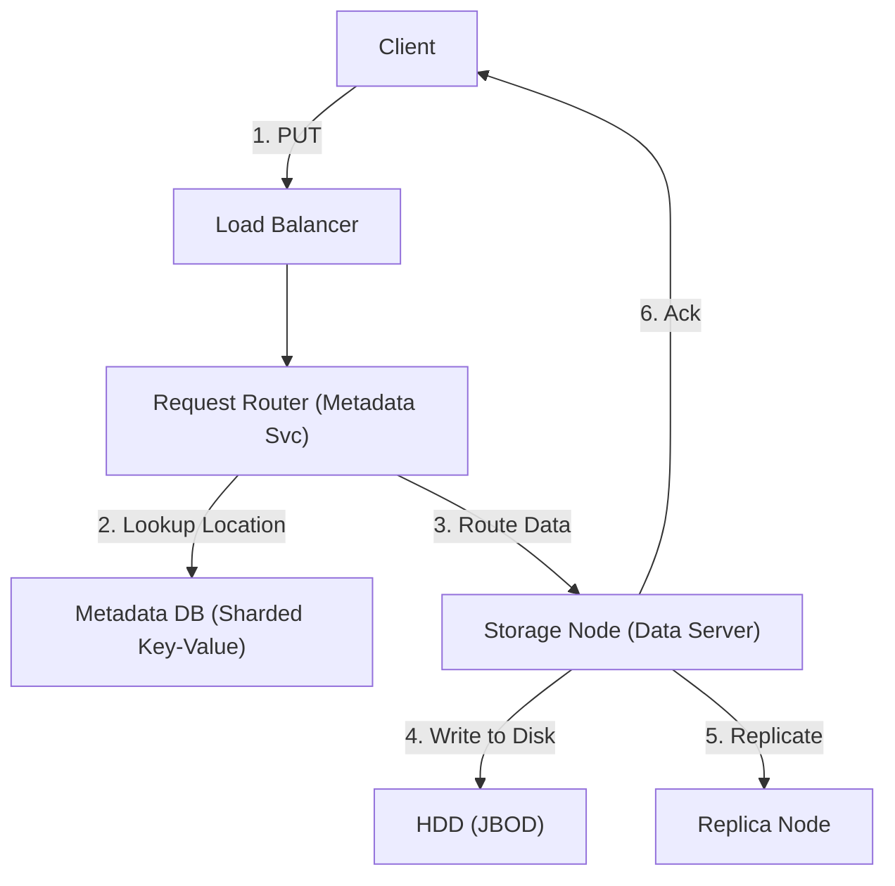

# 24. Blob / Object Storage

## 1. Detailed Overview
The **Blob Storage** subsystem stores immutable binary data (Photos, Logs, Backups).
**Why not a File System (NFS)?**
File Systems have hierarchies (Folders) and Metadata (POSIX locks) that don't scale to Billion of files.
Object Stores use flat namespaces (`Bucket + Key`) and simple HTTP APIs (`PUT`, `GET`) to scale infinitely.

**Real-world Examples**:
- **Amazon S3**: The archetype.
- **Facebook Haystack**: Optimization for small photos.

## 2. Requirements & Reasoning

### Functional
- **CRUD**: Put, Get, Delete. (No "Edit").
- **Metadata**: Key-Value tags (`user=123`).

### Non-Functional
- **Durability (11 9's)**:
    - *Reasoning*: Data loss is unacceptable. We must survive the destruction of an entire datacenter.
- **Availability**:
    - *Reasoning*: "Always on". Eventual Consistency is acceptable (Read-after-write consistency is hard).
- **Throughput**:
    - *Reasoning*: Saturate 100Gbps network links for Big Data jobs.

## 3. Interface Design

### S3-style API

```protobuf
service ObjectStore {
  rpc PutObject(Bucket, Key, Data) returns (Ack);
  rpc GetObject(Bucket, Key) returns (Data);
  rpc HeadObject(Bucket, Key) returns (Metadata); // Check existence
}
```

## 4. Data Model

### The Immutable Blob
- **Files are not modified**. They are overwritten.
- **Namespace**: Flat. `/bucket/folder/file.txt` is just a string Key `folder/file.txt`. There are no real folders.

## 5. High-Level Design



### Component Breakdown
1.  **Metadata Service**: Stores the map `Key -> [Disk1, Disk2, Disk3]`. Needs to be fast (Bigtable/Cassandra).
2.  **Storage Node**: Dumb server with lots of Disks. Just writes blobs.
3.  **Replicator**: Background process ensuring 3 copies exist.

## 6. Deep Dive & Core Problems

### A. Erasure Coding (Saving Cost)
**Problem**: Storing 3 full copies (Replica=3) means 200% overhead. 1PB data = 3PB disk. Expensive.
**Solution: Erasure Coding (Reed-Solomon)**.
- Split data into 6 chunks + 3 Parity chunks (Total 9).
- Store 9 chunks on 9 servers.
- **Math**: Any 6 chunks can reconstruct the file.
- **Resilience**: Can lose any 3 servers.
- **Overhead**: 50% extra (1.5x) instead of 200% extra (3x).
- *Trade-off*: Reconstruction is CPU intensive. Used for "Cold" storage.

### B. The "Small File" Problem (Haystack)
**Problem**: Filesystems (ext4) have inode overhead. Reading 1KB photo requires 1 Disk Seek (Inode) + 1 Disk Seek (Data).
- For billions of photos, the Inode lookups kill performance.
**Solution**: **Agglomeration**.
- Pack 1000 small photos into 1 Giant File (1GB).
- Maintain an in-memory index of offsets: `Photo A starts at byte 5000`.
- **Result**: 1 Seek to read.

### C. Range Requests
**Feature**: Video streaming needs `GET /movie.mp4 Range: bytes=0-1000`.
**Implementation**: Storage Node just seeks to offset and streams.
**Benefit**: Resumable downloads.

## 7. Technology Choices

| Component | Standard Choice | Why we chose it (The "Why") | Alternatives considered |
| :--- | :--- | :--- | :--- |
| **Hard Disks** | **HDD / SMR** | Cost per TB. Tape is cheaper but too slow. SSD is too expensive for cold blobs. | **SSD** (For Metadata only) |
| **Algorithm** | **Consistent Hashing** | Mapping Keys to Nodes. | |

## 8. Summary Checklist
- [ ] **Erasure Coding**: The key economic driver.
- [ ] **Immutable**: Why we don't edit files in place.
- [ ] **Metadata vs Data**: Separation of concerns.
