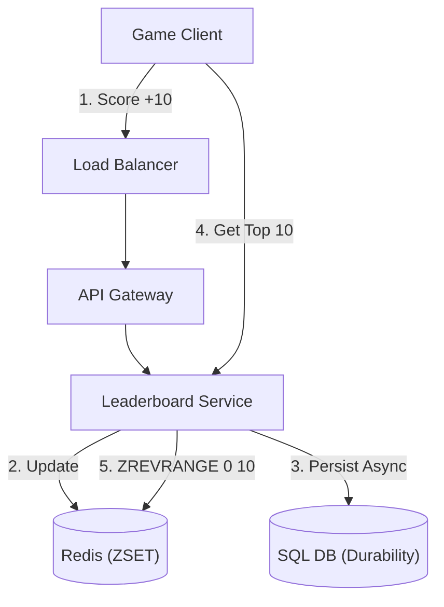

# 25. High-Performance Leaderboard

## 1. Detailed Overview
The **Leaderboard** subsystem ranks entities based on a score in real-time.
**Why is it hard?**
Sorting is expensive `O(N log N)`.
If you have 10 Million players, and Player A gets +10 points, re-sorting the entire 10 Million list is impossible to do in real-time.
We need a data structure that maintains sorted order on `Insert/Update` efficiently.

**Real-world Examples**:
- **Gaming**: "Top 100 Global Players".
- **Social**: "Trending Hashtags" (Ranked by Count).
- **Financial**: "Top Gainers" stock list.

## 2. Requirements & Reasoning

### Functional
- **Update Score**:
    - *Requirement*: `AddScore(User, 10)`. (Increment).
- **Get Rank**:
    - *Requirement*: "What place am I?" (e.g., 5,402th).
- **Get Top K**:
    - *Requirement*: "Who are the top 10?".
- **Get Neighbors**:
    - *Requirement*: "Show me the 2 people above and below me".

### Non-Functional
- **Real-time Accuracy**:
    - *Reasoning*: Gamification relies on instant feedback.
- **High Write Throughput**:
    - *Reasoning*: In a tournament, millions of score updates happen per minute.

## 3. Interface Design

### Leaderboard API

```protobuf
service LeaderboardService {
  rpc SubmitScore(ScoreUpdate) returns (CurrentRank);
  rpc GetTop(LeaderboardID, Limit) returns (List<Entry>);
  rpc GetMyRank(LeaderboardID, UserID) returns (RankEntry);
}
```

## 4. Data Model

### The Sorted Set (Skip List)
We don't use a B-Tree or SQL Table (slow for "Rank" calculation).
We use a **Skip List** or **Redis ZSET**.
- **Operation**: `ZADD key score member`.
- **Complexity**: `O(log N)` for Update. `O(log N)` for Rank.
- **Why**: Standard SQL `SELECT count(*) FROM scores WHERE score > my_score` is `O(N)`. ZSET is `O(log N)`.

## 5. High-Level Design



### Component Breakdown
1.  **Redis**: The engine. Holds the `ZSET`.
    - Key: `leaderboard:global`
    - Score: `Points`
    - Member: `UserID`
2.  **SQL DB**: The backup. Redis is RAM; if it crashes, we replay the leaderboard from the SQL log.

## 6. Deep Dive & Core Problems

### A. The Million User Problem (Sharding)
A single Redis instance can hold ~10M items in a ZSET, but performance drops.
**Problem**: How to scale to 1 Billion users?
**Solution: Partitioning**.
- **Idea**: You cannot partition a *SINGLE* global leaderboard easily (sorting requires all data).
- **Approximate Method (Scatter-Gather)**:
    1.  Shard users into 10 partitions (User ID % 10).
    2.  Each partition maintains a "Top 100".
    3.  Query: Get Top 100 from ALL 10 shards. Merge them. Return Top 100.
    - *Flaw*: This works for Top K. It does NOT work for "Get My Rank" (You don't know how many people in other shards have a higher score).
- **Exact Method (Feature Partitioning)**:
    - Partition by Score Range? (Hard to rebalance).
    - Usually, for 1B users, we accept we cannot have a *Global, Real-time, Exact* rank. We use **Batch Updates** for the global rank, and Real-time for **Local/Friend** leaderboards.

### B. Leaderboard Reset (Seasonality)
**Problem**: Deleting 10M keys in Redis (`DEL key`) causes a thread block (Latency Spike).
**Solution**:
- Use **UNLINK** (Async delete).
- Or just switch keys: `leaderboard:season_1` -> `leaderboard:season_2`.

### C. Tie Breaking
**Problem**: User A and B both have 100 points. Who is #1?
**Solution**: Time-based. First to reach 100 wins.
- **Score Formula**: `Total = Points + (1 / Timestamp)`.
- Or store `Timestamp` as a decimal suffix: `100.16900000`.

## 7. Technology Choices

| Component | Standard Choice | Why we chose it (The "Why") | Alternatives considered |
| :--- | :--- | :--- | :--- |
| **Engine** | **Redis** | The `ZSET` data structure is the industry standard for this problem. `O(log N)` rank. | **SQL** (Too slow for ranking updates), **DynamoDB** (No native Rank support, only Sort Key) |

## 8. Summary Checklist
- [ ] **Skip List**: The underlying structure of ZSET.
- [ ] **O(log N)**: The complexity of finding rank.
- [ ] **Scatter-Gather**: Scaling Top K.
