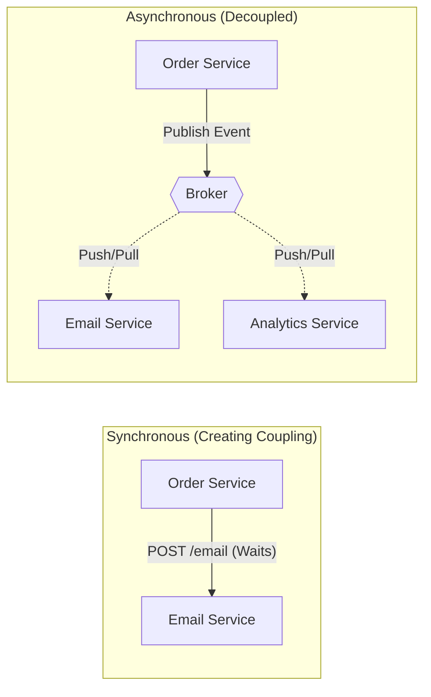

# 01. Message Broker Overview: Architectural Paradigms

## 1. Introduction
In distributed systems, **Message Brokers** act as the intermediary layer that decouples services in time and space. They replace synchronous, blocking Remote Procedure Calls (RPC) with asynchronous event passing, enabling systems to handle load spikes, isolate failures, and evolve independently.

This document outlines the fundamental architectural paradigms and design patterns common across all broker technologies.

---

## 2. Core Architecture: The Async Decoupling

The primary value of a broker is **Temporal Decoupling**.

### Benefits
1.  **Failure Isolation**: If the Email Service is down, the Order Service successfully completes the transaction. The broker buffers the message until the Email Service recovers.
2.  **Load Leveling**: The broker absorbs burst traffic (e.g., 10k orders/sec) and lets consumers process at their own pace (e.g., 500/sec), preventing database collapse.

---

## 3. The Two Paradigms: Queue vs. Stream

Choosing the right broker requires understanding the fundamental difference between "Transient Work" and "Persisted History".

### Paradigm A: The Message Queue (Smart Broker)
*   **Mental Model**: A Task Distributor.
*   **Behavior**:
    *   **Destructive Read**: Once a consumer acknowledges a message, it is **Deleted** from the broker.
    *   **Competitors**: Multiple consumers on the same queue compete for messages (Load Balancing).
    *   **Stateful**: The broker tracks who has which message.
*   **Technology**: RabbitMQ, AWS SQS, ActiveMQ.
*   **Use Case**: Task Processing (Image Resizing, Email Sending).

### Paradigm B: The Event Stream (Dumb Broker)
*   **Mental Model**: A Distributed Log.
*   **Behavior**:
    *   **Non-Destructive Read**: Reading a message does **not** delete it. It stays on disk until retention expires (e.g., 7 days).
    *   **Independent Readers**: Multiple consumer groups read the same history independently at their own pace.
    *   **Stateless**: The broker doesn't care what consumers are doing. Consumers track their own "Offset".
*   **Technology**: Apache Kafka, AWS Kinesis.
*   **Use Case**: Data Pipelines, Event Sourcing, Analytics.

---

## 4. Key Design Patterns

### A. Competing Consumers (Work Queue)
Used to scale up CPU-intensive tasks.
*   **Setup**: 1 Queue, 50 Consumers.
*   **Flow**: Message 1 -> C1, Message 2 -> C2.
*   **Result**: Throughput increases linearly with consumer count.

### B. Publish / Subscribe (Fanout)
Used to broadcast state changes to multiple downstream systems.
*   **Setup**: 1 Exchange/Topic, 3 Distinct Queues (Email, Audit, CacheInvalidator).
*   **Flow**: Message 1 -> Copied to all 3 Queues.
*   **Result**: Zero coupling between the Email team and the Audit team.

### C. Dead Letter Queue (DLQ)
Used to handle "Poison Pills" (Malformatted messages that crash consumers).
*   **Mechanism**: If a consumer rejects a message (Nack) `X` times, the broker moves it to a separate DLQ.
*   **Ops**: Engineers monitor the DLQ to investigate bugs without blocking the main pipeline.

---

## 5. Decision Matrix

| Requirement | Recommended Technology |
| :--- | :--- |
| **Complex Routing** (Topics, headers, priority) | **RabbitMQ** |
| **Throughput / Replay** (1M+ events/s, Historical Analysis) | **Kafka** |
| **Serverless / Maintenance Free** | **AWS SQS** |
| **Global Geo-Replication** | **Kafka** (MirrorMaker) or **RabbitMQ** (Federation) |
