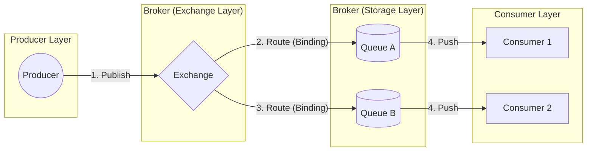

# 02. RabbitMQ: The Smart Broker Architecture

## 1. Introduction
RabbitMQ is a mature, general-purpose message broker that implements the **AMQP 0-9-1** protocol. Unlike streaming platforms (Kafka) that prioritize raw throughput, RabbitMQ prioritizes **complex routing**, **flexible delivery guarantees**, and **fine-grained reliability**.

It acts as a "Smart Broker" because it maintains the delivery state of every individual message, allowing for features like delayed retries, dead-letter routing, and priority queues.

---

## 2. Core Architecture

The RabbitMQ model separates the "Message Publisher" from the "Storage Queue".

### Key Components
1.  **Producer**: The application that sends the message. It *never* writes directly to a queue.
2.  **Exchange**: The entry point. It takes a message and uses **Binding Rules** to decide which queue(s) typically receive it.
3.  **Queue**: A sequential buffer that holds messages until a consumer is ready.
4.  **Binding**: The logic linking an Exchange to a Queue (e.g., "If key='error', go to Queue A").

---

## 3. Message Delivery Mechanics

This section details exactly how RabbitMQ moves a message from the Queue to the Consumer.

### A. Round-Robin Dispatching
By default, if multiple consumers are connected to a single queue, RabbitMQ distributes messages in a strict **Round-Robin** fashion, regardless of how busy the consumers are.

*   **Scenario**: Queue has messages `[1, 2, 3, 4]`. Consumers `A` and `B` connect.
*   **Result**:
    *   Consumer A gets: `1, 3`
    *   Consumer B gets: `2, 4`

### B. The "Prefetch" (Push Model)
RabbitMQ uses a **Push** model. It forces messages down the TCP connection to the consumer.
*   **Problem**: If Consumer A is processing a heavy PDF (taking 1 minute), and Consumer B is idle, Round-Robin will still send 50% of work to Consumer A. Consumer A's internal buffer fills up, causing a bottleneck.
*   **Solution: Prefetch Count**.
    *   Setting `Basic.Qos(prefetch=1)` tells RabbitMQ: *"Do not push a new message to me until I have Sent an ACK for the previous one."*
    *   This converts the system to a "Fair Dispatch" model where busy consumers get fewer messages.

### C. Acknowledgment Lifecycle
RabbitMQ guarantees reliability via **Acknowledgments**.

1.  **Delivery**: Broker sends Message X to Consumer. Status becomes `Unacked`.
2.  **Processing**: Consumer executes logic.
3.  **Ack**: Consumer sends `Basic.Ack`. Broker deletes Message X.
    *   **Ack Failure**: If the consumer's TCP connection dies (crash) while Message X is `Unacked`, RabbitMQ **Re-queues** it. It will be delivered to another consumer.
    *   **Negative Ack (Nack)**: If the consumer logic catches an error (e.g., "Invalid JSON"), it can send `Basic.Reject(requeue=False)`. The message is either deleted or sent to a **Dead Letter Queue (DLQ)**.

---

## 4. Reliability & Internals

### Reliability Guarantees
*   **At-Least-Once**: The standard mode. If a consumer crashes after processing but before Acking, the message is redelivered (duplicate processing).
*   **At-Most-Once**: Consumer Auto-Acks immediately upon receipt. Best for high speed, low safety.

### Flow Control (Backpressure)
RabbitMQ protects itself from crashing due to memory exhaustion.
*   **Per-Connection Limit**: If a specific queue cannot write to disk fast enough, RabbitMQ stops reading from the socket of the publisher sending to that queue. The publisher blocks.
*   **Memory Watermark**: If the Broker's RAM usage exceeds 40% (configurable), it blocks **ALL** publishers globally. This is a "Stop the World" protection mechanism.

---

## 5. Constraints & Limitations

Every technology has breaking points. Here are RabbitMQ's:

| Constraint | Limit | Why? |
| :--- | :--- | :--- |
| **Throughput** | ~50k msgs/s per queue | A single queue is single-threaded (Erlang process). It cannot use multiple cores. |
| **Queue Depth** | Keep it empty! | RabbitMQ is designed for **RAM**. If millions of messages accumulate, they page to disk, destroying performance. |
| **Message Size** | < 128MB | Large payloads block the single thread. Use S3 for large data and pass the pointer. |
| **Global Scale** | difficult | Clustering logic is complex and sensitive to network latency. Not meant for WAN replication. |

---

## 6. Clustering & High Availability

### Quorum Queues (The Gold Standard)
For high availability, we use **Quorum Queues**, which implement the **Raft Consensus Algorithm**.
*   **Structure**: A queue consists of 1 Leader and multiple Followers.
*   **Write Path**: A message is confirmed only when a **Majority** (e.g., 2/3) of nodes have written it to disk.
*   **Advantages**:
    *   **Partition Tolerance**: Can survive node failures and split-brain scenarios without data loss.
    *   **Poison Message Safety**: Handles "bad messages" causing crash loops better than classic queues.

---

## 7. Scaling RabbitMQ: Global & Horizontal

Unlike Kafka, RabbitMQ does not "just add nodes" to scale infinitely. You must be strategic.

### A. Horizontal Scaling (Sharding)
A single queue is bound to a single Erlang process (1 CPU Core).
*   **The Limit**: Max ~50k msg/s per queue.
*   **The Fix**: Use the **Sharding Plugin** or **Consistent Hash Exchange**.
    *   *Mechanism*: You publish to Exchange X. It hashes the routing key (e.g., `order_id`) and routes to `Queue_1`, `Queue_2` ... `Queue_10`.
    *   *Result*: You now have 10 queues using 10 CPU cores, achieving 500k msg/s.

### B. Global Scaling (Geo-Replication)
**Challenge**: How do we replicate from AWS US-East to AWS EU-West?

#### 1. The Anti-Pattern: Stretched Cluster
*   **Do Not**: Connect US-East nodes and EU-West nodes into one implementation.
*   **Why**: Erlang distribution assumes low latency. WAN latency causes constant "Net Ticks" (timeouts), leading to partition flapping and cluster disintegration.

#### 2. The Solution: Federation / Shovel
RabbitMQ provides async replication tools.
*   **Federation**:
    *   *Concept*: "Pull" model. The Downstream (EU) broker connects to Upstream (US) and pulls messages.
    *   *Use Case*: Replicating "Reference Data" (e.g., Product Catalog updates) to all regions.
*   **Shovel**:
    *   *Concept*: "Push" model. A script acts as a consumer on Source and producer on Dest.
    *   *Use Case*: Migrating data or moving Dead Letters to a central cluster.

### C. Example: Global Order Processing
*   **Scenario**: Users in Europe must have fast ordering. Analytics is centralized in US.
*   **Setup**:
    1.  **EU-West Cluster**: Local users publish `order.created` here. (Fast).
    2.  **US-East Cluster**: The Analytics Service lives here.
    3.  **Federation**: US-East has a "Federated Queue" that pulls from EU-West.
    4.  **Result**: Local latency for EU users, eventual consistency for US analytics.

---

## 8. When to Use RabbitMQ?

| Use Case | Verdict | Why? |
| :--- | :--- | :--- |
| **Complex Routing** | **YES** | You need to route 'Server A' logs to 'DevOps' and 'Server B' logs to 'Security'. Exchanges make this trivial. |
| **Job Queues** | **YES** | You need to acknowledge individual tasks (Resize Image). If a worker dies, the specific task retries instantly. |
| **Delayed Messaging** | **YES** | "Retry this email in 15 minutes." RabbitMQ supports delayed exchanges (via plugin). |
| **Big Data Streaming** | **NO** | Use Kafka. RabbitMQ struggles with massive persistent storage and replayability. |

---

## 9. Production Checklist

1.  [ ] **Use Quorum Queues** for all critical data.
2.  [ ] **Set Prefetch=1** (or small number) for worker queues to ensure even load balancing.
3.  [ ] **Enable Manual Acks** to prevent data loss on crash.
4.  [ ] **Monitor Queue Depth**. If it grows, you are in trouble. Add consumers.
5.  [ ] **Reuse Connections**. Open one TCP connection per app, and use logic Channels for threads.
