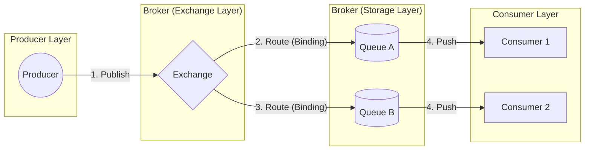
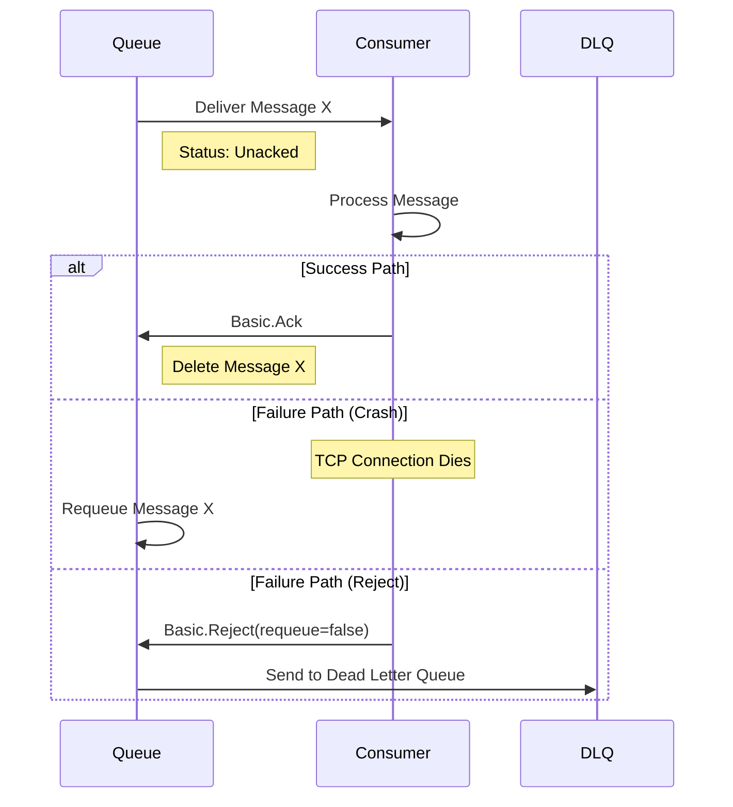
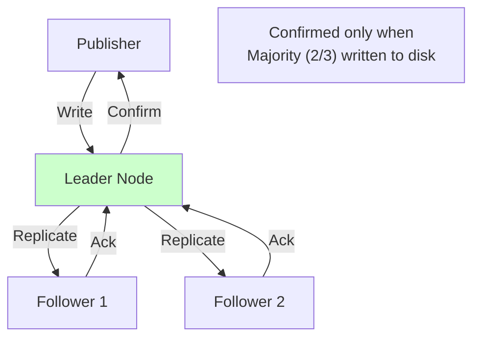
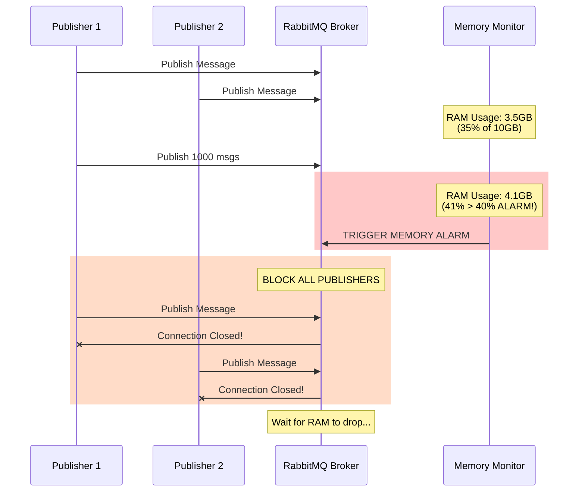
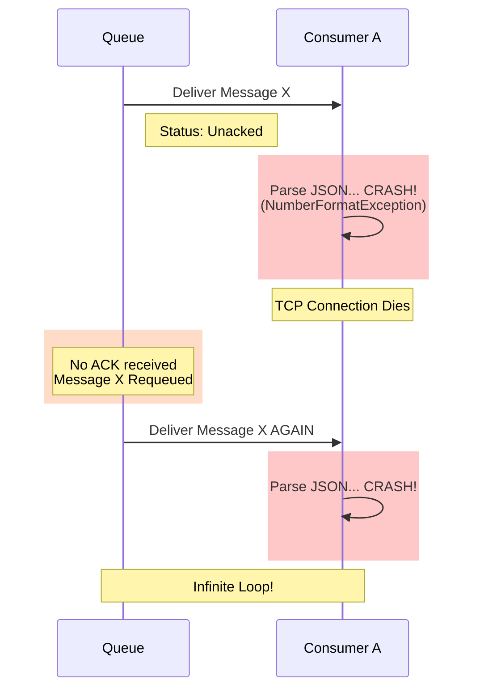
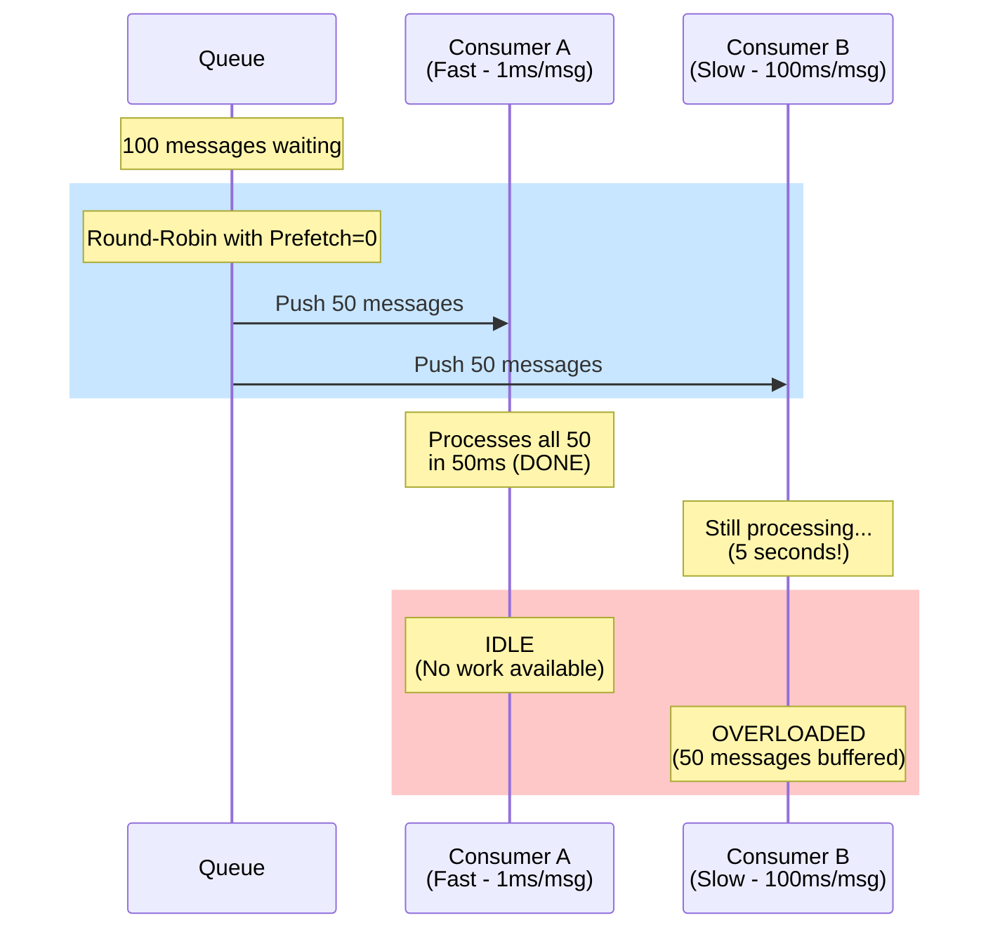

# 02. RabbitMQ: The Smart Broker Architecture

## 1. Introduction
RabbitMQ is a mature, general-purpose message broker that implements the **AMQP 0-9-1** protocol. Unlike streaming platforms (Kafka) that prioritize raw throughput, RabbitMQ prioritizes **complex routing**, **flexible delivery guarantees**, and **fine-grained reliability**.

It acts as a "Smart Broker" because it maintains the delivery state of every individual message, allowing for features like delayed retries, dead-letter routing, and priority queues.

**Origins**: Built on **Erlang/OTP**, a language designed for telecom systems requiring 99.999% uptime.

---

## 2. Core Architecture

The RabbitMQ model separates the "Message Publisher" from the "Storage Queue" via **Exchanges**.



### Key Components
1.  **Producer**: The application that sends the message. It *never* writes directly to a queue.
2.  **Exchange**: The entry point. It takes a message and uses **Binding Rules** to decide which queue(s) receive it.
3.  **Queue**: A sequential buffer (Erlang process) that holds messages until a consumer is ready.
4.  **Binding**: The logic linking an Exchange to a Queue (e.g., "If routing_key='error', go to Queue A").
5.  **Consumer**: The application that processes messages (push model).

---

## 3. How It Works: Exchange Types

RabbitMQ's power comes from its **Exchange Types**.

### A. Direct Exchange
*   **Rule**: Exact routing key match.
*   **Example**: Publish with key `error` → Routes to queue bound with key `error`.
*   **Use Case**: Log severity routing (`info`, `warn`, `error`).

### B. Topic Exchange
*   **Rule**: Pattern matching with wildcards (`*`, `#`).
*   **Example**: Publish `user.created.eu` → Matches binding `user.*.eu`.
*   **Use Case**: Multi-dimensional routing (region + event type).

### C. Fanout Exchange
*   **Rule**: Broadcast to all bound queues (ignores routing key).
*   **Use Case**: Cache invalidation to all instances.

### D. Headers Exchange
*   **Rule**: Match on message headers (not routing key).
*   **Use Case**: Complex routing logic beyond simple strings.

---

## 4. Deep Dive: Internal Implementation

### A. Message Delivery Mechanics

#### 1. Round-Robin Dispatching
By default, if multiple consumers are connected to a single queue, RabbitMQ distributes messages in strict **Round-Robin** fashion, regardless of how busy consumers are.

*   **Scenario**: Queue has messages `[1, 2, 3, 4]`. Consumers `A` and `B` connect.
*   **Result**: Consumer A gets `1, 3`, Consumer B gets `2, 4`.

#### 2. The Prefetch Problem (Push Model)
RabbitMQ uses a **Push** model. It forces messages down the TCP connection to the consumer.
*   **Problem**: If Consumer A is processing a heavy task (1 minute), and Consumer B is idle, Round-Robin still sends 50% of work to Consumer A. Consumer A's buffer fills up.
*   **Solution**: `Basic.Qos(prefetch=1)` tells RabbitMQ: *"Do not push a new message until I've ACKed the previous one."*
*   **Result**: Fair dispatch where busy consumers get fewer messages.

### B. Acknowledgment Lifecycle



### C. Flow Control (Backpressure)

RabbitMQ protects itself from memory exhaustion through multiple mechanisms:

#### 1. Per-Connection Blocking
If a specific queue cannot write to disk fast enough, RabbitMQ blocks the publisher's TCP socket for *that* queue only.

#### 2. Memory Watermark (Global)
If the Broker's RAM usage exceeds 40% (configurable `vm_memory_high_watermark`), it blocks **all** publishers globally.

**This is a "Stop the World" protection mechanism.**

### D. Quorum Queues (Raft Consensus)

For high availability, use **Quorum Queues**, which implement the **Raft Algorithm**.



**Structure**: 1 Leader + N Followers (typically 3 or 5 nodes).
**Write Path**: Message confirmed only when a **Majority** (e.g., 2/3) have written to disk.
**Benefits**: Partition tolerance, faster recovery than classic mirrored queues.

---

## 5. End-to-End Walkthrough: Life of a Message

Let's trace an order processing message.

### Step 1: Publishing
*   **Producer**: Publishes `{"order_id": 123}` to Exchange `orders` with routing key `orders.created`.
*   **Exchange**: Uses binding rules. Finds queue `order-processing` bound to `orders.*`.
*   **Queue**: Appends message to Erlang process queue.

### Step 2: Dispatching
*   **RabbitMQ**: Checks prefetch count of connected consumers.
*   **Consumer A**: Has prefetch=1, currently processing. Skip.
*   **Consumer B**: Has prefetch=1, idle. Push message.

### Step 3: Processing
*   **Consumer B**: Receives message, processes order, writes to DB.
*   **Action**: Sends `Basic.Ack`.
*   **Queue**: Marks message as deleted (removes from Erlang process memory).

### Step 4: Failure Recovery
If Consumer B crashes after receiving but before ACKing:
1.  **RabbitMQ**: Detects TCP connection drop.
2.  **Action**: Requeues the message.
3.  **Consumer C**: Receives the same message (duplicate processing possible).

---

## 6. Failure Scenarios (The Senior View)

### Scenario A: The Memory Alarm (Global Backpressure)

**Symptom**: All publishers are blocked. Clients see `socket_closed_unexpectedly` or `PreconditionFailed: node_memory_alarm`.
**Cause**: Broker RAM usage exceeded `vm_memory_high_watermark` (default 40%).

#### The Memory Watermark Mechanism

RabbitMQ monitors its own memory usage and triggers a global alarm when it exceeds the configured threshold.

**Key Configuration** (in `rabbitmq.conf`):
```
vm_memory_high_watermark.relative = 0.4  # 40% of total RAM
```

**Example**: If the broker has 10GB RAM, alarm triggers at 4GB.

#### The Failure Cascade



#### Root Causes

1.  **Queue Depth Growing**: Consumers too slow, messages accumulating in RAM.
2.  **Large Messages**: Publishing 10MB messages fills memory quickly.
3.  **Prefetch Too High**: Consumers with `prefetch=1000` buffer messages in client memory, but also consume broker memory for tracking.

#### The Fix

**Immediate**:
1.  Check queue depths:
   ```bash
   rabbitmqctl list_queues name messages
   ```
2.  If specific queue is large, purge or add consumers.

**Long-term**:
1.  **Enable Lazy Queues** to page messages to disk:
   ```java
   Map<String, Object> args = new HashMap<>();
   args.put("x-queue-mode", "lazy");
   channel.queueDeclare("my-queue", true, false, false, args);
   ```
2.  **Increase RAM** on the broker.
3.  **Set Max Queue Length**:
   ```java
   args.put("x-max-length", 100000);  // Drop oldest after 100k msgs
   ```

---

### Scenario B: The Poison Message Loop

**Symptom**: Consumer repeatedly crashes on the same message. Queue depth stays at 1.
**Cause**: Malformed message (e.g., `{ "price": "NaN" }`) causes unhandled exception.

#### The Requeue Trap



#### The Mechanism (Step-by-Step)

1.  **Delivery**: Queue sends `Message X` to Consumer A.
2.  **Processing**: Consumer A tries to parse `{ "price": "NaN" }`.
3.  **Exception**: `NumberFormatException` thrown (unhandled).
4.  **Crash**: Consumer process exits.
5.  **TCP Disconnect**: RabbitMQ detects connection drop.
6.  **Automatic Requeue**: Since no ACK was received, RabbitMQ puts `Message X` back in the queue.
7.  **Restart**: Consumer A restarts (via systemd/supervisor).
8.  **Repeat**: Consumer A receives `Message X` again → Crashes again.

#### The Fix

**Option 1: Explicit Reject with Requeue=False**

```java
try {
    processMessage(message);
    channel.basicAck(deliveryTag, false);
} catch (Exception e) {
    logger.error("Poison message: " + message, e);
    // Reject WITHOUT requeue → Sends to DLQ
    channel.basicReject(deliveryTag, false);
}
```

**Option 2: Configure Dead Letter Queue (DLQ)**

```java
Map<String, Object> args = new HashMap<>();
args.put("x-dead-letter-exchange", "dlq-exchange");
args.put("x-max-length", 100000);
channel.queueDeclare("main-queue", true, false, false, args);
```

**Result**: After `basicReject(requeue=false)`, the message is routed to `dlq-exchange` instead of being deleted.

**Option 3: Use `x-message-ttl` to Expire Old Messages**

```java
args.put("x-message-ttl", 86400000);  // 24 hours in ms
```

---

### Scenario C: The Unfair Distribution (Prefetch Problem)

**Symptom**: One consumer is overloaded while another is idle.
**Cause**: Using default `prefetch=0` (unlimited) with Round-Robin.

#### The Problem: Push Model + No Backpressure



**The Mechanism**:
1.  Queue has 100 messages.
2.  Consumer A and Consumer B connect.
3.  RabbitMQ uses **Round-Robin**: Sends 50 to A, 50 to B.
4.  Consumer A is fast (processes 50 in 50ms).
5.  Consumer B is slow (processes 50 in 5 seconds).
6.  **Result**: Consumer A sits idle while Consumer B is swamped.

#### The Fix: Set `prefetch=1`

```java
channel.basicQos(1);  // Prefetch count = 1
// Now: Don't send next message until I ACK the current one
```

**New Behavior**:
1.  Queue sends 1 message to Consumer A.
2.  Queue sends 1 message to Consumer B.
3.  Consumer A finishes quickly → **ACKs** → Gets another message.
4.  Consumer B is slow → Queue waits for ACK before sending more.
5.  **Result**: Consumer A gets ~90 messages, Consumer B gets ~10 (fair distribution).

---

### Scenario D: The Split-Brain (Classic Mirrored Queues)

**Symptom**: Network partition causes two independent clusters accepting writes.
**Cause**: Using classic mirrored queues (not Quorum Queues).

**Why It's Bad**: Both sides accept writes. Data diverges. Manual reconciliation required.

**The Fix**: Use **Quorum Queues** (Raft-based consensus automatically elects new leader).

```java
Map<String, Object> args = new HashMap<>();
args.put("x-queue-type", "quorum");
channel.queueDeclare("my-queue", true, false, false, args);
```

---

---

## 7. Scaling Strategies

### A. Horizontal Scaling (Sharding)
A single queue is bound to **one Erlang process** (1 CPU core).
*   **Limit**: ~50k msg/s per queue.
*   **Fix**: Use **Consistent Hash Exchange** or **Sharding Plugin**.

**Example**: Hash `order_id` to route across `queue_0`, `queue_1`, ... `queue_9` (10 queues = 10 cores = 500k msg/s).

### B. Vertical Scaling
*   **Increase RAM**: More memory = more messages buffered.
*   **Faster Disks**: SSD speeds up persistence.

### C. Global Replication (Federation/Shovel)
**Challenge**: Cannot cluster across WAN (Erlang distribution assumes low latency).

**Solutions**:
1.  **Federation**: Downstream cluster "pulls" from upstream (async replication).
2.  **Shovel**: Acts as consumer on source, producer on destination.

---

## 8. Constraints & Limitations

| Constraint | Limit | Why? |
| :--- | :--- | :--- |
| **Throughput** | ~50k msgs/s per queue | Single queue = single Erlang process = 1 CPU core. |
| **Queue Depth** | Keep it empty! | Designed for RAM. Millions of messages page to disk, destroying performance. |
| **Message Size** | < 128MB | Large payloads block the single thread. Use S3 for big data. |
| **Global Scale** | Difficult | Clustering is complex. Not designed for multi-region WAN. |

---

## 9. When to Use RabbitMQ?

| Use Case | Verdict | Why? |
| :--- | :--- | :--- |
| **Complex Routing** | **YES** | Exchange types make multi-destination routing trivial. |
| **Job Queues (Task Workers)** | **YES** | Per-message ACKs ensure reliable task processing. |
| **Delayed Messaging** | **YES** | Delayed exchange plugin supports "retry in 15 minutes". |
| **Request-Reply (RPC)** | **YES** | Built-in correlation ID and reply-to queue support. |
| **Big Data Streaming** | **NO** | Use Kafka. RabbitMQ lacks replay, retention, and massive parallelism. |
| **Event Sourcing** | **NO** | Use Kafka or Redis Streams. RabbitMQ deletes acknowledged messages. |

---

## 10. Production Checklist

1.  [ ] **Use Quorum Queues** for all critical data (not classic mirrored queues).
2.  [ ] **Set Prefetch=1** (or small number) for fair load distribution.
3.  [ ] **Enable Manual Acks** to prevent data loss on consumer crash.
4.  [ ] **Monitor Queue Depth**: If growing, add consumers or increase processing speed.
5.  [ ] **Reuse Connections**: One TCP connection per app, multiple logical channels for threads.
6.  [ ] **Configure DLQ**: Set `x-dead-letter-exchange` to catch poison messages.
7.  [ ] **Set TTL**: Use `x-message-ttl` to prevent infinite message accumulation.
