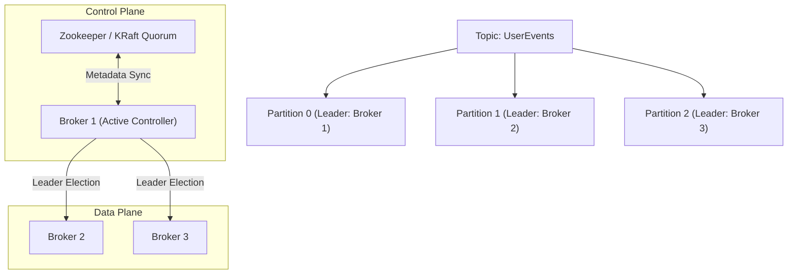
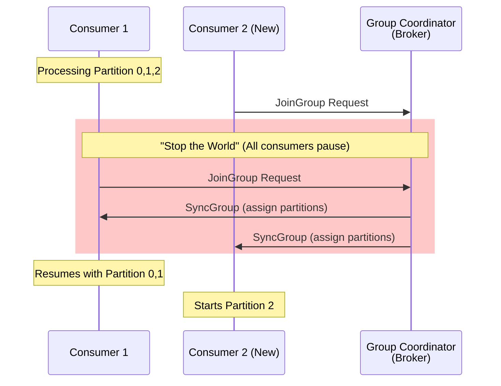
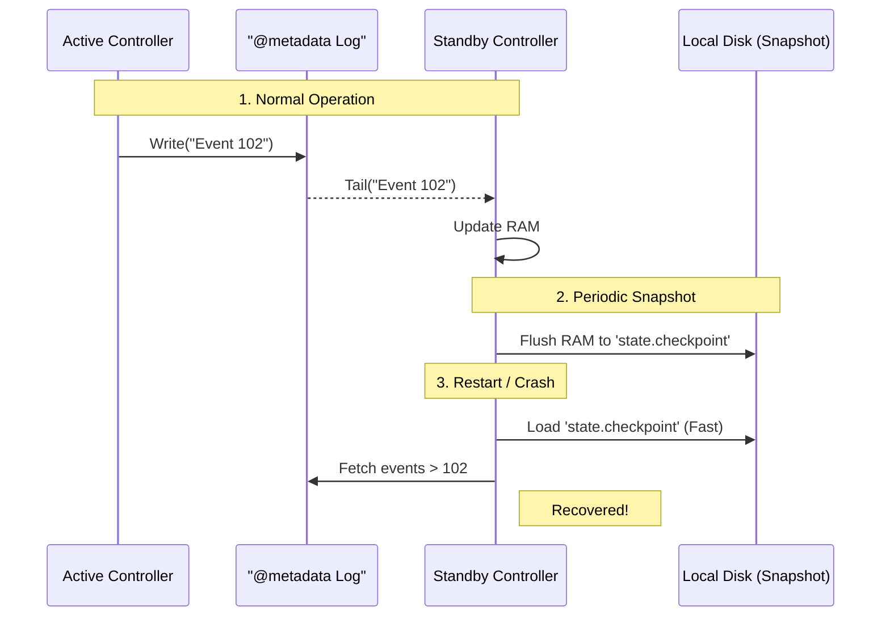
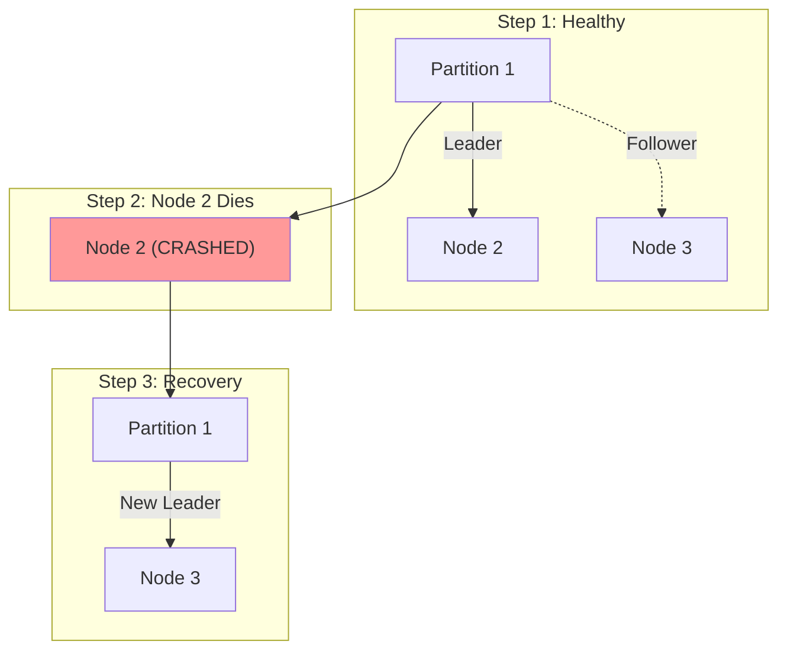
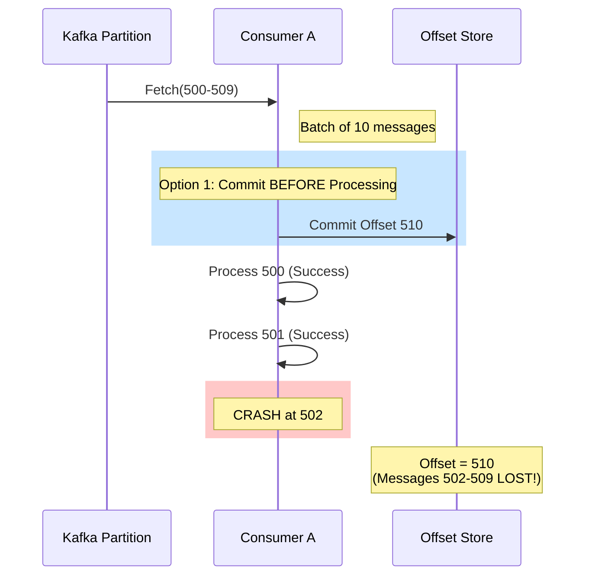
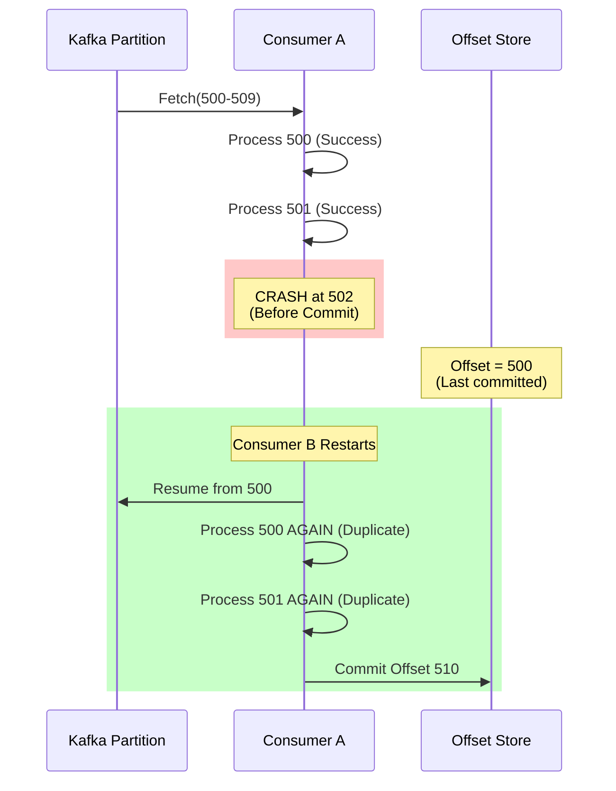
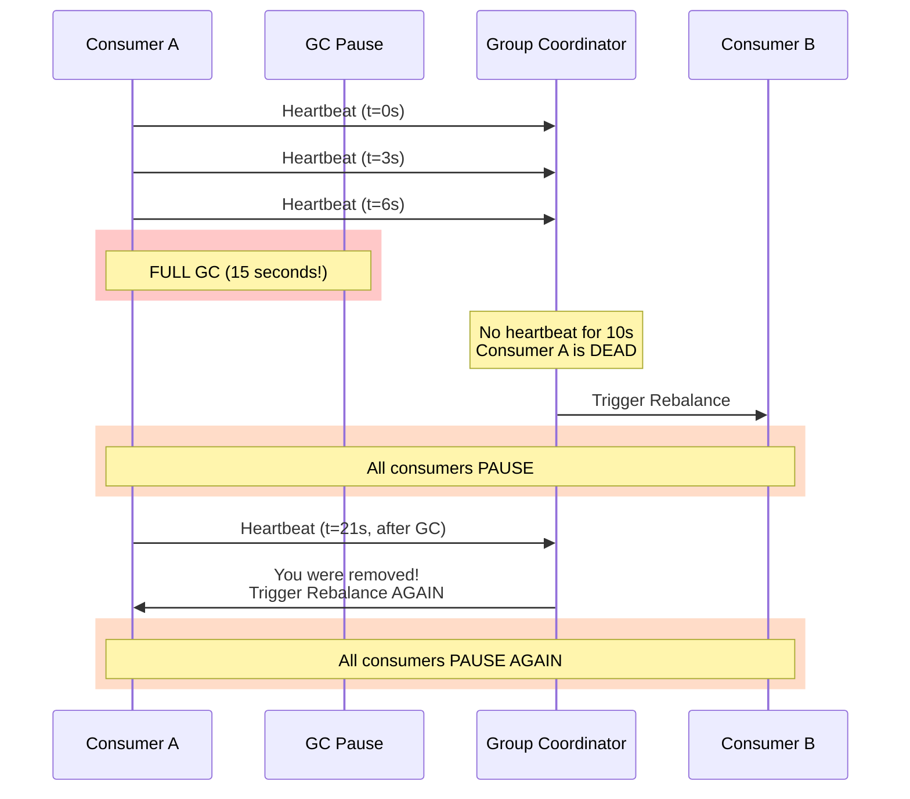
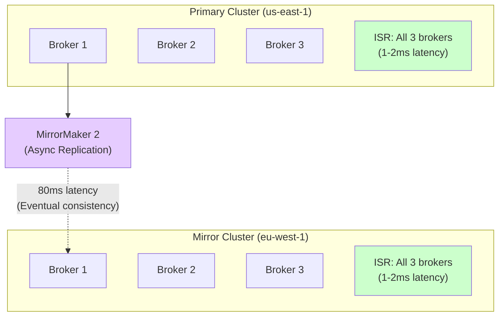

# 03. Apache Kafka: The Distributed Commit Log

## 1. Introduction
Apache Kafka is a distributed event streaming platform designed for **High Throughput**, **Fault Tolerance**, and **Replayability**. Unlike traditional message brokers, it functions as a **Distributed Commit Log**: an append-only, immutable sequence of records.

It is the industry standard for building real-time data pipelines, stream processing applications, and event-driven architectures.

**Key Differentiator**: Messages are **not deleted** after consumption. They persist for a configured retention period, enabling replay and multiple independent consumers.

---

## 2. Core Architecture

Kafka's scalability comes from its partitioning model.



### Key Components
1.  **Topic**: A logical category of messages (e.g., `user-events`, `transactions`).
2.  **Partition**: The unit of parallelism. A topic is split into $N$ partitions.
3.  **Offset**: A unique integer ID identifying a message's position in the partition (starts at 0, increments sequentially).
4.  **Consumer Group**: A set of consumers working together. Kafka assigns each partition to exactly one consumer in the group.
5.  **Controller**: One broker acts as the "brain", managing leader election and metadata propagation.

---

## 3. How It Works: The Partition Model

### A. Producers Choose Partitions
When publishing, producers use a **partitioning strategy**:
*   **Key-based**: `hash(key) % num_partitions` (guarantees same key goes to same partition → ordering).
*   **Round-robin**: If no key, distribute evenly.

### B. Consumer Groups & Partition Assignment
*   **Rule**: Each partition is assigned to **exactly one** consumer in a group.
*   **Parallelism**: If you have 10 partitions and 10 consumers in a group, each consumer gets 1 partition.
*   **Under-subscribed**: 10 partitions, 3 consumers → Some consumers get multiple partitions.
*   **Over-subscribed**: 10 partitions, 20 consumers → 10 consumers sit idle.

---

## 4. Deep Dive: Internal Implementation

### A. Sequential I/O & Page Cache

Kafka relies on the physics of disk drives.
*   **Design**: It **appends** to log files (no random writes).
*   **Benefit**: Sequential Write/Read on HDD/SSD is fast (100MB/s+). Random access is slow (1MB/s).
*   **Caching**: Kafka does not cache data in JVM heap. It relies on the **OS Page Cache**. Free RAM automatically caches recent messages.

**Why This Matters**: You can achieve 1M+ messages/second on commodity hardware.

### B. Zero-Copy Optimization

Kafka minimizes CPU cycles during network transfer using `sendfile()` syscall.

**Traditional Path** (4 copies):
```
Disk → Kernel Buffer → User Space (JVM) → Kernel Socket Buffer → NIC
```

**Kafka Path** (2 copies):
```
Disk → Kernel Page Cache → NIC
```

**Result**: Saturate 10Gbps+ links with low CPU usage.

### C. The Consumer Rebalancing Protocol

When a consumer joins or leaves a group, the cluster triggers a **Rebalance**.



**Steps**:
1.  **Stop the World**: All consumers in the group stop reading.
2.  **JoinGroup**: All send a request to the Group Coordinator (a Broker).
3.  **SyncGroup**: One consumer (leader) assigns partitions to members.
4.  **Resume**: Consumers start reading from the last committed offset.

**Performance Note**: Frequent rebalancing (due to unstable networks or long GC pauses) kills throughput.

### D. The Controller: Cluster Brain

In Kafka, exactly one Broker is elected as the **Controller**. Its job:
1.  **Monitor Liveness**: Watch for broker failures.
2.  **Elect Leaders**: When a broker dies, decide which replica becomes the new Leader for affected partitions.
3.  **Propagate Metadata**: Push the new "State of the World" to all brokers.

#### The Zookeeper Problem (Pre-KRaft)
When a Controller fails, the *new* Controller must:
1.  Read metadata for **ALL** partitions from Zookeeper (O(partitions)).
2.  Compute new state.
3.  Send requests to every broker.

**Bottleneck**: With 500k partitions, this "Stop-the-World" loading takes minutes.

#### The KRaft Solution (Kafka 2.8+)
Modern Kafka removes Zookeeper entirely. The Controller is a **Stateful Raft Member**.

**How It Works**:
1.  **`@metadata` Topic**: A single-partition internal log storing all cluster events (`CreateTopic`, `RegisterBroker`, `IsrChange`).
2.  **State Machine**: Controllers replay this log to build cluster state in RAM.
3.  **Snapshots**: Periodic dumps (`state.checkpoint`) enable fast recovery (load snapshot + replay recent log).



**Result**: KRaft clusters can support **1 Million+ Partitions** stably (vs 200k with Zookeeper).

---

## 5. End-to-End Walkthrough: Life and Death in a Cluster

Let's trace a 3-node cluster through normal operation and failures.

### Setup
*   **Cluster**: 3 Brokers (Node 1, Node 2, Node 3).
*   **Topic**: `UserEvents` (3 Partitions, Replication Factor 3).
*   **Controller**: Node 1.

| Partition | Leader | Follower A | Follower B |
| :--- | :--- | :--- | :--- |
| **P0** | **Node 1** | Node 2 | Node 3 |
| **P1** | **Node 2** | Node 3 | Node 1 |
| **P2** | **Node 3** | Node 1 | Node 2 |

### Scenario A: The Worker Dies (Node 2 Crashes)

**Event**: Node 2 loses power.

1.  **Detection**: Node 1 (Controller) notices Node 2 missed heartbeat.
2.  **Impact**:
    *   **P1** lost its Leader.
    *   **P0 & P2** lost a Follower.
3.  **Action (Controller)**:
    *   Elects **Node 3** as new Leader for **P1** (it's in ISR).
    *   Shrinks ISR for P0 & P2 to `{1, 3}`.
4.  **Result**:
    *   Producers writing to P1 now send to Node 3.
    *   Cluster is "Under Replicated" but **100% Available**.



### Scenario B: The Controller Dies (Node 1 Crashes)

**Event**: Node 1 (The Controller) crashes.

1.  **Detection**: ZK/KRaft Quorum detects Node 1 is gone.
2.  **Action (Control Plane)**:
    *   **Election**: Node 3 wins controller election.
    *   **State Recovery**: Node 3 reads `@metadata` (instant in KRaft).
3.  **Action (Data Plane)**:
    *   Node 3 sees P0 lost its leader (Node 1).
    *   Elects **Node 2** as new Leader for P0.
4.  **Result**: Cluster resumes normal operation with Node 3 as the brain.

---

## 6. Failure Scenarios (The Senior View)

### Scenario A: The Consumer Crash (Offset Management)

**Symptom**: Messages are either duplicated or lost after a consumer crashes.
**Cause**: The offset commit happened at the wrong time relative to processing.

#### The Mechanics of Offset Commits

Kafka consumers must **commit offsets** to tell the broker "I've successfully processed up to here."

**The Critical Question**: When do you commit?



#### Scenario A1: Commit-Then-Process (Data Loss)

**Steps**:
1.  Consumer fetches messages 500-509.
2.  Consumer **commits offset 510** (marking all as processed).
3.  Consumer processes 500, 501 successfully.
4.  Consumer **crashes** at 502.

**Result**:
*   **Committed offset**: 510 (already saved).
*   **Actual progress**: Only 500-501 processed.
*   **Messages 502-509**: **LOST** (never processed, but marked as done).

**When This Happens**: Using `enable.auto.commit=true` with default `auto.commit.interval.ms=5000` (auto-commits every 5 seconds, regardless of processing state).

#### Scenario A2: Process-Then-Commit (Duplicates)



**Steps**:
1.  Consumer fetches messages 500-509.
2.  Consumer processes 500, 501 successfully.
3.  Consumer **crashes** before committing offset.
4.  New consumer (or restarted A) reads from **last committed offset (500)**.

**Result**:
*   **Messages 500-501**: **Duplicated** (processed twice).
*   **Messages 502-509**: Processed correctly.

**When This Happens**: Using `enable.auto.commit=false` with manual commit **after** a batch.

**The Fix**: Implement **idempotent processing** (process the same message multiple times with the same effect).

**Option 1: Transaction ID (Deduplication)**
```java
public void processPayment(PaymentEvent event) {
    String txnId = event.transactionId; // Unique ID from producer
    
    try {
        // Try to insert (prevents duplicates via primary key)
        db.execute(
            "INSERT INTO transactions (id, amount, user_id) VALUES (?, ?, ?)",
            txnId, event.amount, event.userId
        );
        
        // Deduct balance only if insert succeeded
        db.execute("UPDATE accounts SET balance = balance - ? WHERE user_id = ?",
                   event.amount, event.userId);
                   
    } catch (DuplicateKeyException e) {
        // Duplicate message -> Already processed -> Skip
        logger.info("Duplicate transaction: " + txnId);
    }
}
```

**Option 2: UPSERT (Insert or Update)**
```java
// Idempotent: Running twice has same effect as running once
db.execute(
    "INSERT INTO user_profiles (user_id, email, updated_at) " +
    "VALUES (?, ?, NOW()) " +
    "ON CONFLICT (user_id) DO UPDATE SET email = EXCLUDED.email",
    event.userId, event.email
);
```

**Option 3: Check-Then-Act**
```java
// Check if already processed
if (orderRepo.existsById(event.orderId)) {
    logger.info("Order already processed");
    return; // Idempotent
}

// Process only if not exists
Order order = new Order(event.orderId, event.items);
orderRepo.save(order);
```

---

### Scenario B: The Rebalance Storm

**Symptom**: Consumers frequently disconnect/reconnect, processing stops periodically.
**Cause**: Long GC pauses or network instability causing heartbeat timeouts.

#### The Heartbeat Mechanism

Consumers send heartbeats to the **Group Coordinator** (a Broker) to prove they're alive.

**Key Configurations**:
*   `session.timeout.ms` (default 10s): If no heartbeat for 10s, consumer is considered dead.
*   `heartbeat.interval.ms` (default 3s): How often to send heartbeats.
*   `max.poll.interval.ms` (default 5 minutes): Max time between `poll()` calls.

**The Failure Cascade**:



**Result**: 
*   Every GC pause > 10s triggers a rebalance.
*   Rebalance = All consumers stop processing.
*   If GC happens frequently → Throughput drops to near zero.

**The Fix**:
1.  **Increase `session.timeout.ms`** to 30s (allows for longer GC pauses).
2.  **Tune JVM GC**: Use G1GC, increase heap size.
3.  **Ensure stable network** (no packet loss).
4.  **Monitor `max.poll.interval.ms`**: If processing takes > 5 minutes, increase this.

---

### Scenario C: The Poison Message

**Symptom**: Consumer crashes repeatedly on the same message.
**Cause**: Malformed JSON or logic bug causes unhandled exception.

**Mechanism**:
1.  Consumer reads offset 100 → Crashes (e.g., `JSONParseException`).
2.  Restarts → Reads offset 100 again → Crashes.
3.  Infinite loop.

**The Fix**:

**Option 1: Skip Bad Message**
```java
try {
    processMessage(record);
    consumer.commitSync();
} catch (Exception e) {
    logger.error("Poison message at offset " + record.offset(), e);
    // Skip to next message
    consumer.commitSync();
}
```

**Option 2: Dead Letter Topic (Recommended)**
```java
KafkaProducer<String, String> dlqProducer = new KafkaProducer<>(dlqProps);

try {
    processMessage(record);
    consumer.commitSync();
} catch (Exception e) {
    logger.error("Poison message at offset " + record.offset(), e);
    
    // Send to DLQ
    ProducerRecord<String, String> dlqRecord = new ProducerRecord<>(
        "dead-letter-queue",
        record.key(),
        record.value()
    );
    dlqRecord.headers().add("error", e.getMessage().getBytes());
    dlqRecord.headers().add("original_topic", record.topic().getBytes());
    dlqRecord.headers().add("original_offset", String.valueOf(record.offset()).getBytes());
    
    dlqProducer.send(dlqRecord);
    
    // Commit to skip
    consumer.commitSync();
}
```

---

## 7. Scaling Strategies

### A. Horizontal Scaling
*   **Add Brokers**: New nodes join the cluster.
*   **Reassign Partitions**: Use `kafka-reassign-partitions.sh` to move partitions to new brokers (network intensive).

### B. Vertical Scaling
*   **More Disk**: Increase retention capacity.
*   **Faster Disks**: SSDs improve throughput.
*   **More RAM**: OS Page Cache caches more messages.

### C. Global Geo-Replication (MirrorMaker 2)
Kafka clusters are regional due to ISR latency requirements.

**What is ISR (In-Sync Replicas)?**

ISR is the set of replica brokers that are **fully caught up** with the partition leader. Kafka only acknowledges writes when all ISR replicas have written the message (when `acks=all`).

**Why Regional?**
```
Single Region (us-east-1):
- Leader in AZ-1a, Follower in AZ-1b
- Network latency: 1-2ms
- ISR stable: ✅ Replicas stay in-sync

Multi-Region (us-east-1 to eu-west-1):
- Leader in US, Follower in Europe
- Network latency: 80-100ms
- ISR timeout: replica.lag.time.max.ms = 10s
- Result: ❌ Replicas frequently drop from ISR (unstable)
```

**The Problem**: Cross-region latency (80ms+) causes followers to lag and drop from ISR, leading to write failures.

**Cross-Region Strategy**: Use separate regional clusters with **MirrorMaker 2** for async replication.

#### Architecture



**How It Works**:
1.  **US Cluster**: Serves US traffic with local ISR (3 replicas, 1-2ms).
2.  **MirrorMaker 2**: Kafka Connect-based consumer/producer.
   - Consumes from US cluster
   - Produces to EU cluster (async, no ISR dependency)
3.  **EU Cluster**: Serves EU traffic with local ISR (3 replicas).

**Key Benefits**:
*   Each region has its own stable ISR
*   Cross-region replication is **async** (doesn't block writes)
*   EU cluster can serve local reads with low latency

#### Configuration Example

**MirrorMaker 2 Config**:
```properties
# Source cluster (US)
clusters = us, eu
us.bootstrap.servers = us-kafka-1:9092,us-kafka-2:9092
eu.bootstrap.servers = eu-kafka-1:9092,eu-kafka-2:9092

# Replication flow: US -> EU
us->eu.enabled = true
us->eu.topics = orders.*, payments.*  # Replicate these topics

# Consumer config (read from US)
us->eu.consumer.group.id = mm2-us-to-eu

# Producer config (write to EU)
us->eu.producer.acks = all
us->eu.producer.compression.type = lz4

# Sync settings
sync.topic.configs.enabled = true
sync.topic.acls.enabled = true
```

#### Topic Naming

MirrorMaker 2 prefixes topics with the source cluster name:
```
US Cluster:
- orders
- payments

EU Cluster (after replication):
- us.orders       <- Replicated from US
- us.payments     <- Replicated from US
- local-eu-orders <- Local EU topic (not replicated)
```

#### Failover Strategy

**Active-Passive** (Most Common):
```
Normal: US cluster (active), EU cluster (passive backup)
Disaster: Switch DNS to EU cluster, EU becomes active
```

**Active-Active** (Complex):
```
US users -> US cluster (writes local topics)
EU users -> EU cluster (writes local topics)
MirrorMaker: Bidirectional replication (conflict resolution needed)
```

**Replication Lag**: Typically 100ms-1s (acceptable for DR scenarios, not for real-time sync).

---

## 8. Constraints & Limitations

| Constraint | Limit | Why? |
| :--- | :--- | :--- |
| **Total Partitions** | ~200k (ZK) / 1M (KRaft) | Metadata overhead on Controller. |
| **Message Size** | < 1MB (Recommended) | Huge blobs block network threads. |
| **Retention** | Disk Bound | Can only store what fits on disk (Tiered Storage to S3 solving this). |
| **Ordering** | Partition Scope Only | Global ordering impossible without sacrificing parallelism. |

---

## 9. When to Use Kafka?

| Use Case | Verdict | Why? |
| :--- | :--- | :--- |
| **Event Sourcing** | **YES** | Immutable log is perfect for audit trails and replay. |
| **Stream Processing** | **YES** | Kafka Streams / Flink integrate natively. |
| **Real-time Analytics** | **YES** | High throughput, low latency. |
| **Job Queues (Task Workers)** | **MAYBE** | Works, but RabbitMQ is better (per-message ACKs, complex routing). |
| **Request-Reply (RPC)** | **NO** | Use gRPC or RabbitMQ. Kafka is for async workflows. |

---

## 10. Production Checklist

1.  [ ] **Use Semantic Partition Keys**: Hash `user_id` (not random) to ensure ordering per entity.
2.  [ ] **Set `min.insync.replicas=2`**: With `acks=all`, guarantees no data loss if one node dies.
3.  [ ] **Disable `unclean.leader.election`**: Better to go down than serve corrupt/old data.
4.  [ ] **Monitor Consumer Lag**: The most critical metric. If lag grows, you're falling behind.
5.  [ ] **Use KRaft Mode**: Avoid Zookeeper complexity (Kafka 3.0+).
6.  [ ] **Set Retention Based on Disk**: Calculate `retention.ms` based on throughput and disk size.
