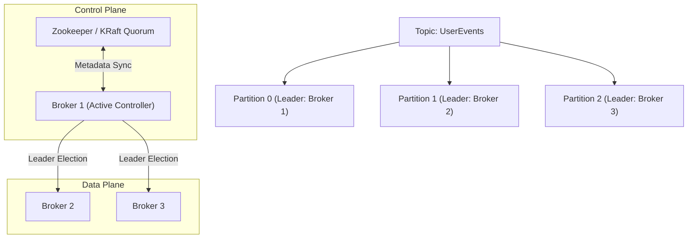
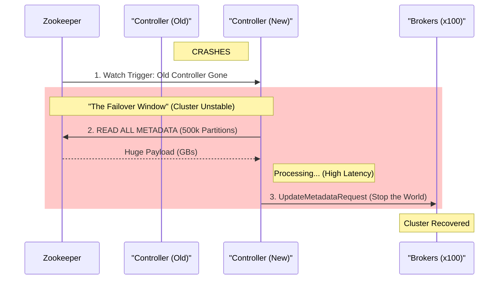
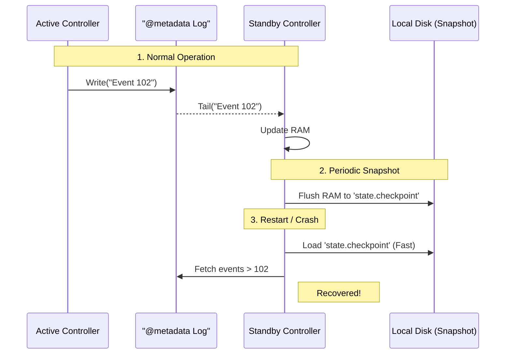
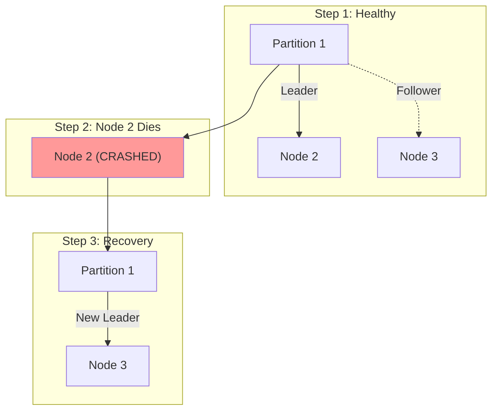

# 03. Apache Kafka: The Distributed Commit Log

## 1. Introduction
Apache Kafka is a distributed event streaming platform designed for **High Throughput**, **Fault Tolerance**, and **Replayability**. Unlike traditional queues, it functions as a **Distributed Commit Log**: an append-only, immutable sequence of records.

It is the industry standard for building real-time data pipelines and streaming applications.

---

## 2. Core Architecture

Kafka's scalability comes from its partitioning model.

### Key Components
1.  **Topic**: A logical category of messages (e.g., `logs`, `transactions`).
2.  **Partition**: The unit of parallelism. A topic is split into $N$ partitions.
3.  **Offset**: A unique integer ID identifying a message's position in the partition.
4.  **Consumer Group**: A set of consumers working together. Kafka assigns each partition to exactly one consumer in the group.

---

## 3. Internal Mechanics

### A. Sequential I/O & Page Cache
Kafka relies on the physics of disk drives.
*   **Design**: It purely **appends** to files.
*   **Benefit**: Sequential Write/Read on HDD/SSD is fast. Random Access is slow.
*   **Caching**: Kafka does not cache data in JVM heap. It relies on the **OS Page Cache**. This means free RAM on the Linux server is automatically used to cache the latest messages.

### B. Zero-Copy Optimization
Kafka minimizes CPU cycles during network transfer.
*   **Traditional**: Disk -> Kernel -> User Space -> Kernel -> Socket.
*   **Kafka**: Application calls `sendfile()`. Disk -> Kernel Page Cache -> NIC.
*   **Result**: Extremely high throughput (saturating 10Gbps+ links) with low CPU usage.

### C. The Consumer Rebalancing Protocol
When a consumer joins or leaves a group, the cluster triggers a **Rebalance**.
1.  **Stop the World**: All consumers in the group stop reading.
2.  **JoinGroup**: All send a request to the Group Coordinator (Broker).
3.  **SyncGroup**: Leader assigns partitions to members.
4.  **Resume**: Consumers start reading from the last committed offset.
*   *Note*: Frequent rebalancing (due to unstable networks) is a common performance killer.

---

---

## 4. The Cluster Controller & Metadata Overhead
Why can't you just have 1 million partitions in a Kafka cluster? The answer usually lies in the **Controller Bottleneck**.

### The Role of the Controller
In a standard Kafka cluster (Pre-KRaft), exactly one Broker is elected as the **Controller**. Its job is to:
1.  **Monitor Liveness**: Watch Zookeeper for broker failures.
2.  **Elect Leaders**: When a broker dies, the Controller decides which replica becomes the new Leader for every affected partition.
3.  **Propagate Metadata**: Push the new "State of the World" to all other brokers.

### The Bottleneck: "Stop-the-World" Loading
When a Controller fails, the *new* Controller must:
1.  Read the metadata for **ALL** partitions from Zookeeper.
2.  Compute the new state.
3.  Send requests to every broker.

If you have 500,000 partitions, loading this metadata from Zookeeper is linear and slow.
*   **The Impact**: During this failover (which can take minutes), the cluster cannot handle administrative changes, and "unclean" shutdowns can trigger massive rebuild storrms.

### The Solution: KRaft (Roaring new Architecture)
Modern Kafka (2.8+) removes Zookeeper entirely. The Controller is no longer a "State-Less Processor that needs to load state"; it is a **State-Full Raft Member**.

#### Under the Hood: The Mechanics of KRaft
You asked: *"Does it have a local DB?"* and *"How does it finalize everything?"* Here is the detailed answer.

1.  **The Metadata Topic (`@metadata`)**:
    *   Yes, this is an internal Kafka topic.
    *   **Single Partition**: It typically has only **1 Partition**. Why? Because total ordering of cluster events is required. You cannot compromise consistency for parallelism here.
    *   **The Log**: It contains events like `RegisterBroker(ID=1)`, `CreateTopic(Name=UserEvents)`, `IsrChange(Partition=0, NewISR=[1,2])`.

2.  **The State Machine (Log Replay)**:
    *   Every Controller (Active & Standby) treats this log as the "Source of Truth".
    *   They run a **State Machine** in memory. By replaying every message in the log from Offset 0 to Infinity, they build the current state of the cluster in RAM.
    *   *Analogy*: It's like replaying a bank ledger to get the final account balance.

3.  **The "Local DB" (Snapshots)**:
    *   **Problem**: Replaying a log with 100 million events takes too long.
    *   **Solution**: Kafka periodically dumps its in-memory state to a **Snapshot File** (`.checkpoint`).
    *   **Optimization**: When a Controller starts, it loads the latest Snapshot (e.g., state at Offset 10,000) and then only replays the log from Offset 10,001. This Snapshot file *is* effectively the local database.

#### 1 Million Partitions?
**Yes.** Because the failover cost is almost zero (no "Stop-the-World" loading), KRaft clusters can support **1 Million+ Partitions** stable.
*   *Note*: You still need enough RAM on brokers to hold the partition indices, but the administrative bottleneck is gone.

---

## 5. Scaling Kafka: Global & Horizontal

### A. Horizontal Scaling
*   **Broker Expansion**: Add new nodes to the cluster.
*   **Partition Reassignment**: Use the `kafka-reassign-partitions.sh` tool to move existing partitions to the new nodes. (This consumes network bandwidth).

### B. Global Geo-Replication (MirrorMaker 2)
Kafka clusters are effectively local to a region due to latency requirements (ISR - In-Sync Replicas).
*   **Cross-Region Strategy**:
    *   Cluster A (US-East)
    *   Cluster B (EU-West)
*   **MirrorMaker 2 (MM2)**: A specialized Connect cluster that works as a consumer on A and producer on B.
    *   **Active-Passive**: Disaster Recovery.
    *   **Active-Active**: Bi-directional sync (requires handling infinite routing loops).

---

## 6. Constraints & Limitations

| Constraint | Limit | Why? |
| :--- | :--- | :--- |
| **Total Partitions** | ~200k (ZK) / 1M (KRaft) | Metadata overhead on the Controller (See Section 4). |
| **Message Size** | < 1MB (Recommended) | Kafka is throughput-optimized. Huge blobs block the network threads. |
| **Retention** | Disk Bound | You can only store as much as your disk allows. Tiered Storage (S3) is solving this. |
| **Ordering** | Partition Scope Only | Global ordering across a topic is impossible without sacrificing parallelism. |

---

## 7. End-to-End Walkthrough: Life and Death in a Cluster

Let's trace a real-world scenario to cement these concepts.

### 1. The Setup
*   **Cluster**: 3 Brokers (Node 1, Node 2, Node 3).
*   **Topic**: `UserEvents` (3 Partitions, Replication Factor 3).
*   **Controller**: Node 1.

| Partition | Leader | Follower A | Follower B |
| :--- | :--- | :--- | :--- |
| **P0** | **Node 1** | Node 2 | Node 3 |
| **P1** | **Node 2** | Node 3 | Node 1 |
| **P2** | **Node 3** | Node 1 | Node 2 |

---

### 2. Scenario A: The Worker Dies (Node 2 Crashes)
**Event**: Node 2 pulls the power plug.

1.  **Detection**: Node 1 (Controller) notices Node 2 missed its Zookeeper heartbeat / KRaft Pulse.
2.  **Impact Analysis**:
    *   **P1** lost its Leader.
    *   **P0 & P2** lost a Follower.
3.  **Action (Controller)**:
    *   Elects **Node 3** as new Leader for **P1** (because Node 3 is in ISR).
    *   Shrinks ISR for P0 & P2 to `{1, 3}`.
4.  **Result**:
    *   Producers writing to P1 now send data to Node 3.
    *   Cluster is "Under Replicated" but **100% Available**.

---

### 3. Scenario B: The Controller Dies (Node 1 Crashes)
**Event**: Node 1 (The Controller) crashes.

1.  **Detection**: The ZK/KRaft Quorum detects Node 1 is gone.
2.  **Action (Control Plane)**:
    *   **New Controller Election**: Node 3 wins the election.
    *   **State Recovery**: Node 3 reads `@metadata` (Instant in KRaft) to know the partition layout.
3.  **Action (Data Plane)**:
    *   Node 3 sees P0 lost its leader (Node 1).
    *   Node 3 elects **Node 2** (if it recovered) or itself as new Leader for P0.
4.  **Result**: Cluster resumes normal operation with Node 3 as the Brain.

---

## 8. Production Checklist

1.  [ ] **Use Random Partition Keys? No.** Use a semantic key (`UserId`) to ensure ordering for that entity.
2.  [ ] **Tuning `min.insync.replicas`**: Set to `2` (with `acks=all`) to guarantee no data loss if a node dies.
3.  [ ] **Avoid `unclean.leader.election`**: Set to `false`. Better to go down than to serve corrupt/old data.
4.  [ ] **Monitor Consumer Lag**: The most critical metric. If Lag grows, you are falling behind.
