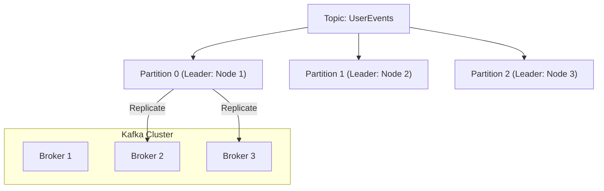

# 03. Apache Kafka: The Distributed Commit Log

## 1. Introduction
Apache Kafka is a distributed event streaming platform designed for **High Throughput**, **Fault Tolerance**, and **Replayability**. Unlike traditional queues, it functions as a **Distributed Commit Log**: an append-only, immutable sequence of records.

It is the industry standard for building real-time data pipelines and streaming applications.

---

## 2. Core Architecture

Kafka's scalability comes from its partitioning model.

### Key Components
1.  **Topic**: A logical category of messages (e.g., `logs`, `transactions`).
2.  **Partition**: The unit of parallelism. A topic is split into $N$ partitions.
3.  **Offset**: A unique integer ID identifying a message's position in the partition.
4.  **Consumer Group**: A set of consumers working together. Kafka assigns each partition to exactly one consumer in the group.

---

## 3. Internal Mechanics

### A. Sequential I/O & Page Cache
Kafka relies on the physics of disk drives.
*   **Design**: It purely **appends** to files.
*   **Benefit**: Sequential Write/Read on HDD/SSD is fast. Random Access is slow.
*   **Caching**: Kafka does not cache data in JVM heap. It relies on the **OS Page Cache**. This means free RAM on the Linux server is automatically used to cache the latest messages.

### B. Zero-Copy Optimization
Kafka minimizes CPU cycles during network transfer.
*   **Traditional**: Disk -> Kernel -> User Space -> Kernel -> Socket.
*   **Kafka**: Application calls `sendfile()`. Disk -> Kernel Page Cache -> NIC.
*   **Result**: Extremely high throughput (saturating 10Gbps+ links) with low CPU usage.

### C. The Consumer Rebalancing Protocol
When a consumer joins or leaves a group, the cluster triggers a **Rebalance**.
1.  **Stop the World**: All consumers in the group stop reading.
2.  **JoinGroup**: All send a request to the Group Coordinator (Broker).
3.  **SyncGroup**: Leader assigns partitions to members.
4.  **Resume**: Consumers start reading from the last committed offset.
*   *Note*: Frequent rebalancing (due to unstable networks) is a common performance killer.

---

## 4. Scaling Kafka: Global & Horizontal

### A. Horizontal Scaling
*   **Broker Expansion**: Add new nodes to the cluster.
*   **Partition Reassignment**: Use the `kafka-reassign-partitions.sh` tool to move existing partitions to the new nodes. (This consumes network bandwidth).

### B. Global Geo-Replication (MirrorMaker 2)
Kafka clusters are effectively local to a region due to latency requirements (ISR - In-Sync Replicas).
*   **Cross-Region Strategy**:
    *   Cluster A (US-East)
    *   Cluster B (EU-West)
*   **MirrorMaker 2 (MM2)**: A specialized Connect cluster that works as a consumer on A and producer on B.
    *   **Active-Passive**: Disaster Recovery.
    *   **Active-Active**: Bi-directional sync (requires handling infinite routing loops).

---

## 5. Constraints & Limitations

| Constraint | Limit | Why? |
| :--- | :--- | :--- |
| **Total Partitions** | ~200k per cluster (Zookeeper Mode) | Metadata overhead on the Controller. KRaft mode improves this significantly (to ~1M). |
| **Message Size** | < 1MB (Recommended) | Kafka is throughput-optimized. Huge blobs block the network threads. |
| **Retention** | Disk Bound | You can only store as much as your disk allows. Tiered Storage (S3) is solving this. |
| **Ordering** | Partition Scope Only | Global ordering across a topic is impossible without sacrificing parallelism (1 partition). |

---

## 6. Production Checklist

1.  [ ] **Use Random Partition Keys? No.** Use a semantic key (`UserId`) to ensure ordering for that entity.
2.  [ ] **Tuning `min.insync.replicas`**: Set to `2` (with `acks=all`) to guarantee no data loss if a node dies.
3.  [ ] **Avoid `unclean.leader.election`**: Set to `false`. Better to go down than to serve corrupt/old data.
4.  [ ] **Monitor Consumer Lag**: The most critical metric. If Lag grows, you are falling behind.
