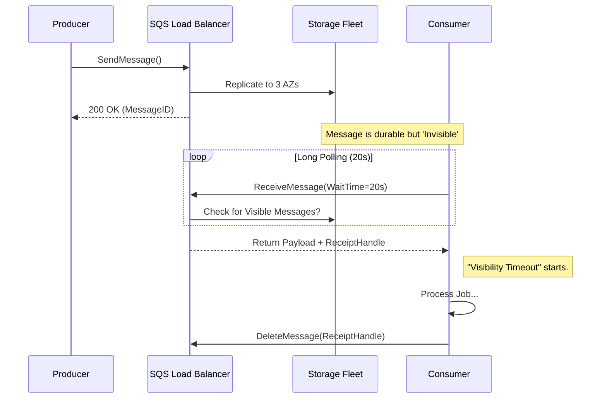

# 04. AWS SQS: Serverless Distributed Queuing

## 1. Introduction
Amazon Simple Queue Service (SQS) is a fully managed message queuing service that enables the decoupling of serverless and microservices applications. Unlike managing a RabbitMQ cluster, SQS abstracts away the underlying infrastructure completely, offering "Infinite" scaling but with higher latency trade-offs.

---

## 2. Core Architecture

SQS operates on a massive fleet of redundant storage nodes.

### Key Components
1.  **Storage Fleet**: AWS stores messages across multiple Availability Zones (AZs) for durability.
2.  **The Polling Model**: SQS does *not* push messages. Consumers must make HTTP requests (`ReceiveMessage`) to pull data.
3.  **Visibility Timeout**: The mechanism that "locks" a message for a consumer.

---

## 3. Internal Mechanics

### A. The "Distributed Visibility" Problem
Since SQS is a distributed fleet, there is no single "Master" node.
*   **Behavior**: When you read a message, SQS does not delete it. It sets a "Visibility Timer" on that specific message ID.
*   **Implication**: If your consumer crashes, the timer expires. The message usually reappears to other consumers.
*   **Edge Case**: "At-Least-Once" delivery means occasionally *two* consumers might get the same message if the distributed lock propagation is slow (rare, but possible).

### B. Long Polling vs Short Polling
*   **Short Polling** (Default): Returns immediately. Problem: If the queue is empty, you waste money and CPU on empty cycles.
*   **Long Polling** (`WaitTimeSeconds=20`): The HTTP connection hangs open for 20s. If a message arrives at $t=5s$, it returns immediately.
    *   **Recommendation**: ALWAYS use Long Polling. It reduces cost by ~99%.

---

## 4. Scaling SQS

### A. Standard Queues (Infinite)
*   **Throughput**: Unlimited. AWS automatically provisions more storage nodes behind the scenes.
*   **Trade-off**: Best-effort ordering. Duplicates are possible.

### B. FIFO Queues (Limited)
*   **Requirement**: Strict Ordering (First-In-First-Out) and Exactly-Once processing.
*   **Scaling Limit**: ~300 transactions/second (TPS) default.
*   **Sharding (The Fix)**:
    *   Use `MessageGroupId`.
    *   Messages with GroupID `A` are ordered strictly. Messages with GroupID `B` are ordered strictly. `A` and `B` process in parallel.
    *   By using high-cardinality Group IDs, you can scale FIFO beyond 300 TPS.

---

## 5. Constraints & Limitations

| Constraint | Limit | Why? |
| :--- | :--- | :--- |
| **Payload Size** | 256 KB | SQS is for signaling, not data transfer. Use S3 for large objects. |
| **Latency** | 10ms - 100ms | HTTP Polling overhead. Not suitable for real-time RPC. |
| **Visibility Timeout** | Max 12 Hours | If a job takes >12 hours, SQS is the wrong tool (Use Step Functions). |
| **Message Retention** | Max 14 Days | SQS is ephemeral storage. |

---

## 6. Production Checklist

1.  [ ] **Enable Long Polling**: Set `ReceiveMessageWaitTimeSeconds` to 20.
2.  [ ] **Configure DLQ**: Attach a Dead Letter Queue with `maxReceiveCount=5`.
3.  [ ] **Batching**: Use `SendMessageBatch` and `DeleteMessageBatch` (10 msgs) to reduce costs by 10x.
4.  [ ] **Lambda Concurrency**: If triggering Lambda, set `ReservedConcurrency` to prevent SQS from launching 10,000 Lambdas and crashing your database.
