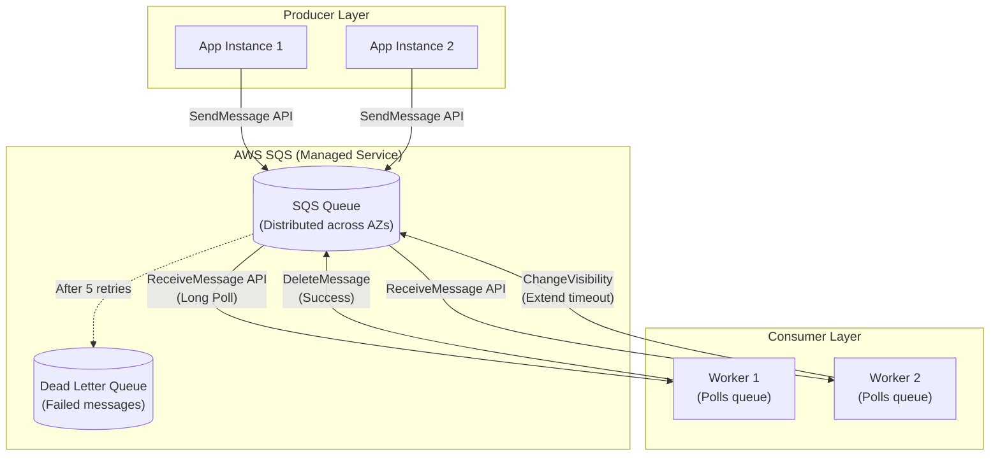
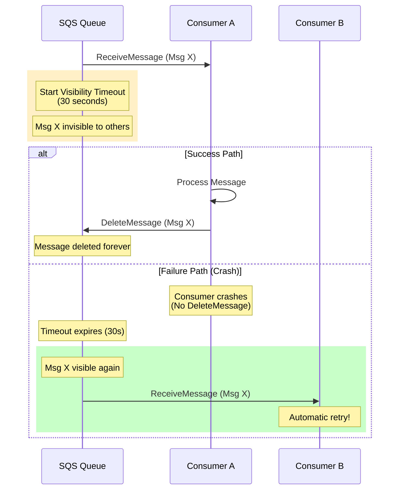
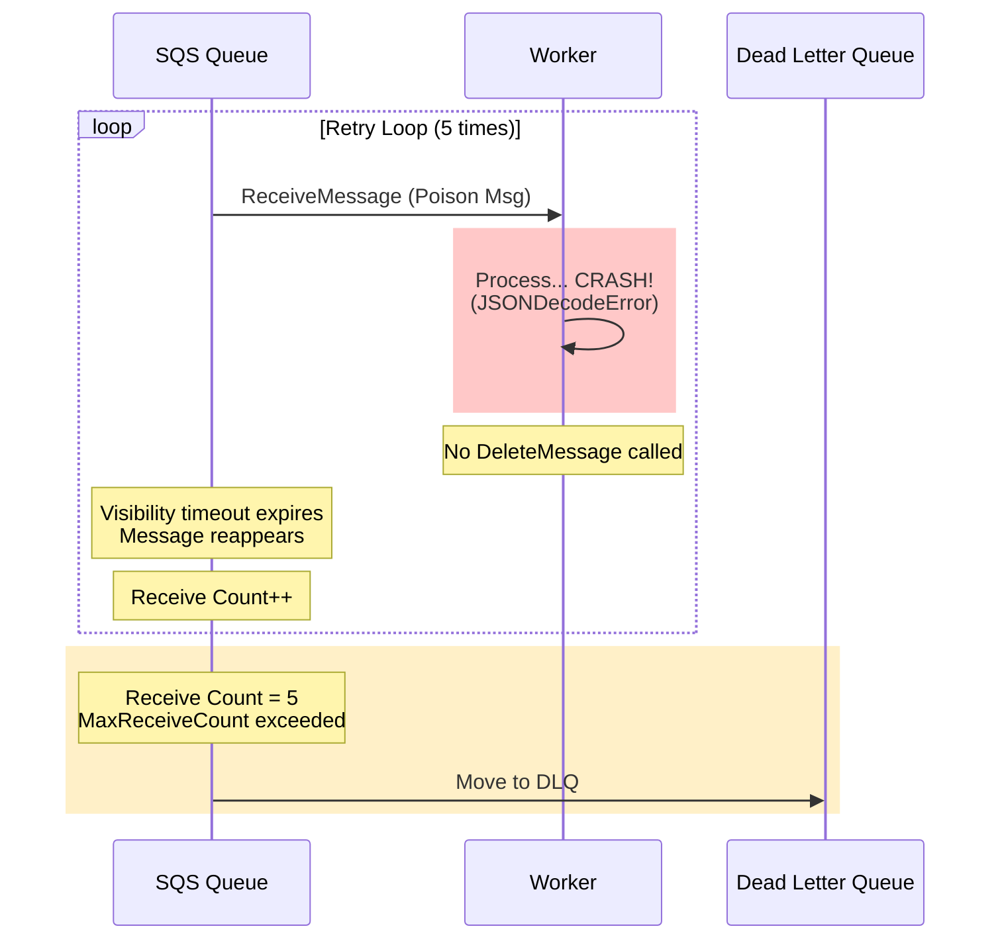

# 04. AWS SQS: The Serverless Message Queue

## 1. Introduction
AWS Simple Queue Service (SQS) is a **fully managed, serverless** message queue that eliminates the operational overhead of running your own message broker. Unlike RabbitMQ or Kafka, you don't provision servers, manage clusters, or worry about capacity planning.

It is the de facto choice for AWS-native applications requiring simple, reliable message queuing without infrastructure management.

**Key Differentiator**: **Infinite scalability** with **zero infrastructure**. You pay only for messages sent/received, not for idle capacity.

**Origins**: One of the first AWS services, launched in 2004 (before EC2!).

---

## 2. Core Architecture

SQS is a **distributed, multi-AZ message queue** with no concept of "nodes" or "connections."



### Key Components
1.  **Queue**: A logical container for messages, distributed across multiple AWS Availability Zones.
2.  **Producer**: Sends messages via `SendMessage` API (HTTP POST).
3.  **Consumer**: Polls messages via `ReceiveMessage` API (pull model, not push).
4.  **Visibility Timeout**: The temporary "lock" on a message after it's received (prevents duplicate processing).
5.  **Dead Letter Queue (DLQ)**: A separate queue for messages that fail processing repeatedly.

---

## 3. How It Works: Visibility Timeout Mechanics

SQS does not delete messages when you read them. It **hides** them temporarily.

### A. The Visibility Timeout Lifecycle



**Step-by-Step**:
1.  **Consumer A** polls and receives Message X.
2.  **SQS** starts a 30-second Visibility Timeout timer.
3.  **Message X** becomes invisible to other consumers (soft lock).
4.  **Success**: Consumer A processes and calls `DeleteMessage` → Message gone.
5.  **Failure**: Consumer A crashes → Timeout expires → Message visible again → Consumer B gets it.

### B. Standard vs FIFO Queues

| Feature | Standard Queue | FIFO Queue |
| :--- | :--- | :--- |
| **Ordering** | Best-effort (Msg 1 sent before Msg 2 might arrive after) | Strictly preserved (First-In-First-Out) |
| **Delivery** | At-least-once (rare duplicates) | Exactly-once (deduplication enabled) |
| **Throughput** | **Unlimited** | 300 msgs/s (3000 with batching) |
| **Cost** | Cheaper | More expensive |
| **Use Case** | Background jobs, fan-out | Order processing, financial transactions |

---

## 4. Deep Dive: Internal Implementation

### A. Multi-AZ Distribution

SQS queues are **not tied to a single server**. Messages are replicated across multiple Availability Zones for durability.

**How It Works**:
1.  **Producer** sends `SendMessage`.
2.  **SQS** writes to 3+ storage nodes across different AZs.
3.  **ACK**: Returns success only after writes are durable.
4.  **Consumer** polls any SQS endpoint → Receives message from nearest available node.

**Result**: ~99.9% durability (messages survive AZ failures).

### B. Polling Strategies

#### Short Polling (BAD)
```python
# BAD: Returns immediately if queue is empty (wastes API calls)
response = sqs.receive_message(
    QueueUrl=queue_url,
    WaitTimeSeconds=0  # Default
)
# Result: Burns money on empty responses
```

#### Long Polling (GOOD)
```python
# GOOD: Waits up to 20s for messages to arrive
response = sqs.receive_message(
    QueueUrl=queue_url,
    MaxNumberOfMessages=10,
    WaitTimeSeconds=20,  # Long poll
    MessageAttributeNames=['All']
)
# Result: Reduces API calls by 90%+
```

### C. Deduplication (FIFO Queues Only)

FIFO queues prevent duplicates using **Content-Based Deduplication** or **Message Deduplication ID**.

**Content-Based** (automatic):
```python
# SQS hashes message body SHA-256
sqs.send_message(
    QueueUrl=fifo_queue_url,
    MessageBody='{"order_id": 123}',
    MessageGroupId='orders'  # Required for FIFO
)
# If same body sent within 5 minutes → Ignored (dedup window)
```

**ID-Based** (manual control):
```python
sqs.send_message(
    QueueUrl=fifo_queue_url,
    MessageBody='{"order_id": 123}',
    MessageDeduplicationId='order-123-2024',  # Unique ID
    MessageGroupId='orders'
)
# Same ID within 5 minutes → Duplicate, ignored
```

---

## 5. End-to-End Walkthrough: Life of a Message

Let's trace an image processing job from submission to completion.

### Step 1: Message Publishing
*   **User** uploads image to S3.
*   **Lambda Trigger** sends message to SQS:
    ```python
    sqs.send_message(
        QueueUrl='https://sqs.us-east-1.amazonaws.com/123456/image-processing',
        MessageBody=json.dumps({
            's3_bucket': 'uploads',
            's3_key': 'images/photo.jpg'
        }),
        DelaySeconds=5  # Process in 5 seconds (optional)
    )
    ```

### Step 2: Message Storage
*   **SQS** stores message across 3 AZs.
*   **Waits 5 seconds** (DelaySeconds) before making it visible.

### Step 3: Consumer Polling
*   **Worker Instance** polls:
    ```python
    while True:
        messages = sqs.receive_message(
            QueueUrl=queue_url,
            MaxNumberOfMessages=10,
            WaitTimeSeconds=20  # Long poll
        )
        for msg in messages.get('Messages', []):
            process_image(msg['Body'])
    ```

### Step 4: Processing
*   **Worker** downloads image from S3, resizes it.
*   **Visibility Timeout** (30s) prevents other workers from picking it up.

### Step 5: Completion
*   **Success**: Worker calls `DeleteMessage` → Message removed from queue.
*   **Failure**: Worker crashes → Timeout expires → Message reappears → Another worker retries.

---

## 6. Failure Scenarios (The Senior View)

### Scenario A: The Infinite Retry Loop (Poison Message)

**Symptom**: Same message appears over and over, never gets deleted. Queue depth stays at 1.
**Cause**: Malformed message causes consumer to crash before calling `DeleteMessage`.

#### The Mechanism



**Step-by-Step**:
1.  **Consumer** receives message: `{"image": "invalid-json}` (malformed).
2.  **Code** tries to parse JSON → Crashes with `JSONDecodeError`.
3.  **No DeleteMessage** called.
4.  **Visibility timeout** expires → Message reappears.
5.  **Repeat** 5 times (maxReceiveCount).
6.  **SQS** moves message to Dead Letter Queue.

#### The Fix

**Option 1: Configure Dead Letter Queue**
```python
# Create DLQ
dlq = sqs.create_queue(QueueName='image-processing-dlq')

# Configure main queue
sqs.set_queue_attributes(
    QueueUrl=main_queue_url,
    Attributes={
        'RedrivePolicy': json.dumps({
            'deadLetterTargetArn': dlq_arn,
            'maxReceiveCount': '5'  # After 5 failures, move to DLQ
        })
    }
)
```

**Option 2: Wrap Processing in Try/Catch**
```python
def process_message(msg_body):
    try:
        data = json.loads(msg_body)
        process_image(data)
        sqs.delete_message(QueueUrl=queue_url, ReceiptHandle=receipt_handle)
    except Exception as e:
        logger.error(f"Poison message: {msg_body}, error: {e}")
        # Delete anyway to prevent infinite loop
        sqs.delete_message(QueueUrl=queue_url, ReceiptHandle=receipt_handle)
        # Send to DLQ manually for investigation
        sqs.send_message(QueueUrl=dlq_url, MessageBody=msg_body)
```

---

### Scenario B: The Visibility Timeout Too Short

**Symptom**: Same message processed twice by different workers. Duplicate charges, duplicate emails sent.
**Cause**: Visibility timeout (30s) is shorter than processing time (60s).

#### The Mechanism

```python
# Processing takes 60 seconds
def process_order(order_id):
    validate_payment(order_id)  # 20s
    reserve_inventory(order_id)  # 20s
    send_confirmation_email(order_id)  # 20s (total 60s)
```

**Timeline**:
*   **t=0s**: Worker A receives message, starts processing.
*   **t=30s**: Visibility timeout expires (processing not done yet!).
*   **t=30s**: Worker B receives **same message**, starts processing.
*   **t=60s**: Worker A finishes → Calls `DeleteMessage` → **Succeeds** (original message).
*   **t=90s**: Worker B finishes → Calls `DeleteMessage` → **Fails** (already deleted).
*   **Result**: Payment validated twice, email sent twice.

#### The Fix

**Option 1: Increase Visibility Timeout**
```python
sqs.set_queue_attributes(
    QueueUrl=queue_url,
    Attributes={
        'VisibilityTimeout': '300'  # 5 minutes (was 30s)
    }
)
```

**Option 2: Extend Visibility Programmatically**
```python
# If processing takes longer, extend the timeout
def process_long_job(receipt_handle):
    for i in range(10):
        do_work_chunk(i)
        
        # Every 30 seconds, extend visibility by another 30s
        sqs.change_message_visibility(
            QueueUrl=queue_url,
            ReceiptHandle=receipt_handle,
            VisibilityTimeout=30
        )
```

---

### Scenario C: The FIFO Queue Throughput Limit

**Symptom**: Application stuck at 300 messages/second. No errors, just stops scaling.
**Cause**: FIFO queue throughput limit (300 TPS without batching).

#### The Fix

**Option 1: Use Batching**
```python
# BAD: Send one message at a time (300 TPS limit)
for order in orders:
    sqs.send_message(QueueUrl=fifo_queue, MessageBody=order)

# GOOD: Batch 10 messages per API call (3000 TPS)
batch = []
for order in orders:
    batch.append({'Id': str(uuid.uuid4()), 'MessageBody': order, 'MessageGroupId': 'orders'})
    
    if len(batch) == 10:
        sqs.send_message_batch(QueueUrl=fifo_queue, Entries=batch)
        batch = []
```

**Option 2: Use Standard Queue (If Ordering Not Critical)**
```python
# If you don't need strict ordering, use Standard Queue
# Unlimited throughput, but messages may arrive out of order
```

---

## 7. Performance Tuning / Scaling Strategies

### A. Horizontal Scaling
*   **Auto Scaling Workers**: Use CloudWatch `ApproximateNumberOfMessagesVisible` metric to scale EC2/Lambda.
*   **Multiple Queues**: Shard by workload type (e.g., `images-queue`, `videos-queue`).

### B. Configuration Tuning

| Configuration | Recommendation | Why? |
| :--- | :--- | :--- |
| `WaitTimeSeconds` | 20 | Enable long polling (reduce API calls) |
| `VisibilityTimeout` | 2x processing time | Prevent duplicate processing |
| `MaxReceiveCount` | 5 | Move to DLQ after 5 failures |
| `DelaySeconds` | 0 (default) | Use for scheduled jobs (0-900s) |
| `MessageRetentionPeriod` | 345600 (4 days) | Increase for longer retention |

---

## 8. Constraints & Limitations

| Constraint | Limit | Why? |
| :--- | :--- | :--- |
| **Message Size** | 256 KB | Use S3 for larger payloads |
| **FIFO Throughput** | 300 TPS (3000 with batching) | Deduplication overhead |
| **Standard Throughput** | Unlimited | No ordering guarantees |
| **Retention** | 14 days max | Not designed for long-term storage |
| **Visibility Timeout** | 12 hours max | Prevents indefinite locks |

---

## 9. When to Use SQS?

| Use Case | Verdict | Why? |
| :--- | :--- | :--- |
| **Background Jobs** | **YES** | Perfect for async task queues (email, image processing) |
| **Microservices Decoupling** | **YES** | Simple, managed, zero infrastructure |
| **Event-Driven Workflows** | **YES** | Integrate with Lambda, SNS, Step Functions |
| **High-Throughput Streaming** | **NO** | Use Kinesis or Kafka (SQS not for streaming) |
| **Real-Time Analytics** | **NO** | Use Kinesis Data Streams |
| **Message Replay** | **NO** | SQS deletes after consumption (use Kafka) |

---

## 10. Production Checklist

1.  [ ] **Enable Long Polling**: Set `WaitTimeSeconds=20` to reduce API calls.
2.  [ ] **Configure Dead Letter Queue**: Set `maxReceiveCount=5` to catch poison messages.
3.  [ ] **Set Visibility Timeout**: 2x your average processing time.
4.  [ ] **Use Batching for FIFO**: Send/receive up to 10 messages per API call.
5.  [ ] **Monitor Queue Depth**: Alert on `ApproximateNumberOfMessagesVisible > 1000`.
6.  [ ] **Implement Idempotency**: Assume messages may be delivered twice (use deduplication IDs).
7.  [ ] **Use S3 for Large Payloads**: Store 256KB+ data in S3, send pointer in SQS.
8.  [ ] **Tag Queues**: Use cost allocation tags for billing visibility.
