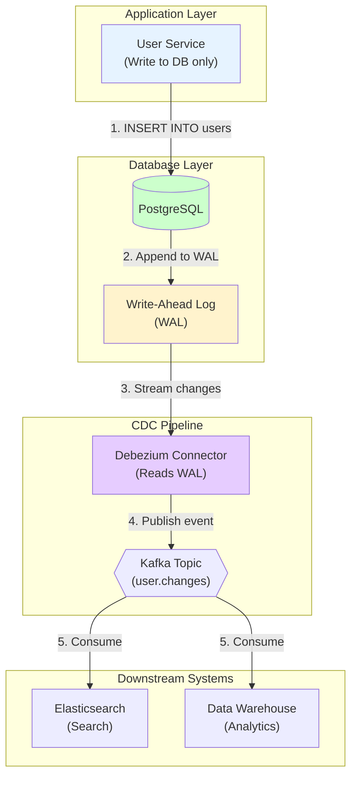
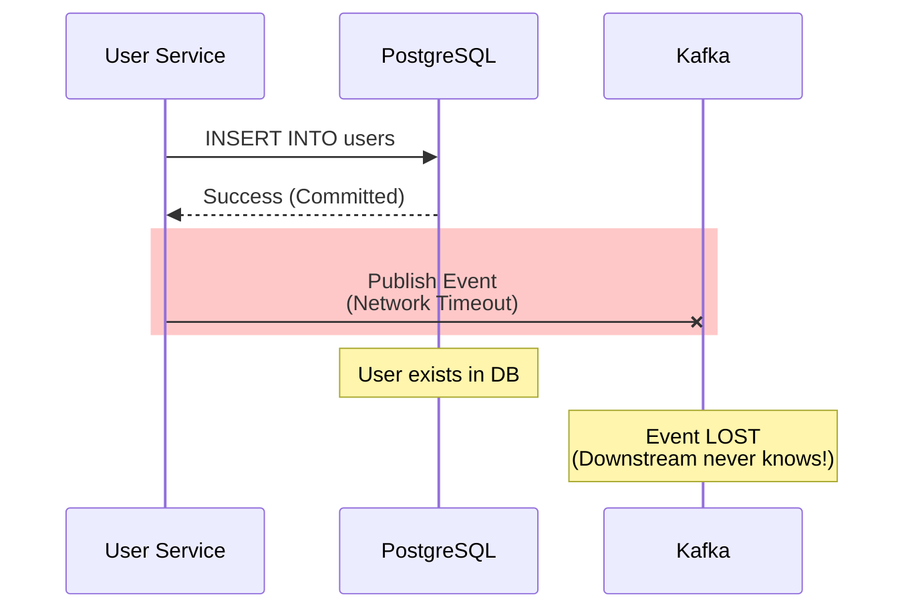
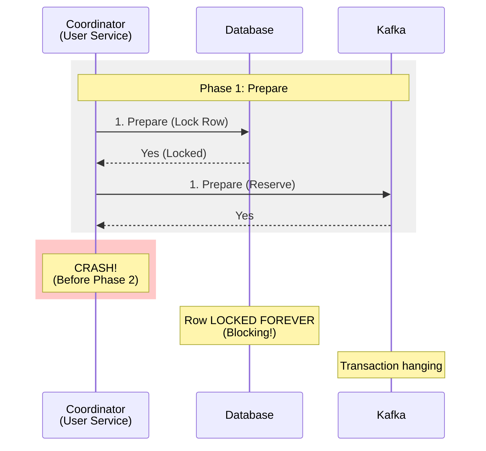

# 05. Change Data Capture & Delivery Semantics

## 1. Introduction
In microservices architecture, maintaining data consistency across system boundaries (e.g., PostgreSQL → Elasticsearch, PostgreSQL → Kafka → Analytics) is the hardest problem. Naive "Dual Writes" (writing to DB and message broker sequentially) lead to eventual data corruption and inconsistency.

This document explores **Change Data Capture (CDC)** as the industry-standard solution and explains the theoretical limits of **Delivery Semantics** (at-most-once, at-least-once, exactly-once).

**The Problem**: You cannot atomically commit to two separate systems (database + message broker) over the network. One will eventually fail while the other succeeds, causing permanent data divergence.

**The Solution**: Treat the database's transaction log (WAL, Binlog) as the single source of truth and stream changes asynchronously.

---

## 2. Core Architecture

CDC inverts the traditional dual-write flow by making the database the only write target.



### Key Components
1.  **Application**: Writes **only** to the database (single source of truth).
2.  **Write-Ahead Log (WAL)**: The database's internal transaction log (Postgres WAL, MySQL Binlog, MongoDB Oplog).
3.  **CDC Connector**: Reads the WAL and converts binary log entries into structured events (Debezium, Maxwell, Databus).
4.  **Message Broker**: Distributes change events to downstream consumers (Kafka, Pulsar).
5.  **Schema Registry**: Ensures event format compatibility across consumers (Confluent Schema Registry, AWS Glue).

---

## 3. How It Works: Delivery Semantics

Before understanding CDC, you must understand the theoretical limits of distributed message delivery.

### A. The Two Generals Problem
It is **mathematically impossible** to guarantee that two distributed systems agree on a message status over an unreliable network. We must choose our failure mode.

### B. The Three Guarantees

| Semantic | Guarantee | Failure Mode | Implementation | Use Case |
| :--- | :--- | :--- | :--- | :--- |
| **At-Most-Once** | Delivered 0 or 1 time | Data Loss | Fire-and-forget UDP | IoT sensor metrics (lossy OK) |
| **At-Least-Once** | Delivered 1+ times | Duplicates | Retry + ACK | E-commerce, payments (with idempotency) |
| **Exactly-Once** | Effect applied exactly once | Performance hit | Deduplication + Transactions | Stream processing (Flink, Kafka Streams) |

### C. Exactly-Once is an Illusion

**Truth**: "Exactly-Once" means **at-least-once delivery + idempotent processing**. The message may be delivered twice, but the *effect* is applied only once.

**Example**:
```sql
-- BAD: Non-idempotent (running twice doubles the balance)
UPDATE accounts SET balance = balance + 100 WHERE id = 123;

-- GOOD: Idempotent (running twice has the same effect)
INSERT INTO transactions (id, account_id, amount) VALUES ('tx-456', 123, 100)
ON CONFLICT (id) DO NOTHING;
```

---

## 4. Deep Dive: Internal Implementation

### A. The Dual Write Problem (Why Naive Approaches Fail)

**Naive Code**:
```java
// BAD: Unsafe dual write
public void createUser(User user) {
    database.insert(user);           // Step 1: Success
    messageQueue.publish(user);      // Step 2: CRASH (network timeout)
    // Result: DB has user, but downstream never gets the event!
}
```

**The Failure**:


**Result**: Permanent data inconsistency. Elasticsearch never gets the user. Analytics never sees the event.

### B. Why Not 2PC (Two-Phase Commit)?

**Two-Phase Commit** attempts to atomically commit across multiple systems.



**The Problems**:
1.  **Blocking**: If Coordinator crashes after Prepare, participants hold locks indefinitely.
2.  **Latency**: 2 network round-trips per transaction.
3.  **Availability**: System can't make progress during coordinator failure (violates CAP theorem's Availability).

**Why CDC Wins**:
| Feature | 2PC | CDC (Log Tailing) |
| :--- | :--- | :--- |
| **Latency** | High (blocking RTTs) | Low (async) |
| **Availability** | Low (chooses Consistency over Availability) | High (eventual consistency) |
| **Coupling** | Tight (app knows all sinks) | Loose (app only knows DB) |
| **Failure Mode** | Blocking | Non-blocking |

### C. CDC Mechanics (How Debezium Works)

**Step-by-Step**:
1.  **Application writes** to PostgreSQL: `INSERT INTO users (id, name) VALUES (123, 'Alice')`.
2.  **Postgres writes to WAL** (on disk): Binary log entry `{lsn: 16/3A2B, op: INSERT, table: users, new: {id:123, name:'Alice'}}`.
3.  **Debezium connector** acts as a PostgreSQL replica, requesting WAL stream.
4.  **Debezium parses** binary log and converts to JSON/Avro:
    ```json
    {
      "before": null,
      "after": {"id": 123, "name": "Alice"},
      "source": {"db": "prod", "table": "users", "lsn": "16/3A2B"},
      "op": "c",  // create
      "ts_ms": 1700000000000
    }
    ```
5.  **Debezium publishes** to Kafka topic `postgres.public.users`.
6.  **Consumers** (Elasticsearch, Data Warehouse) read from Kafka.

**The Guarantee**: At-least-once delivery (WAL is durable, messages may duplicate on retry).

---

## 5. End-to-End Walkthrough: Life of a Database Change

Let's trace a user creation from database write to downstream consumption.

### Step 1: Application Write
*   **User Service** executes:
    ```sql
    BEGIN;
    INSERT INTO users (id, email, created_at) VALUES (123, 'alice@example.com', NOW());
    COMMIT;
    ```
*   **PostgreSQL** writes to WAL on disk before replying "Success."

### Step 2: WAL Streaming
*   **Debezium Connector** is registered as a logical replication slot.
*   **PostgreSQL** streams WAL entries to Debezium over the replication protocol.
*   **Debezium** receives binary log entry with LSN (Log Sequence Number) `16/3A2B46C0`.

### Step 3: Event Transformation
*   **Debezium** decodes binary format to structured event.
*   **Schema Registry** validates the event against the registered Avro schema for `users` table.
*   **Event Structure**:
    ```json
    {
      "schema": {...},
      "payload": {
        "before": null,
        "after": {"id": 123, "email": "alice@example.com", "created_at": 1700000000000},
        "source": {"version": "1.9.0", "connector": "postgresql", "lsn": 16/3A2B46C0},
        "op": "c",
        "ts_ms": 1700000000123
      }
    }
    ```

### Step 4: Kafka Publishing
*   **Debezium** publishes to Kafka topic `postgres.public.users`.
*   **Partition Key**: `id=123` (ensures all changes for user 123 go to same partition → ordering).
*   **Kafka** writes to partition leader, replicates to followers, acknowledges.

### Step 5: Downstream Consumption
*   **Elasticsearch Consumer**:
    *   Reads event from Kafka.
    *   Executes: `PUT /users/_doc/123 {"email": "alice@example.com", "created_at": ...}`.
    *   Commits Kafka offset.
*   **Data Warehouse Consumer**:
    *   Reads event from Kafka.
    *   Bulk inserts to Redshift staging table.

---

## 6. Failure Scenarios (The Senior View)

### Scenario A: Schema Evolution Breaking Consumers

**Symptom**: Consumers crash with `Unexpected field` or `Missing required field` errors.
**Cause**: Database column was renamed (`fname` → `first_name`) without updating consumer code.

#### The Mechanism

**Without Schema Registry**:
1.  **DBA** renames column: `ALTER TABLE users RENAME COLUMN fname TO first_name;`.
2.  **CDC** emits event: `{"first_name": "Alice"}`.
3.  **Old Consumer** expects: `{"fname": ...}` → Crashes with `KeyError: fname`.

**The Cascade**:
*   Consumer lag grows.
*   Downstream systems (Elasticsearch, Analytics) stop updating.
*   Data freshness degrades.

#### The Fix

**Option 1: Use Schema Registry (CORRECT)**
```java
// Define Avro schema with versioning
{
  "type": "record",
  "name": "User",
  "fields": [
    {"name": "first_name", "type": "string", "aliases": ["fname"]}  // Backward compatible
  ]
}
```

**Option 2: Backward-Compatible Schema Changes**
```sql
-- GOOD: Add new column, keep old one temporarily
ALTER TABLE users ADD COLUMN first_name VARCHAR(100);
UPDATE users SET first_name = fname;
-- Deploy consumer updates
-- Later: DROP COLUMN fname;
```

---

### Scenario B: Out-of-Order Events (Kafka Partition Key Mismatch)

**Symptom**: User's email shows old value after update.
**Cause**: Partition key doesn't match database primary key.

#### The Mechanism

**Bad Configuration**:
```java
// BAD: Random partition key
producer.send(new ProducerRecord<>("users", UUID.randomUUID().toString(), event));
```

**The Problem**:
1.  **Event 1** (INSERT user_id=123): Goes to Partition 0.
2.  **Event 2** (UPDATE user_id=123): Goes to Partition 1 (different partition!).
3.  **Partition 1 consumer** processes UPDATE before INSERT → Fails or overwrites.

#### The Fix

**Use Database Primary Key as Partition Key**:
```java
// GOOD: Partition by primary key
String partitionKey = String.valueOf(event.getPayload().getAfter().getId());
producer.send(new ProducerRecord<>("users", partitionKey, event));
```

**Result**: All events for `user_id=123` go to the same Kafka partition → ordering preserved.

---

### Scenario C: CDC Connector Lag Spike

**Symptom**: `debezium.lag.seconds` metric shows 300s (5 minutes).
**Cause**: Bulk data migration or large transaction.

#### The Mechanism

**The Scenario**:
1.  **DBA** runs: `UPDATE users SET verified=true;` (affects 10 million rows).
2.  **PostgreSQL** writes 10 million WAL entries.
3.  **Debezium** must read, parse, and publish 10 million events.
4.  **Bottleneck**: Single connector instance can't keep up.

#### The Fix

**Option 1: Increase Connector Parallelism**
```yaml
tasks.max: 10  # Was 1, now 10 parallel tasks
```

**Option 2: Skip Bulk Operations**
```sql
-- Temporarily disable WAL logging for bulk operations
BEGIN;
SET LOCAL wal_level = minimal;  -- PostgreSQL
UPDATE users SET verified=true;
COMMIT;
```

**Option 3: Monitor and Alert**
```yaml
# Prometheus alert
- alert: CDCLagHigh
  expr: debezium_lag_seconds > 60
  annotations:
    summary: "CDC lag exceeds 1 minute"
```

---

## 7. Performance Tuning / Scaling Strategies

### A. Horizontal Scaling
*   **Multiple Connector Tasks**: Debezium supports `tasks.max` to parallelize WAL reading per table.
*   **Table-Level Sharding**: Deploy separate connector instances per table for very large databases.

### B. Vertical Scaling
*   **Increase Connector Memory**: More heap for buffering events.
*   **Faster Disk I/O**: Use SSDs for Kafka log storage.

### C. Configuration Tuning

| Configuration | Recommendation | Why? |
| :--- | :--- | :--- |
| `tasks.max` | Number of tables / 2 | Parallel WAL processing per table |
| `max.batch.size` | 2048 | Publish events in batches to Kafka |
| `max.queue.size` | 8192 | Buffer size before blocking WAL read |
| `snapshot.mode` | `initial` | Full table snapshot on first run |
| `schema.history.internal.kafka.topic` | `schema-changes` | Track schema evolution |

---

## 8. Constraints & Limitations

| Constraint | Limit | Why? |
| :--- | :--- | :--- |
| **Latency** | ~100ms - 1s | WAL parsing + Kafka publish overhead |
| **Schema Changes** | Manual coordination | Consumers must update schemas |
| **Deletes** | Tombstone events | Kafka key exists, value is null (compaction) |
| **Ordering** | Per partition only | Global ordering impossible without single partition |
| **Database Support** | Postgres, MySQL, MongoDB | Oracle, SQL Server require proprietary connectors |

---

## 9. When to Use CDC?

| Use Case | Verdict | Why? |
| :--- | :--- | :--- |
| **Database → Elasticsearch Sync** | **YES** | Avoid dual writes, guaranteed consistency |
| **Event-Driven Microservices** | **YES** | Database changes trigger workflows |
| **Data Warehouse Replication** | **YES** | Real-time analytics without ETL lag |
| **Cross-Region Replication** | **MAYBE** | Use Kafka MirrorMaker + CDC |
| **High-Frequency Trading** | **NO** | 100ms latency too high, use direct DB replication |

---

## 10. Production Checklist

1.  [ ] **Use Schema Registry**: Never run CDC without Avro/Protobuf schemas (Confluent, AWS Glue).
2.  [ ] **Idempotent Consumers**: Ensure consumers can handle duplicate messages (`UPSERT`, deduplication keys).
3.  [ ] **Partition by Primary Key**: Set Kafka partition key to database primary key for ordering.
4.  [ ] **Handle Tombstones**: Deletes produce `null` payloads → compact Kafka logs periodically.
5.  [ ] **Monitor Lag**: Alert on `debezium.lag.seconds > 60`.
6.  [ ] **Snapshot Strategy**: Use `snapshot.mode=initial` for full table load on first run.
7.  [ ] **Backfill Plan**: Have a strategy for reprocessing historical data (re-snapshot or replay Kafka).
8.  [ ] **Test Schema Evolution**: Simulate column add/rename/drop in staging before production.
