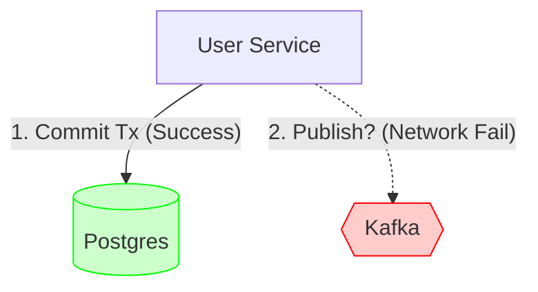
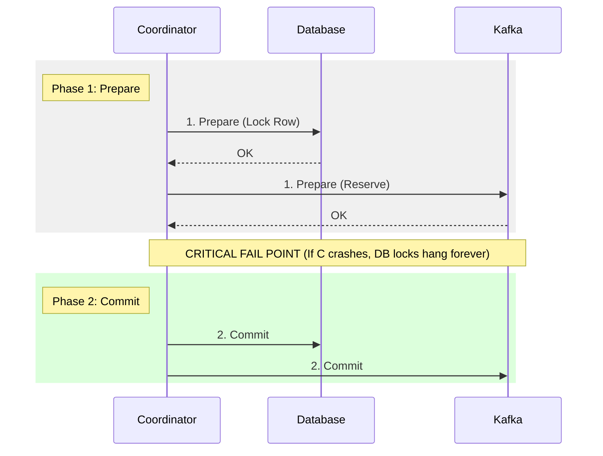
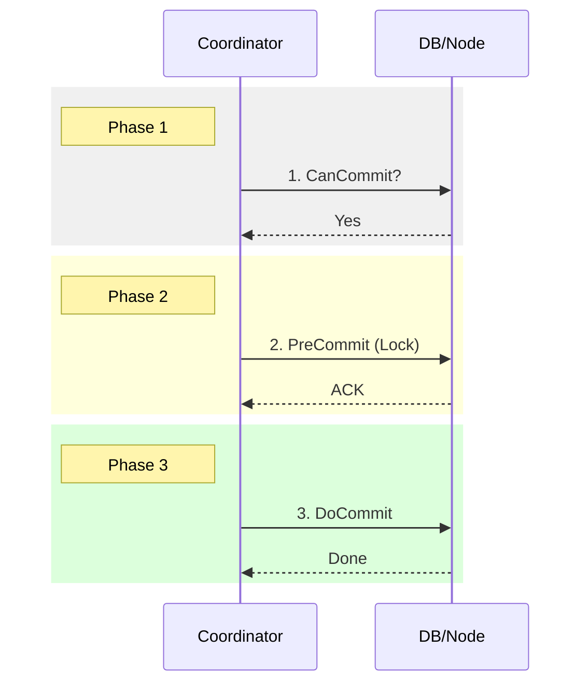
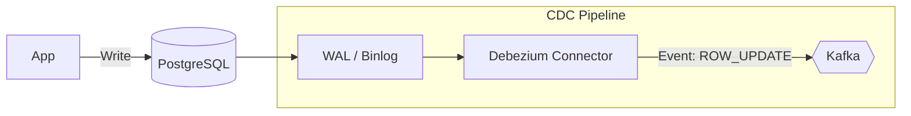

# 05. Data Integration: CDC & Delivery Semantics

## 1. Introduction
In microservices architecture, maintaining data consistency across boundaries (e.g., PostgreSQL -> Elasticsearch) is the hardest problem. Naive "Dual Writes" (writing to DB and Kafka sequentially) lead to eventual data corruption.

This document explores **Change Data Capture (CDC)** and the theoretical limits of **Delivery Semantics**.

---

## 2. Theory: Delivery Semantics

The "Two Generals Problem" proves that it is impossible to guarantee that two distributed systems agree on a message status over an unreliable network. We must choose our failure mode.

| Semantic | Guarantee | Failure Mode | Use Case |
| :--- | :--- | :--- | :--- |
| **At-Most-Once** | Message delivered 0 or 1 time. | Data Loss. | IoT Sensor Metrics. |
| **At-Least-Once** | Message delivered 1 or more times. | Duplicates. | Payments, E-commerce (Requires Idempotency). |
| **Exactly-Once** | Effect applied exactly once. | Performance Hit. | Internal Stream Processing (Flink/Kafka). |

---

## 3. The Dual Write Problem

Why can't we just do this?



*   **Risk**: If line 1 succeeds, but line 2 crashes (network fail), your DB has the user, but your Downstream (Search/Analytics) never knows.
*   **Result**: Permanent data inconsistency.

---

## 4. Alternative: Distributed Transactions (The Hard Way)

Why CDC? Why not just use "Prepare" and "Commit" across the network?

### A. Two-Phase Commit (2PC) - The Standard
The Coordinator (User Service) asks everyone to promise to commit.



1.  **Prepare Phase**:
    *   Coordinator -> DB: "Prepare to commit User X?" -> DB: "Yes, I hold the lock."
    *   Coordinator -> Kafka: "Prepare to send Event X?" -> Kafka: "Yes." (Note: Kafka does not support this native 2PC well).
2.  **Commit Phase**:
    *   Coordinator -> DB: "Commit!"
    *   Coordinator -> Kafka: "Commit!"

*   **The Killer Flaw**: **Blocking**. If the Coordinator crashes after step 1, the DB holds the row lock *forever* (or until timeout). The entire system halts for that row.

### B. Three-Phase Commit (3PC) - The Academic Fix
Adds a "Pre-Commit" phase to solve the blocking issue.



1.  **CanCommit?**: "Can you do it?"
2.  **PreCommit**: "I am about to do it. Acknowledge?"
3.  **DoCommit**: "Do it."

*   **Why we don't use it**: It requires **3 rounds of network messages** per transaction. It is too slow (high latency) for high-throughput systems and still doesn't solve network partitioning perfectly (Paxos/Raft is better).

### C. Why CDC Wins
| Feature | 2PC / 3PC | CDC (Log Tailing) |
| :--- | :--- | :--- |
| **Latency** | High (Blocking RTTs) | Low (Async) |
| **Availability** | Low (CAP Theorem: chooses C over A) | High (Eventual Consistency) |
| **Coupling** | Tight (App must know all sinks) | Loose (App only knows DB) |

---

## 5. Solution A: Change Data Capture (CDC)

We invert the flow. We treat the **Database Transaction Log (WAL)** as the source of truth.



*   **Mechanism**:
    1.  Postgres writes to Write-Ahead-Log (WAL) on disk.
    2.  Debezium acts as a "Replica", reading the WAL stream.
    3.  Debezium converts binary log entries into JSON/Avro events.
*   **Pros**: Zero data loss (At-Least-Once). No changes to Application Code.

---

## 6. Solution B: The Transactional Outbox

If you cannot install CDC tools (Debezium), use the Outbox Pattern.

1.  **Atomic Commit**:
    ```sql
    BEGIN;
    INSERT INTO users (id, name) ...;
    INSERT INTO outbox (event_type, payload) VALUES ('UserCreated', '{...}');
    COMMIT;
    ```
2.  **Relay**: A background poller reads the `outbox` table and pushes to Kafka.
3.  **Cleanup**: The poller deletes the row from `outbox` after acknowledgment.

---

## 7. Constraints & Challenges

| Challenge | Explanation | Mitigation |
| :--- | :--- | :--- |
| **Schema Evolution** | DB column renamed (`fname` -> `first_name`). Downstream crashes. | Use a **Schema Registry** (Avro) to enforce backward compatibility. |
| **Ordering** | CDC preserves order *per table key*. | Ensure Kafka Partition Key matches the DB Primary Key. |
| **Lag** | Debezium adds latency (usually < 1s). | Monitor `consumer_lag` metrics. |

---

## 8. Production Checklist

1.  [ ] **Idempotence**: Ensure consumers can handle the same message twice (Use `UPSERT` or Dedup keys).
2.  [ ] **Schema Registry**: Never perform CDC without a registry (Confluent/Glue).
3.  [ ] **Tombstones**: Handle Deletes correctly (Kafka Key exists, Value is Null) to compact Log.
