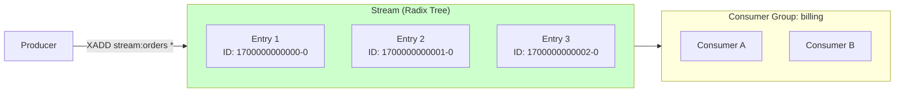
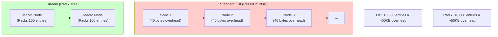
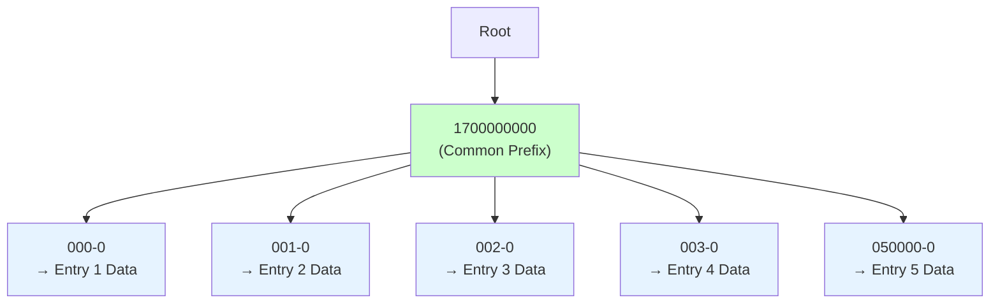
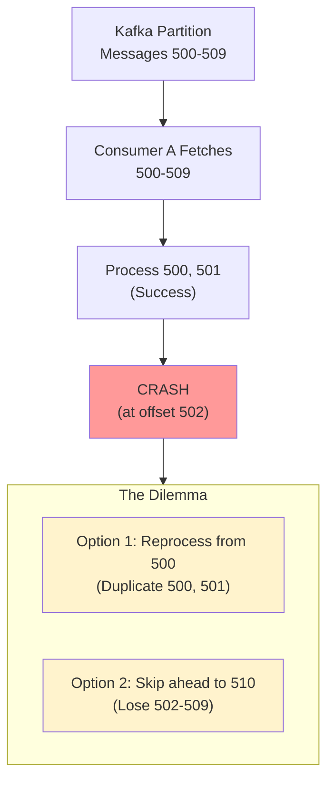
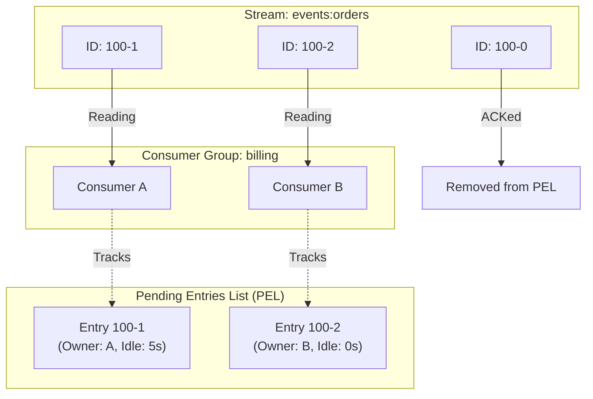
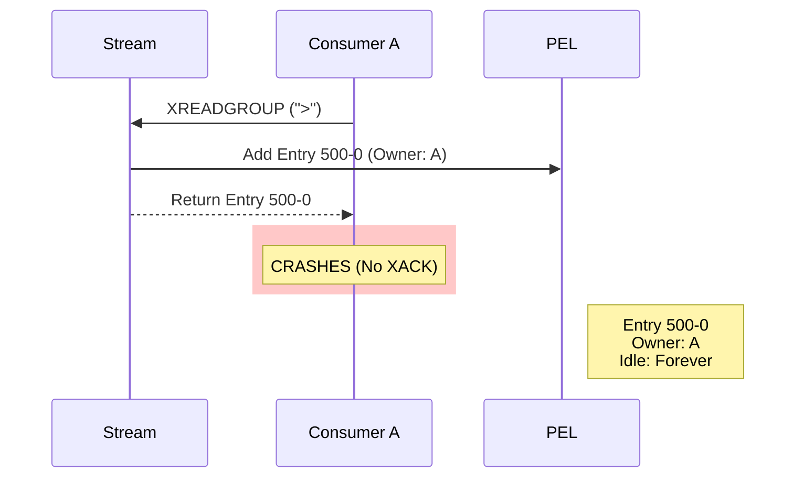
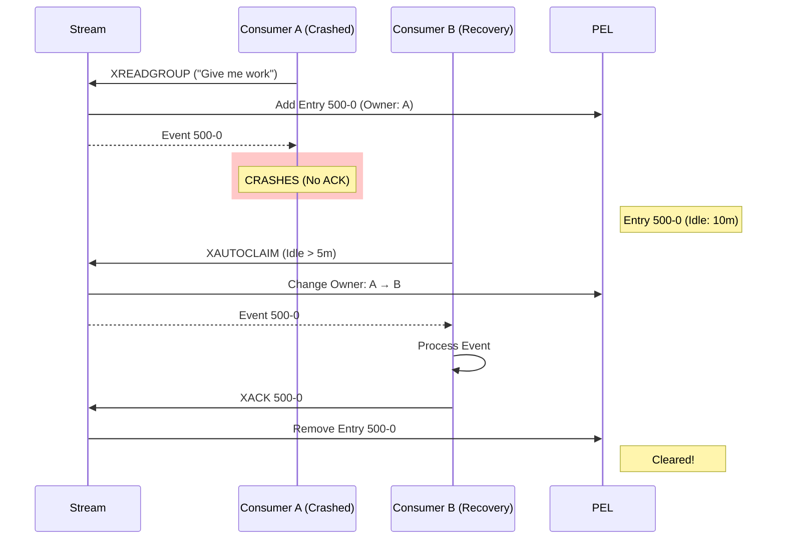

# 06. Redis Streams: The "Mini-Kafka" in Memory

## 1. Introduction
Launched in Redis 5.0, **Redis Streams** bridges the gap between the "Fire-and-Forget" nature of Pub/Sub and the heavy persistent log of Kafka.

It provides a **Persistent, Append-Only Log** with **Consumer Groups**, but runs entirely in memory (with disk persistence via RDB/AOF). It is the perfect choice for high-throughput event sourcing where you don't want the operational complexity of Zookeeper/Kafka.

---

## 2. Core Architecture

Unlike a standard Redis `List` (Linked List) or `ZSET` (Skip List), Streams use a **Radix Tree (specifically Rax)** for memory efficiency.

### The Stream Structure



### Key Components
1.  **Stream**: An append-only log, identified by a key (e.g., `events:orders`).
2.  **Entry**: A message with:
    *   **ID**: Auto-generated timestamp-sequence (e.g., `1526985054069-0`).
    *   **Fields**: Key-value pairs (e.g., `amount=50, user=123`).
3.  **Consumer Group**: A named set of consumers that divide work (like Kafka consumer groups).
4.  **PEL (Pending Entries List)**: Tracks messages that have been delivered but not acknowledged.

---

## 3. How It Works: Entry IDs and Time

### The Entry ID Format
Every entry has a unique ID: `<millisecond-timestamp>-<sequence>`

**Example**: `1526985054069-0`
*   **Top Part**: Millisecond timestamp (1526985054069).
*   **Bottom Part**: Sequence number (0) for events in the same millisecond.

**Implication**: The ID *is* the time. You can query "Give me all events from 5 minutes ago" without indexing a separate timestamp field.

```
XRANGE events:pay 1526985000000 1526985054069  # Get events in time range
```

---

## 4. Deep Dive: Internal Implementation

### A. Why Radix Trees? (Memory Efficiency)

Redis Streams use **Radix Trees (Rax)** instead of linked lists for memory density.

#### Memory Comparison



**Key Difference**: 
*   **List**: Each entry is a separate heap object with pointers (prev/next).
*   **Radix Tree**: Entries are serialized into contiguous memory blocks. Redis reads chunks, not individual nodes.
*   **Result**: Streams can hold **10x more data** in the same RAM.

### B. The Radix Tree Structure

The Radix Tree (Rax) is a **compressed prefix tree** that stores Entry IDs efficiently.

**Components**:
*   **Keys**: Entry IDs (e.g., `1700000000000-0`).
*   **Values**: Pointers to serialized field-value pairs.
*   **Compression**: Common prefixes are compressed (e.g., if 1000 entries start with `1700000000`, that prefix is stored once).

```c
// Simplified internal structure
typedef struct stream {
    rax *rax;           // Radix tree of entry IDs
    // ...
    streamCG *cgroups;  // Linked list of consumer groups
} stream;
```

#### Visual Example: How Prefix Compression Works

Let's say we have 5 entries with these IDs:
*   `1700000000000-0`
*   `1700000000001-0`
*   `1700000000002-0`
*   `1700000000003-0`
*   `1700000050000-0`

**Without Compression (Standard Tree)**:
Each entry stores the full ID → **5 × 17 bytes = 85 bytes** (just for keys).

**With Radix Tree Compression**:


**Storage**:
*   **Common prefix** `1700000000` stored once: **10 bytes**.
*   **Suffixes**: `000-0`, `001-0`, `002-0`, `003-0`, `050000-0`: **5-6 bytes each**.
*   **Total**: ~10 + (5 × 6) = **40 bytes** (vs 85 bytes).

**Memory Savings**: ~53% reduction just on keys!

#### Real-World Impact

**Scenario**: 100,000 entries added in 1 second (same millisecond timestamp `1700000000000`).
*   **All share prefix**: `1700000000000-`
*   **Only suffix varies**: `-0`, `-1`, `-2`, ... `-99999`.

**Radix Tree Storage**:
*   Prefix stored once: 13 bytes.
*   100,000 unique suffixes: ~1-6 bytes each.
*   **Total Key Storage**: ~600KB (vs 1.7MB uncompressed).

This is why Streams can hold **10x more entries** than standard Redis Lists in the same RAM.

### C. Consumer Groups vs Kafka

#### Kafka: The "Offset" Model
*   **State**: Stored as a single integer (Offset 500).
*   **Meaning**: "I have processed everything up to 500."
*   **Weakness**: If Consumer A crashes at offset 502, the whole group is blocked or messages are lost.

**The Problem Explained**:

In Kafka, the consumer group tracks a **single committed offset** per partition. This creates a critical issue when a consumer crashes mid-processing.

**Scenario**:
1.  Consumer A fetches messages 500-509 (batch of 10).
2.  Consumer A processes messages 500, 501 successfully.
3.  Consumer A crashes while processing message 502.
4.  **Last committed offset**: 500 (because Consumer A never committed 501-509).

**What Happens Next?**



**The Two Bad Choices**:

1.  **Reprocess from last committed offset (500)**:
    *   Consumer B (or restarted A) reads from offset 500.
    *   Messages 500-501 are **duplicated** (processed twice).
    *   *Best Practice*: Use idempotent processing to handle duplicates.

2.  **Skip ahead (if using `enable.auto.commit=true` and it committed mid-batch)**:
    *   If auto-commit happened after fetching but before crash, offset might be 510.
    *   Messages 502-509 are **lost** (never processed).
    *   *This is data loss.*

**Why "Blocked"?**

If the partition is assigned exclusively to Consumer A (which crashed), and the consumer group waits for a rebalance timeout before reassigning, the partition sits idle during this window → throughput drops to zero for that partition.
*   **Weakness**: If Consumer A crashes at offset 502, the whole group is blocked or messages are lost.

#### Redis Streams: The "PEL" (Pending Entries List) Model
*   **State**: Stored as a discrete list of **unacknowledged message IDs** for *each* consumer.
*   **Meaning**: "I have read IDs [1, 5, 7], but I haven't ACKed them yet."
*   **Benefit**: Allows for non-sequential processing and individual message re-delivery.



**PEL Structure**:
```c
typedef struct streamCG {
    streamID last_id;       // Last delivered ID
    rax *pel;               // Pending Entries List (ID -> nack info)
    rax *consumers;         // Consumer name -> streamConsumer
} streamCG;
```

---

## 5. End-to-End Walkthrough: Life of a Stream Event

Let's trace a payment event through the complete lifecycle.

### Step 1: Production (`XADD`)
*   **Publisher**: `XADD events:pay * amount 50 user 123`
*   **Redis**:
    1.  Generates ID `1700000000000-0` (current timestamp + sequence).
    2.  Serializes fields (`amount=50, user=123`) into a listpack.
    3.  Inserts into Radix Tree.
    *   **Complexity**: $O(\log N)$ where $N$ is number of entries.

```c
// Pseudo-code
raxInsert(stream->rax, id, serialized_entry, NULL);
```

### Step 2: Consumption (`XREADGROUP`)
*   **Consumer A**: `XREADGROUP GROUP billing ConsumerA COUNT 1 STREAMS events:pay >`
    *   The `>` means "Give me new messages I haven't seen."
*   **Redis**:
    1.  Looks up consumer group `billing`.
    2.  Finds next entry after `last_id` in the Radix Tree.
    3.  **Crucial Step**: Adds this ID to Consumer A's **PEL** with timestamp.
    4.  Returns the entry to Consumer A.
*   **State**: Message is now "delivered" but "unacknowledged".

```c
// Pseudo-code
raxInsert(group->pel, entry_id, nack_info, NULL);  // Add to PEL
consumerA->pel_count++;
```

### Step 3: Acknowledgment (`XACK`)
*   **Consumer A**: Successfully processes the payment.
*   **Action**: `XACK events:pay billing 1700000000000-0`
*   **Redis**:
    1.  Removes the ID from the PEL.
    2.  Decrements Consumer A's pending count.
*   **State**: Message is now complete.

```c
// Pseudo-code
raxRemove(group->pel, entry_id, NULL);  // Remove from PEL
consumerA->pel_count--;
```

---

## 6. Failure Scenarios (The Senior View)

### Scenario A: The Crashed Consumer (Stuck in PEL)
**Event**: Consumer A reads payment event (ID `170...0`) and crashes *before* sending XACK.

**Problem**:
*   The message sits in the PEL forever.
*   New consumers (Consumer B) asking for `>` will *never* see it because Redis thinks A is working on it.
*   **Symptom**: "Missing Data" or "Stuck Job".



### Scenario B: Recovery (`XAUTOCLAIM`)

This is the equivalent of Kafka's Rebalance, but manual or polled.

**The Fix**: Running a "Garbage Collector" process.

1.  **Inspect**: `XPENDING events:pay billing`
    *   Shows: `"ID 170...0, Consumer: A, Idle: 60 minutes"`.

2.  **Claim**: `XAUTOCLAIM events:pay billing ConsumerB 30000 0-0 COUNT 10`
    *   **Logic**: "If any message has been idle for > 30s, change ownership to ME (Consumer B)."
    *   **COUNT 10**: Claim up to 10 messages at once.

3.  **Process**: Consumer B processes it and sends `XACK`.



**Internal Mechanism**:
```c
// XAUTOCLAIM pseudo-logic
for each entry in PEL {
    if (entry.idle_time > min_idle_time) {
        entry.owner = new_consumer;
        entry.delivery_count++;
        entry.last_delivery_time = now();
        return entry;
    }
}
```

---

## 7. Scaling Considerations

### A. Partitioning (Sharding by Key)
Unlike Pub/Sub, Streams **DO** shard by key in Redis Cluster:
*   **Example**: `events:user:123` and `events:user:456` might be on different nodes.
*   **Benefit**: You can scale horizontally by adding more cluster nodes.

### B. Memory Management (The Capping Problem)
Streams grow indefinitely if not capped.

**Solution**: Use `MAXLEN` to cap stream size:
```
XADD events:pay MAXLEN ~ 1000000 * amount 50 user 123
```
*   **`~` (Approximate)**: Allows Redis to delete in chunks (more efficient than exact).
*   **`1000000`**: Keep approximately 1 million entries.

**Alternative**: `XTRIM` to trim old entries:
```
XTRIM events:pay MAXLEN ~ 1000000
```

---

## 8. Constraints & Comparison

| Feature | Redis Streams | Apache Kafka | RabbitMQ |
| :--- | :--- | :--- | :--- |
| **Storage** | RAM (limited by memory) | Disk (limited by drive size) | RAM/Disk |
| **Throughput** | ~1M ops/sec (In-Memory) | ~500k ops/sec (Disk I/O) | ~50k ops/sec |
| **Latency** | Sub-millisecond | ~2-5ms | ~1ms |
| **Persistence** | Snapshot (RDB) / Append (AOF) | Commit Log (Very durable) | Queue Persistence |
| **Consumer Groups** | Yes (PEL-based) | Yes (Offset-based) | No (Work Queue) |
| **Best For** | Real-time jobs, cache invalidation | Event sourcing, data lakes | Complex routing |

**Key Limitation**: 
*   **RAM Bound**: If your stream is 100GB, you need 100GB+ of RAM.
*   **No Tiered Storage**: Unlike Kafka (which can offload to S3), Redis Streams stay in memory.

---

## 9. When to Use Redis Streams?

| Use Case | Verdict | Why? |
| :--- | :--- | :--- |
| **Job Queues** | **YES** | Better than RPUSH/LPOP due to Consumer Groups and ACKs. |
| **Event Sourcing (Small Scale)** | **YES** | If total events fit in RAM (< 100GB). |
| **Real-time ML Feature Updates** | **YES** | Fast in-memory reads for feature stores. |
| **Large-Scale Event Sourcing** | **NO** | Use Kafka. Redis can't handle TB-scale logs. |
| **Financial Transactions** | **MAYBE** | Enable AOF for durability, but Kafka is safer. |

---

## 10. Production Checklist

1.  [ ] **Capping**: Always use `XADD ... MAXLEN ~ 1000000` to prevent infinite memory growth (OOM).
2.  [ ] **Recovery Sidecar**: Implement a process that runs `XAUTOCLAIM` every 30s to clean up dead consumers.
3.  [ ] **Persistence**: Enable AOF (`appendonly yes`) if data loss on restart is unacceptable.
4.  [ ] **Monitor PEL Size**: Use `XPENDING` to check if PEL is growing (indicates stuck consumers).
5.  [ ] **Consumer Naming**: Use unique consumer names (e.g., `hostname-pid`) to avoid conflicts.
6.  [ ] **Idempotency**: Design consumers to handle duplicate processing (PEL reclaim can cause re-delivery).
