# 06. Redis Streams: The "Mini-Kafka" in Memory

## 1. Introduction
Launched in Redis 5.0, **Redis Streams** bridges the gap between the "Fire-and-Forget" nature of Pub/Sub and the heavy persistent log of Kafka.

It provides a **Persistent, Append-Only Log** with **Consumer Groups**, but runs entirely in memory (with disk persistence via RDB/AOF). It is the perfect choice for high-throughput event sourcing where you don't want the operational complexity of Zookeeper/Kafka.

---

## 2. Core Architecture

Unlike a standard Redis `List` (Linked List) or `ZSET` (Skip List), Streams use a **Radix Tree (specifically Rax)** for memory efficiency.

### The Stream Structure

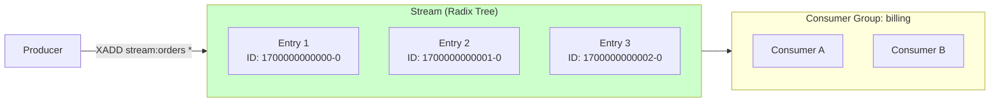

### Key Components
1.  **Stream**: An append-only log, identified by a key (e.g., `events:orders`).
2.  **Entry**: A message with:
    *   **ID**: Auto-generated timestamp-sequence (e.g., `1526985054069-0`).
    *   **Fields**: Key-value pairs (e.g., `amount=50, user=123`).
3.  **Consumer Group**: A named set of consumers that divide work (like Kafka consumer groups).
4.  **PEL (Pending Entries List)**: Tracks messages that have been delivered but not acknowledged.

---

## 3. How It Works: Entry IDs and Time

### The Entry ID Format
Every entry has a unique ID: `<millisecond-timestamp>-<sequence>`

**Example**: `1526985054069-0`
*   **Top Part**: Millisecond timestamp (1526985054069).
*   **Bottom Part**: Sequence number (0) for events in the same millisecond.

**Implication**: The ID *is* the time. You can query "Give me all events from 5 minutes ago" without indexing a separate timestamp field.

```
XRANGE events:pay 1526985000000 1526985054069  # Get events in time range
```

---

## 4. Deep Dive: Internal Implementation

### A. Why Radix Trees? (Memory Efficiency)

Redis Streams use **Radix Trees (Rax)** instead of linked lists for memory density.

#### Memory Comparison

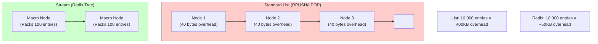

**Key Difference**: 
*   **List**: Each entry is a separate heap object with pointers (prev/next).
*   **Radix Tree**: Entries are serialized into contiguous memory blocks. Redis reads chunks, not individual nodes.
*   **Result**: Streams can hold **10x more data** in the same RAM.

### B. The Radix Tree Structure

The Radix Tree (Rax) is a **compressed prefix tree** that stores Entry IDs efficiently.

**Components**:
*   **Keys**: Entry IDs (e.g., `1700000000000-0`).
*   **Values**: Pointers to serialized field-value pairs.
*   **Compression**: Common prefixes are compressed (e.g., if 1000 entries start with `1700000000`, that prefix is stored once).

```c
// Simplified internal structure
typedef struct stream {
    rax *rax;           // Radix tree of entry IDs
    // ...
    streamCG *cgroups;  // Linked list of consumer groups
} stream;
```

#### Visual Example: How Prefix Compression Works

Let's say we have 5 entries with these IDs:
*   `1700000000000-0`
*   `1700000000001-0`
*   `1700000000002-0`
*   `1700000000003-0`
*   `1700000050000-0`

**Without Compression (Standard Tree)**:
Each entry stores the full ID → **5 × 17 bytes = 85 bytes** (just for keys).

**With Radix Tree Compression**:
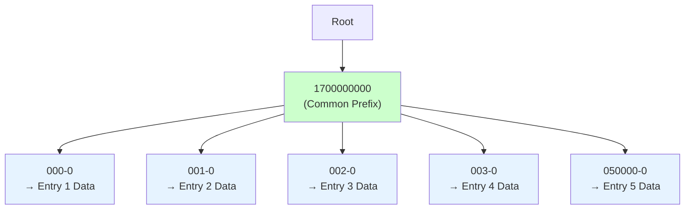

**Storage**:
*   **Common prefix** `1700000000` stored once: **10 bytes**.
*   **Suffixes**: `000-0`, `001-0`, `002-0`, `003-0`, `050000-0`: **5-6 bytes each**.
*   **Total**: ~10 + (5 × 6) = **40 bytes** (vs 85 bytes).

**Memory Savings**: ~53% reduction just on keys!

#### Real-World Impact

**Scenario**: 100,000 entries added in 1 second (same millisecond timestamp `1700000000000`).
*   **All share prefix**: `1700000000000-`
*   **Only suffix varies**: `-0`, `-1`, `-2`, ... `-99999`.

**Radix Tree Storage**:
*   Prefix stored once: 13 bytes.
*   100,000 unique suffixes: ~1-6 bytes each.
*   **Total Key Storage**: ~600KB (vs 1.7MB uncompressed).

This is why Streams can hold **10x more entries** than standard Redis Lists in the same RAM.

### C. Consumer Groups vs Kafka

#### Kafka: The "Offset" Model
*   **State**: Stored as a single integer (Offset 500).
*   **Meaning**: "I have processed everything up to 500."
*   **Weakness**: If Consumer A crashes at offset 502, the whole group is blocked or messages are lost.

**The Problem Explained**:

In Kafka, the consumer group tracks a **single committed offset** per partition. This creates a critical issue when a consumer crashes mid-processing.

**Scenario**:
1.  Consumer A fetches messages 500-509 (batch of 10).
2.  Consumer A processes messages 500, 501 successfully.
3.  Consumer A crashes while processing message 502.
4.  **Last committed offset**: 500 (because Consumer A never committed 501-509).

**What Happens Next?**

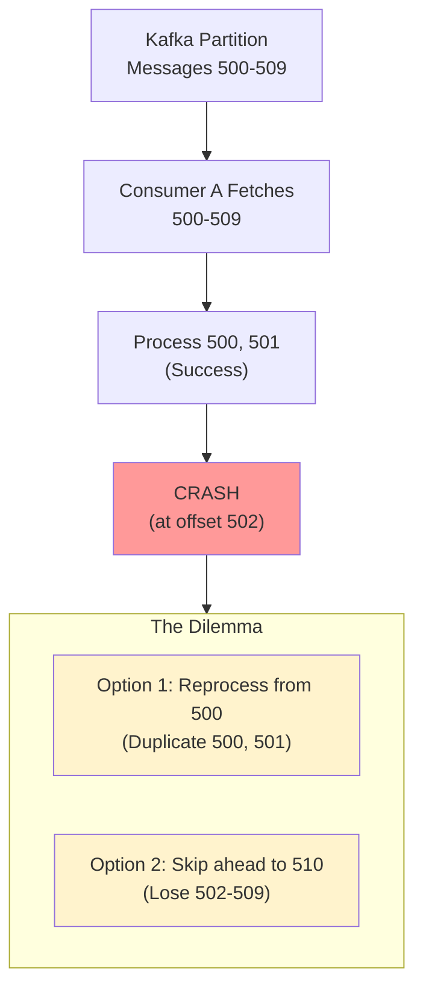

**The Two Bad Choices**:

1.  **Reprocess from last committed offset (500)**:
    *   Consumer B (or restarted A) reads from offset 500.
    *   Messages 500-501 are **duplicated** (processed twice).
    *   *Best Practice*: Use idempotent processing to handle duplicates.

2.  **Skip ahead (if using `enable.auto.commit=true` and it committed mid-batch)**:
    *   If auto-commit happened after fetching but before crash, offset might be 510.
    *   Messages 502-509 are **lost** (never processed).
    *   *This is data loss.*

**Why "Blocked"?**

If the partition is assigned exclusively to Consumer A (which crashed), and the consumer group waits for a rebalance timeout before reassigning, the partition sits idle during this window → throughput drops to zero for that partition.
*   **Weakness**: If Consumer A crashes at offset 502, the whole group is blocked or messages are lost.

### Redis Streams: The "PEL" (Pending Entries List) Model

**State**: Stored as a **discrete list of unacknowledged message IDs** for *each* consumer.
**Meaning**: "I have read IDs `[1700000000000-0, 1700000000001-0, 1700000000005-0]`, but I haven't ACKed them yet."
**Benefit**: Allows for **non-sequential processing** and **individual message re-delivery**.

##### How PEL Works (Detailed)

The PEL is a **per-consumer** data structure that tracks exactly which messages that consumer has received but not yet acknowledged.

**Internal Structure**:
```c
// Simplified C struct
typedef struct streamConsumer {
    robj *name;              // Consumer name ("consumer-A")
    mstime_t seen_time;      // Last activity timestamp
    rax *pel;                // Radix tree: entry_id -> pending_since_timestamp
} streamConsumer;
```

**Visual Representation**:

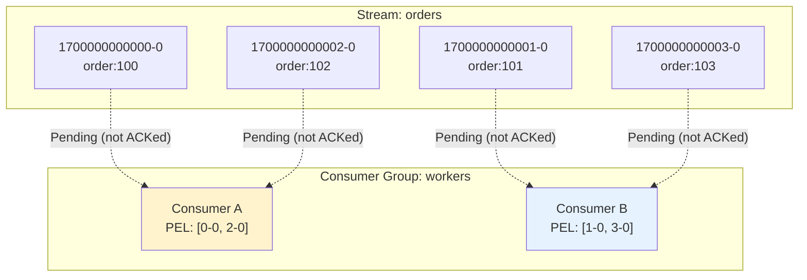

**State Transitions**:

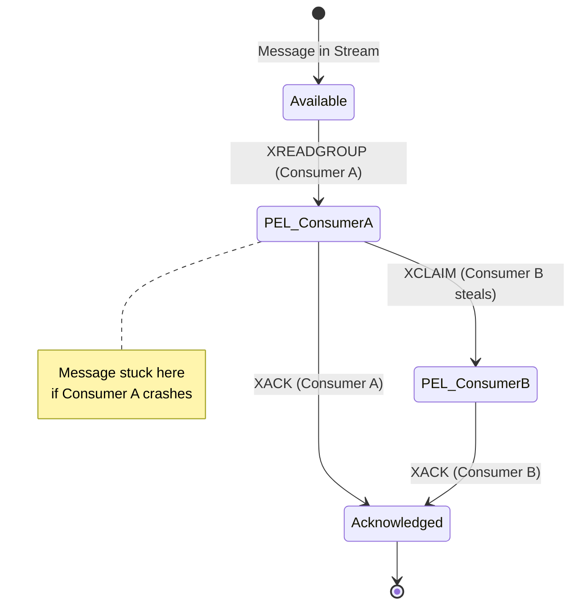

##### Concrete Example

**Scenario**: Processing orders with 2 consumers.

**Step 1: Initial State**
```bash
# Stream has 4 messages
XRANGE orders - +
1) "1700000000000-0" {"order_id": "100"}
2) "1700000000001-0" {"order_id": "101"}
3) "1700000000002-0" {"order_id": "102"}
4) "1700000000003-0" {"order_id": "103"}
```

**Step 2: Consumers Read**
```bash
# Consumer A reads
XREADGROUP GROUP workers consumer-A COUNT 2 STREAMS orders >
1) "1700000000000-0"  # order:100
2) "1700000000002-0"  # order:102

# Consumer B reads
XREADGROUP GROUP workers consumer-B COUNT 2 STREAMS orders >
1) "1700000000001-0"  # order:101
2) "1700000000003-0"  # order:103
```

**Step 3: PEL State (Internal)**
```
Consumer A PEL:
  1700000000000-0 -> pending_since: t0
  1700000000002-0 -> pending_since: t0

Consumer B PEL:
  1700000000001-0 -> pending_since: t0
  1700000000003-0 -> pending_since: t0
```

**Step 4: Consumer A Processes and ACKs**
```bash
# Consumer A finishes processing order:100
XACK orders workers 1700000000000-0
# Returns: (integer) 1

# Consumer A PEL now:
#   1700000000002-0 -> pending_since: t0  (still unacked)
```

**Step 5: Consumer A Crashes (order:102 stuck)**
```
Consumer A crashes before ACKing 1700000000002-0.

PEL State:
  Consumer A: [1700000000002-0]  <- STUCK (no consumer to process)
  Consumer B: [1700000000001-0, 1700000000003-0]
```

**Step 6: Recovery via XAUTOCLAIM**
```bash
# Consumer B claims Consumer A's stuck messages
XAUTOCLAIM orders workers consumer-B 60000 0-0 COUNT 10
# Returns messages pending > 60 seconds

# Result: Consumer B now owns 1700000000002-0
# PEL State:
#   Consumer A: []  (empty)
#   Consumer B: [1700000000001-0, 1700000000002-0, 1700000000003-0]
```

##### The Key Difference from Kafka

**Kafka Offset Model**:
```
Consumer A committed offset: 500
Meaning: "I processed 0-499"
Problem: If Consumer A crashes at 502, you must reprocess 500, 501 (duplicates)
```

**Redis Streams PEL Model**:
```
Consumer A PEL: [1700000000000-0, 1700000000005-0]
Meaning: "I have these 2 specific messages pending"
Benefit: Consumer B can claim ONLY those 2 messages (no duplicates for other messages)
```

**Visual Comparison**:

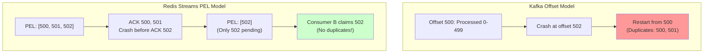

##### Performance Characteristics

**Memory Overhead**:
*   Each pending message: ~40 bytes (entry ID + timestamp + consumer pointer).
*   1000 pending messages per consumer = ~40KB.
*   **Trade-off**: More memory than Kafka offsets, but enables fine-grained recovery.

**Query Complexity**:
*   **Check PEL size**: `XPENDING orders workers` → O(1)
*   **List all pending**: `XPENDING orders workers - + COUNT 10` → O(N) where N = pending count
*   **Claim stuck messages**: `XAUTOCLAIM` → O(M) where M = messages claimed

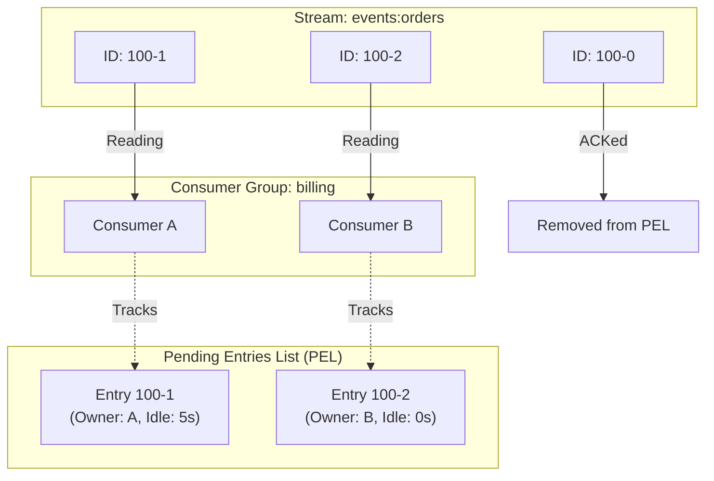

**PEL Structure**:
```c
typedef struct streamCG {
    streamID last_id;       // Last delivered ID
    rax *pel;               // Pending Entries List (ID -> nack info)
    rax *consumers;         // Consumer name -> streamConsumer
} streamCG;
```

---

## 5. End-to-End Walkthrough: Life of a Stream Event

Let's trace a payment event through the complete lifecycle.

### Step 1: Production (`XADD`)
*   **Publisher**: `XADD events:pay * amount 50 user 123`
*   **Redis**:
    1.  Generates ID `1700000000000-0` (current timestamp + sequence).
    2.  Serializes fields (`amount=50, user=123`) into a listpack.
    3.  Inserts into Radix Tree.
    *   **Complexity**: $O(\log N)$ where $N$ is number of entries.

```c
// Pseudo-code
raxInsert(stream->rax, id, serialized_entry, NULL);
```

### Step 2: Consumption (`XREADGROUP`)
*   **Consumer A**: `XREADGROUP GROUP billing ConsumerA COUNT 1 STREAMS events:pay >`
    *   The `>` means "Give me new messages I haven't seen."
*   **Redis**:
    1.  Looks up consumer group `billing`.
    2.  Finds next entry after `last_id` in the Radix Tree.
    3.  **Crucial Step**: Adds this ID to Consumer A's **PEL** with timestamp.
    4.  Returns the entry to Consumer A.
*   **State**: Message is now "delivered" but "unacknowledged".

```c
// Pseudo-code
raxInsert(group->pel, entry_id, nack_info, NULL);  // Add to PEL
consumerA->pel_count++;
```

### Step 3: Acknowledgment (`XACK`)
*   **Consumer A**: Successfully processes the payment.
*   **Action**: `XACK events:pay billing 1700000000000-0`
*   **Redis**:
    1.  Removes the ID from the PEL.
    2.  Decrements Consumer A's pending count.
*   **State**: Message is now complete.

```c
// Pseudo-code
raxRemove(group->pel, entry_id, NULL);  // Remove from PEL
consumerA->pel_count--;
```

---

## 6. Failure Scenarios (The Senior View)

### Scenario A: The Crashed Consumer (Stuck in PEL)
**Event**: Consumer A reads payment event (ID `170...0`) and crashes *before* sending XACK.

**Problem**:
*   The message sits in the PEL forever.
*   New consumers (Consumer B) asking for `>` will *never* see it because Redis thinks A is working on it.
*   **Symptom**: "Missing Data" or "Stuck Job".

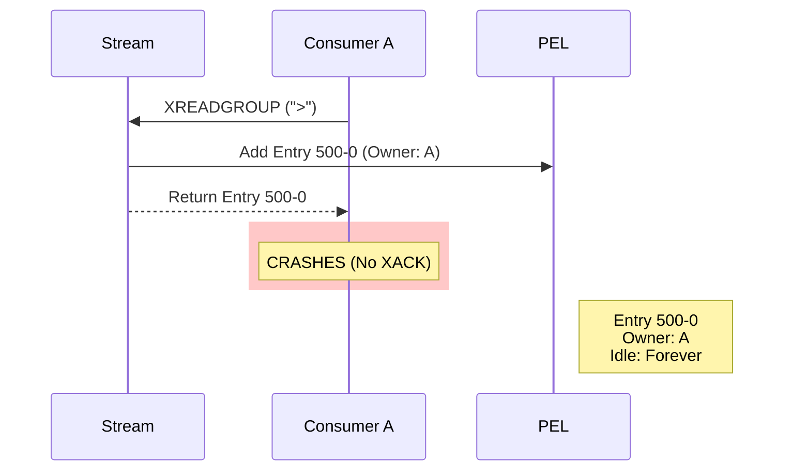

### Scenario B: Recovery (`XAUTOCLAIM`)

This is the equivalent of Kafka's Rebalance, but manual or polled.

**The Fix**: Running a "Garbage Collector" process.

1.  **Inspect**: `XPENDING events:pay billing`
    *   Shows: `"ID 170...0, Consumer: A, Idle: 60 minutes"`.

2.  **Claim**: `XAUTOCLAIM events:pay billing ConsumerB 30000 0-0 COUNT 10`
    *   **Logic**: "If any message has been idle for > 30s, change ownership to ME (Consumer B)."
    *   **COUNT 10**: Claim up to 10 messages at once.

3.  **Process**: Consumer B processes it and sends `XACK`.

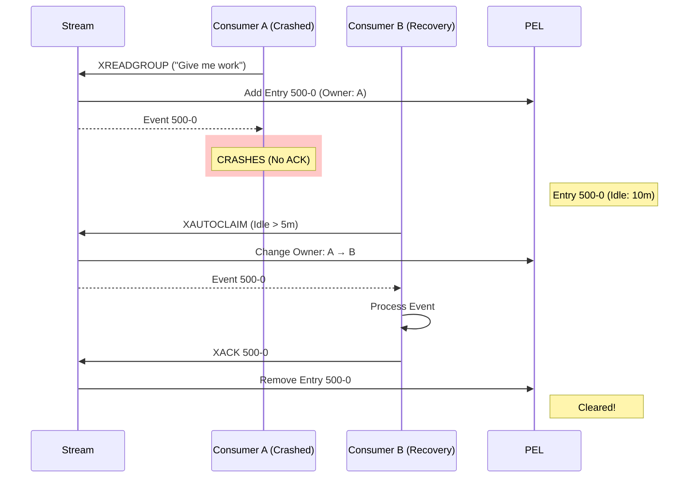

**Internal Mechanism**:
```c
// XAUTOCLAIM pseudo-logic
for each entry in PEL {
    if (entry.idle_time > min_idle_time) {
        entry.owner = new_consumer;
        entry.delivery_count++;
        entry.last_delivery_time = now();
        return entry;
    }
}
```

---

## 7. Scaling Considerations

### A. Partitioning (Sharding by Key)
Unlike Pub/Sub, Streams **DO** shard by key in Redis Cluster:
*   **Example**: `events:user:123` and `events:user:456` might be on different nodes.
*   **Benefit**: You can scale horizontally by adding more cluster nodes.

### B. Memory Management (The Capping Problem)
Streams grow indefinitely if not capped.

**Solution**: Use `MAXLEN` to cap stream size:
```
XADD events:pay MAXLEN ~ 1000000 * amount 50 user 123
```
*   **`~` (Approximate)**: Allows Redis to delete in chunks (more efficient than exact).
*   **`1000000`**: Keep approximately 1 million entries.

**Alternative**: `XTRIM` to trim old entries:
```
XTRIM events:pay MAXLEN ~ 1000000
```

---

## 8. Constraints & Comparison

### A. Replayability

**Redis Streams**: ✅ **YES** - Messages are stored in the stream and can be replayed.

**How It Works**:
```bash
# Consumer can re-read from any point in the stream
XREAD STREAMS orders 1700000000000-0  # Start from specific ID

# Consumer group can reset to beginning
XGROUP SETID orders workers 0-0  # Reset to start of stream
```

**Key Difference from Kafka**:
| Feature | Redis Streams | Kafka |
| :--- | :--- | :--- |
| **Replay Mechanism** | Reset consumer group ID or read from specific entry ID | Reset consumer offset |
| **Persistence** | RDB/AOF (disk snapshots) | Append-only log files (always on disk) |
| **Default Storage** | In-memory (can persist to disk) | On-disk by default |
| **Retention** | Manual (`XTRIM`, `MAXLEN`) | Time-based or size-based retention |

**Example: Replay Last 100 Messages**:
```bash
# Kafka: Reset offset and consume
kafka-consumer-groups --reset-offsets --to-offset -100 ...

# Redis Streams: Read from 100 messages ago
XREVRANGE orders + - COUNT 100  # Read last 100
XRANGE orders - + COUNT 100     # Read first 100
```

**Limitation**: Redis Streams replayability depends on:
1.  **Memory availability**: Stream must fit in RAM (unless persistence enabled).
2.  **Manual trimming**: Old messages deleted if `MAXLEN` or `XTRIM` used.

---

### B. Redundancy & Replication

**Kafka**: ✅ Default **3x replication** (configurable via `replication.factor=3`)

**Architecture**:
```
Topic: orders (3 partitions, replication.factor=3)
Partition 0: Node 1 (Leader), Node 2 (Follower), Node 3 (Follower)
Partition 1: Node 2 (Leader), Node 1 (Follower), Node 3 (Follower)
Partition 2: Node 3 (Leader), Node 1 (Follower), Node 2 (Follower)
```

**Result**: If any 1 node dies, data is still available on 2 other nodes.

---

**Redis Streams**: ⚠️ **NO built-in multi-node replication for Streams**

**Redis Replication Model**:
*   **Master-Replica**: One master, multiple read replicas.
*   **Replication**: Async (eventual consistency).
*   **Failover**: Manual or via Redis Sentinel/Cluster.

**The Problem**:
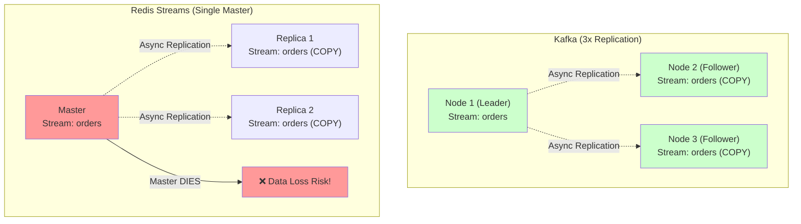

**Kafka**: If Node 1 (Leader) dies → Node 2 automatically becomes leader (ISR failover). **No data loss** (writes confirmed by all replicas).

**Redis Streams**: If Master dies → Must manually promote replica (or use Sentinel). **Potential data loss** if replication lag exists (async).

---

### C. Detailed Comparison Table (Cluster to Cluster)

| Feature | Redis Streams (Redis Cluster) | Apache Kafka (Kafka Cluster) | RabbitMQ (Cluster) |
| :--- | :--- | :--- | :--- |
| **Primary Goal** | Ultra-low latency (sub-ms) | Reliability and High Throughput | Flexible routing, Work distribution |
| **Storage Medium** | RAM (Expensive at scale) | Disk (Cheap at scale) | RAM/Disk hybrid |
| **Max Capacity** | **Gigabytes** (RAM-limited) | **Terabytes / Petabytes** (Disk-limited) | **Gigabytes to Terabytes** |
| **Data Retention** | Short-term (Hours/Days) | Long-term (Years) | Short-term (Hours/Days) |
| **Complexity** | **Low** (if you already use Redis) | **High** (requires dedicated ops team) | **Medium** (Erlang VM management) |
| **Replayability** | ✅ Yes (manual reset) | ✅ Yes (offset reset) | ❌ No (messages deleted) |
| **Replication** | ⚠️ Master-Replica (async) | ✅ Multi-node ISR (sync) | ✅ Quorum Queues (Raft) |
| **Data Loss Risk** | ⚠️ High (if AOF disabled) | ✅ Low (3x replication) | ⚠️ Medium (depends on config) |
| **Throughput (Cluster)** | ~1M msgs/sec per node | ~10M msgs/sec (multi-partition) | ~50k msgs/sec |
| **Latency** | ~1ms (in-memory) | ~10ms (disk write + replication) | ~1-5ms |
| **Persistence** | RDB/AOF snapshots | Always-on commit log | Durable queues (optional) |
| **Consumer Groups** | ✅ Yes (PEL-based) | ✅ Yes (Offset-based) | ❌ No (work queue pattern) |
| **Ordering Guarantee** | Per-stream (single key) | Per-partition | No ordering |
| **Max Message Size** | 512 MB (Redis limit) | 1 MB default (configurable) | 128 MB default |
| **Retention Policy** | Manual (`MAXLEN`, `XTRIM`) | Time/size-based (automatic) | TTL-based (manual) |
| **Horizontal Scaling** | Shard by key (Redis Cluster) | Partition-based (automatic) | Queue sharding (manual) |
| **Operational Cost** | **High** (RAM expensive) | **Low** (Disk cheap) | **Medium** |
| **Best For** | Real-time jobs, low latency | Event sourcing, data lakes | Complex routing, RPC |

---

#### **Verdict**

**Redis Streams (Redis Cluster)** is preferred for:
- ✅ Lightweight microservices requiring sub-millisecond latency
- ✅ Real-time use cases: chat, gaming, leaderboards, cache invalidation
- ✅ Workloads where the entire dataset fits in RAM (typically < 100GB)
- ✅ Simple deployments (if Redis is already in your stack)

**Apache Kafka (Kafka Cluster)** remains the "backbone" for:
- ✅ Enterprise data pipelines where **data loss is not an option**
- ✅ Event sourcing and audit logs requiring **long-term retention** (years)
- ✅ Massive volumes (Terabytes/Petabytes) that don't fit in RAM
- ✅ Multi-datacenter replication (MirrorMaker 2)
- ✅ Integration with data lakes (S3, Hadoop, Spark)

**Use Both** (Hybrid):
- Write to Redis Streams for hot data (recent 1 hour)
- Stream to Kafka for cold storage and analytics (7+ days)
- Result: Low latency + Durability

---

---

### D. Hybrid Approach (Best of Both Worlds)

Many production systems use **both** Redis Streams and Kafka:

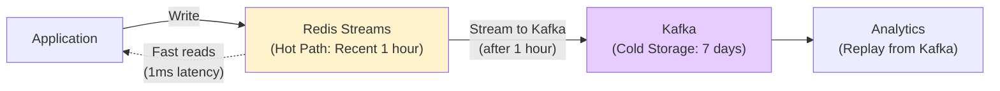

**Strategy**:
1.  **Write to Redis Streams** (low latency, in-memory).
2.  **Background job** reads from Redis, writes to Kafka (durability).
3.  **Trim Redis** after 1 hour (`XTRIM MAXLEN 100000`).
4.  **Kafka** retains 7 days for analytics replay.

**Result**: Low latency (Redis) + Durability (Kafka).

---

## 9. When to Use Redis Streams?

| Use Case | Verdict | Why? |
| :--- | :--- | :--- |
| **Job Queues** | **YES** | Better than RPUSH/LPOP due to Consumer Groups and ACKs. |
| **Event Sourcing (Small Scale)** | **YES** | If total events fit in RAM (< 100GB). |
| **Real-time ML Feature Updates** | **YES** | Fast in-memory reads for feature stores. |
| **Large-Scale Event Sourcing** | **NO** | Use Kafka. Redis can't handle TB-scale logs. |
| **Financial Transactions** | **MAYBE** | Enable AOF for durability, but Kafka is safer. |

---

## 10. Production Checklist

1.  [ ] **Capping**: Always use `XADD ... MAXLEN ~ 1000000` to prevent infinite memory growth (OOM).
2.  [ ] **Recovery Sidecar**: Implement a process that runs `XAUTOCLAIM` every 30s to clean up dead consumers.
3.  [ ] **Persistence**: Enable AOF (`appendonly yes`) if data loss on restart is unacceptable.
4.  [ ] **Monitor PEL Size**: Use `XPENDING` to check if PEL is growing (indicates stuck consumers).
5.  [ ] **Consumer Naming**: Use unique consumer names (e.g., `hostname-pid`) to avoid conflicts.
6.  [ ] **Idempotency**: Design consumers to handle duplicate processing (PEL reclaim can cause re-delivery).
