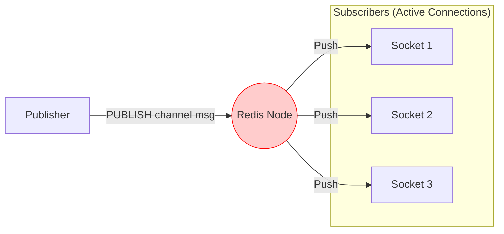
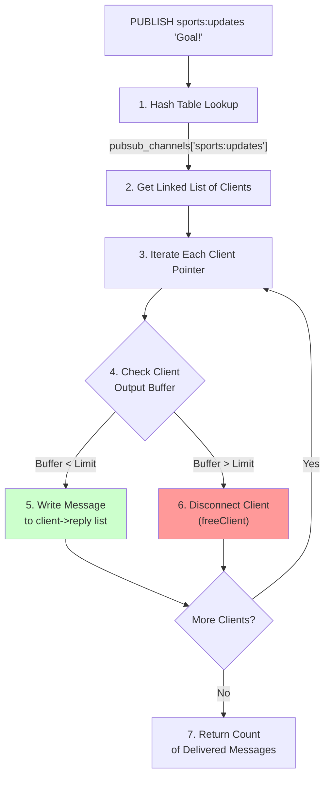
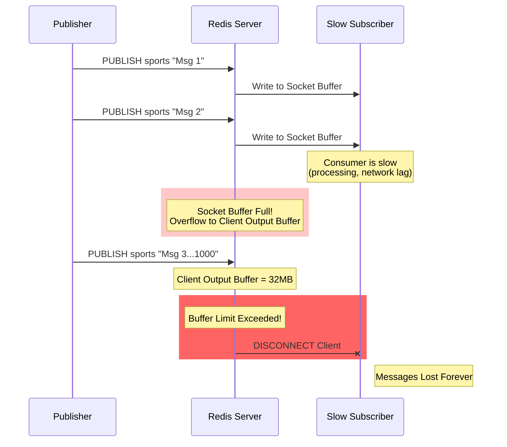
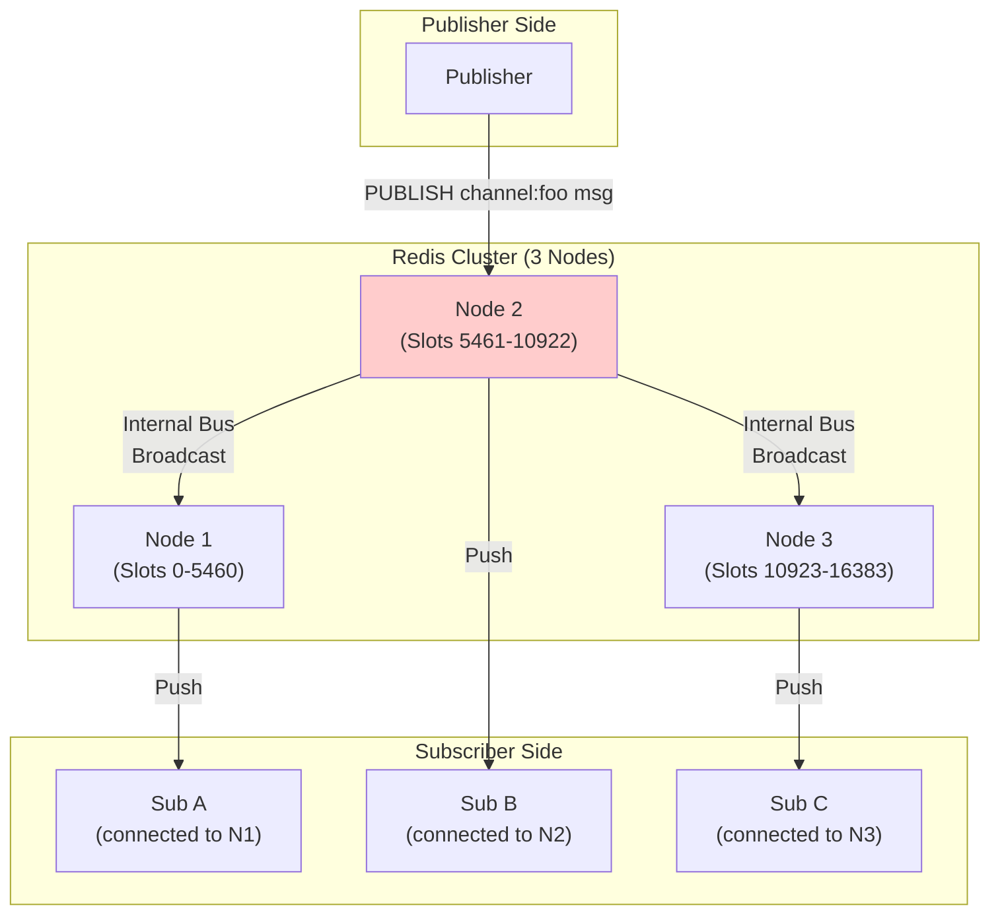

# 07. Redis Pub/Sub: The Fire-and-Forget Broker

## 1. Introduction
Redis Pub/Sub is an extremely lightweight, real-time messaging pattern built into the Redis key-value store. Unlike RabbitMQ (Reliable Queuing) or Kafka (Durable Streaming), Redis Pub/Sub is designed for **maximum speed** with **lowest latency**, sacrificing durability entirely.

It follows the **"Fire and Forget"** paradigm: if no one is listening when a message is published, the message is lost forever.

---

## 2. Core Architecture

Redis Pub/Sub acts as a direct signal router.



### Key Components
1.  **Channel**: A named "frequency" (e.g., `sports:updates`). Channels are not stored; they are just routing keys.
2.  **Publisher**: Sends a message to a channel. It gets an immediate integer reply indicating how many clients received it.
3.  **Subscriber**: A client that holds a blocking connection to Redis, listening for pushes.

---

## 3. How It Works: Basic Mechanics

### A. No Persistence (Fire-and-Forget)
Redis does **NOT** queue Pub/Sub messages.
*   **Mechanism**: When a `PUBLISH` command runs, Redis looks up the linked list of active socket connections for that channel.
*   **Action**: It writes the message to the socket buffers of all subscribers immediately.
*   **Drop**: If a subscriber's socket buffer is full (slow consumer), Redis will disconnect that subscriber to protect itself. The message is dropped.

### B. Pattern Matching
Redis supports glob-style pattern matching.
*   **Command**: `PSUBSCRIBE news:*`
*   **Behavior**: Subscribes to `news:politics`, `news:sports`, etc.
*   **Cost**: Pattern matching requires scanning the list of patterns for every message, which is $O(N)$ where $N$ is the number of active patterns.

---

## 4. Deep Dive: Internal Implementation (C-Level)

This is how Redis implements Pub/Sub at the source code level.

### A. Channel Subscription Tracking
Redis uses a **Hash Table** (not a sorted set or queue):

```c
// Simplified internal structure (from server.h)
dict *pubsub_channels;  // Hash table of channels
// Key: channel name (e.g., "notifications")
// Value: linked list of client pointers
```

**Structure**:
*   **Key**: Channel name string (e.g., `"sports:updates"`).
*   **Value**: A **linked list** of client connection pointers currently subscribed to this channel.

### B. Client Output Buffer (Per Connection)
For each subscriber, Redis maintains:

```c
typedef struct client {
    int fd;                    // Socket file descriptor
    sds querybuf;             // Input buffer
    list *reply;              // Output buffer (linked list of strings)
    unsigned long long reply_bytes; // Total bytes in output buffer
    // Buffer limits
    clientBufferLimitsConfig obuf_limits;
} client;
```

**Not a Fixed Deque**: The output buffer is a **dynamically sized linked list** of reply objects.

### C. The Complete Message Distribution Flow



**Step-by-Step Internals**:
1.  **Hash Lookup**: `dictFind(pubsub_channels, "sports:updates")` → Returns linked list.
2.  **Iterate Clients**: Walk the linked list (each node is a `client*` pointer).
3.  **Buffer Check**: For each client, check `client->reply_bytes` against `client->obuf_limits`.
4.  **Write to Buffer**:
    *   If buffer is under limit: `addReply(client, message)` → Appends to `client->reply` linked list.
    *   If buffer exceeds **hard limit** (32MB): Call `freeClient()` immediately.
    *   If buffer exceeds **soft limit** (8MB for 60s): Start timer, disconnect if sustained.
5.  **Socket Write**: Later, the event loop (`aeMain`) calls `writeToClient()` to flush `client->reply` to the actual TCP socket.
6.  **Return**: The `PUBLISH` command returns the integer count of how many clients received it.

### D. Pattern Subscriptions Implementation
Separately maintained in:

```c
dict *pubsub_patterns;  // Another hash table
// Key: pattern string (e.g., "news:*")
// Value: linked list of clients
```

**On `PUBLISH`**:
1.  Check exact channel match in `pubsub_channels`.
2.  **Also** iterate *all* patterns in `pubsub_patterns` and check if the channel matches (e.g., `"sports:updates"` matches `"sports:*"`).
3.  Cost: $O(P)$ where $P$ is the number of active patterns (can be slow if many patterns exist).

### E. Cleanup on Disconnect
When a client disconnects (graceful or forced):
1.  **Remove from All Channels**: Iterate `pubsub_channels`, remove client pointer from linked lists.
2.  **Free Output Buffer**: Deallocate `client->reply` list.
3.  **No ZSet to Delete**: There are no sorted sets. Just pointer removal from linked lists.

---

## 5. Message Bursts and Buffer Management

Redis maintains a **Client Output Buffer** for every connected client. When messages arrive faster than consumers can read them, this buffer fills up.

### The Buffer Problem

#### The Mechanics
1.  **Publisher Sends**: `PUBLISH sports:updates "Goal!"`
2.  **Redis Writes to Socket Buffers**: For each subscriber, Redis attempts to write the message to the OS socket buffer.
3.  **Slow Consumer**: If Subscriber A is slow (network lag, CPU bound), the OS socket buffer fills up.
4.  **Client Output Buffer**: Redis keeps a **secondary buffer** in its own memory to queue messages waiting to be written to the socket.
5.  **Buffer Limit Exceeded**: If this buffer exceeds the configured limit, Redis **disconnects** the client.



### Configuration: `client-output-buffer-limit`
The limit is set in `redis.conf`:
```
client-output-buffer-limit pubsub 32mb 8mb 60
```
**Meaning**:
*   **Hard Limit**: 32MB. If buffer reaches 32MB, disconnect immediately.
*   **Soft Limit**: 8MB for 60 seconds. If buffer stays above 8MB for 60s, disconnect.
*   **Protection**: This prevents one slow subscriber from consuming all Redis memory.

---

## 6. Scaling Challenges: Why Redis Cluster Pub/Sub Doesn't Scale

### The Architecture Problem
Redis Cluster shards **data** (keys) but **broadcasts** Pub/Sub messages.



### The Scaling Bottleneck
1.  **No Slot Hashing**: Unlike `GET/SET` which hash the key to a specific node, Pub/Sub channels are NOT assigned to slots.
2.  **Full Broadcast**: When you `PUBLISH` to Node 2, it must forward the message to Node 1 and Node 3, because:
    *   Subscriber A might be listening on Node 1.
    *   Subscriber C might be listening on Node 3.
3.  **The Problem**: In a 100-node cluster:
    *   Every `PUBLISH` generates **99 internal network packets** (1 to every other node).
    *   **Network Traffic** grows as $O(N^2)$ where $N$ is the number of nodes.
    *   **CPU Cost**: Every node must scan its subscriber list for every broadcast.

### Why This Happens
Redis Cluster was designed for **data partitioning**, not messaging. The Pub/Sub system predates clustering and was never refactored to use slot-based routing.

**Key Architecture Note**: The "Cluster Bus" (gossip protocol on port 16379) handles metadata, but Pub/Sub broadcast uses a separate mechanism that floods all nodes.

### When Redis Cluster Is NOT Infinitely Scalable
| Workload Type | Scalability | Reason |
| :--- | :--- | :--- |
| **GET/SET (Data)** | ✅ Linear | Keys are hashed to specific nodes. Adding nodes spreads load. |
| **Pub/Sub (Messages)** | ❌ Sub-Linear | All nodes receive all messages. Network becomes bottleneck. |
| **Lua Scripts** | ⚠️ Limited | Script must run on node holding all keys. Multi-key scripts don't scale. |

**Production Implication**: If you need Pub/Sub at scale (1M+ messages/sec), use Redis Streams (which DO shard by stream key) or an external broker like Kafka.

---

## 7. Constraints & Limitations

| Constraint | Limit | Why? |
| :--- | :--- | :--- |
| **Durability** | **Zero** | If a subscriber disconnects for 1ms, they miss messages sent during that ms. |
| **Delivery Guarantee** | At-Most-Once | No ACKs. No Retries. |
| **Buffer Limit** | ~32MB (Configurable) | If a consumer is slow, Redis kills the connection (`client-output-buffer-limit`). |
| **Cluster Traffic** | High | Pub/Sub generates massive internal bus traffic in sharded clusters. |

---

## 8. When to Use Redis Pub/Sub?

| Use Case | Verdict | Why? |
| :--- | :--- | :--- |
| **Live Chat / WebSocket** | **YES** | You need to route a "User Typing..." event to a specific websocket server. Speed > Reliability. |
| **Real-time Metrics** | **YES** | Broadcasting "CPU is 99%" to a dashboard. If you miss one tick, it's fine. |
| **Job Queues** | **NO** | Use Redis Lists (RPUSH/LPOP) or streams. Pub/Sub loses jobs. |
| **Order Processing** | **NO** | Never use for financial/critical data. |

**Alternative**: If you need Pub/Sub but with persistence and consumer groups, use **Redis Streams** (introduced in Redis 5.0). It behaves like a mini-Kafka.

---

## 9. Production Checklist

1.  [ ] **Check Buffer Limits**: Tune `client-output-buffer-limit pubsub` in `redis.conf` to prevent disconnecting slow clients.
2.  [ ] **Use Dedicated Connection**: Do not reuse a Pub/Sub connection for `GET/SET`. A subscriber connection is in a special "blocked" state.
3.  [ ] **Avoid Patterns**: Use exact channel names (`SUBSCRIBE`) instead of patterns (`PSUBSCRIBE`) for high-throughput systems.
4.  [ ] **Monitor `rejected_connections`**: If Redis is killing clients, your consumers are too slow.
