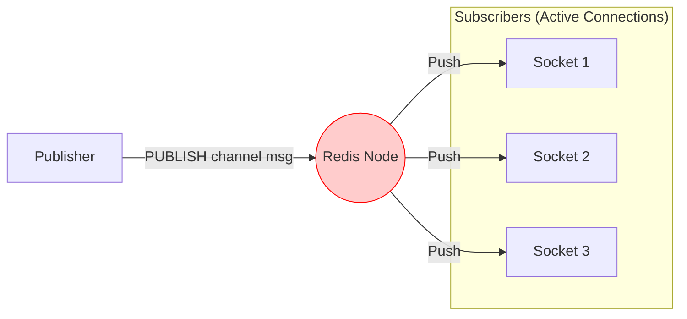

# 07. Redis Pub/Sub: The Fire-and-Forget Broker

## 1. Introduction
Redis Pub/Sub is an extremely lightweight, real-time messaging pattern built into the Redis key-value store. Unlike RabbitMQ (Reliable Queuing) or Kafka (Durable Streaming), Redis Pub/Sub is designed for **maximum speed** with **lowest latency**, sacrificing durability entirely.

It follows the **"Fire and Forget"** paradigm: if no one is listening when a message is published, the message is lost forever.

---

## 2. Core Architecture

Redis Pub/Sub acts as a direct signal router.

### Key Components
1.  **Channel**: A named "frequency" (e.g., `sports:updates`). Channels are not stored; they are just routing keys.
2.  **Publisher**: Sends a message to a channel. It gets an immediate integer reply indicating how many clients received it.
3.  **Subscriber**: A client that holds a blocking connection to Redis, listening for pushes.

---

## 3. Internal Mechanics

### A. No Persistence
Redis does **NOT** queue Pub/Sub messages.
*   **Mechanism**: When a `PUBLISH` command runs, Redis looks up the linked list of active socket connections for that channel.
*   **Action**: It writes the message to the socket buffers of all subscribers immediately.
*   **Drop**: If a subscriber's socket buffer is full (slow consumer), Redis will disconnect that subscriber to protect itself. The message is dropped.

### B. Pattern Matching
Redis supports glob-style pattern matching.
*   **Command**: `PSUBSCRIBE news:*`
*   **Behavior**: Subscribes to `news:politics`, `news:sports`, etc.
*   **Cost**: Pattern matching requires scanning the list of patterns for every message, which is $O(N)$ where $N$ is the number of active patterns.

---

## 4. Scaling Redis Pub/Sub

### A. Redis Cluster (The Sharding Problem)
Pub/Sub scales poorly in Redis Cluster mode.
*   **Behavior**: Redis does **not** hash the channel name to a specific slot.
*   **Broadcast**: Every `PUBLISH` to *any* node in the cluster is automatically broadcast to **all other nodes** in the cluster.
    *   *Why?*: Because a subscriber for channel `foo` might be connected to Node A, but the publisher published to Node B.
*   **Impact**: In a 100-node cluster, every message generates 99 internal network packets. Throughput does not scale linearly.

### B. Redis Streams (The Alternative)
If you need Pub/Sub but with persistence and consumer groups, use **Redis Streams** (introduced in Redis 5.0). It behaves like a mini-Kafka.

---

## 5. Constraints & Limitations

| Constraint | Limit | Why? |
| :--- | :--- | :--- |
| **Durability** | **Zero** | If a subscriber disconnects for 1ms, they miss messages sent during that ms. |
| **Delivery Guarantee** | At-Most-Once | No ACKs. No Retries. |
| **Buffer Limit** | ~32MB (Configurable) | If a consumer is slow, Redis kills the connection (`client-output-buffer-limit`). |
| **Cluster Traffic** | High | Pub/Sub generates massive internal bus traffic in sharded clusters. |

---

## 6. When to Use Redis Pub/Sub?

| Use Case | Verdict | Why? |
| :--- | :--- | :--- |
| **Live Chat / WebSocket** | **YES** | You need to route a "User Typing..." event to a specific websocket server. Speed > Reliability. |
| **Real-time Metrics** | **YES** | Broadcasting "CPU is 99%" to a dashboard. If you miss one tick, it's fine. |
| **Job Queues** | **NO** | Use Redis Lists (RPUSH/LPOP) or streams. Pub/Sub loses jobs. |
| **Order Processing** | **NO** | Never use for financial/critical data. |

---

## 7. Production Checklist

1.  [ ] **Check Buffer Limits**: Tune `client-output-buffer-limit pubsub` in `redis.conf` to prevent disconnecting slow clients.
2.  [ ] **Use Dedicated Connection**: Do not reuse a Pub/Sub connection for `GET/SET`. A subscriber connection is in a special "blocked" state.
3.  [ ] **Avoid Patterns**: Use exact channel names (`SUBSCRIBE`) instead of patterns (`PSUBSCRIBE`) for high-throughput systems.
4.  [ ] **Monitor `rejected_connections`**: If Redis is killing clients, your consumers are too slow.
