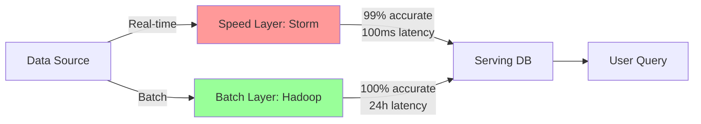
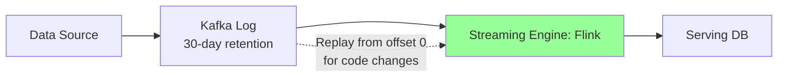
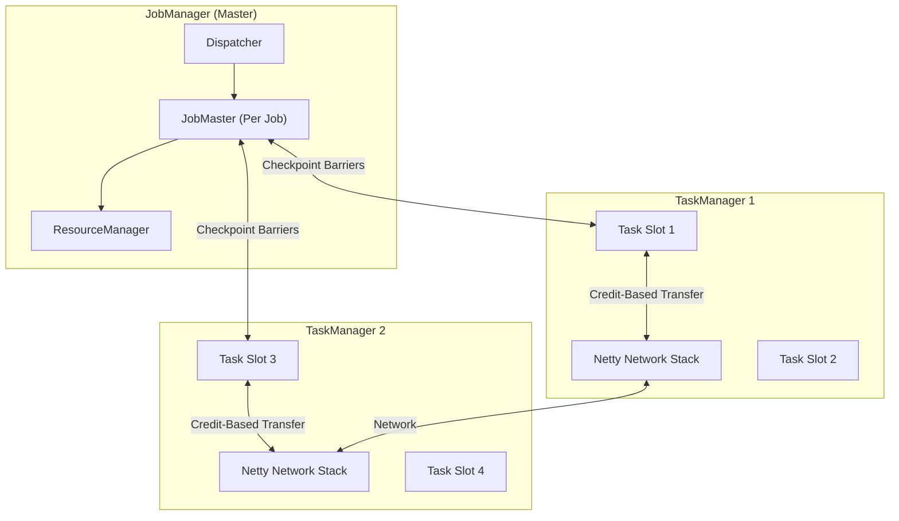
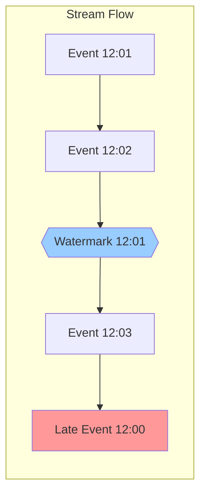
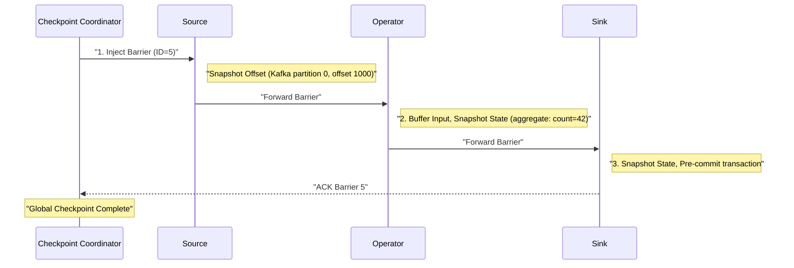
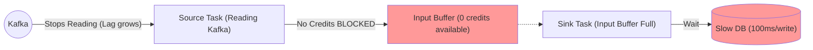
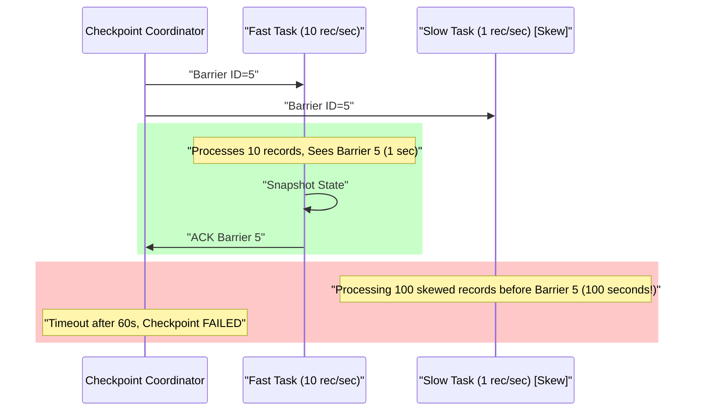

# Apache Flink: Stream Processing with Exactly-Once Guarantees

## 1. Introduction

**Apache Flink** is an open-source, distributed stream processing framework designed for **stateful computations over unbounded and bounded data streams**. Unlike Spark (batch-first with streaming as an afterthought), Flink is **stream-native from the ground up**, treating batch as a special case of streaming.

### The Problem: Batch is Too Slow

**Real-Time Requirements** emerged across industries:
- **Fraud detection**: Catch fraudulent transactions within milliseconds, not hours
- **Recommendations**: Update user profiles based on clicks in real-time
- **Monitoring**: Alert on anomalies within seconds of occurrence
- **Pricing**: Adjust ride-sharing prices based on current demand

**Batch Processing Limitations**:
- **Latency**: Hadoop jobs take minutes to hours
- **Freshness**: Data is stale by the time results arrive
- **Use Case Mismatch**: Event-driven applications need continuous processing

### The Evolution: From Unreliable to Exactly-Once

The history of stream processing is defined by one challenge: **Correctness under failure**.

---

### Generation 1: Apache Storm (2011) - Speed Without Guarantees

**Nathan Marz at Twitter** created the first widely-adopted stream processor.

**Architecture**:
- **Spouts**: Data sources
- **Bolts**: Processing operators
- **Topology**: DAG of spouts and bolts

**Key Limitation**: **At-least-once** processing only
- On failure, replay records from source
- No state checkpointing
- Result: Duplicate processing, incorrect aggregations

**The Lambda Architecture Hack** (2011-2014):
Because Storm couldn't guarantee correctness, teams ran **two pipelines**:



**The Problem**: Violates DRY (Don't Repeat Yourself)
1. **Logic Divergence**: Write `calculate_revenue()` twice (Java for Storm, SQL for Hive)
2. **Operational Nightmare**: Maintain two clusters, two failure modes
3. **Eventually Consistent**: Speed layer gradually corrected by batch layer

**Why It Failed**:
- Teams spent 60% of time reconciling differences between layers
- Bugs in one layer often missed in the other
- Complexity killed agility

---

### Generation 2: Spark Streaming (2013) - Micro-Batch Compromise

**Berkeley AMPLab** added streaming to Spark via **micro-batching**.

**Mechanism**: Chop stream into tiny batches (e.g., 500ms), run batch job on each

**Advantages**:
- **Exactly-once**: Each micro-batch is transactional
- **Unified API**: Same code for batch and streaming
- **Leverage Spark**: Reuse batch infrastructure

**Fatal Flaw: Latency Floor**
```
Latency >= Micro-batch interval + Scheduler overhead
Typical: 500ms + 500ms = 1 second minimum
```

**Why It's Not True Streaming**:
- Must wait for entire micro-batch to complete before processing
- Scheduler overhead dominates at small batch sizes
- Backpressure is reactive (slow down source after memory fills)

**Use Cases Where It's Acceptable**:
- Simple ETL (5-second latency OK)
- Aggregations over windows (e.g., "count clicks per 5 minutes")
- Analytics dashboards

**Use Cases Where It Fails**:
- Fraud detection (need <100ms)
- Alerting (need real-time)
- CEP (complex event patterns require stateful processing)

---

### Generation 3: Apache Flink (2014) - True Streaming Solution

**TU Berlin's Stratosphere Project** (2010-2014) became Apache Flink.

**Core Innovations**:

**1. True Streaming** (not micro-batch)
- Long-running operators passing messages
- Latency: 1-100ms (network overhead only)
- No scheduler delay

**2. Exactly-Once via Chandy-Lamport Snapshots**
- Distributed snapshots without stopping data flow
- State checkpointed to durable storage (S3, HDFS)
- Failure recovery: Restore from last checkpoint

**3. Advanced State Management**
- Embedded RocksDB for TB-scale state per operator
- Queryable state (external systems can query running job)
- Incremental checkpoints (only save deltas)

**4. Event-Time Processing**
- **Watermarks**: Track progress of event time
- Out-of-order handling: Buffer late events
- Correct results despite network delays

**5. Credit-Based Backpressure**
- Receivers advertise available buffer space ("credits")
- Senders only send when credits available
- Natural flow control (no reactive throttling)

---

### The Kappa Architecture: Streaming Unification

Flink (+ Kafka's log retention) enabled **Kappa Architecture**:

**Premise**: "The batch layer is redundant if the stream layer is correct."



**How It Works**:
1. **Normal Operation**: Process stream in real-time
2. **Code Change**: Deploy new version, replay Kafka from beginning
3. **Result**: Single codebase, single cluster, 100% accuracy

**Why Kafka is Critical**:
- 30-day retention = "replayable batch"
- Offset tracking = "bookmark" for where you are
- Partitioning = parallelism

---

### Why Flink Won

| Aspect | Storm | Spark Streaming | Flink |
|:-------|:------|:----------------|:------|
| **Guarantees** | At-least-once | Exactly-once (micro-batch) | Exactly-once (true streaming) |
| **Latency** | 10-100ms | 500ms-5s | 1-100ms |
| **State** | None (external only) | Limited (in-memory) | Advanced (RocksDB, TB-scale) |
| **Backpressure** | Manual throttling | Reactive | Credit-based (proactive) |
| **Event Time** | Not supported | Added later | Native from start |
| **Complexity** | Low (simple API) | Medium (batch API) | High (powerful but steep learning curve) |
| **Use Case** | Deprecated | Simple ETL | Mission-critical streaming |

---

### Problem It Solves

- **True stream processing**: Sub-second latency (1-100ms) vs Spark's micro-batching (500ms-5s)
- **Exactly-once guarantees**: Even for external systems (databases, Kafka) via 2-phase commit
- **Advanced state management**: TB-scale stateful operations with RocksDB
- **Event-time processing**: Correct results despite out-of-order events via watermarks
- **Complex event processing (CEP)**: Pattern matching across event streams

### Key Differentiator

Flink's **Chandy-Lamport distributed snapshots** enable exactly-once processing without sacrificing throughput. The **credit-based backpressure** system prevents memory explosions, and **unaligned checkpoints** allow sub-second checkpoint completion even under heavy load.

### Industry Adoption

- **Alibaba**: Processes 4+ trillion events/day for real-time recommendations
- **Uber**: Real-time pricing, fraud detection, trip monitoring
- **Netflix**: Real-time quality-of-experience monitoring
- **LinkedIn**: Metrics computation, abuse detection
- **ByteDance (TikTok)**: Real-time content recommendation
- **Airbnb**: Real-time pricing and fraud detection

### Historical Timeline

- **2010**: Stratosphere research project begins at TU Berlin
- **2014**: Apache incubation as "Flink"
- **2015**: Top-level Apache project
- **2016**: Flink 1.0 - Core APIs stabilized
- **2017**: Queryable state, incremental checkpoints
- **2019**: Flink 1.9 - Fine-grained recovery
- **2020**: Flink 1.10 - Python support (PyFlink)
- **2022**: Flink 1.15 - Unified batch/streaming
- **2024**: Flink 1.18+ - Adaptive scheduler, speculative execution

### Current Version Features (Flink 1.18+)

- **Adaptive batch scheduler**: Dynamic resource allocation for batch jobs
- **Fine-grained resource management**: Per-operator memory/CPU limits
- **Speculative execution**: Retry slow tasks on different workers
- **PyFlink maturity**: Production-ready Python API
- **Kubernetes-native**: First-class K8s integration

---

## 2. Core Architecture

Flink follows a **master-worker** architecture with a unique "Trinity" structure for job management.



### Key Components

**1. JobManager Trinity (Control Plane)**:

**Dispatcher**:
- REST API entry point (`http://jobmanager:8081`)
- Accepts job submissions
- Spins up dedicated JobMaster per job
- Manages job lifecycle (start, cancel, stop)

**JobMaster** (Per-job brain):
- **Checkpoint Coordinator**: Triggers distributed snapshots every N seconds
- Execution graph management
- Failure recovery coordination
- **Debug Note**: Checkpoint failures? Check JobMaster logs, not Dispatcher

**ResourceManager**:
- Infrastructure liaison (talks to Kubernetes, YARN, Mesos)
- Requests/releases TaskManager containers
- Doesn't understand jobs, only resources (CPU, RAM)

**2. TaskManager (Data Plane)**:

**Task Slots**:
- Fixed resource allocation (e.g., 4GB RAM, 2 CPU cores)
- Unlike Spark executors (shared heap), Flink slots have clear boundaries
- Multiple tasks can run in one slot via **operator chaining**

**Network Stack (Netty)**:
- **Credit-based flow control**: Downstream grants "credits" (buffer space) to upstream
- Prevents buffer overflow and OOM
- 32KB buffer size (default)

**3. State Backend (RocksDB)**:
- Embedded LSM-tree database
- **Off-heap**: Lives outside JVM to avoid GC pauses
- **Disk-backed**: Can hold TB-scale state on SSD
- **Incremental checkpoints**: Only snapshot changed data

---

## 3. How It Works: Time, State, and Watermarks

### A. Event Time vs Processing Time

**Challenge**: Events arrive out-of-order

```
Real-world timeline:
  User in Tokyo tunnel: Generates event at 12:00
  Network delay: Event arrives at Flink at 12:05
  
Processing time: 12:05 (when Flink sees it)
Event time: 12:00 (when it actually happened)
```

**Flink's Solution: Watermarks**

A watermark `W(T)` is a guarantee: **"No events older than T will arrive"**



**Watermark Example**:

```java
// Java
WatermarkStrategy<Event> strategy = WatermarkStrategy
    .<Event>forBoundedOutOfOrderness(Duration.ofSeconds(10))
    .withTimestampAssigner((event, timestamp) -> event.getTimestamp());

stream.assignTimestampsAndWatermarks(strategy);
```

```scala
// Scala
val strategy = WatermarkStrategy
  .forBoundedOutOfOrderness[Event](Duration.ofSeconds(10))
  .withTimestampAssigner((event, _) => event.timestamp)

stream.assignTimestampsAndWatermarks(strategy)
```

```python
# Python (PyFlink)
from pyflink.datastream import WatermarkStrategy

def extract_timestamp(event):
    return int(event['timestamp'] * 1000)

watermark_strategy = WatermarkStrategy.for_bounded_out_of_orderness(Duration.of_seconds(10)) \
    .with_timestamp_assigner(TimestampAssignerWrapper(extract_timestamp))
```

**Meaning**: Allow 10 seconds of out-of-order arrival. After seeing event at T=100, emit watermark W(90) = "No events before T=90 will arrive"

---

### B. Stateful Operations (The Power of Flink)

**State Types**:

**1. Keyed State** (per key):
```java
// Java - ValueState example
public class CountFunction extends KeyedProcessFunction<String, Event, Tuple2<String, Long>> {
    private ValueState<Long> count;
    
    @Override
    public void open(Configuration config) {
        ValueStateDescriptor<Long> descriptor = 
            new ValueStateDescriptor<>("count", Long.class);
        count = getRuntimeContext().getState(descriptor);
    }
    
    @Override
    public void processElement(Event event, Context ctx, Collector<Tuple2<String, Long>> out) {
        Long current = count.value();
        if (current == null) current = 0L;
        count.update(current + 1);
        out.collect(new Tuple2<>(event.getKey(), current + 1));
    }
}
```

```scala
// Scala
class CountFunction extends KeyedProcessFunction[String, Event, (String, Long)] {
  lazy val count: ValueState[Long] = getRuntimeContext
    .getState(new ValueStateDescriptor[Long]("count", classOf[Long]))
  
  override def processElement(event: Event, ctx: Context, out: Collector[(String, Long)]): Unit = {
    val current = Option(count.value()).getOrElse(0L)
    count.update(current + 1)
    out.collect((event.key, current + 1))
  }
}
```

**2. Operator State** (non-keyed):
- Broadcast state: Same state across all parallel instances
- List state: Redistributable list elements

**Storage: RocksDB**:
```
TaskManager Memory:
├─ JVM Heap: 4 GB
│   └─ User functions, operators
├─ Off-Heap (Managed): 8 GB
│   └─ RocksDB state backend
└─ Off-Heap (Network): 2 GB
    └─ Network buffers
```

---

## 4. Deep Dive: Internal Mechanisms

### A. Checkpoint Mechanism (Chandy-Lamport Algorithm)

**Goal**: Distributed snapshot without pausing the stream

**Algorithm**:
```
1. Checkpoint Coordinator (JobMaster): "Time for checkpoint!"
2. Inject barrier into source operators
3. Barrier flows downstream with data
4. When operator sees barrier on ALL inputs:
   - Snapshot state
   - Forward barrier downstream
5. Sink acknowledges completion
6. Global checkpoint committed
```

**Detailed Flow**:



**State Storage**:
```
Checkpoint 5:
  s3://bucket/checkpoints/5/
    ├─ _metadata (coordinatorstate, operator list)
    ├─ source-0/state (Kafka offset: 1000)
    ├─ operator-1/state (RocksDB snapshot: 500 MB)
    └─ sink-2/state (Pre-committed Kafka transaction ID)
```

---

### B. Exactly-Once Sink (2-Phase Commit)

**Challenge**: How to guarantee exactly-once writes to external systems?

**Solution**: 2PC protocol

**Phase 1: Pre-commit** (during processing):
```
Operator processes events → Sink writes to Kafka as "uncommitted"
  Kafka transaction: OPEN
  Messages visible only to this transaction
```

**Phase 2: Commit** (on checkpoint complete):
```
Checkpoint Coordinator: "Checkpoint 5 SUCCESS"
  → Notify all sinks
  → Sinks call: kafkaProducer.commitTransaction()
  → Messages now visible to consumers
```

**Failure Handling**:
```
If checkpoint fails:
  → Sinks call: kafkaProducer.abortTransaction()
  → Uncommitted messages discarded
  → Restart from last successful checkpoint
```

**Code Example**:
```java
// Java - Exactly-once Kafka sink
Properties props = new Properties();
props.setProperty("transaction.timeout.ms", "900000");  // 15 min

FlinkKafkaProducer<Event> sink = new FlinkKafkaProducer<>(
    "output-topic",
    new EventSchema(),
    props,
    FlinkKafkaProducer.Semantic.EXACTLY_ONCE  // Enable 2PC
);
```

---

### C. Credit-Based Backpressure

**Problem**: Fast upstream overwhelms slow downstream

**Flink's Solution**: Credit system

**Mechanism**:
```
Downstream (Sink):
  - Has 10 input buffers (32KB each)
  - Grants credits to upstream: "I have 10 free buffers"

Upstream (Source):
  - Sends data only if it has credits
  - Decrements credit counter per buffer sent

When credits = 0:
  - Upstream blocks
  - Source stops reading from Kafka (backpressure propagation)
```

**Monitoring**:
```
Flink Web UI → Job → Tasks → Backpressure
  Status: OK (green) | Low (yellow) | High (red)
```

---

## 5. End-to-End Walkthrough: Stream Processing Flow

**Scenario**: Real-time fraud detection on credit card transactions

### Job Submission

```bash
flink run -d \
  --parallelism 16 \
  --jobmanager-memory 2G \
  --taskmanager-memory 8G \
  fraud-detection.jar
```

### Step 1: Job Deployment (t=0s)

```
Dispatcher: Receives job JAR
  → Creates JobMaster
  → ResourceManager: Requests 4 TaskManagers from Kubernetes
  → K8s: Allocates 4 pods (8GB RAM each)
  → JobMaster: Deploys operators to Task Slots
```

### Step 2: Stream Processing Loop (ongoing)

```
Source Operator (Kafka):
  t=0.001s: Read transaction event
  {user: "alice", amount: 5000, card: "1234", time: 1704400000000}

Map Operator (Feature Extraction):
  t=0.002s: Enrich with user history
  {user: "alice", amount: 5000, avg_30d: 200, score: 0.95}

Keyed State (Fraud Model):
  t=0.003s: Lookup user state (RocksDB off-heap)
  State: {alice: {tx_count_1h: 3, total_amount_1h: 15000}}
  
  Rule: If tx_count_1h > 5 or amount > avg_30d * 10:
    Flag as fraud

Window Aggregation (1-hour tumbling):
  t=0.004s: Increment counters
  Update state: {alice: {tx_count_1h: 4, total_amount_1h: 20000}}

Sink Operator (Alert to Kafka):
  t=0.005s: Write alert to Kafka (uncommitted)
  Pre-commit transaction

Total latency: 5ms (sub-second!)
```

### Step 3: Checkpointing (every 60s)

```
t=60s: Checkpoint Coordinator triggers checkpoint #5

Source:
  Snapshot: Kafka offset = partition 0: offset 120000
  Forward barrier

Operator:
  Snapshot: RocksDB state (alice: {tx_count_1h: 4, ...})
  Write to S3: s3://checkpoints/5/operator-1/state (500 MB)
  Forward barrier

Sink:
  Pre-commit Kafka transaction
  Acknowledge checkpoint

t=65s: Global checkpoint complete
  → Commit all Kafka transactions
  → Alerts now visible to consumers

Checkpoint duration: 5 seconds
```

### Step 4: Failure Recovery (TaskManager crashes)

```
t=120s: TaskManager 2 crashes (OOM, spot instance loss)

JobMaster detects failure:
  → Cancel all tasks
  → Reload state from checkpoint #5 (S3)
  → Rewind Kafka offsets to checkpoint #5 position
  → Resume processing

Recovery time: 30 seconds
  (Checkpoint #5 to #7 = 2 minutes of reprocessing)
```

---

## 6. Failure Scenarios (The Senior View)

### Scenario A: Backpressure Deadlock

**Symptom**: Job running (green UI), but throughput = 0 records/sec, Kafka lag growing

**Cause**: Downstream sink (e.g., PostgreSQL) is slow (100ms/write)

#### The Mechanism

**Credit-based flow control prevents OOM, but can cause deadlock**:



**Timeline**:
```
t=0: Sink writes to DB at 100ms/record
t=1s: Upstream sends 10 records (fills all 10 buffers)
t=1s: Sink buffers = FULL → credits = 0
t=1.1s: Upstream waits for credits (blocked)
t=1.2s: Source stops reading Kafka (backpressure propagates)
Result: Kafka lag grows, but job appears "healthy" (no errors)
```

#### The Fix

**Option 1: Scale Sink Parallelism**:
```java
// Increase sink instances
DataStream<Event> stream = ...;
stream.sinkTo(sink).setParallelism(10);  // Was 1, now 10
```

**Option 2: Async I/O** (Recommended):
```java
// Non-blocking database writes
AsyncDataStream.orderedWait(
    stream,
    new AsyncDatabaseFunction(),
    60000,  // Timeout 60s
    TimeUnit.MILLISECONDS,
    100     // Max concurrent requests
);

class AsyncDatabaseFunction extends RichAsyncFunction<Event, Result> {
    @Override
    public void asyncInvoke(Event event, ResultFuture<Result> resultFuture) {
        CompletableFuture.supplyAsync(() -> database.write(event))
            .thenAccept(result -> resultFuture.complete(Collections.singleton(result)));
    }
}
```

**Option 3: Increase Network Buffers**:
```yaml
taskmanager.memory.network.fraction: 0.2  # Was 0.1 (10%), now 20%
taskmanager.network.numberOfBuffers: 4096  # Increase buffer pool
```

---

### Scenario B: Barrier Alignment Timeout

**Symptom**: `CheckpointExpiredException: Checkpoint 123 expired before completing`

**Cause**: Data skew - one parallel instance processing 90% of data

#### The Mechanism

**Chandy-Lamport requires barrier alignment across all inputs**:



**Problem**:
```
Checkpoint config: timeout = 60 seconds
Fast task: Processes 10 records → barrier (1s)
Slow task: Has 100 skewed records queued → barrier (100s)
Result: Checkpoint fails, recovery window grows
```

#### The Fix

**Option 1: Enable Unaligned Checkpoints** (Critical!):
```yaml
execution.checkpointing.unaligned: true
```

**How it works**:
- Barrier "jumps ahead" of queued data
- Snapshots in-flight buffered data as part of checkpoint
- Checkpoint completes in milliseconds (not waiting for 100 records)

**Option 2: Fix Data Skew (Salting)**:
```java
// BAD: Skewed key (99% of data has user_id="bot_123")
stream.keyBy(event -> event.getUserId());

// GOOD: Add random suffix to distribute load
stream.keyBy(event -> event.getUserId() + "_" + (event.hashCode() % 10));
```

**Option 3: Increase Checkpoint Timeout**:
```yaml
execution.checkpointing.timeout: 600000  # 10 min (was 60s)
```

---

### Scenario C: State Backend OOM

**Symptom**: TaskManager killed (OOM), `java.lang.OutOfMemoryError`

**Cause**: RocksDB state grows unbounded, no TTL configured

#### The Mechanism

```
User session state:
  Key: user_id
  Value: {cart: [...], last_activity: timestamp}

Problem:
  - Store session for every user ever
  - No cleanup for inactive users (90 days old)
  - State grows: 1 GB → 10 GB → 100 GB → OOM

RocksDB uses disk, but index/bloom filters in RAM
  → RAM exhausted → OOM
```

#### The Fix

**Option 1: Configure State TTL**:
```java
// Java
StateTtlConfig ttlConfig = StateTtlConfig
    .newBuilder(Time.days(30))
    .setUpdateType(StateTtlConfig.UpdateType.OnCreateAndWrite)
    .setStateVisibility(StateTtlConfig.StateVisibility.NeverReturnExpired)
    .cleanupFullSnapshot()
    .build();

ValueStateDescriptor<Session> descriptor = new ValueStateDescriptor<>("session", Session.class);
descriptor.enableTimeToLive(ttlConfig);
```

```scala
// Scala
val ttlConfig = StateTtlConfig
  .newBuilder(Time.days(30))
  .setUpdateType(UpdateType.OnCreateAndWrite)
  .setStateVisibility(StateVisibility.NeverReturnExpired)
  .cleanupFullSnapshot()
  .build()

val descriptor = new ValueStateDescriptor[Session]("session", classOf[Session])
descriptor.enableTimeToLive(ttlConfig)
```

**Option 2: Increase RocksDB Memory**:
```yaml
taskmanager.memory.managed.fraction: 0.5  # 50% of total memory for RocksDB
state.backend.rocksdb.memory.managed: true
```

**Option 3: Enable Compaction Filters**:
```yaml
state.backend.rocksdb.ttl.compaction.filter.enabled: true
```

---

### Scenario D: Exactly-Once Sink Timeout

**Symptom**: `TransactionTimeoutException` on Kafka sink

**Cause**: 2PC transaction timeout (default 15min) exceeded during checkpoint

#### The Mechanism

```
Checkpoint triggers:
  t=0: Sink pre-commits Kafka transaction
  t=0-900s: Waiting for global checkpoint
  t=901s: Kafka aborts transaction (transaction.timeout.ms=900000)
  t=920s: Checkpoint completes, tries to commit → FAIL
```

#### The Fix

**Increase Kafka transaction timeout**:
```java
Properties props = new Properties();
props.setProperty("transaction.timeout.ms", "3600000");  // 1 hour

FlinkKafkaProducer<Event> sink = new FlinkKafkaProducer<>(
    "output",
    schema,
    props,
    FlinkKafkaProducer.Semantic.EXACTLY_ONCE
);
```

**Also increase checkpoint timeout**:
```yaml
execution.checkpointing.timeout: 1800000  # 30 min
```

---

## 7. Performance Tuning / Scaling Strategies

### Configuration Table

| Configuration | Recommendation | Why? |
|:--------------|:---------------|:-----|
| `state.backend` | rocksdb | Heap dangerous for large state (GC issues) |
| `execution.checkpointing.unaligned` | true | **CRITICAL**: Prevents timeout under backpressure |
| `execution.checkpointing.interval` | 60000 (60s) | Balance recovery time vs overhead |
| `execution.checkpointing.timeout` | 600000 (10min) | Prevent timeout under high load |
| `execution.checkpointing.max-concurrent-checkpoints` | 1 | Prevent checkpoint storms |
| `taskmanager.memory.network.fraction` | 0.1-0.2 | Increase for backpressure tolerance |
| `taskmanager.memory.managed.fraction` | 0.4-0.5 | RocksDB off-heap memory allocation |
| `state.checkpoints.dir` | s3://bucket/chk | Distributed storage (NOT local disk) |
| `state.backend.rocksdb.memory.managed` | true | Use Flink's managed memory for RocksDB |
| `state.backend.rocksdb.ttl.compaction.filter.enabled` | true | Cleanup expired state during compaction |
| `parallelism.default` | Match Kafka partitions | Maximize parallelism |
| `taskmanager.numberOfTaskSlots` | 2-4 | Balance: too high = resource contention |

### Scaling Strategies

**1. Horizontal Scaling (Add TaskManagers)**:
```bash
# Kubernetes
kubectl scale deployment flink-taskmanager --replicas=8  # Up from 4

# Result: More CPU for processing, more parallel instances
```

**2. Vertical Scaling (Increase Resources)**:
```bash
flink run \
  --parallelism 32 \
  --taskmanager-memory 16G \  # Up from 8G
  --taskmanager-slots 4 \
  job.jar
```

**3. State Sharding (Increase Parallelism)**:
```
Current:
  Parallelism = 8
  State per instance = 10 GB
  Total state = 80 GB

After:
  Parallelism = 16
  State per instance = 5 GB
  Total state = 80 GB (redistributed)
  
Benefit: Faster checkpoint (smaller snapshots per instance)
```

**4. Operator Chaining Optimization**:
```java
// Disable chaining for CPU-heavy operator
stream
  .map(new HeavyFunction()).disableChaining()
  .keyBy(...)
```

---

## 8. Constraints & Limitations

| Constraint | Limit | Why? |
|:-----------|:------|:-----|
| **Checkpoint size** | < 100GB recommended | Large checkpoints slow recovery (30s → 5min) |
| **State size** | TB-scale with RocksDB | Limited by disk, not RAM (SSD recommended) |
| **Parallelism max** | 1000s (practical: 100-500) | Too high = coordination overhead, small tasks |
| **Watermark latency** | Seconds to minutes | Depends on event-time skew, out-of-order arrival |
| **Exactly-once overhead** | 10-30% throughput reduction | 2PC commits add latency vs at-least-once |
| **Backpressure propagation** | Milliseconds | Credit-based system responds fast |
| **Network buffer size** | 32KB fixed | Not configurable per-task |
| **TaskSlot isolation** | Memory only, shares CPU | Not container-level isolation |
| **Checkpoint alignment** | Can cause timeouts | Use unaligned checkpoints for > 1min skew |
| **Savepoint compatibility** | Between minor versions only | 1.15 → 1.16 OK, 1.15 → 2.0 may break |

### Why Not Flink?

| Use Case | Better Alternative | Reason |
|:---------|:-------------------|:-------|
| **Batch ETL only** | Apache Spark | More mature batch ecosystem, SQL integration |
| **< 1GB/day throughput** | Kafka Streams | Simpler deployment (library, not cluster) |
| **Simple map/filter** | Kafka Streams/KSQL | No need for Flink's complexity |
| **Sub-millisecond latency** | Custom system | Flink's 1-100ms latency may not suffice |
| **Read-only dashboards** | Presto/Trino | Better for ad-hoc queries |

---

## 9. When to Use Flink?

| Use Case | Verdict | Why? |
|:---------|:--------|:-----|
| **Real-time analytics** | **YES** ✅ | Sub-second latency, event-time windows, exactly-once |
| **Fraud detection** | **YES** ✅ | Stateful pattern matching (CEP), complex rules |
| **Stream joins** | **YES** ✅ | More mature than Spark (interval joins, temporal joins) |
| **IoT data processing** | **YES** ✅ | TB-scale state, watermarks for sensor skew |
| **Change data capture (CDC)** | **YES** ✅ | Exactly-once writes, stateful transformations |
| **Batch ETL** | **MAYBE** ⚠️ | Flink can do batch, but Spark ecosystem more mature |
| **Small jobs (< 1GB/day)** | **NO** ❌ | Overhead not worth it; use Kafka Streams |
| **Simple aggregations** | **NO** ❌ | ksqlDB or Kafka Streams simpler |

### Flink vs Alternatives

| Aspect | Flink | Spark Streaming | Kafka Streams |
|:-------|:------|:----------------|:--------------|
| **Latency** | 1-100ms | 500ms-5s | 1-10ms |
| **State** | Advanced (RocksDB, queryable) | Limited (memory) | RocksDB |
| **Exactly-once** | Native (Chandy-Lamport) | Micro-batch | Native (changelog) |
| **Deployment** | Cluster (complex) | Cluster | Library (simple) |
| **SQL support** | Mature (Flink SQL) | Very mature (Spark SQL) | Limited (ksqlDB) |
| **Backpressure** | Credit-based (built-in) | Reactive throttle | Manual |
| **Use case** | Complex CEP, low-latency | Batch + streaming hybrid | Simple transforms |
| **Operational complexity** | High (cluster management) | High | Low (embedded) |

---

## 10. Production Checklist

1. [ ] **Enable checkpointing**: `execution.checkpointing.interval=60000` (60s)
2. [ ] **Use RocksDB state backend**: `state.backend=rocksdb`
3. [ ] **Enable unaligned checkpoints**: `execution.checkpointing.unaligned=true` (CRITICAL)
4. [ ] **Configure distributed storage**: `state.checkpoints.dir=s3://bucket/checkpoints` (not local)
5. [ ] **Set state TTL**: Configure TTL for non-permanent state (30-90 days typical)
6. [ ] **Configure managed memory**: `taskmanager.memory.managed.fraction=0.4` (40% for RocksDB)
7. [ ] **Set checkpoint timeout**: `execution.checkpointing.timeout=600000` (10 min)
8. [ ] **Match Kafka parallelism**: `parallelism = number of Kafka partitions`
9. [ ] **Enable metrics**: Integrate Prometheus for monitoring
10. [ ] **Configure failure recovery**: `restart-strategy: fixed-delay` with attempts=3
11. [ ] **Test failure recovery**: Kill TaskManager pod, verify checkpoint recovery
12. [ ] **Set up alerting**: Checkpoint failures, Kafka lag, backpressure, state growth

### Critical Metrics

```
checkpoint_duration_p95: < 60 seconds
  High duration = large state, slow storage, or skew

checkpoint_failure_rate: < 1%
  Failures = lost recovery points, wider recovery window

kafka_consumer_lag: < 10000 messages
  Growing lag = backpressure or slow processing

backpressure_time_percentage: < 5%
  Sustained backpressure = sink bottleneck

task_failure_rate: < 0.1%
  High failure = instability, resource issues

state_size_mb: Monitor growth rate
  Unbounded growth = missing TTL or cascading state

throughput_records_per_second: Baseline for regression
  Sudden drop = backpressure, failures, or skew

gc_time_percentage: < 10%
  RocksDB should prevent GC issues (off-heap state)
```

### Troubleshooting Commands

```bash
# Check backpressure (Flink REST API)
curl http://jobmanager:8081/jobs/<job-id>/vertices/<vertex-id>/backpressure

Output:
{
  "status": "ok",  # or "low", "high"
  "backpressure-level": 0.15,  # < 0.1 = OK
  "idle-time-percentage": 85  # > 80 = healthy
}

# View checkpoint statistics
curl http://jobmanager:8081/jobs/<job-id>/checkpoints

Output:
{
  "latest-acked": {..., "duration": 45000},  # 45s
  "failed_count": 2,
  "restored_from": "checkpoint-5"
}

# Check Kafka lag
kafka-consumer-groups --bootstrap-server kafka:9092 \
  --group flink-consumer-group \
  --describe

Output:
GROUP          TOPIC     PARTITION  LAG
flink-group    events    0          5234  # < 10k = OK

# TaskManager logs (Kubernetes)
kubectl logs flink-taskmanager-0 | grep -i "exception\|error\|warn"

# Check state backend size
kubectl exec -it flink-taskmanager-0 -- \
  du -sh /opt/flink/state
```

### Monitoring Alerts

```
Alert: checkpoint_duration > 180s for 3 checkpoints
Action: Check for:
  - State growth (need TTL?)
  - Slow S3 writes (network issue?)
  - Data skew (use unaligned checkpoints)

Alert: checkpoint_failure_rate > 5% for 10 minutes
Action:
  - Check JobMaster logs for timeout/exceptions
  - Verify S3 connectivity
  - Increase checkpoint timeout

Alert: kafka_consumer_lag > 50000 for 5 minutes
Action:
  - Check backpressure (sink bottleneck?)
  - Increase parallelism
  - Scale TaskManagers horizontally

Alert: backpressure_percentage > 20% for 10 minutes
Action:
  - Identify slow operator (Flink UI metrics)
  - Use async I/O for database writes
  - Increase sink parallelism

Alert: state_size growth_rate > 10 GB/hour
Action:
  - Configure state TTL (likely missing)
  - Investigate runaway state (bug?)
```

---

**Remember**: Flink's power comes from its **Chandy-Lamport distributed snapshots** (exactly-once without stopping the stream), **credit-based backpressure** (preventing OOM), and **unaligned checkpoints** (sub-second checkpoints under load). Mastering state management, watermarks, and failure recovery unlocks truly reliable stream processing at scale.
