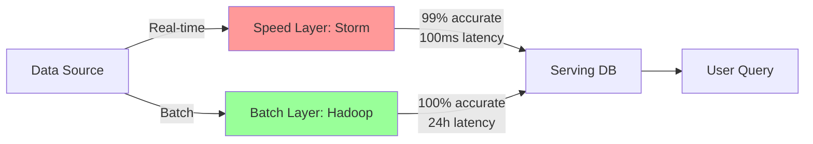
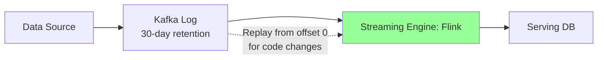
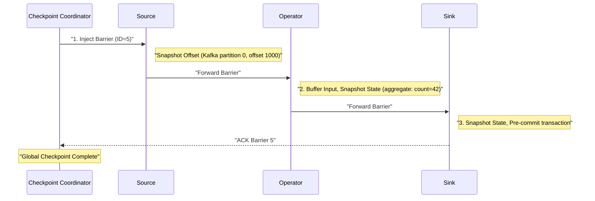
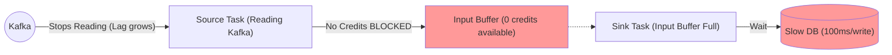
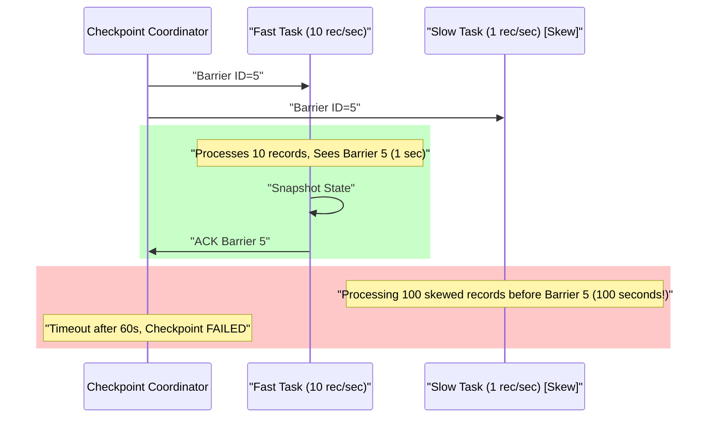

# Apache Flink: Stream Processing with Exactly-Once Guarantees

## 1. Introduction

### The Scenario: Why Batch Processing Fails

**Imagine you're building a fraud detection system for credit card transactions**:

**Timeline**:
- **12:00:00 PM**: Customer's card used to buy $50 coffee in New York
- **12:00:03 PM**: Same card used to buy $5,000 laptop in London
- **12:00:05 PM**: Same card used to buy $2,000 phone in Tokyo

**The Problem**:
- These transactions happen **3 seconds apart**
- Physically impossible (can't travel NYC → London → Tokyo in 5 seconds)
- **This is fraud** and must be blocked immediately

**Batch Processing Approach** (Hadoop/Spark batch jobs):
```
Hour 1: Transactions accumulate in database
Hour 2: Batch job starts processing
Hour 3: Job detects fraud pattern
Hour 4: Alert generated

Result: Fraud detected 4 hours later
        $7,050 already stolen
        Too late to block
```

**Stream Processing Requirement** (Flink):
```
12:00:00: NYC transaction → processed
12:00:03: London transaction arrives
          → Flink checks: "Last transaction 3 seconds ago in NYC"
          → Distance: 3,459 miles
          → Time to travel at 767 mph (plane): 4.5 hours
          → Verdict: IMPOSSIBLE → BLOCK TRANSACTION
          
Result: Fraud blocked in 10 milliseconds
        Customer protected
        $7,000 saved
```

**Why Batch Fails**:
- **Latency**: Processes data in hourly/daily batches
- **Stale data**: Decisions made on old information
- **No real-time state**: Can't check "what happened 3 seconds ago"

**Why Stream Processing is Mandatory**:
- **Sub-second decisions**: Detect and block within milliseconds
- **Stateful processing**: Remembers recent transactions per user
- **Event-time correctness**: Handles out-of-order events (London transaction arrives before Tokyo)
- **Continuous computation**: Always running, always protecting

**Other Scenarios Where Batch is Inadequate**:
1. **Ride-sharing pricing**: Surge pricing based on current demand (not yesterday's demand)
2. **Stock trading**: Detect market manipulation patterns in real-time
3. **IoT monitoring**: Alert when sensor reading anomalous (not hours later when equipment already failed)
4. **Recommendation systems**: Update user profile as they click (not next day)

---

**Apache Flink** is an open-source, distributed stream processing framework designed for **stateful computations over unbounded and bounded data streams**. Unlike Spark (batch-first with streaming as an afterthought), Flink is **stream-native from the ground up**, treating batch as a special case of streaming.

### The Problem: Batch is Too Slow

**Real-Time Requirements** emerged across industries:
- **Fraud detection**: Catch fraudulent transactions within milliseconds, not hours
- **Recommendations**: Update user profiles based on clicks in real-time
- **Monitoring**: Alert on anomalies within seconds of occurrence
- **Pricing**: Adjust ride-sharing prices based on current demand

**Batch Processing Limitations**:
- **Latency**: Hadoop jobs take minutes to hours
- **Freshness**: Data is stale by the time results arrive
- **Use Case Mismatch**: Event-driven applications need continuous processing

### The Evolution: From Unreliable to Exactly-Once

The history of stream processing is defined by one challenge: **Correctness under failure**.

---

### Generation 1: Apache Storm (2011) - Speed Without Guarantees

**Nathan Marz at Twitter** created the first widely-adopted stream processor.

**Architecture**:
- **Spouts**: Data sources
- **Bolts**: Processing operators
- **Topology**: DAG of spouts and bolts

**Key Limitation**: **At-least-once** processing only
- On failure, replay records from source
- No state checkpointing
- Result: Duplicate processing, incorrect aggregations

**The Lambda Architecture Hack** (2011-2014):
Because Storm couldn't guarantee correctness, teams ran **two pipelines**:



**The Problem**: Violates DRY (Don't Repeat Yourself)
1. **Logic Divergence**: Write `calculate_revenue()` twice (Java for Storm, SQL for Hive)
2. **Operational Nightmare**: Maintain two clusters, two failure modes
3. **Eventually Consistent**: Speed layer gradually corrected by batch layer

**Why It Failed**:
- Teams spent 60% of time reconciling differences between layers
- Bugs in one layer often missed in the other
- Complexity killed agility

---

### Generation 2: Spark Streaming (2013) - Micro-Batch Compromise

**Berkeley AMPLab** added streaming to Spark via **micro-batching**.

**Mechanism**: Chop stream into tiny batches (e.g., 500ms), run batch job on each

**Advantages**:
- **Exactly-once**: Each micro-batch is transactional
- **Unified API**: Same code for batch and streaming
- **Leverage Spark**: Reuse batch infrastructure

**Fatal Flaw: Latency Floor**
```
Latency >= Micro-batch interval + Scheduler overhead
Typical: 500ms + 500ms = 1 second minimum
```

**Why It's Not True Streaming**:
- Must wait for entire micro-batch to complete before processing
- Scheduler overhead dominates at small batch sizes
- Backpressure is reactive (slow down source after memory fills)

**Use Cases Where It's Acceptable**:
- Simple ETL (5-second latency OK)
- Aggregations over windows (e.g., "count clicks per 5 minutes")
- Analytics dashboards

**Use Cases Where It Fails**:
- Fraud detection (need <100ms)
- Alerting (need real-time)
- CEP (complex event patterns require stateful processing)

---

### Generation 3: Apache Flink (2014) - True Streaming Solution

**TU Berlin's Stratosphere Project** (2010-2014) became Apache Flink.

**Core Innovations**:

**1. True Streaming** (not micro-batch)

Unlike Spark's micro-batch approach (which processes data in 500ms chunks), Flink uses **long-running operators** that continuously pass messages between each other. This means:
- **No artificial batching**: Events processed individually as they arrive
- **Ultra-low latency**: 1-100ms end-to-end (only network overhead)
- **No scheduler delay**: Operators stay running; no JVM startup for each batch
- **Continuous computation**: Like a pipeline where data flows continuously, not in chunks

**Why it matters**: Fraud detection needs decisions in <100ms, impossible with 500ms+ micro-batches.

---

**2. Exactly-Once via Chandy-Lamport Snapshots**

Flink achieves **exactly-once processing** without pausing the data stream. The mechanism:
- **Distributed snapshots**: Takes a consistent snapshot of entire job state while processing continues
- **Checkpoint barriers**: Special markers flow with data to coordinate snapshots across operators
- **Durable storage**: State saved to S3/HDFS (survives machine failures)
- **Failure recovery**: On crash, restore state from last successful checkpoint and replay from that point

**Why it matters**: Guarantees no data loss and no duplicates, even when machines fail mid-processing. Critical for financial transactions where "exactly once" is legally required.

---

**3. Advanced State Management**

Flink can maintain **massive amounts of state** (terabytes) efficiently:
- **Embedded RocksDB**: Each operator has local LSM-tree database stored on SSD (not RAM)
- **Off-heap storage**: State lives outside JVM to avoid garbage collection pauses
- **TB-scale per operator**: Single operator can manage terabytes of state (user sessions, aggregations)
- **Queryable state**: External systems can query running job's state via REST API (e.g., "What's the current count for user123?")
- **Incremental checkpoints**: Only save changed data, not entire state (100GB state → 5GB checkpoint)

**Why it matters**: Enables stateful computations like "count all events per user in last 30 days" without external databases. State co-located with computation = fast lookups.

---

**4. Event-Time Processing**

Flink processes events based on **when they happened** (event time), not when they arrived (processing time). This handles:
- **Out-of-order events**: Mobile app generates event at 10:00 AM, arrives at 10:05 AM due to network delay
- **Watermarks**: Flink tracks "event time progress" using watermarks (guarantees like "no events before 10:00 AM will arrive")
- **Late event buffering**: Holds events temporarily to wait for stragglers
- **Correct window results**: 5-minute window from 10:00-10:05 includes all events with timestamps in that range, regardless of arrival time

**Why it matters**: Getting accurate "clicks in last hour" when events arrive out of order. Without event-time, results would be wrong.

---

**5. Credit-Based Backpressure**

Flink prevents memory overflows using a **flow control** system:
- **Credit system**: Downstream operators advertise "I have 10 free buffers" to upstream
- **Sender respects credits**: Upstream only sends data if downstream has space
- **Natural throttling**: When downstream is slow, upstream automatically slows down (no manual tuning)
- **Prevents OOM**: Can't overwhelm operators with more data than they can handle
- **Propagates to source**: Backpressure flows all the way to Kafka source (stops reading when system full)

**Why it matters**: **Reactive** backpressure (Spark) waits for OOM, then crashes. **Proactive** backpressure (Flink) prevents crashes before they happen.

---

### The Kappa Architecture: Streaming Unification

Flink (+ Kafka's log retention) enabled **Kappa Architecture**:

**Premise**: "The batch layer is redundant if the stream layer is correct."



**How It Works**:
1. **Normal Operation**: Process stream in real-time
2. **Code Change**: Deploy new version, replay Kafka from beginning
3. **Result**: Single codebase, single cluster, 100% accuracy

**Why Kafka is Critical**:
- 30-day retention = "replayable batch"
- Offset tracking = "bookmark" for where you are
- Partitioning = parallelism

---

### Why Flink Won

| Aspect | Storm | Spark Streaming | Flink |
|:-------|:------|:----------------|:------|
| **Guarantees** | At-least-once | Exactly-once (micro-batch) | Exactly-once (true streaming) |
| **Latency** | 10-100ms | 500ms-5s | 1-100ms |
| **State** | None (external only) | Limited (in-memory) | Advanced (RocksDB, TB-scale) |
| **Backpressure** | Manual throttling | Reactive | Credit-based (proactive) |
| **Event Time** | Not supported | Added later | Native from start |
| **Complexity** | Low (simple API) | Medium (batch API) | High (powerful but steep learning curve) |
| **Use Case** | Deprecated | Simple ETL | Mission-critical streaming |

---

### Key Differentiator

Flink's **Chandy-Lamport distributed snapshots** enable exactly-once processing without sacrificing throughput. The **credit-based backpressure** system prevents memory explosions, and **unaligned checkpoints** allow sub-second checkpoint completion even under heavy load.

### Industry Adoption

- **Alibaba**: Processes 4+ trillion events/day for real-time recommendations
- **Uber**: Real-time pricing, fraud detection, trip monitoring
- **Netflix**: Real-time quality-of-experience monitoring
- **LinkedIn**: Metrics computation, abuse detection
- **ByteDance (TikTok)**: Real-time content recommendation
- **Airbnb**: Real-time pricing and fraud detection

### Historical Timeline

- **2010**: Stratosphere research project begins at TU Berlin
- **2014**: Apache incubation as "Flink"
- **2015**: Top-level Apache project
- **2016**: Flink 1.0 - Core APIs stabilized
- **2017**: Queryable state, incremental checkpoints
- **2019**: Flink 1.9 - Fine-grained recovery
- **2020**: Flink 1.10 - Python support (PyFlink)
- **2022**: Flink 1.15 - Unified batch/streaming
- **2024**: Flink 1.18+ - Adaptive scheduler, speculative execution

### Current Version Features (Flink 1.18+)

- **Adaptive batch scheduler**: Dynamic resource allocation for batch jobs
- **Fine-grained resource management**: Per-operator memory/CPU limits
- **Speculative execution**: Retry slow tasks on different workers
- **PyFlink maturity**: Production-ready Python API
- **Kubernetes-native**: First-class K8s integration

---

## 2. Core Architecture: Following a Job's Journey

**Scenario**: You've written a fraud detection job. Let's follow it from submission to execution to understand how Flink's architecture works.

### The Journey Begins: Submitting Your Job

You run:
```bash
flink run fraud-detection.jar
```

**What happens next?** Your JAR file needs to be deployed, coordinated, and executed across a cluster of machines. Here's how Flink orchestrates this:

---

### Step 1: The Dispatcher (Airport Check-In Desk)

**Your JAR arrives at the Dispatcher**

**What is it?**: The Dispatcher is Flink's **central entry point** - think of it like an airport check-in desk.

**Why does it exist?**:
- Handles multiple jobs arriving at different times
- Routes each job to the right place
- Provides REST API for job submission (`http://jobmanager:8081`)

**What it does**:
1. Receives your `fraud-detection.jar`
2. Validates it (does it have a `main()` method?)
3. Assigns a Job ID: `job-abc123`
4. Creates a dedicated **JobMaster** just for your job

**Analogy**: Like checking in at airport - you get a boarding pass (Job ID) and are routed to your specific gate (JobMaster).

---

### Step 2: The JobMaster (Your Personal Project Manager)

**Now you have a dedicated coordinator for your fraud detection job**

**What is it?**: JobMaster is a **per-job brain** - each job gets its own.

**Why separate JobMaster per job?**:
- **Isolation**: Your job's failures don't affect other jobs
- **Dedicated resources**: Full focus on your job's success
- **Independent lifecycle**: Can cancel your job without touching others

**What it does**:
1. **Builds execution graph**: Converts your code into DAG of operators
   - Example: `read_kafka → detect_fraud → write_alerts`
2. **Checkpoint Coordinator**: Triggers snapshots every 60 seconds
3. **Failure recovery**: If a task crashes, JobMaster restarts it
4. **Tracks progress**: Monitors which operators are running, which finished

**Analogy**: Like a project manager assigned specifically to YOUR project - knows every detail, coordinates all pieces.

**Debug Tip**: Checkpoint failures? Check JobMaster logs, not Dispatcher logs.

---

### Step 3: The ResourceManager (Infrastructure Liaison)

**JobMaster needs machines to run your job. Enter ResourceManager.**

**What is it?**: The **infrastructure middleman** - talks to Kubernetes/YARN/Mesos on your behalf.

**Why separate from JobMaster?**:
- **Abstraction**: Your job doesn't care if it's on K8s, YARN, or bare metal
- **Centralized resource allocation**: One component handles all infrastructure
- **Job-agnostic**: Understands CPU/RAM, not fraud detection logic

**What it does**:
1. JobMaster requests: "I need 4 TaskManagers, 8GB RAM each"
2. ResourceManager translates to infrastructure:
   - Kubernetes: `kubectl create pod flink-taskmanager-1`
   - YARN: Request 4 containers from YARN ResourceManager
3. Waits for machines to come online
4. Reports back to JobMaster: "Your TaskManagers are ready"

**Analogy**: Like a procurement team - you say "I need 4 servers", they figure out how to get them from the cloud provider.

---

### Step 4: TaskManagers (The Workers)

**Your job code finally runs here**

**What are they?**: The **actual worker machines** where your fraud detection logic executes.

**Task Slots** (subdivisions of TaskManager):
- Each TaskManager divided into **slots** (e.g., 4 slots per machine)
- **Fixed resources per slot**: 2GB RAM, 1 CPU core
- **Why fixed?**: Unlike Spark (shared heap), Flink gives clear boundaries
- **Prevents interference**: Slot 1's memory explosion doesn't crash Slot 2

**Network Stack (Netty)**:
- **Credit-based flow control**: Like traffic lights for data
- Downstream operator says: "I have 10 free buffers" (credits)
- Upstream only sends data if credits available
- **Prevents OOM**: Can't overwhelm downstream with too much data
- **Buffer size**: 32KB per buffer (default)

**State Backend (RocksDB)**:
- **What is it?**: Local database embedded in each TaskManager
- **Why exists?**: Your fraud detection needs to remember "last transaction per user"
- **Off-heap storage**: Lives outside JVM to avoid garbage collection pauses
- **Disk-backed**: Can hold TB-scale state on SSD
- **Incremental checkpoints**: Only saves changed data (not entire state)

---

### Putting It All Together: The Full Flow

```
You: `flink run fraud-detection.jar`
  ↓
Dispatcher: "New job! Creating JobMaster for job-abc123"
  ↓
JobMaster: "I need resources. Requesting 4 TaskManagers"
  ↓
ResourceManager: "Creating 4 pods in Kubernetes"
  ↓
TaskManagers: "Ready! Waiting for work"
  ↓
JobMaster: "Deploy operators: read_kafka → detect_fraud → write_alerts"
  ↓
TaskManagers: "Running your code, processing transactions in real-time"
  ↓
(Every 60s) JobMaster: "Checkpoint time! Snapshot all state"
  ↓
If TaskManager crashes:
  JobMaster: "Restart failed tasks, restore from last checkpoint"
```

**Key Takeaway**: Flink's architecture separates concerns:
- **Dispatcher**: Routes jobs
- **JobMaster**: Coordinates YOUR specific job
- **ResourceManager**: Handles infrastructure
- **TaskManagers**: Execute your code

This separation enables isolation (jobs don't interfere), flexibility (works on K8s/YARN), and resilience (job-level failure recovery).

## 3. How It Works: Solving Real Problems with Event-Time and State

**Scenario**: You're building analytics for a mobile shopping app. You want to count "product views per user in 5-minute windows" to detect trending products.

### The Problem: When Phones Go Offline

**What happens in the real world**:

```
10:00 AM: User scrolls on phone, views iPhone case
          Phone generates event: {user: "alice", product: "case", time: 10:00}
          
10:01 AM: User enters subway tunnel (phone offline)
          Views AirPods, Charger, Cable
          ALL 3 EVENTS STUCK IN PHONE
          
10:06 AM: User exits tunnel (phone reconnects)
          Phone uploads ALL 4 events at once to server
          Flink receives events at 10:06 AM
```

**The Question**: Do these 4 events belong in the **10:00-10:05 window** or the **10:05-10:10 window**?

**Two Possible Approaches**:

---

### Approach 1: Processing Time (WRONG for this use case)

**What it means**: Use the time Flink **sees** the events (arrival time)

**Result**:
```
All 4 events arrived at 10:06 AM
→ Go into 10:05-10:10 window
→ 10:00-10:05 window shows 0 views
→ WRONG! User actually viewed during 10:00-10:05
```

**Problem**: Network delays make data incorrect
- User was active 10:00-10:05 but analytics show zero activity
- 10:05-10:10 window shows spike that didn't actually happen

---

### Approach 2: Event Time (CORRECT - What Flink Does)

**What it means**: Use the time events **actually happened** (embedded in event data)

**How Flink handles it**:
```
Event 1: {user: "alice", product: "case", time: 10:00}
→ Extract timestamp: 10:00 AM
→ Place in 10:00-10:05 window

Event 2: {user: "alice", product: "airpods", time: 10:01}
→ Extract timestamp: 10:01 AM  
→ Place in 10:00-10:05 window

... and so on
```

**Result**:
```
10:00-10:05 window: 4 views (CORRECT!)
10:05-10:10 window: 0 views (CORRECT!)
```

**Key Insight**: Flink gets the right answer even though events arrived late

---

### But Wait... When is the Window "Done"?

**The Challenge**: Flink processes events at 10:06. Should it:
- Wait longer? Maybe more 10:00-10:05 events will arrive?
- Close the window? Risk missing late events?

**This is where Watermarks come into play...**

---

### Watermarks: Tracking Event-Time Progress

**What is a Watermark?**: A special marker saying **"No events older than T will arrive"**

**How Flink Uses Them**:

```
Flink processing stream:

Event {time: 10:00} arrives
Event {time: 10:01} arrives  
Event {time: 10:03} arrives

Watermark(10:00) flows through → "No events before 10:00 will arrive"

Event {time: 10:04} arrives
Event {time: 10:05} arrives

Watermark(10:05) flows through → "No events before 10:05 will arrive"

→ Flink TRIGGERS 10:00-10:05 window computation
→ Emits result: (alice, 4 views)
```

**Watermark Configuration** (allowing 2-minute delay tolerance):
1. Flink sees event with timestamp 10:05
2. Calculates: "Latest timestamp = 10:05, tolerance = 2 minutes"
3. Emits: Watermark(10:03) = "No events before 10:03 will arrive"
4. When Watermark reaches window end (10:05), trigger computation

---

### Handling Late Events

**What if event arrives AFTER watermark passed?**

```
Watermark(10:05) already passed
10:00-10:05 window already computed and emitted result

Late Event {time: 10:02} arrives at 10:08 AM (very late!)
```

**Flink Options**:
1. **Drop it** (if window already closed)
2. **Allow late events** with configured grace period
   - Example: Allow up to 1 minute late
   - Update previous result (emit correction)
3. **Send to side output** (dead letter queue for analysis)

---

### Stateful Processing: Remembering User Activity

**Back to our scenario**: We need to track "views per user"

**The Problem**: Events for one user arrive at different TaskManagers
```
alice's event 1 → TaskManager 1
alice's event 2 → TaskManager 2
```

**Flink's Solution: Keyed State**

**Step 1: Key By User**
```
Flink routes ALL events with key="alice" → Same TaskManager instance
```

**Step 2: Maintain State Per User**
```
TaskManager 1 has local state:
{
  "alice": {count: 4, last_seen: 10:05},
  "bob": {count: 2, last_seen: 10:03}
}
```

**Step 3: Process Event**
```
New event arrives: {user: "alice", product: "case", time: 10:06}

1. Flink routes to TaskManager 1 (alice's owner)
2. Reads alice's state: count=4
3. Increments: count=5
4. Writes back to RocksDB
5. State persisted (survives crashes)
```

---

### Why Off-Heap RocksDB?

**The Challenge**: User state can be HUGE
- 10 million users
- Each user has activity history
- Total: 100GB of state

**JVM Heap Problem**:


---

## 4. Deep Dive: Internal Mechanisms

### A. Checkpoint Mechanism (Chandy-Lamport Algorithm)

**Goal**: Distributed snapshot without pausing the stream

**Algorithm**:
```
1. Checkpoint Coordinator (JobMaster): "Time for checkpoint!"
2. Inject barrier into source operators
3. Barrier flows downstream with data
4. When operator sees barrier on ALL inputs:
   - Snapshot state
   - Forward barrier downstream
5. Sink acknowledges completion
6. Global checkpoint committed
```

**Detailed Flow**:



**State Storage**:
```
Checkpoint 5:
  s3://bucket/checkpoints/5/
    ├─ _metadata (coordinatorstate, operator list)
    ├─ source-0/state (Kafka offset: 1000)
    ├─ operator-1/state (RocksDB snapshot: 500 MB)
    └─ sink-2/state (Pre-committed Kafka transaction ID)
```

---

### B. Exactly-Once Sink (2-Phase Commit)

**Challenge**: How to guarantee exactly-once writes to external systems (Kafka, databases)?

**Solution**: Two-Phase Commit (2PC) protocol coordinated with checkpoints

**Phase 1: Pre-commit** (during processing):
1. Sink receives records from operator
2. Opens transaction in external system (e.g., Kafka transaction)
3. Writes records as "uncommitted" (invisible to consumers)
4. Accumulates writes until checkpoint barrier arrives

**Phase 2: Commit** (on checkpoint complete):
1. Checkpoint Coordinator confirms: "Checkpoint 5 SUCCESS"
2. Notifies all sinks via RPC
3. Each sink commits its transaction
4. Records now visible atomically to external consumers

**Failure Handling**:
- **If checkpoint fails**: 
  - Sink aborts transaction
  - Uncommitted writes discarded
  - Flink restarts from last successful checkpoint
  - Re-processes and re-writes same records (idempotent)

**Configuration** (enable exactly-once):
```java
FlinkKafkaProducer.Semantic.EXACTLY_ONCE  // 2PC enabled
```

**Transaction Timeout**: Must exceed checkpoint interval (e.g., 15 minutes for 60s checkpoints)

---

### C. Credit-Based Backpressure

**Problem**: Fast upstream overwhelms slow downstream

**Flink's Solution**: Credit system

**Mechanism**:
```
Downstream (Sink):
  - Has 10 input buffers (32KB each)
  - Grants credits to upstream: "I have 10 free buffers"

Upstream (Source):
  - Sends data only if it has credits
  - Decrements credit counter per buffer sent

When credits = 0:
  - Upstream blocks
  - Source stops reading from Kafka (backpressure propagation)
```

**Monitoring**:
```
Flink Web UI → Job → Tasks → Backpressure
  Status: OK (green) | Low (yellow) | High (red)
```

---

## 5. End-to-End Walkthrough: Stream Processing Flow

**Scenario**: Real-time fraud detection on credit card transactions

### Job Submission

```bash
flink run -d \
  --parallelism 16 \
  --jobmanager-memory 2G \
  --taskmanager-memory 8G \
  fraud-detection.jar
```

### Step 1: Job Deployment (t=0s)

```
Dispatcher: Receives job JAR
  → Creates JobMaster
  → ResourceManager: Requests 4 TaskManagers from Kubernetes
  → K8s: Allocates 4 pods (8GB RAM each)
  → JobMaster: Deploys operators to Task Slots
```

### Step 2: Stream Processing Loop (ongoing)

```
Source Operator (Kafka):
  t=0.001s: Read transaction event
  {user: "alice", amount: 5000, card: "1234", time: 1704400000000}

Map Operator (Feature Extraction):
  t=0.002s: Enrich with user history
  {user: "alice", amount: 5000, avg_30d: 200, score: 0.95}

Keyed State (Fraud Model):
  t=0.003s: Lookup user state (RocksDB off-heap)
  State: {alice: {tx_count_1h: 3, total_amount_1h: 15000}}
  
  Rule: If tx_count_1h > 5 or amount > avg_30d * 10:
    Flag as fraud

Window Aggregation (1-hour tumbling):
  t=0.004s: Increment counters
  Update state: {alice: {tx_count_1h: 4, total_amount_1h: 20000}}

Sink Operator (Alert to Kafka):
  t=0.005s: Write alert to Kafka (uncommitted)
  Pre-commit transaction

Total latency: 5ms (sub-second!)
```

### Step 3: Checkpointing (every 60s)

```
t=60s: Checkpoint Coordinator triggers checkpoint #5

Source:
  Snapshot: Kafka offset = partition 0: offset 120000
  Forward barrier

Operator:
  Snapshot: RocksDB state (alice: {tx_count_1h: 4, ...})
  Write to S3: s3://checkpoints/5/operator-1/state (500 MB)
  Forward barrier

Sink:
  Pre-commit Kafka transaction
  Acknowledge checkpoint

t=65s: Global checkpoint complete
  → Commit all Kafka transactions
  → Alerts now visible to consumers

Checkpoint duration: 5 seconds
```

### Step 4: Failure Recovery (TaskManager crashes)

```
t=120s: TaskManager 2 crashes (OOM, spot instance loss)

JobMaster detects failure:
  → Cancel all tasks
  → Reload state from checkpoint #5 (S3)
  → Rewind Kafka offsets to checkpoint #5 position
  → Resume processing

Recovery time: 30 seconds
  (Checkpoint #5 to #7 = 2 minutes of reprocessing)
```

---

## 6. Failure Scenarios (The Senior View)

### Scenario A: Backpressure Deadlock

**Symptom**: Job running (green UI), but throughput = 0 records/sec, Kafka lag growing

**Cause**: Downstream sink (e.g., PostgreSQL) is slow (100ms/write)

#### The Mechanism

**Credit-based flow control prevents OOM, but can cause deadlock**:



**Timeline**:
```
t=0: Sink writes to DB at 100ms/record
t=1s: Upstream sends 10 records (fills all 10 buffers)
t=1s: Sink buffers = FULL → credits = 0
t=1.1s: Upstream waits for credits (blocked)
t=1.2s: Source stops reading Kafka (backpressure propagates)
Result: Kafka lag grows, but job appears "healthy" (no errors)
```

#### The Fix

**Option 1: Scale Sink Parallelism**
- Increase sink operator parallelism: `sink.setParallelism(10)` (was 1)
- Distributes load across 10 instances
- Each handles 10% of traffic → 10× throughput

**Option 2: Async I/O** (Recommended)
- Use non-blocking database writes
- Allow 100 concurrent requests per operator
- Prevents blocking while waiting for DB response
- **Result**: 100× higher throughput (100ms/write but 100 concurrent = 1000 writes/sec)

**Option 3: Increase Network Buffers**
- Configuration:
  ```yaml
  taskmanager.memory.network.fraction: 0.2  # 20% for network (was 10%)
  taskmanager.network.numberOfBuffers: 4096  # More buffers
  ```
- More buffers = more tolerance for slow downstream

---

### Scenario B: Barrier Alignment Timeout

**Symptom**: `CheckpointExpiredException: Checkpoint 123 expired before completing`

**Cause**: Data skew - one parallel instance processing 90% of data

#### The Mechanism

**Chandy-Lamport requires barrier alignment across all inputs**:



**Problem**:
```
Checkpoint config: timeout = 60 seconds
Fast task: Processes 10 records → barrier (1s)
Slow task: Has 100 skewed records queued → barrier (100s)
Result: Checkpoint fails, recovery window grows
```

#### The Fix

**Option 1: Enable Unaligned Checkpoints** (Critical!)
- Configuration: `execution.checkpointing.unaligned: true`
- **How it works**:
  1. Barrier "jumps ahead" of queued data in buffers
  2. Snapshots include in-flight buffered records
  3. Checkpoint completes in milliseconds (doesn't wait for slow task)
- **Trade-off**: Larger checkpoint size (includes buffered data)

**Option 2: Fix Data Skew (Key Salting)**
- **Problem**: 99% of data has same key (e.g., `user_id="bot_123"`)
- **Solution**: Add random suffix to distribute across subtasks
  - Before: `keyBy(event -> event.getUserId())` → all to 1 subtask
  - After: `keyBy(event -> event.getUserId() + "_" + random(0-9))` → spread across 10 subtasks

**Option 3: Increase Checkpoint Timeout**
- Configuration: `execution.checkpointing.timeout: 600000` (10 min, was 60s)
- **When to use**: Temporary fix while investigating skew root cause

---

### Scenario C: State Backend OOM

**Symptom**: TaskManager killed (OOM), `java.lang.OutOfMemoryError`

**Cause**: RocksDB state grows unbounded, no TTL configured

#### The Mechanism

```
User session state:
  Key: user_id
  Value: {cart: [...], last_activity: timestamp}

Problem:
  - Store session for every user ever
  - No cleanup for inactive users (90 days old)
  - State grows: 1 GB → 10 GB → 100 GB → OOM

RocksDB uses disk, but index/bloom filters in RAM
  → RAM exhausted → OOM
```

#### The Fix

**Option 1: Configure State TTL**:
```java
// Java
StateTtlConfig ttlConfig = StateTtlConfig
    .newBuilder(Time.days(30))
    .setUpdateType(StateTtlConfig.UpdateType.OnCreateAndWrite)
    .setStateVisibility(StateTtlConfig.StateVisibility.NeverReturnExpired)
    .cleanupFullSnapshot()
    .build();

ValueStateDescriptor<Session> descriptor = new ValueStateDescriptor<>("session", Session.class);
descriptor.enableTimeToLive(ttlConfig);
```

```scala
// Scala
val ttlConfig = StateTtlConfig
  .newBuilder(Time.days(30))
  .setUpdateType(UpdateType.OnCreateAndWrite)
  .setStateVisibility(StateVisibility.NeverReturnExpired)
  .cleanupFullSnapshot()
  .build()

val descriptor = new ValueStateDescriptor[Session]("session", classOf[Session])
descriptor.enableTimeToLive(ttlConfig)
```

**Option 2: Increase RocksDB Memory**:
```yaml
taskmanager.memory.managed.fraction: 0.5  # 50% of total memory for RocksDB
state.backend.rocksdb.memory.managed: true
```

**Option 3: Enable Compaction Filters**:
```yaml
state.backend.rocksdb.ttl.compaction.filter.enabled: true
```

---

### Scenario D: Exactly-Once Sink Timeout

**Symptom**: `TransactionTimeoutException` on Kafka sink

**Cause**: 2PC transaction timeout (default 15min) exceeded during checkpoint

#### The Mechanism

```
Checkpoint triggers:
  t=0: Sink pre-commits Kafka transaction
  t=0-900s: Waiting for global checkpoint
  t=901s: Kafka aborts transaction (transaction.timeout.ms=900000)
  t=920s: Checkpoint completes, tries to commit → FAIL
```

#### The Fix

**Option 1: Increase Kafka Transaction Timeout**
- Configuration: `transaction.timeout.ms=3600000` (1 hour, was 15 min)
- **Why**: Kafka aborts transactions exceeding timeout
- Must exceed: checkpoint interval + checkpoint duration + buffer

**Option 2: Reduce Checkpoint Interval**
- Configuration: `execution.checkpointing.interval=30000` (30s, was 60s)
- Shorter interval = faster commits = less likely to timeout
- **Trade-off**: More frequent checkpoints = 2× overhead

**Option 3: Pre-aggregate Before Sink**
- Aggregate in Flink before writing to Kafka
- Example: Write per-minute aggregates instead of raw events
- **Result**: 60× fewer writes, 60× shorter transaction duration

---

## 7. Performance Tuning / Scaling Strategies

### Configuration Table

| Configuration | Recommendation | Why? |
|:--------------|:---------------|:-----|
| `state.backend` | rocksdb | Heap dangerous for large state (GC issues) |
| `execution.checkpointing.unaligned` | true | **CRITICAL**: Prevents timeout under backpressure |
| `execution.checkpointing.interval` | 60000 (60s) | Balance recovery time vs overhead |
| `execution.checkpointing.timeout` | 600000 (10min) | Prevent timeout under high load |
| `execution.checkpointing.max-concurrent-checkpoints` | 1 | Prevent checkpoint storms |
| `taskmanager.memory.network.fraction` | 0.1-0.2 | Increase for backpressure tolerance |
| `taskmanager.memory.managed.fraction` | 0.4-0.5 | RocksDB off-heap memory allocation |
| `state.checkpoints.dir` | s3://bucket/chk | Distributed storage (NOT local disk) |
| `state.backend.rocksdb.memory.managed` | true | Use Flink's managed memory for RocksDB |
| `state.backend.rocksdb.ttl.compaction.filter.enabled` | true | Cleanup expired state during compaction |
| `parallelism.default` | Match Kafka partitions | Maximize parallelism |
| `taskmanager.numberOfTaskSlots` | 2-4 | Balance: too high = resource contention |

### Scaling Strategies

**1. Horizontal Scaling (Add TaskManagers)**:
- Add more TaskManager pods/instances
- Example: Scale from 4 to 8 TaskManagers
- **Result**: 2× CPU capacity, 2× parallel task slots
- **When**: CPU-bound workloads, need more parallelism

**2. Vertical Scaling (Increase Resources)**:
- Increase memory/CPU per TaskManager
- Example: 8GB → 16GB RAM per TaskManager
- **Result**: Handle larger state per instance, fewer checkpoints
- **When**: Memory-bound (large state), avoid too many small instances

**3. State Sharding (Increase Parallelism)**:
- Increase job parallelism (redistribute keys across more subtasks)
- Example: Parallelism 8 → 16
  - Before: 10GB state per instance × 8 = 80GB total
  - After: 5GB state per instance × 16 = 80GB total
- **Benefit**: Faster checkpoints (smaller snapshots per instance)
- **Limit**: Cannot exceed Kafka partition count

**4. Operator Chaining Optimization**:
- Disable chaining for CPU-heavy operators to spread load
- Configuration: `.disableChaining()` on heavy map/filter
- **Trade-off**: More network overhead, better parallelism
```

---

## 8. Constraints & Limitations

| Constraint | Limit | Why? |
|:-----------|:------|:-----|
| **Checkpoint size** | < 100GB recommended | Large checkpoints slow recovery (30s → 5min) |
| **State size** | TB-scale with RocksDB | Limited by disk, not RAM (SSD recommended) |
| **Parallelism max** | 1000s (practical: 100-500) | Too high = coordination overhead, small tasks |
| **Watermark latency** | Seconds to minutes | Depends on event-time skew, out-of-order arrival |
| **Exactly-once overhead** | 10-30% throughput reduction | 2PC commits add latency vs at-least-once |
| **Backpressure propagation** | Milliseconds | Credit-based system responds fast |
| **Network buffer size** | 32KB fixed | Not configurable per-task |
| **TaskSlot isolation** | Memory only, shares CPU | Not container-level isolation |
| **Checkpoint alignment** | Can cause timeouts | Use unaligned checkpoints for > 1min skew |
| **Savepoint compatibility** | Between minor versions only | 1.15 → 1.16 OK, 1.15 → 2.0 may break |

### Why Not Flink?

| Use Case | Better Alternative | Reason |
|:---------|:-------------------|:-------|
| **Batch ETL only** | Apache Spark | More mature batch ecosystem, SQL integration |
| **< 1GB/day throughput** | Kafka Streams | Simpler deployment (library, not cluster) |
| **Simple map/filter** | Kafka Streams/KSQL | No need for Flink's complexity |
| **Sub-millisecond latency** | Custom system | Flink's 1-100ms latency may not suffice |
| **Read-only dashboards** | Presto/Trino | Better for ad-hoc queries |

---

## 9. When to Use Flink?

| Use Case | Verdict | Why? |
|:---------|:--------|:-----|
| **Real-time analytics** | **YES** ✅ | Sub-second latency, event-time windows, exactly-once |
| **Fraud detection** | **YES** ✅ | Stateful pattern matching (CEP), complex rules |
| **Stream joins** | **YES** ✅ | More mature than Spark (interval joins, temporal joins) |
| **IoT data processing** | **YES** ✅ | TB-scale state, watermarks for sensor skew |
| **Change data capture (CDC)** | **YES** ✅ | Exactly-once writes, stateful transformations |
| **Batch ETL** | **MAYBE** ⚠️ | Flink can do batch, but Spark ecosystem more mature |
| **Small jobs (< 1GB/day)** | **NO** ❌ | Overhead not worth it; use Kafka Streams |
| **Simple aggregations** | **NO** ❌ | ksqlDB or Kafka Streams simpler |

### Flink vs Alternatives

| Aspect | Flink | Spark Streaming | Kafka Streams |
|:-------|:------|:----------------|:--------------|
| **Latency** | 1-100ms | 500ms-5s | 1-10ms |
| **State** | Advanced (RocksDB, queryable) | Limited (memory) | RocksDB |
| **Exactly-once** | Native (Chandy-Lamport) | Micro-batch | Native (changelog) |
| **Deployment** | Cluster (complex) | Cluster | Library (simple) |
| **SQL support** | Mature (Flink SQL) | Very mature (Spark SQL) | Limited (ksqlDB) |
| **Backpressure** | Credit-based (built-in) | Reactive throttle | Manual |
| **Use case** | Complex CEP, low-latency | Batch + streaming hybrid | Simple transforms |
| **Operational complexity** | High (cluster management) | High | Low (embedded) |

---

## 10. Production Checklist

1. [ ] **Enable checkpointing**: `execution.checkpointing.interval=60000` (60s)
2. [ ] **Use RocksDB state backend**: `state.backend=rocksdb`
3. [ ] **Enable unaligned checkpoints**: `execution.checkpointing.unaligned=true` (CRITICAL)
4. [ ] **Configure distributed storage**: `state.checkpoints.dir=s3://bucket/checkpoints` (not local)
5. [ ] **Set state TTL**: Configure TTL for non-permanent state (30-90 days typical)
6. [ ] **Configure managed memory**: `taskmanager.memory.managed.fraction=0.4` (40% for RocksDB)
7. [ ] **Set checkpoint timeout**: `execution.checkpointing.timeout=600000` (10 min)
8. [ ] **Match Kafka parallelism**: `parallelism = number of Kafka partitions`
9. [ ] **Enable metrics**: Integrate Prometheus for monitoring
10. [ ] **Configure failure recovery**: `restart-strategy: fixed-delay` with attempts=3
11. [ ] **Test failure recovery**: Kill TaskManager pod, verify checkpoint recovery
12. [ ] **Set up alerting**: Checkpoint failures, Kafka lag, backpressure, state growth

### Critical Metrics

```
checkpoint_duration_milliseconds:
  Description: Time to complete distributed snapshot
  Target: < 60 seconds (95th percentile)
  Why it matters: Long checkpoints = wide recovery window, more data reprocessed on failure
  Fix: Enable unaligned checkpoints, reduce state size with TTL, use faster storage (S3 vs HDFS)

checkpoint_failure_count_total:
  Description: Count of failed checkpoint attempts
  Target: < 1% of total checkpoints
  Why it matters: Failed checkpoints = no recovery points, wider blast radius on failures
  Fix: Increase checkpoint timeout, fix data skew, verify S3 connectivity

kafka_consumer_lag_messages:
  Description: Number of unprocessed messages in Kafka
  Target: < 10,000 messages per partition
  Why it matters: Growing lag = processing slower than input rate, backpressure active
  Fix: Scale parallelism, optimize sink (async I/O), increase TaskManager count

backpressure_time_percentage:
  Description: Percentage of time tasks are blocked waiting for credits
  Target: < 5%
  Why it matters: Sustained backpressure = sink bottleneck, throughput degradation
  Fix:Identify slow operator (Flink Web UI), use async I/O for external calls, scale sink parallelism

task_failure_count_total:
  Description: Count of individual task failures (before job restart)
  Target: < 0.1% of total tasks
  Why it matters: High failure rate = instability, resource contention, or bugs
  Fix: Check logs for OOM/exceptions, increase memory, fix code bugs

state_size_bytes:
  Description: Total state backend size (RocksDB on disk)
  Target: Monitor growth rate (should be bounded)
  Why it matters: Unbounded growth = missing TTL, eventual OOM or slow checkpoints
  Fix: Configure state TTL (30-90 days typical), investigate state accumulation bugs

throughput_records_per_second:
  Description: Records processed per second (baseline for regression detection)
  Target: Establish baseline, alert on >20% drop
  Why it matters: Sudden drop = backpressure, failures, data skew, or resource exhaustion
  Fix: Investigate backpressure, check for failures, verify resource allocation

gc_time_percentage:
  Description: Percentage of time spent in JVM garbage collection
  Target: < 10% (off-heap RocksDB should minimize GC)
  Why it matters: High GC = heap pressure, performance degradation
  Fix: RocksDB state backend uses off-heap (verify config), increase managed memory fraction
```

---

**Remember**: Flink's power comes from its **Chandy-Lamport distributed snapshots** (exactly-once without stopping the stream), **credit-based backpressure** (preventing OOM), and **unaligned checkpoints** (sub-second checkpoints under load). Mastering state management, watermarks, and failure recovery unlocks truly reliable stream processing at scale.
