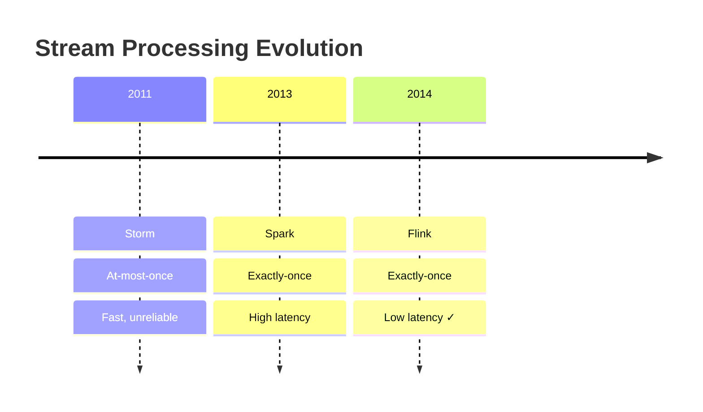
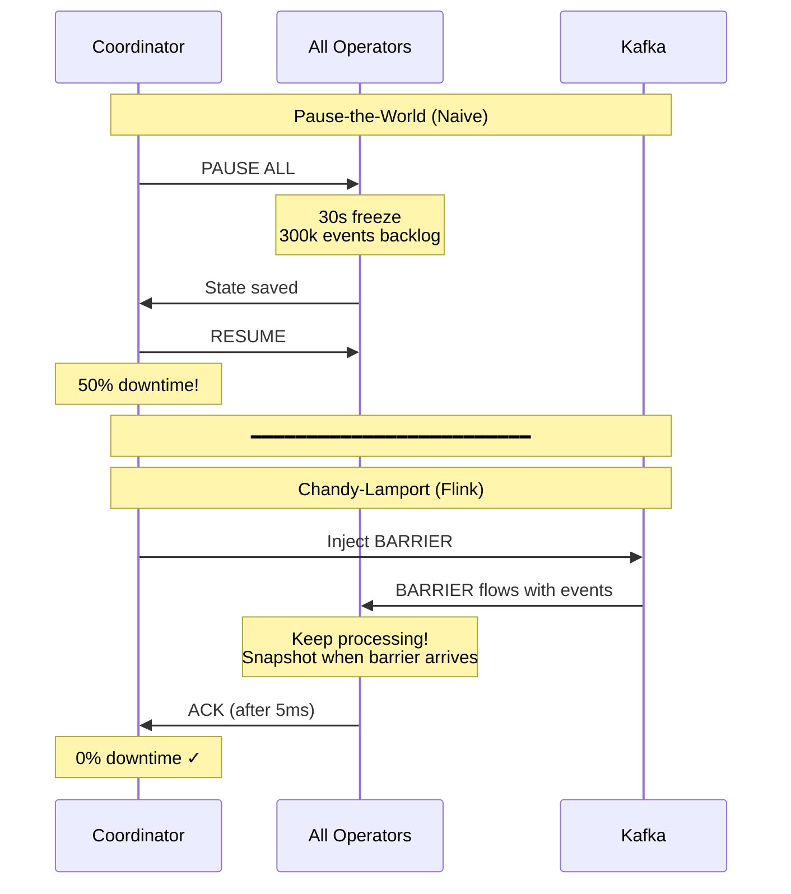

# Apache Flink: Stream Processing with Exactly-Once Guarantees

## 1. Introduction

### The Scenario: Why Batch Processing Fails

**Imagine you're building a fraud detection system for credit card transactions**:

**Timeline**:
- **12:00:00 PM**: Customer's card used to buy $50 coffee in New York
- **12:00:03 PM**: Same card used to buy $5,000 laptop in London
- **12:00:05 PM**: Same card used to buy $2,000 phone in Tokyo

**The Problem**:
- These transactions happen **3 seconds apart**
- Physically impossible (can't travel NYC → London → Tokyo in 5 seconds)
- **This is fraud** and must be blocked immediately

**Batch Processing Approach** (Hadoop/Spark batch jobs):
```
Hour 1: Transactions accumulate in database
Hour 2: Batch job starts processing
Hour 3: Job detects fraud pattern
Hour 4: Alert generated

Result: Fraud detected 4 hours later
        $7,050 already stolen
        Too late to block
```

**Stream Processing Requirement** (Flink):
```
12:00:00: NYC transaction → processed
12:00:03: London transaction arrives
          → Flink checks: "Last transaction 3 seconds ago in NYC"
          → Distance: 3,459 miles
          → Time to travel at 767 mph (plane): 4.5 hours
          → Verdict: IMPOSSIBLE → BLOCK TRANSACTION
          
Result: Fraud blocked in 10 milliseconds
        Customer protected
        $7,000 saved
```

**Why Batch Fails**:
- **Latency**: Processes data in hourly/daily batches
- **Stale data**: Decisions made on old information
- **No real-time state**: Can't check "what happened 3 seconds ago"

**Why Stream Processing is Mandatory**:
- **Sub-second decisions**: Detect and block within milliseconds
- **Stateful processing**: Remembers recent transactions per user
- **Event-time correctness**: Handles out-of-order events (London transaction arrives before Tokyo)
- **Continuous computation**: Always running, always protecting

**Other Scenarios Where Batch is Inadequate**:
1. **Ride-sharing pricing**: Surge pricing based on current demand (not yesterday's demand)
2. **Stock trading**: Detect market manipulation patterns in real-time
3. **IoT monitoring**: Alert when sensor reading anomalous (not hours later when equipment already failed)
4. **Recommendation systems**: Update user profile as they click (not next day)

---

**Apache Flink** is an open-source, distributed stream processing framework designed for **stateful computations over unbounded and bounded data streams**. Unlike Spark (batch-first with streaming as an afterthought), Flink is **stream-native from the ground up**, treating batch as a special case of streaming.

### The Problem: Batch is Too Slow

**Real-Time Requirements** emerged across industries:
- **Fraud detection**: Catch fraudulent transactions within milliseconds, not hours
- **Recommendations**: Update user profiles based on clicks in real-time
- **Monitoring**: Alert on anomalies within seconds of occurrence
- **Pricing**: Adjust ride-sharing prices based on current demand

**Batch Processing Limitations**:
- **Latency**: Hadoop jobs take minutes to hours
- **Freshness**: Data is stale by the time results arrive
- **Use Case Mismatch**: Event-driven applications need continuous processing

### The Evolution: From Unreliable to Exactly-Once

The history of stream processing is defined by one challenge: **Correctness under failure**.

---

### Generation 1: Apache Storm (2011) - Speed Without Guarantees

**At-most-once guarantee** - Fast but data loss possible. Led to Lambda Architecture (dual batch+stream pipelines).

### Generation 2: Spark Streaming (2013) - Micro-Batch Compromise

**Exactly-once via micro-batching** - Reliable but high latency (500ms+ minimum). Not acceptable for real-time.

### Generation 3: Apache Flink (2014) - True Streaming Solution

**Exactly-once + low latency** - Combines best of both using Chandy-Lamport. The breakthrough.



| Feature | Storm (2011) | Spark (2013) | Flink (2014) |
|---------|-------------|--------------|--------------|
| **Guarantee** | At-most-once | Exactly-once | Exactly-once |
| **Latency** | <100ms | 500ms-5s | <100ms |
| **Mechanism** | Direct streaming | Micro-batch | Chandy-Lamport |
| **Problem** | Data loss | High latency | ✓ None |

**Why Flink Won**: True streaming (not micro-batch) + exactly-once (Chandy-Lamport snapshots) + low latency (<100ms).

---

### The Kappa Architecture: Streaming Unification

Flink (+ Kafka's log retention) enabled **Kappa Architecture**:

**Premise**: "The batch layer is redundant if the stream layer is correct."


**How It Works**:
1. **Normal Operation**: Process stream in real-time
2. **Code Change**: Deploy new version, replay Kafka from beginning
3. **Result**: Single codebase, single cluster, 100% accuracy

**Why Kafka is Critical**:
- 30-day retention = "replayable batch"
- Offset tracking = "bookmark" for where you are
- Partitioning = parallelism

---

### Why Flink Won

| Aspect | Storm | Spark Streaming | Flink |
|:-------|:------|:----------------|:------|
| **Guarantees** | At-least-once | Exactly-once (micro-batch) | Exactly-once (true streaming) |
| **Latency** | 10-100ms | 500ms-5s | 1-100ms |
| **State** | None (external only) | Limited (in-memory) | Advanced (RocksDB, TB-scale) |
| **Backpressure** | Manual throttling | Reactive | Credit-based (proactive) |
| **Event Time** | Not supported | Added later | Native from start |
| **Complexity** | Low (simple API) | Medium (batch API) | High (powerful but steep learning curve) |
| **Use Case** | Deprecated | Simple ETL | Mission-critical streaming |

---

### Key Differentiator

Flink's **Chandy-Lamport distributed snapshots** enable exactly-once processing without sacrificing throughput. The **credit-based backpressure** system prevents memory explosions, and **unaligned checkpoints** allow sub-second checkpoint completion even under heavy load.

### Industry Adoption

- **Alibaba**: Processes 4+ trillion events/day for real-time recommendations
- **Uber**: Real-time pricing, fraud detection, trip monitoring
- **Netflix**: Real-time quality-of-experience monitoring
- **LinkedIn**: Metrics computation, abuse detection
- **ByteDance (TikTok)**: Real-time content recommendation
- **Airbnb**: Real-time pricing and fraud detection

### Historical Timeline

- **2010**: Stratosphere research project begins at TU Berlin
- **2014**: Apache incubation as "Flink"
- **2015**: Top-level Apache project
- **2016**: Flink 1.0 - Core APIs stabilized
- **2017**: Queryable state, incremental checkpoints
- **2019**: Flink 1.9 - Fine-grained recovery
- **2020**: Flink 1.10 - Python support (PyFlink)
- **2022**: Flink 1.15 - Unified batch/streaming
- **2024**: Flink 1.18+ - Adaptive scheduler, speculative execution

### Current Version Features (Flink 1.18+)

- **Adaptive batch scheduler**: Dynamic resource allocation for batch jobs
- **Fine-grained resource management**: Per-operator memory/CPU limits
- **Speculative execution**: Retry slow tasks on different workers
- **PyFlink maturity**: Production-ready Python API
- **Kubernetes-native**: First-class K8s integration

---

## 2. Core Architecture: Following a Job's Journey

**Scenario**: You've written a fraud detection job. Let's follow it from submission to execution to understand how Flink's architecture works.

### The Journey Begins: Submitting Your Job

You run:
```bash
flink run fraud-detection.jar
```

**What happens next?** Your JAR file needs to be deployed, coordinated, and executed across a cluster of machines. Here's how Flink orchestrates this:

---

### Step 1: The Dispatcher (Airport Check-In Desk)

**Your JAR arrives at the Dispatcher**

**What is it?**: The Dispatcher is Flink's **central entry point** - think of it like an airport check-in desk.

**Why does it exist?**:
- Handles multiple jobs arriving at different times
- Routes each job to the right place
- Provides REST API for job submission (`http://jobmanager:8081`)

**What it does**:
1. Receives your `fraud-detection.jar`
2. Validates it (does it have a `main()` method?)
3. Assigns a Job ID: `job-abc123`
4. Creates a dedicated **JobMaster** just for your job

**Analogy**: Like checking in at airport - you get a boarding pass (Job ID) and are routed to your specific gate (JobMaster).

---

### Step 2: The JobMaster (Your Personal Project Manager)

**Now you have a dedicated coordinator for your fraud detection job**

**What is it?**: JobMaster is a **per-job brain** - each job gets its own.

**Why separate JobMaster per job?**:
- **Isolation**: Your job's failures don't affect other jobs
- **Dedicated resources**: Full focus on your job's success
- **Independent lifecycle**: Can cancel your job without touching others

**What it does**:
1. **Builds execution graph**: Converts your code into DAG of operators
   - Example: `read_kafka → detect_fraud → write_alerts`
2. **Checkpoint Coordinator**: Triggers snapshots every 60 seconds
3. **Failure recovery**: If a task crashes, JobMaster restarts it
4. **Tracks progress**: Monitors which operators are running, which finished

**Analogy**: Like a project manager assigned specifically to YOUR project - knows every detail, coordinates all pieces.

**Debug Tip**: Checkpoint failures? Check JobMaster logs, not Dispatcher logs.

---

### Step 3: The ResourceManager (Infrastructure Liaison)

**JobMaster needs machines to run your job. Enter ResourceManager.**

**What is it?**: The **infrastructure middleman** - talks to Kubernetes/YARN/Mesos on your behalf.

**Why separate from JobMaster?**:
- **Abstraction**: Your job doesn't care if it's on K8s, YARN, or bare metal
- **Centralized resource allocation**: One component handles all infrastructure
- **Job-agnostic**: Understands CPU/RAM, not fraud detection logic

**What it does**:
1. JobMaster requests: "I need 4 TaskManagers, 8GB RAM each"
2. ResourceManager translates to infrastructure:
   - Kubernetes: `kubectl create pod flink-taskmanager-1`
   - YARN: Request 4 containers from YARN ResourceManager
3. Waits for machines to come online
4. Reports back to JobMaster: "Your TaskManagers are ready"

**Analogy**: Like a procurement team - you say "I need 4 servers", they figure out how to get them from the cloud provider.

---

### Step 4: TaskManagers (The Workers)

**Your job code finally runs here**

**What are they?**: The **actual worker machines** where your fraud detection logic executes.

**Task Slots** (subdivisions of TaskManager):
- Each TaskManager divided into **slots** (e.g., 4 slots per machine)
- **Fixed resources per slot**: 2GB RAM, 1 CPU core
- **Why fixed?**: Unlike Spark (shared heap), Flink gives clear boundaries
- **Prevents interference**: Slot 1's memory explosion doesn't crash Slot 2

**Network Stack (Netty)**:
- **Credit-based flow control**: Like traffic lights for data
- Downstream operator says: "I have 10 free buffers" (credits)
- Upstream only sends data if credits available
- **Prevents OOM**: Can't overwhelm downstream with too much data
- **Buffer size**: 32KB per buffer (default)

**State Backend (RocksDB)**:
- **What is it?**: Local database embedded in each TaskManager
- **Why exists?**: Your fraud detection needs to remember "last transaction per user"
- **Off-heap storage**: Lives outside JVM to avoid garbage collection pauses
- **Disk-backed**: Can hold TB-scale state on SSD
- **Incremental checkpoints**: Only saves changed data (not entire state)

---

### Putting It All Together: The Full Flow

```
You: `flink run fraud-detection.jar`
  ↓
Dispatcher: "New job! Creating JobMaster for job-abc123"
  ↓
JobMaster: "I need resources. Requesting 4 TaskManagers"
  ↓
ResourceManager: "Creating 4 pods in Kubernetes"
  ↓
TaskManagers: "Ready! Waiting for work"
  ↓
JobMaster: "Deploy operators: read_kafka → detect_fraud → write_alerts"
  ↓
TaskManagers: "Running your code, processing transactions in real-time"
  ↓
(Every 60s) JobMaster: "Checkpoint time! Snapshot all state"
  ↓
If TaskManager crashes:
  JobMaster: "Restart failed tasks, restore from last checkpoint"
```

**Key Takeaway**: Flink's architecture separates concerns:
- **Dispatcher**: Routes jobs
- **JobMaster**: Coordinates YOUR specific job
- **ResourceManager**: Handles infrastructure
- **TaskManagers**: Execute your code

This separation enables isolation (jobs don't interfere), flexibility (works on K8s/YARN), and resilience (job-level failure recovery).

---

### Flink Cluster Architecture


**Diagram Explanation**:
- **JobManager**: Control plane (coordinates)
- **TaskManagers**: Data plane (execute)
- **Solid arrows**: Control messages (job submission, deployment)
- **Dashed arrows**: Data flow (events between operators)
- **RocksDB**: Off-heap state storage (survives crashes)

---

### Task Slots vs DAG: Important Clarification

**Common Misconception**: "Does one task slot contain the entire DAG (Source → Map → Aggregate → Sink)?"

**Answer**: **NO!** Each task slot runs **ONE operator instance** (one stage of the DAG).

**How the DAG is Distributed**:

```
Your Job DAG:
Source → Map → Aggregate → Sink

With Parallelism = 4:

TaskManager 1:
  - Task Slot 1: Source instance 0
  - Task Slot 2: Map instance 0  
  - Task Slot 3: Aggregate instance 0
  - Task Slot 4: Sink instance 0

TaskManager 2:
  - Task Slot 1: Source instance 1
  - Task Slot 2: Map instance 1
  - Task Slot 3: Aggregate instance 1
  - Task Slot 4: Sink instance 1

... (and so on for instances 2 and 3)
```

**Key Points**:
1. **One slot = One operator instance** (e.g., "Map instance 0")
2. **Events flow between slots** via network buffers (dashed arrows in diagram)
3. **Pipeline spans multiple slots** across TaskManagers

**Example Flow for ONE Event**:
```
Event arrives →
  Slot 1 (Source-0) reads from Kafka →
    Network buffer sends to Slot 2 →
      Slot 2 (Map-0) transforms event →
        Network buffer sends to Slot 3 →
          Slot 3 (Aggregate-0) updates state →
            Network buffer sends to Slot 4 →
              Slot 4 (Sink-0) writes to Kafka
```

**Why Not Put Entire DAG in One Slot?**
- **Parallelism**: Need 4 separate Source instances reading 4 Kafka partitions simultaneously
- **Resource Isolation**: Map might need 2GB RAM, Sink needs 4GB - separate slots allow different allocations
- **Fault Tolerance**: If one operator fails, only restart that stage

**Special Case: Operator Chaining**
- Sometimes Flink **does** chain operators in same slot (e.g., Source+Map together)
- Only when: same parallelism, no shuffle, connected directly
- Optimization to avoid network overhead
- But logically they're still separate operators

## 3. How It Works: Solving Real Problems with Event-Time and State

**Scenario**: You're building analytics for a mobile shopping app. You want to count "product views per user in 5-minute windows" to detect trending products.

### The Problem: When Phones Go Offline

**What happens in the real world**:

```
10:00 AM: User scrolls on phone, views iPhone case
          Phone generates event: {user: "alice", product: "case", time: 10:00}
          
10:01 AM: User enters subway tunnel (phone offline)
          Views AirPods, Charger, Cable
          ALL 3 EVENTS STUCK IN PHONE
          
10:06 AM: User exits tunnel (phone reconnects)
          Phone uploads ALL 4 events at once to server
          Flink receives events at 10:06 AM
```

**The Question**: Do these 4 events belong in the **10:00-10:05 window** or the **10:05-10:10 window**?

**Two Possible Approaches**:

---

### Approach 1: Processing Time (WRONG for this use case)

**What it means**: Use the time Flink **sees** the events (arrival time)

**Result**:
```
All 4 events arrived at 10:06 AM
→ Go into 10:05-10:10 window
→ 10:00-10:05 window shows 0 views
→ WRONG! User actually viewed during 10:00-10:05
```

**Problem**: Network delays make data incorrect
- User was active 10:00-10:05 but analytics show zero activity
- 10:05-10:10 window shows spike that didn't actually happen

---

### Approach 2: Event Time (CORRECT - What Flink Does)

**What it means**: Use the time events **actually happened** (embedded in event data)

**How Flink handles it**:
```
Event 1: {user: "alice", product: "case", time: 10:00}
→ Extract timestamp: 10:00 AM
→ Place in 10:00-10:05 window

Event 2: {user: "alice", product: "airpods", time: 10:01}
→ Extract timestamp: 10:01 AM  
→ Place in 10:00-10:05 window

... and so on
```

**Result**:
```
10:00-10:05 window: 4 views (CORRECT!)
10:05-10:10 window: 0 views (CORRECT!)
```

**Key Insight**: Flink gets the right answer even though events arrived late

---

### But Wait... When is the Window "Done"?

**The Challenge**: Flink processes events at 10:06. Should it:
- Wait longer? Maybe more 10:00-10:05 events will arrive?
- Close the window? Risk missing late events?

**This is where Watermarks come into play...**

---

### Watermarks: Tracking Event-Time Progress

**What is a Watermark?**: A special marker saying **"No events older than T will arrive"**

**How Flink Uses Them**:

```
Flink processing stream:

Event {time: 10:00} arrives
Event {time: 10:01} arrives  
Event {time: 10:03} arrives

Watermark(10:00) flows through → "No events before 10:00 will arrive"

Event {time: 10:04} arrives
Event {time: 10:05} arrives

Watermark(10:05) flows through → "No events before 10:05 will arrive"

→ Flink TRIGGERS 10:00-10:05 window computation
→ Emits result: (alice, 4 views)
```

**Watermark Configuration** (allowing 2-minute delay tolerance):
1. Flink sees event with timestamp 10:05
2. Calculates: "Latest timestamp = 10:05, tolerance = 2 minutes"
3. Emits: Watermark(10:03) = "No events before 10:03 will arrive"
4. When Watermark reaches window end (10:05), trigger computation

---

### WHO Generates Watermarks and WHEN?

**Critical Question**: Who is actually creating these watermark markers?

**Answer**: The **Source Operator** generates watermarks based on YOUR configuration.

---

#### Step-by-Step: Watermark Generation

**1. You Configure a Watermark Strategy** (in your code):

```java
DataStream<Event> stream = env
    .addSource(new KafkaSource<>())
    .assignTimestampsAndWatermarks(
        WatermarkStrategy
            .<Event>forBoundedOutOfOrderness(Duration.ofMinutes(2))
            .withTimestampAssigner((event, timestamp) -> event.getTimestamp())
    );
```

**What this means**:
- `forBoundedOutOfOrderness(2 minutes)`: Tolerate events up to 2 minutes late
- `withTimestampAssigner`: Extract timestamp from event (e.g., `event.timestamp` field)

---

**2. Source Operator Generates Watermarks** (automatically, periodically):

```
Source Operator (reading from Kafka partition 0):

t=10:00:00 - Event arrives {time: 10:00:00}
             Extract timestamp: 10:00:00
             Track: maxTimestamp = 10:00:00
             
t=10:00:05 - Event arrives {time: 10:00:05}
             Extract timestamp: 10:00:05
             Track: maxTimestamp = 10:00:05
             
t=10:00:10 - Event arrives {time: 10:00:08}
             Extract timestamp: 10:00:08
             Track: maxTimestamp = 10:00:08 (not updated, older than 10:00:05)
             
t=10:00:12 - PERIODIC WATERMARK CHECK (every 200ms by default)
             Calculate: maxTimestamp - allowedLateness
                      = 10:00:05 - 2 minutes
                      = 09:58:05
             EMIT: Watermark(09:58:05)
             
t=10:00:15 - Event arrives {time: 10:00:15}
             Track: maxTimestamp = 10:00:15
             
t=10:00:20 - PERIODIC WATERMARK CHECK
             Calculate: 10:00:15 - 2min = 09:58:15
             EMIT: Watermark(09:58:15)
```

---

**3. Watermark Flows Downstream** (like a special event):

```
Source (generates) → Map (forwards) → Aggregate (uses to trigger windows) → Sink
     ↓                    ↓                        ↓
  Watermark(t)      Watermark(t)              Watermark(t)
```

**Each operator**:
- Receives watermark from upstream
- Processes it (e.g., window operator checks if windows should close)
- Forwards watermark to downstream

---

#### Configuration Options

**Periodic Watermarks** (default):
```java
env.getConfig().setAutoWatermarkInterval(200); // Generate every 200ms
```

**How it works**:
- Every 200ms, source operator checks: "What's the max timestamp I've seen?"
- Calculates: `watermark = maxTimestamp - allowedLateness`
- Emits watermark

**Per-Event Watermarks** (custom, for special cases):
```java
WatermarkStrategy.forGenerator((ctx) -> new WatermarkGenerator<Event>() {
    public void onEvent(Event event, long eventTimestamp, WatermarkOutput output) {
        // Emit watermark on EVERY event (usually too expensive)
        output.emitWatermark(new Watermark(eventTimestamp - 2000));
    }
});
```

---

#### Multiple Sources and Watermarks

**Problem**: If you have 4 Kafka partitions, you have 4 source operators. Which watermark does Flink use?

**Answer**: Flink uses the **MINIMUM** watermark across all parallel sources.

```
Source instance 0 (partition 0): Watermark(10:00:05)
Source instance 1 (partition 1): Watermark(10:00:03)  ← SLOWEST
Source instance 2 (partition 2): Watermark(10:00:07)
Source instance 3 (partition 3): Watermark(10:00:06)

Downstream sees: Watermark(10:00:03)
```

**Why?**: To guarantee correctness. If we used max (10:00:07), partition 1 might still have events from 10:00:04 that haven't arrived yet.

**Implication**: One slow partition slows down ALL windows!

---

#### Summary: WHO and WHEN

| Question | Answer |
|----------|--------|
| **WHO generates?** | Source operator (first operator in DAG) |
| **WHEN generated?** | Periodically (every 200ms by default) |
| **HOW calculated?** | `maxTimestamp - allowedLateness` |
| **Multiple sources?** | Flink uses MIN across all parallel sources |
| **Who uses watermarks?** | Window operators (to trigger window computation) |

**Key Insight**: Watermarks are generated at the SOURCE (where events enter Flink), then flow through the pipeline like special events.

---

### Event-Time Processing Flow


**Diagram Shows**:
1. **Events arrive** with timestamps (event time)
2. **Watermark emitted** based on max timestamp - tolerance
3. **Window stays open** until watermark >= window end
4. **Trigger fires** when watermark reaches window boundary
5. **Late events** handled based on grace period configuration

---

### Handling Late Events

**What if event arrives AFTER watermark passed?**

```
Watermark(10:05) already passed
10:00-10:05 window already computed and emitted result

Late Event {time: 10:02} arrives at 10:08 AM (very late!)
```

**Flink Options**:
1. **Drop it** (if window already closed)
2. **Allow late events** with configured grace period
   - Example: Allow up to 1 minute late
   - Update previous result (emit correction)
3. **Send to side output** (dead letter queue for analysis)

---

### Stateful Processing: Remembering User Activity

**Back to our scenario**: We need to track "views per user"

**The Problem**: Events for one user arrive at different TaskManagers
```
alice's event 1 → TaskManager 1
alice's event 2 → TaskManager 2
```

**Flink's Solution: Keyed State**

**Step 1: Key By User**
```
Flink routes ALL events with key="alice" → Same TaskManager instance
```

**Step 2: Maintain State Per User**
```
TaskManager 1 has local state:
{
  "alice": {count: 4, last_seen: 10:05},
  "bob": {count: 2, last_seen: 10:03}
}
```

**Step 3: Process Event**
```
New event arrives: {user: "alice", product: "case", time: 10:06}

1. Flink routes to TaskManager 1 (alice's owner)
2. Reads alice's state: count=4
3. Increments: count=5
4. Writes back to RocksDB
5. State persisted (survives crashes)
```

---

### Why Off-Heap RocksDB?

**The Challenge**: User state can be HUGE
- 10 million users
- Each user has activity history
- Total: 100GB of state

**JVM Heap Problem**:


---

## 4. Deep Dive: Internal Mechanisms

### A. Checkpoint Mechanism: Preventing Duplicate Processing

**Scenario**: You're running a banking app on Flink that processes money transfers.

```
Transaction arrives: Transfer $1000 from Alice to Bob

Flink processing:
1. Source: Read event from Kafka
2. Debit Operator: Deduct $1000 from Alice's account
   → Alice balance: $5000 → $4000 ✓
3. CRASH! TaskManager dies
4. Credit Operator: (never executed) Add $1000 to Bob

Result: Alice lost $1000, Bob never received it
```

**The Recovery Dilemma**:

```
Option 1: Restart from beginning
→ Deduct $1000 from Alice AGAIN
→ Alice: $4000 → $3000 (WRONG! Double debit)

Option 2: Skip this transaction
→ Bob never gets his $1000 (WRONG! Money lost)
```

**The Question**: How do we know **exactly where to restart** so Alice is debited once and Bob is credited once?

---

### The Solution: Checkpoints

**What Flink Needs to Remember**:

1. **Where we are in the stream**: "We've processed up to Kafka offset 1000"
2. **Current state**: "Alice balance = $4000, Bob balance = $2000"
3. **What's in-flight**: "Debit complete, credit pending"

**WHY Checkpoints**:
- Without them: No way to know what's been processed
- With them: "Restore to checkpoint #5, replay from there"
- Result: Each transaction processed **exactly once**

---

### Why Not Just "Pause Everything"?

**Naive Approach**: Stop the stream, snapshot all state, resume

```
00:00:00 - Processing (1M events/sec)
00:00:05 - PAUSE for snapshot
00:00:10 - Resume processing
```

**Problem**:
- 5-second pause = 5 million events buffered in Kafka
- **Latency spike**: All fraud detection delayed by 5 seconds
- **Unacceptable** for real-time systems (fraud happens NOW, not in 5 seconds)

---

### Chandy-Lamport Algorithm: Snapshot Without Pausing

**The Challenge**: Take a consistent snapshot of a distributed system while it keeps processing events.

**Two Approaches**:



| Aspect | Pause-the-World | Chandy-Lamport |
|--------|----------------|----------------|
| **Pause time** | 30 seconds | 0 seconds |
| **Events during checkpoint** | 0 (blocked) | Unlimited |
| **Customer impact** | System unavailable | Zero |
| **Kafka lag growth** | +300k events | No change |
| **Checkpoint frequency** | Once/hour | Once/minute |
| **Production viable?** | ❌ NO | ✅ YES |

**How Chandy-Lamport Works**:

1. **Inject Barrier**: Coordinator inserts special marker into Kafka (between Transfer 1000 and 1001)
2. **Barrier Flows**: Each operator sees barrier → snapshots state → forwards barrier → keeps processing
3. **Global Checkpoint**: When all operators ACK, checkpoint is complete (5ms total)

**Key Insight**: Barrier divides time into "before" (included in snapshot) and "after" (excluded). All operators snapshot at same logical point in time, ensuring consistency.

**Historical Impact**: This 1985 algorithm made modern stream processing possible - enabling exactly-once semantics without stopping the stream.

---

### Barrier Alignment: Ensuring Consistency

**The Challenge**: When an operator has **two input streams**, they don't always arrive at the same speed.

---

#### CRITICAL: Why Do Barriers Arrive at Different Times?

**Pipeline Architecture**:


**This is the DAG we're working with!**

---

**Your Question**: "If barriers are injected at the SAME TIME, why does one arrive faster than the other?"

**Answer**: Barriers ARE injected simultaneously, but they travel through DIFFERENT Kafka partitions with DIFFERENT lag!

**Visual Timeline**:

```
t=0s: Checkpoint Coordinator says "Start checkpoint #5!"

SIMULTANEOUS INJECTION:
├─ Injects BARRIER into Kafka Topic 1 (Account Updates) at t=0s
└─ Injects BARRIER into Kafka Topic 2 (Transfer Events) at t=0s

But the partitions have different states:

KAFKA TOPIC 1 (Account Updates):
  Offset 995: Alice=$1000
  Offset 996: Bob=$500
  Offset 997: Charlie=$800
  Offset 998: ★ BARRIER #5 ★  ← Inserted here at t=0s
  
  Source operator reading from this topic:
  - Currently at offset 997 (near the end!)
  - Only 1 event behind (997 vs 998)
  - Processes offset 997 → Sees BARRIER at offset 998
  - Time: t=1s ← FAST!

KAFKA TOPIC 2 (Transfer Events):
  Offset 990: Transfer: Alice → Bob
  Offset 991: Transfer: Charlie → David
  ... (many events)
  Offset 1007: ★ BARRIER #5 ★  ← Inserted here at t=0s
  
  Source operator reading from this topic:
  - Currently at offset 990 (far behind!)
  - 17 events behind (990 vs 1007)
  - Must process offsets 990, 991, 992... 1006 first
  - Finally sees BARRIER at offset 1007
  - Time: t=10s ← SLOW! (had to catch up)
```

**Key Insight**: 
- **Injection time**: SAME (both at t=0s)
- **Arrival time at operator**: DIFFERENT (t=1s vs t=10s)
- **Why different?**: Kafka partition lag (offset gap)

**Real-World Cause**: Topic 2 has consumer lag
- Maybe Topic 2 had a partition rebalance recently
- Maybe Topic 2 has slower processing (complex deserialization)
- Maybe Topic 2 has network issues
- Result: Source is 17 events behind on Topic 2, only 1 event behind on Topic 1

---

**Concrete Example**:

```
You have a JOIN operator merging:
- Input 1: Account balance updates (FAST Kafka partition, low lag)
- Input 2: Transfer instructions (SLOW Kafka partition, high lag)

Checkpoint #5 starts at t=0s (barriers injected into BOTH topics):

INPUT 1 (fast topic, LOW LAG - only 1 event behind):
  Alice=$1000       ← offset 997
  Bob=$500          ← offset 998  
  Charlie=$800      ← offset 999
  ★ BARRIER #5 ★   ← offset 1000 (injected at t=0s)
  
  Source reads 997, 998, 999 → sees barrier at 1000
  Time: t=1s ← Fast! Only had to process 3 events
  
INPUT 2 (slow topic, HIGH LAG - 17 events behind):
  Transfer: Alice → Bob      ← offset 990 (current position)
  Transfer: Charlie → David  ← offset 991
  Transfer: Eve → Frank      ← offset 992
  ... (14 more transfers at offsets 993-1006)
  ★ BARRIER #5 ★            ← offset 1007 (injected at t=0s)
  
  Source reads 990, 991, 992... 1006 → finally sees barrier at 1007
  Time: t=10s ← Slow! Had to process 17 events first
```

**See the problem?** 
- Barrier injected at **SAME TIME** (t=0s) in both topics
- Input 1's barrier **ARRIVES** at JOIN operator at t=1s (fast, low lag)
- Input 2's barrier **ARRIVES** at JOIN operator at t=10s (slow, high lag)
- Meanwhile, Input 1 keeps receiving events (Alice=$800, Bob=$700, etc.)

**Question**: When do we take the snapshot?
- If we snapshot when Input 1's barrier arrives (t=1s) → Input 2 is still 9 seconds behind!
- If we keep processing Input 1 → Snapshot will include AFTER-barrier events from Input 1 but BEFORE-barrier events from Input 2 = **INCONSISTENT**!

This is the barrier alignment problem in concrete terms!

**WHY Block**:
- Without blocking: State snapshot includes events after barrier = inconsistent
- With blocking: State snapshot includes ONLY pre-barrier events = consistent

**But WHY is mixing timeline inconsistent?** Let's see a concrete example:

---

#### Concrete Example: Bank Transfer Verification

A common misconception is thinking barrier alignment is about different operators taking snapshots at different times. Actually, it's about **one operator** (the JOIN) with **two inputs** that need to snapshot consistently.

---

#### First: What Does the JOIN Operator Actually Do?

**Real-World Banking Scenario**:

Imagine you're building a fraud detection system. Every transfer has two sides:
- **Input 1**: Debit stream (money leaving accounts)
- **Input 2**: Credit stream (money entering accounts)

**The JOIN operator's job**: Match debits with credits to verify transfers are complete and correct.

**Example**:

```
Input 1 (Debit Stream):
  Event A: Debit Alice's account $100
  Event B: Debit Charlie's account $50
  Event C: Debit Alice's account $200  ← Alice sends $200
  
Input 2 (Credit Stream):
  Event X: Credit David's account $100
  Event Y: Credit Frank's account $50
  Event Z: Credit Bob's account $200  ← Bob receives $200
```

**What JOIN does**:

```
JOIN operator maintains state:
  - Pending debits: {Alice: $200, Charlie: $50}
  - Pending credits: {David: $100, Frank: $50, Bob: $200}
  - Matched transfers: Track which debits matched which credits

When Event C arrives (Debit Alice $200):
  1. Store: "Alice sent $200, waiting for matching credit..."
  2. Check credits: Is there a $200 credit? Not yet!
  3. Wait...
  
When Event Z arrives (Credit Bob $200):
  1. Store: "Bob received $200"
  2. Check debits: Is there a pending $200 debit? YES! (Alice)
  3. Match them! ✓
  4. Output: "Transfer complete: Alice → Bob $200"
```

**Why BOTH inputs matter**:
- **Debit alone**: Money left Alice, but did Bob receive it? (Could be lost!)
- **Credit alone**: Bob got $200, but from who? (Could be fraud!)
- **JOIN together**: Verify transfer is complete (debit matches credit)

**The JOIN operator's state contains**:
- **From Input 1**: Pending debits waiting for matching credits
- **From Input 2**: Pending credits waiting for matching debits
- **Action**: Match debit + credit, verify transfer complete

Now you understand what JOIN does! Let's see how it works normally:

---

#### Happy Flow: How JOIN Works Normally (No Checkpoints)

During normal operation, the JOIN operator waits for matching events regardless of lag. This works perfectly fine:

```
t=1s: Event C arrives (Debit Alice $200)
      JOIN state:
        - Pending debits: {Alice: $200}
        - Pending credits: {}
      
      JOIN waits for matching credit...
      
t=5s: Event Z arrives (Credit Bob $200)
      JOIN sees:
        - Pending debit: Alice $200
        - New credit: Bob $200
        - Amounts match! ✓
      
      Output: "Alice → Bob $200 verified ✓"
```

Even with extreme lag (e.g., one minute), the JOIN simply waits until the matching event arrives. **Lag doesn't matter for normal operation** - the JOIN will always wait for the debit and credit to match before outputting the result.

The barrier alignment problem only appears during **checkpoints**, when Flink needs to decide when to snapshot the JOIN's state.

---

---

#### The Barrier Alignment Problem

When a checkpoint starts, barriers are injected into both Kafka topics simultaneously. However, they arrive at the JOIN operator at different times due to partition lag.

**Timeline Example**:

```
t=0s: Checkpoint #5 starts, barriers injected

INPUT 1 (Debit Stream - low lag):
  Event A: Debit Alice $100
  Event B: Debit Charlie $50  
  Event C: Debit Alice $200
  BARRIER #5 arrives at t=1s
  Event D: Debit Eve $150  ← After barrier
  
INPUT 2 (Credit Stream - high lag):
  Event X: Credit David $100
  Event Y: Credit Frank $50
  Event Z: Credit Bob $200
  ... (more events)
  BARRIER #5 arrives at t=10s  ← 9 seconds later!
```

**The Dilemma**: When should the JOIN operator take its snapshot?

---

#### Option 1: Snapshot When First Barrier Arrives (WRONG)

```
t=1s: Input 1 BARRIER arrives
      Snapshot immediately:
        - Pending debits: {Alice: $200, Charlie: $50}
        - Pending credits: {David: $100, Frank: $50}
      
      Continue processing...
      
t=2s: Process Event Z (Credit Bob $200)
      Match with debit Alice $200 ✓
      
t=3s: Process Event D (Debit Eve $150)
      
t=10s: Input 2 BARRIER arrives
```

**What's wrong?**
- Snapshot captured: Pending debits include Alice $200
- But then Event Z (Credit Bob $200) was processed and matched with Alice's debit
- On restore: Alice's $200 debit is still pending (from snapshot), so Event Z will match it AGAIN
- **Result**: Transfer matched twice! Money duplicated!

---

#### Option 2: Block Fast Input Until Both Barriers Arrive (CORRECT)

```
t=1s: Input 1 BARRIER arrives
      BLOCK Input 1 (buffer Event D, don't process yet!)
      Continue processing Input 2
      
t=2s: Process Event Z (Credit Bob $200)
      Match with debit Alice $200 ✓
      
t=10s: Input 2 BARRIER arrives
       NOW take snapshot:
         - Matched: {Alice → Bob $200}
         - Pending debits: {Charlie: $50}
         - Pending credits: {David: $100, Frank: $50}
       
       UNBLOCK Input 1, process buffered Event D
```

**Why this works**:
- Snapshot captured AFTER both streams reached barrier point
- Alice → Bob transfer already matched before snapshot
- On restore: Transfer won't be matched again ✓

---

#### Key Insight

Barrier alignment ensures snapshot consistency when one operator has multiple inputs arriving at different speeds. The solution is to **block the fast input** until the slow input's barrier arrives, guaranteeing all inputs snapshot at the same logical point in time.

**Production Impact**:
- **Kafka lag**: If one input is 10 minutes behind, the fast input blocks for 10 minutes
- **Memory**: Buffered events consume RAM (can cause OOM if lag too large)
- **Latency**: Entire job slowed by slowest input

**Production fix**: Monitor Kafka partition lag, keep inputs balanced!

---

#### Visual: The Timeline Problem

**WITHOUT Blocking**:
```
Input 1:  [A1][A2][BARRIER][A3 PROCESSED]
                    ↓
                Snapshot (Alice=$1000)
Input 2:  [T1][T2 NOT YET SEEN][T3]...[BARRIER]
                                          ↓
                                    Snapshot late

Snapshot says: "Alice has $1000, and T2 hasn't happened yet"
Reality: A3 shows Alice=$800 (T2 already applied)
= INCONSISTENT!
```

**WITH Blocking**:
```
Input 1:  [A1][A2][BARRIER]──BLOCKED──>[A3 BUFFERED, not processed]
                    ↓
                Snapshot (Alice=$1000)
Input 2:  [T1][T2][T3]──continues──>[BARRIER]
                                        ↓
                                    Snapshot

BOTH at barrier → Snapshot (Alice=$1000, T2 queued) → Unblock → Process A3
= CONSISTENT!
```

---

#### Key Insight

**The blocking ensures**: Snapshot represents a single point in time across ALL inputs, not a mix of different times.

**Real-world impact**:
- **Kafka lag**: If Input 2 is 10 minutes behind, Input 1 blocks for 10 minutes
- **Memory**: Buffered events consume RAM (can cause OOM if lag too large)
- **Latency**: Entire job slowed by slowest input

**Production fix**: Monitor Kafka partition lag, keep inputs balanced!

---

### Checkpoint Summary: The Complete Picture

**What Gets Saved**: Operator state + Source offsets  
**When Offsets Commit**: Only after checkpoint succeeds  
**Why**: Guarantee exactly-once processing

```mermaid
sequenceDiagram
```

---

### Where Checkpoint State is Stored

**Checkpoint #5 on S3**:
```
s3://flink-checkpoints/job-abc123/checkpoint-5/
  ├─ _metadata 
  │   └─ Job topology, operator list, checkpoint ID
  │
  ├─ source-operator-0/
  │   └─ state: Kafka offset = 1000
  │
  ├─ debit-operator-1/
  │   └─ state: RocksDB snapshot (500 MB)
  │       Contains: Alice: $4000, Bob: $2000, Charlie: $10000...
  │
  └─ sink-operator-2/
      └─ state: Kafka transaction ID (for 2PC)
```

**On Failure**:
```
1. JobMaster detects TaskManager crash
2. Reads checkpoint #5 from S3
3. Restores all operator state
4. Rewinds Kafka consumer to offset 1000
5. Resumes processing from offset 1000

Result: Events 1000-1234 processed exactly once
```

---

### Checkpoint Configuration

**Key Parameters**:

```java
env.enableCheckpointing(60000);  // Checkpoint every 60 seconds
env.getCheckpointConfig()
   .setMinPauseBetweenCheckpoints(30000);  // 30s gap between checkpoints
   .setCheckpointTimeout(600000);          // 10 min timeout
   .setMaxConcurrentCheckpoints(1);        // One at a time
```

**Trade-offs**:
- **Short interval** (10s): Less data loss on failure, higher overhead
- **Long interval** (300s): Lower overhead, more replay on failure
- **Typical**: 60s for most workloads

**Checkpoint Duration**: Should be < 10% of interval
- 60s interval → checkpoint should complete in <6s
- If taking 30s → increase resources or decrease state size

---


### B. Exactly-Once Sink: Preventing Duplicate Alerts

**Scenario**: Your fraud detection system sends alerts to Kafka when suspicious activity is detected.

```
Flink detects fraud:
User "alice" made 10 transactions in 1 minute (suspicious!)

Sink operator: Send alert to Kafka
  → "FRAUD ALERT: alice, 10 tx/min, block card"

Alert sent successfully ✓

CRASH! TaskManager dies immediately after

Flink restarts from checkpoint #5
  → Replays same fraud detection event
  → Sends SAME alert to Kafka AGAIN

Result: Customer service receives 2 alerts for 1 fraud event
       → Blocks alice's card twice
       → Poor customer experience
```

**The Question**: How do we ensure alerts are sent **exactly once**, even with failures?

---

### Progressive Solutions: From Naive to Exactly-Once

#### Layer 1: Naive Approach (Send Immediately)

```
Operator detects fraud
  → Sink sends alert to Kafka immediately
  → Continue processing

On crash and replay:
  → Same event re-processed
  → Alert sent AGAIN
  → Result: DUPLICATES
```

**Problem**: No coordination between Flink checkpoints and external writes

---

#### Layer 2: Wait for Checkpoint (Buffer in Memory)

```
Operator detects fraud
  → Sink buffers alert in memory
  → Wait for checkpoint to complete
  → Then send to Kafka

On crash BEFORE checkpoint:
  → Buffered alerts lost (only in memory)
  → Result: MISSING ALERTS
```

**Problem**: Data loss if crash happens before checkpoint completes

---

#### Layer 3: Two-Phase Commit (Flink's Solution)

**The Innovation**: Coordinate Flink checkpoints with external system translations

**Phase 1: Pre-commit** (Write but Keep Hidden)

```
Operator detects fraud → Sends to sink

Sink:
1. Opens Kafka transaction (transactional.id = "sink-task-0")
2. Writes alert as UNCOMMITTED
   → Alert written to Kafka broker
   → BUT invisible to consumers (transaction not committed)
3. Continues until checkpoint barrier arrives
```

**Phase 2: Commit** (Make Visible Atomically)

```
Checkpoint barrier arrives at sink

Sink:
1. Snapshots state (includes transaction ID)
2. Sends ACK to Checkpoint Coordinator
3. Waits for coordinator's decision

Checkpoint Coordinator:
  "All operators ACK'd checkpoint #5 → SUCCESS!"
  → Notifies all sinks via RPC: "COMMIT"

Sink:
  → Commits Kafka transaction
  → Alert now visible to consumers

Result: Alert sent exactly once!
```

---

### Why This Guarantees Exactly-Once

**Case 1: Crash Before Checkpoint Complete**

```
Sink writes alert (uncommitted)
CRASH before checkpoint #5 finishes

Kafka transaction: Auto-aborts after timeout (5 minutes)
  → Uncommitted alert discarded

Flink restarts from checkpoint #4
  → Re-processes event
  → Writes alert again (new transaction)
  → This time checkpoint succeeds
  → Alert committed

Result: ONE alert delivered (first attempt discarded)
```

**Case 2: Crash After Checkpoint Complete**

```
Checkpoint #5 SUCCESS
Sink commits transaction
Alert visible to consumers
CRASH immediately after

Flink restarts from checkpoint #5
  → Does NOT re-process fraud event (already in checkpoint #5)

Result: ONE alert delivered (no replay)
```

---

### Two-Phase Commit Flow

**Timeline**:

```
t=0s:   Fraud detected, sent to sink
t=1s:   Sink writes to Kafka (uncommitted)
t=30s:  More alerts accumulated (all uncommitted)
t=60s:  Checkpoint barrier arrives
t=61s:  Sink snapshots state, ACKs coordinator
t=65s:  Coordinator declares "Checkpoint #5 SUCCESS"
t=66s:  Sink commits Kafka transaction
t=66s:  All 30s of alerts now visible atomically

Latency: 66s from first detection to delivery
```

**Trade-off**: Exactly-once comes at cost of increased latency (checkpoint interval)

---

### Configuration

**Enable Exactly-Once**:

```java
// Flink checkpoint configuration
env.enableCheckpointing(60000);  // 60s interval

// Kafka sink with exactly-once
FlinkKafkaProducer<Alert> producer = new FlinkKafkaProducer<>(
    "fraud-alerts-topic",
    new AlertSchema(),
    kafkaProps,
    FlinkKafkaProducer.Semantic.EXACTLY_ONCE  // Enable 2PC
);
```

**Critical Parameter**: Kafka transaction timeout

```properties
# Kafka broker config
transaction.max.timeout.ms = 900000  # 15 minutes

# Must be > checkpoint interval + checkpoint duration
# Example: 60s interval + 30s duration = 90s < 900s ✓
```

**Why Long Timeout**: 
- Checkpoint might take long (large state, slow S3)
- If transaction times out before commit → data loss
- Rule: `transaction.timeout > checkpoint.interval * 2`

---

### Failure Scenarios

**Scenario A: Kafka Transaction Timeout**

```
Problem:
Checkpoint takes 10 minutes (very large state)
Kafka transaction timeout = 5 minutes
→ Transaction auto-aborted before commit

Result: Data loss (uncommitted writes discarded)

Fix:
Increase transaction.max.timeout.ms to 15+ minutes
OR reduce checkpoint interval
OR optimize checkpoint duration (incremental checkpoints)
```

**Scenario B: Partial Commit**

```
Flink has multiple sinks (Kafka + Database)

Checkpoint succeeds → Coordinator sends "COMMIT"
Kafka sink commits ✓
Database sink crashes before commit

Result: Kafka has data, Database missing data

Flink's Handling:
→ Job fails entirely
→ Restarts from checkpoint #5
→ Database sink re-processes and commits
→ Kafka sink sees duplicate transaction ID → skips (idempotent)

Final Result: Both sinks consistent
```

---

### Exactly-Once vs At-Least-Once

**Performance Comparison**:

| Mode | Latency | Throughput | Use Case |
|------|---------|------------|----------|
| **Exactly-Once** | Higher (+checkpoint interval) | Lower (transaction overhead) | Financial transactions, billing |
| **At-Least-Once** | Lower (immediate writes) | Higher (no 2PC) | Metrics, logs, idempotent operations |

**When to Use At-Least-Once**:
```java
FlinkKafkaProducer.Semantic.AT_LEAST_ONCE

// Use when:
// 1. Downstream is idempotent (can handle duplicates)
// 2. Low latency critical (gaming, real-time dashboards)
// 3. Approximate results acceptable (metrics, analytics)
```

---


### C. Credit-Based Backpressure: Preventing Memory Overflow

**Scenario**: You're reading events from Kafka and writing to a PostgreSQL database.

```
Kafka Source: Producing 100,000 events/second
              (Fast! Just reading from disk)

Database Sink: Writing 10,000 rows/second  
               (Slow! Network + disk I/O + indexes)

Difference: 90,000 events/second need to be buffered somewhere
```

**The Question**: Where do the extra 90,000 events/second go while waiting for the database?

---

### Naive Approach: Infinite Buffering

**What happens**:

```
t=0s:  Source reads 100k events, sends to operator
       Operator buffers 90k events (sink only consumed 10k)
       Memory: 90k * 1KB = 90 MB buffered

t=1s:  Source reads another 100k events
       Operator buffers 180k events total
       Memory: 180 MB buffered

t=10s: 900k events buffered
       Memory: 900 MB

t=60s: 5.4 million events buffered
       Memory: 5.4 GB

t=120s: 10.8 million events buffered
        Memory: 10.8 GB → OUT OF MEMORY!
        TaskManager CRASHES
```

**Problem**: Unlimited buffering leads to inevitable OOM crash

---

### Why Not Just Increase Memory?

```
Option 1: Give TaskManager 50 GB RAM
  → Delays crash by 10 minutes instead of 2
  → Still crashes eventually
  → Wastes money on RAM

Option 2: Spill to disk
  → Disk fills up (100k events/sec * 1KB = 360 GB/hour)
  → Disk I/O becomes bottleneck
  → Defeats purpose of stream processing
```

**The Real Solution**: Slow down the source to match sink's speed (backpressure)

---

### Flink's Credit-Based Backpressure

**The Innovation**: Fine-grained flow control using buffer credits

#### How It Works

**Step 1: Downstream Declares Capacity**

```
Sink Operator:
  - Has 10 input buffers (configurable)
  - Each buffer: 32 KB
  - Total capacity: 320 KB

Sends to upstream:
  "I have 10 free buffers (credits)"
```

**Step 2: Upstream Sends Only With Credits**

```
Map Operator (upstream):
  - Receives 10 credits from sink
  - Sends 1 buffer of data (32 KB) → Decrements credit
  - Now has 9 credits remaining
  - Sends another buffer → 8 credits
  - ... continues ...
  - Sends 10th buffer → 0 credits remaining
  
When credits = 0:
  → Operator BLOCKS (stops sending to sink)
  → Starts buffering in its own memory
```

**Step 3: Credits Replenished**

```
Sink consumes buffer:
  - Processes data (writes to database)
  - Frees buffer
  - Sends credit back to upstream: "I have 1 free buffer"

Map Operator:
  - Receives credit
  - Resumes sending (unblocks)
```

**Step 4: Backpressure Propagates**

```
Map operator now full (10 buffers filled)
  → Blocks, stops accepting from Source
  → Sends 0 credits to Source

Source:
  → No credits from Map operator
  → Stops reading from Kafka
  → Kafka lag increases (data stays in Kafka)
```

**Result**: Source automatically slows to match sink's speed!

---

### Credit Flow Diagram


---

### Why This Works: Flow Control

**Analogy**: Traffic lights on highway on-ramp

```
Highway (Sink): Can handle 10 cars/minute
On-ramp (Source): Has 100 cars/minute trying to merge

Without backpressure:
  → 100 cars/min flood highway
  → Traffic jam, gridlock

With backpressure (metered on-ramp):
  → Green light only when highway has space
  → 10 cars/min enter smoothly
  → Other 90 cars wait at on-ramp (Kafka buffer)
```

**Key Insight**: Better to buffer in Kafka (durable, designed for it) than in Flink memory (limited, causes crashes)

---

### Backpressure Monitoring

**Flink Web UI**:

```
Job → Task Managers → Tasks → Backpressure Tab

Task: map-operator-1
Backpressure: HIGH (red)
  → This operator is blocked, waiting for downstream

Task: sink-operator-2  
Backpressure: OK (green)
  → This operator is bottleneck (slowest in chain)
```

**Interpretation**:

```
Source: HIGH backpressure → Blocked by downstream
Map: HIGH backpressure → Blocked by downstream
Aggregate: LOW backpressure → Can keep up
Sink: OK (no backpressure) → BOTTLENECK (slowest)

Diagnosis: Sink is the bottleneck
Fix: Scale out sink (more parallel instances)
```

---

### Configuration

**Buffer Tuning**:

```yaml
# Number of network buffers per channel
taskmanager.network.memory.buffers-per-channel: 2

# Floating buffers (shared pool)
taskmanager.network.memory.floating-buffers-per-gate: 8

# Total network memory
taskmanager.network.memory.fraction: 0.1  # 10% of total memory
```

**Buffer Size** (internal, not configurable):
- Default: 32 KB per buffer
- Trade-off: Larger = higher throughput, but worse backpressure granularity

---

### Fixing Backpressure Issues

**Scenario**: Sink showing as bottleneck

**Option 1: Scale Out Sink**

```java
// Increase parallelism of slow operator
stream
  .map(...)  // Parallelism: 16
  .keyBy(...)
  .process(...)  // Parallelism: 16
  .addSink(...)  // Parallelism: 32 (2x to handle load)
```

**Option 2: Optimize Sink**

```java
// Batch writes instead of one-by-one
JdbcSink.sink(
  "INSERT INTO ...",
  (ps, event) -> {...},
  JdbcExecutionOptions.builder()
    .withBatchSize(1000)        // Batch 1000 writes
    .withBatchIntervalMs(200)   // Or every 200ms
    .build()
);

Result:
  Before: 10k writes/sec (1 row at a time)
  After: 50k writes/sec (batched)
  → Backpressure eliminated
```

**Option 3: Add Caching Layer**

```
Flink → Redis (fast, in-memory) → Postgres (batch sync)

Instead of:
  Flink writes directly to Postgres (slow)

Do:
  Flink writes to Redis (fast, no backpressure)
  Separate job syncs Redis → Postgres in batches
```

---

### Backpressure vs Kafka Lag

**They're related but different**:

| Metric | Meaning | Cause |
|--------|---------|-------|
| **Backpressure** | Flink operators blocked | Downstream slower than upstream |
| **Kafka Lag** | Consumer behind producer | Flink source not reading fast enough |

**Common Pattern**:

```
High backpressure in Flink
  → Source stops reading from Kafka
  → Kafka lag increases
  → Data piles up in Kafka (good! Durable buffer)

Fix backpressure in Flink
  → Source resumes reading
  → Kafka lag decreases
```

**Key Insight**: Kafka lag is the symptom,  backpressure is the root cause

---


## 5. End-to-End Walkthrough: Fraud Detection Pipeline

**Scenario**: You're building a real-time fraud detection system for a bank. The system processes credit card transactions and sends alerts when suspicious patterns are detected.

**Business Requirement**: Detect and alert on fraud within **5 milliseconds** of transaction event, with **exactly-once guarantee** (no duplicate/missing alerts).

---

### Initial Job Submission

```bash
flink run -d \
  --parallelism 16 \
  --jobmanager-memory 2G \
  --taskmanager-memory 8G \
  fraud-detection.jar
```

**Job Configuration:**
- 16 parallel tasks (matches Kafka partitions)
- JobManager: 2GB RAM (coordinates)
- TaskManager: 8GB RAM each (executes)

---

### Job Deployment Sequence


**Sequence Highlights**:
- **User → Dispatcher**: Job submission (t=0s)
- **Dispatcher → JobMaster**: Dedicated coordinator created (t=0.5s)
- **JobMaster → ResourceManager**: Resource request (t=0.6s)
- **ResourceManager → Kubernetes**: Pod provisioning (t=10s)
- **TaskManagers → JobMaster**: Task deployment (t=12s)
- **Result**: Job processing events at t=12.001s

---

### Step 1: Job Submission and Validation (t=0s)

**Component**: Dispatcher (on JobManager)

**Action**: 
- Receives `fraud-detection.jar` via REST API
- Parses job graph (Source → Map → KeyBy → Aggregate → Sink)
- Validates configuration (parallelism, memory, state backend)
- Assigns Job ID: `job-abc123`

**State Change**:  
- Job status: `SUBMITTED` → `INITIALIZING`
- JobGraph stored in memory

**WHY Dispatcher Exists**:  
Single entry point for all jobs. Without it, each client would need to find available JobMaster manually. Dispatcher routes jobs and provides job lifecycle API.

**Timing**: ~500ms (JAR upload + parsing)

---

### Step 2: JobMaster Creation (t=0.5s)

**Component**: Dispatcher

**Action**:
- Creates dedicated JobMaster thread for `job-abc123`
- JobMaster reads JobGraph
- Determines resource requirements:
  - Source: 16 parallel tasks (1 per Kafka partition)
  - Map: 16 tasks
  - Aggregate: 16 tasks
  - Sink: 16 tasks
  - **Total**: 64 task slots needed

**State Change**:
- JobMaster spawned (isolated from other jobs)
- Job status: `INITIALIZING` → `CREATED`

**WHY Per-Job JobMaster**:  
Isolation. Job A's checkpoint shouldn't interfere with Job B's scheduling. Each job gets dedicated coordinator that manages ONLY its lifecycle.

**Timing**: ~100ms (thread spawn + graph analysis)

---

### Step 3: Resource Request (t=0.6s)

**Component**: JobMaster

**Action**:
- Sends resource request to ResourceManager:
  - "Need 64 task slots with 8GB RAM each"
- ResourceManager checks available TaskManagers:
  - Currently: 0 TaskManagers running
  - Needs: 4 TaskManagers (16 slots per TaskManager)

**State Change**:
- Resource request queued
- Job status: `CREATED` → `SCHEDULED`

**WHY ResourceManager**:  
Abstraction layer. Works with Kubernetes, YARN, Mesos, or Standalone. JobMaster doesn't care where resources come from, just requests "give me 64 slots".

**Timing**: ~50ms (resource check)

---

### Step 4: Infrastructure Provisioning (t=0.65s - 10s)

**Component**: ResourceManager + Kubernetes

**Action**:
- ResourceManager calls Kubernetes API:
  - `kubectl create pod flink-taskmanager-1` (8GB RAM, 16 CPU cores)
  - `kubectl create pod flink-taskmanager-2`
  - `kubectl create pod flink-taskmanager-3`
  - `kubectl create pod flink-taskmanager-4`
- Pods start, TaskManagers register with ResourceManager

**State Change**:
- 4 TaskManagers running, each offering 16 task slots
- Total: 64 task slots available

**WHY Dynamic Provisioning**:  
Pay only for what you use. When job finishes, pods destroyed. No idle TaskManagers consuming resources.

**Timing**: ~9-10 seconds (K8s pod startup)

---

### Step 5: Task Deployment (t=10s)

**Component**: JobMaster

**Action**:
- Deploys operators to task slots:
  - TaskManager-1: Source tasks 0-15
  - TaskManager-2: Map tasks 0-15
  - TaskManager-3: Aggregate tasks 0-15
  - TaskManager-4: Sink tasks 0-15
- Establishes network connections between operators
- Initializes state backend (RocksDB on local SSD)

**State Change**:
- All 64 tasks: `SCHEDULED` → `DEPLOYING` → `RUNNING`
- Job status: `SCHEDULED` → `RUNNING`

**WHY Distributed Across TaskManagers**:  
Parallel processing. 16 Kafka partitions processed simultaneously by 16 source tasks. Total throughput = single-partition throughput * 16.

**Timing**: ~2 seconds (task deployment + network setup)

---

### Step 6: Event Ingestion (t=12.001s) - FIRST EVENT

**Component**: Source Operator (Kafka Consumer)

**Action**:
- Task 0 reads from Kafka partition 0
- Event: `{user: "alice", amount: 5000, card: "1234", time: "2024-01-05T10:00:00"}`
- Assigns event timestamp (Event Time mode)
- Sends to downstream Map operator

**State Change**:
- Kafka offset for partition 0: 100000 → 100001
- Event enters Flink pipeline

**WHY Source Reads Continuously**:  
Stream processing. Unlike batch (read once, finish), source keeps polling Kafka indefinitely. Stream never ends.

**Timing**: ~1ms (Kafka read)

---

### Step 7: Feature Extraction (t=12.002s)

**Component**: Map Operator (Enrich Event)

**Action**:
- Receives event from source
- Calls external service (Redis cache):
  - Key: `user:alice:profile`
  - Gets: `{avg_30d: 200, avg_90d: 180, country: "US"}`
- Enriches event:
  - `{user: "alice", amount: 5000, ...avg_30d: 200...}`
- Calculates initial fraud score:
  - `score = amount / avg_30d = 5000 / 200 = 25` (suspicious!)
- Sends enriched event to Aggregate operator

**State Change**:
- Event now has context (user history)
- Fraud score calculated: 25 (threshold = 10)

**WHY Separate Map Operator**:  
Reusability. Feature extraction logic same for all fraud models. Keeps business logic (fraud rules) separate from data prep.

**Timing**: ~1ms (Redis lookup + calculation)

---

### Step 8: Stateful Fraud Check (t=12.003s)

**Component**: Aggregate Operator (Keyed State)

**Action**:
- Event routed by `user` key → Task 5 (alice always goes to same task)
- Reads RocksDB state for alice:
  - `{tx_count_1h: 3, total_amount_1h: 15000}`
- Applies fraud rule:
  - `IF tx_count_1h > 5 OR amount > avg_30d * 10 THEN flag_fraud`
  - alice: `tx_count_1h = 3` (OK), `amount = 5000 > 200*10` (FRAUD!)
- Creates alert event:
  - `{type: "FRAUD", user: "alice", reason: "Large transaction"}`
- Updates state:
  - `{tx_count_1h: 4, total_amount_1h: 20000}`
  - Writes to RocksDB (off-heap)
- Sends alert to Sink operator

**State Change**:
- alice's fraud counter: 3 → 4
- Alert event created

**WHY Keyed State**:  
Keeps user-specific counters. alice's transactions always go to same task, so counter is accurate. Without keying, tx_count would be split across multiple tasks (incorrect).

**Timing**: ~1ms (RocksDB read + write)

---

### Step 9: Alert Pre-commit (t=12.004s)

**Component**: Sink Operator (Kafka Producer)

**Action**:
- Receives alert from Aggregate operator
- Opens Kafka transaction:
  - `transactional.id = "sink-task-5"`
  - `transaction.timeout.ms = 900000` (15 min)
- Writes alert to `fraud-alerts` topic (UNCOMMITTED):
  - Alert written to broker
  - BUT invisible to consumers (transaction not committed)
- Continues processing more events
- Accumulates uncommitted writes in memory (buffer)

**State Change**:
- Alert written to Kafka (uncommitted)
- Sink buffer: 1 pending alert

**WHY Pre-commit Instead of Immediate Send**:  
Exactly-once delivery. If Flink crashes before checkpoint, uncommitted writes are discarded. Prevents duplicate alerts on replay.

**Timing**: ~1ms (Kafka write to broker)

**End-to-end latency so far**: 5ms (12.001s → 12.005s)

---

### Step 10: Checkpoint and Transaction Commit (t=72s)

**Component**: Checkpoint Coordinator (on JobMaster)

**Action** (checkpoint triggered every 60s):

**Phase 1: Barrier Injection** (t=60s)
- Coordinator injects checkpoint barrier #5 into all source operators
- Barrier flows downstream with events

**Phase 2: State Snapshot** (t=60-65s)
- Source tasks:
  - Snapshot Kafka offsets:
    - `partition-0: offset 120000`
    - `partition-1: offset 119000`
    - ... (16 partitions)
  - Forward barrier to Map
- Map operator: Snapshot local state (minimal), forward barrier
- Aggregate operator:
  - Snapshot RocksDB (500 MB of user states):
    - `alice: {tx_count_1h: 4, total: 20000}`
    - `bob: {tx_count_1h: 2, total: 1000}`
    - ... (1 million users)
  - Write snapshot to S3: `s3://checkpoints/job-abc123/chk-5/`
  - Forward barrier to Sink
- Sink operator:
  - Snapshot transaction IDs (for idempotency)
  - Send ACK to Coordinator

**Phase 3: Global Commit** (t=65s)
- Coordinator receives ACKs from all 64 tasks
- Declares checkpoint #5 SUCCESS
- Notifies all sink tasks: "COMMIT transactions"

**Phase 4: Transaction Commit** (t=65-66s)
- All 16 sink tasks commit their Kafka transactions atomically
- **ALL alerts from last 60 seconds now visible to consumers**
  - 10,000 alerts committed in one atomic batch

**State Change**:
- Checkpoint #5 written to S3 (persistent)
- All uncommitted Kafka writes → committed
- Alerts visible to downstream fraud analysts

**WHY 60-Second Checkpoint Interval**:  
Trade-off between:
- **Short interval** (10s): Less data loss on failure, but higher overhead (frequent S3 writes)
- **Long interval** (5 min): Lower overhead, but more data to replay on failure
- **60s** is typical balance for most workloads

**Timing**: 
- Checkpoint duration: 5 seconds
- Alert delivery latency: Up to 60s (buffered until checkpoint)
- Total end-to-end: **5ms processing + 60s buffering = ~60 seconds**

---

### Bonus: Failure Recovery (t=120s) - TaskManager Crash

**What Happens**:

```
t=120s: TaskManager-3 crashes (OOM, EC2 spot instance terminated)
  → 16 tasks lost (Aggregate operator tasks)
  → Job cannot continue

JobMaster detects failure (via heartbeat timeout):
  1. Cancels ALL 64 tasks across all TaskManagers
  2. Requests 1 new TaskManager from Kubernetes (to replace lost one)
  3. K8s provisions new pod: flink-taskmanager-5 (10 seconds)
  4. JobMaster restores state from checkpoint #5 (S3):
     - Kafka offsets: Rewind to offset 120000 (from checkpoint #5)
     - RocksDB state: Restore alice's counters (tx_count=4)
  5. Redeploys all 64 tasks
  6. Source tasks resume reading from offset 120000 (replay)

t=150s: Job RUNNING again (30-second recovery)
  → Events 120000-132000 reprocessed (2 minutes of data)
  → Results guaranteed identical (exactly-once replay)
```

**WHY Full Job Restart**:  
Consistency. Flink must ensure all operators see consistent state (from checkpoint #5). Can't mix "checkpoint #5 state" with "checkpoint #6 state".

**Recovery Time Breakdown**:
- Detection: 10s (heartbeat timeout)
- Provisioning: 10s (K8s pod startup)
- Restore: 5s (S3 read)
- Resume: 5s (task deployment)
- **Total**: 30 seconds

---

### Performance Summary

**Normal Operation**:
- **Processing Latency**: 5ms (event ingestion → alert generation)
- **Delivery Latency**: 60s (buffering until checkpoint)
- **Throughput**: 100,000 transactions/sec (16 partitions * 6,250/sec)

**On Failure**:
- **Recovery Time**: 30 seconds
- **Replay**: 2 minutes of data (checkpoint interval * 2)
- **Guarantee**: Exactly-once (no duplicates, no data loss)

**Resource Utilization**:
- 4 TaskManagers: 32 GB RAM, 64 CPU cores
- State size: 500 MB (1M users * 500 bytes/user)
- Checkpoint size: 500 MB (written to S3 every 60s)

---


## 6. Failure Scenarios (The Senior View)

### Scenario A: Backpressure Deadlock

**Symptom**: Job running (green UI), but throughput = 0 records/sec, Kafka lag growing

**Cause**: Downstream sink (e.g., PostgreSQL) is slow (100ms/write)

#### The Mechanism

**Credit-based flow control prevents OOM, but can cause deadlock**:


**Timeline**:
```
t=0: Sink writes to DB at 100ms/record
t=1s: Upstream sends 10 records (fills all 10 buffers)
t=1s: Sink buffers = FULL → credits = 0
t=1.1s: Upstream waits for credits (blocked)
t=1.2s: Source stops reading Kafka (backpressure propagates)
Result: Kafka lag grows, but job appears "healthy" (no errors)
```

#### The Fix

**Option 1: Scale Sink Parallelism**
- Increase sink operator parallelism: `sink.setParallelism(10)` (was 1)
- Distributes load across 10 instances
- Each handles 10% of traffic → 10× throughput

**Option 2: Async I/O** (Recommended)
- Use non-blocking database writes
- Allow 100 concurrent requests per operator
- Prevents blocking while waiting for DB response
- **Result**: 100× higher throughput (100ms/write but 100 concurrent = 1000 writes/sec)

**Option 3: Increase Network Buffers**
- Configuration:
  ```yaml
  taskmanager.memory.network.fraction: 0.2  # 20% for network (was 10%)
  taskmanager.network.numberOfBuffers: 4096  # More buffers
  ```
- More buffers = more tolerance for slow downstream

---

### Scenario B: Barrier Alignment Timeout

**Symptom**: `CheckpointExpiredException: Checkpoint 123 expired before completing`

**Cause**: Data skew - one parallel instance processing 90% of data

#### The Mechanism

**Chandy-Lamport requires barrier alignment across all inputs**:


**Problem**:
```
Checkpoint config: timeout = 60 seconds
Fast task: Processes 10 records → barrier (1s)
Slow task: Has 100 skewed records queued → barrier (100s)
Result: Checkpoint fails, recovery window grows
```

#### The Fix

**Option 1: Enable Unaligned Checkpoints** (Critical!)
- Configuration: `execution.checkpointing.unaligned: true`
- **How it works**:
  1. Barrier "jumps ahead" of queued data in buffers
  2. Snapshots include in-flight buffered records
  3. Checkpoint completes in milliseconds (doesn't wait for slow task)
- **Trade-off**: Larger checkpoint size (includes buffered data)

**Option 2: Fix Data Skew (Key Salting)**
- **Problem**: 99% of data has same key (e.g., `user_id="bot_123"`)
- **Solution**: Add random suffix to distribute across subtasks
  - Before: `keyBy(event -> event.getUserId())` → all to 1 subtask
  - After: `keyBy(event -> event.getUserId() + "_" + random(0-9))` → spread across 10 subtasks

**Option 3: Increase Checkpoint Timeout**
- Configuration: `execution.checkpointing.timeout: 600000` (10 min, was 60s)
- **When to use**: Temporary fix while investigating skew root cause

---

### Scenario C: State Backend OOM

**Symptom**: TaskManager killed (OOM), `java.lang.OutOfMemoryError`

**Cause**: RocksDB state grows unbounded, no TTL configured

#### The Mechanism

```
User session state:
  Key: user_id
  Value: {cart: [...], last_activity: timestamp}

Problem:
  - Store session for every user ever
  - No cleanup for inactive users (90 days old)
  - State grows: 1 GB → 10 GB → 100 GB → OOM

RocksDB uses disk, but index/bloom filters in RAM
  → RAM exhausted → OOM
```

#### The Fix

**Option 1: Configure State TTL**:
```java
// Java
StateTtlConfig ttlConfig = StateTtlConfig
    .newBuilder(Time.days(30))
    .setUpdateType(StateTtlConfig.UpdateType.OnCreateAndWrite)
    .setStateVisibility(StateTtlConfig.StateVisibility.NeverReturnExpired)
    .cleanupFullSnapshot()
    .build();

ValueStateDescriptor<Session> descriptor = new ValueStateDescriptor<>("session", Session.class);
descriptor.enableTimeToLive(ttlConfig);
```

```scala
// Scala
val ttlConfig = StateTtlConfig
  .newBuilder(Time.days(30))
  .setUpdateType(UpdateType.OnCreateAndWrite)
  .setStateVisibility(StateVisibility.NeverReturnExpired)
  .cleanupFullSnapshot()
  .build()

val descriptor = new ValueStateDescriptor[Session]("session", classOf[Session])
descriptor.enableTimeToLive(ttlConfig)
```

**Option 2: Increase RocksDB Memory**:
```yaml
taskmanager.memory.managed.fraction: 0.5  # 50% of total memory for RocksDB
state.backend.rocksdb.memory.managed: true
```

**Option 3: Enable Compaction Filters**:
```yaml
state.backend.rocksdb.ttl.compaction.filter.enabled: true
```

---

### Scenario D: Exactly-Once Sink Timeout

**Symptom**: `TransactionTimeoutException` on Kafka sink

**Cause**: 2PC transaction timeout (default 15min) exceeded during checkpoint

#### The Mechanism

```
Checkpoint triggers:
  t=0: Sink pre-commits Kafka transaction
  t=0-900s: Waiting for global checkpoint
  t=901s: Kafka aborts transaction (transaction.timeout.ms=900000)
  t=920s: Checkpoint completes, tries to commit → FAIL
```

#### The Fix

**Option 1: Increase Kafka Transaction Timeout**
- Configuration: `transaction.timeout.ms=3600000` (1 hour, was 15 min)
- **Why**: Kafka aborts transactions exceeding timeout
- Must exceed: checkpoint interval + checkpoint duration + buffer

**Option 2: Reduce Checkpoint Interval**
- Configuration: `execution.checkpointing.interval=30000` (30s, was 60s)
- Shorter interval = faster commits = less likely to timeout
- **Trade-off**: More frequent checkpoints = 2× overhead

**Option 3: Pre-aggregate Before Sink**
- Aggregate in Flink before writing to Kafka
- Example: Write per-minute aggregates instead of raw events
- **Result**: 60× fewer writes, 60× shorter transaction duration

---

## 7. Performance Tuning / Scaling Strategies

### Configuration Table

| Configuration | Recommendation | Why? |
|:--------------|:---------------|:-----|
| `state.backend` | rocksdb | Heap dangerous for large state (GC issues) |
| `execution.checkpointing.unaligned` | true | **CRITICAL**: Prevents timeout under backpressure |
| `execution.checkpointing.interval` | 60000 (60s) | Balance recovery time vs overhead |
| `execution.checkpointing.timeout` | 600000 (10min) | Prevent timeout under high load |
| `execution.checkpointing.max-concurrent-checkpoints` | 1 | Prevent checkpoint storms |
| `taskmanager.memory.network.fraction` | 0.1-0.2 | Increase for backpressure tolerance |
| `taskmanager.memory.managed.fraction` | 0.4-0.5 | RocksDB off-heap memory allocation |
| `state.checkpoints.dir` | s3://bucket/chk | Distributed storage (NOT local disk) |
| `state.backend.rocksdb.memory.managed` | true | Use Flink's managed memory for RocksDB |
| `state.backend.rocksdb.ttl.compaction.filter.enabled` | true | Cleanup expired state during compaction |
| `parallelism.default` | Match Kafka partitions | Maximize parallelism |
| `taskmanager.numberOfTaskSlots` | 2-4 | Balance: too high = resource contention |

### Scaling Strategies

**1. Horizontal Scaling (Add TaskManagers)**:
- Add more TaskManager pods/instances
- Example: Scale from 4 to 8 TaskManagers
- **Result**: 2× CPU capacity, 2× parallel task slots
- **When**: CPU-bound workloads, need more parallelism

**2. Vertical Scaling (Increase Resources)**:
- Increase memory/CPU per TaskManager
- Example: 8GB → 16GB RAM per TaskManager
- **Result**: Handle larger state per instance, fewer checkpoints
- **When**: Memory-bound (large state), avoid too many small instances

**3. State Sharding (Increase Parallelism)**:
- Increase job parallelism (redistribute keys across more subtasks)
- Example: Parallelism 8 → 16
  - Before: 10GB state per instance × 8 = 80GB total
  - After: 5GB state per instance × 16 = 80GB total
- **Benefit**: Faster checkpoints (smaller snapshots per instance)
- **Limit**: Cannot exceed Kafka partition count

**4. Operator Chaining Optimization**:
- Disable chaining for CPU-heavy operators to spread load
- Configuration: `.disableChaining()` on heavy map/filter
- **Trade-off**: More network overhead, better parallelism
```

---

## 8. Constraints & Limitations

| Constraint | Limit | Why? |
|:-----------|:------|:-----|
| **Checkpoint size** | < 100GB recommended | Large checkpoints slow recovery (30s → 5min) |
| **State size** | TB-scale with RocksDB | Limited by disk, not RAM (SSD recommended) |
| **Parallelism max** | 1000s (practical: 100-500) | Too high = coordination overhead, small tasks |
| **Watermark latency** | Seconds to minutes | Depends on event-time skew, out-of-order arrival |
| **Exactly-once overhead** | 10-30% throughput reduction | 2PC commits add latency vs at-least-once |
| **Backpressure propagation** | Milliseconds | Credit-based system responds fast |
| **Network buffer size** | 32KB fixed | Not configurable per-task |
| **TaskSlot isolation** | Memory only, shares CPU | Not container-level isolation |
| **Checkpoint alignment** | Can cause timeouts | Use unaligned checkpoints for > 1min skew |
| **Savepoint compatibility** | Between minor versions only | 1.15 → 1.16 OK, 1.15 → 2.0 may break |

### Why Not Flink?

| Use Case | Better Alternative | Reason |
|:---------|:-------------------|:-------|
| **Batch ETL only** | Apache Spark | More mature batch ecosystem, SQL integration |
| **< 1GB/day throughput** | Kafka Streams | Simpler deployment (library, not cluster) |
| **Simple map/filter** | Kafka Streams/KSQL | No need for Flink's complexity |
| **Sub-millisecond latency** | Custom system | Flink's 1-100ms latency may not suffice |
| **Read-only dashboards** | Presto/Trino | Better for ad-hoc queries |

---

## 9. When to Use Flink?

| Use Case | Verdict | Why? |
|:---------|:--------|:-----|
| **Real-time analytics** | **YES** ✅ | Sub-second latency, event-time windows, exactly-once |
| **Fraud detection** | **YES** ✅ | Stateful pattern matching (CEP), complex rules |
| **Stream joins** | **YES** ✅ | More mature than Spark (interval joins, temporal joins) |
| **IoT data processing** | **YES** ✅ | TB-scale state, watermarks for sensor skew |
| **Change data capture (CDC)** | **YES** ✅ | Exactly-once writes, stateful transformations |
| **Batch ETL** | **MAYBE** ⚠️ | Flink can do batch, but Spark ecosystem more mature |
| **Small jobs (< 1GB/day)** | **NO** ❌ | Overhead not worth it; use Kafka Streams |
| **Simple aggregations** | **NO** ❌ | ksqlDB or Kafka Streams simpler |

### Flink vs Alternatives

| Aspect | Flink | Spark Streaming | Kafka Streams |
|:-------|:------|:----------------|:--------------|
| **Latency** | 1-100ms | 500ms-5s | 1-10ms |
| **State** | Advanced (RocksDB, queryable) | Limited (memory) | RocksDB |
| **Exactly-once** | Native (Chandy-Lamport) | Micro-batch | Native (changelog) |
| **Deployment** | Cluster (complex) | Cluster | Library (simple) |
| **SQL support** | Mature (Flink SQL) | Very mature (Spark SQL) | Limited (ksqlDB) |
| **Backpressure** | Credit-based (built-in) | Reactive throttle | Manual |
| **Use case** | Complex CEP, low-latency | Batch + streaming hybrid | Simple transforms |
| **Operational complexity** | High (cluster management) | High | Low (embedded) |

---

## 10. Production Checklist

1. [ ] **Enable checkpointing**: `execution.checkpointing.interval=60000` (60s)
2. [ ] **Use RocksDB state backend**: `state.backend=rocksdb`
3. [ ] **Enable unaligned checkpoints**: `execution.checkpointing.unaligned=true` (CRITICAL)
4. [ ] **Configure distributed storage**: `state.checkpoints.dir=s3://bucket/checkpoints` (not local)
5. [ ] **Set state TTL**: Configure TTL for non-permanent state (30-90 days typical)
6. [ ] **Configure managed memory**: `taskmanager.memory.managed.fraction=0.4` (40% for RocksDB)
7. [ ] **Set checkpoint timeout**: `execution.checkpointing.timeout=600000` (10 min)
8. [ ] **Match Kafka parallelism**: `parallelism = number of Kafka partitions`
9. [ ] **Enable metrics**: Integrate Prometheus for monitoring
10. [ ] **Configure failure recovery**: `restart-strategy: fixed-delay` with attempts=3
11. [ ] **Test failure recovery**: Kill TaskManager pod, verify checkpoint recovery
12. [ ] **Set up alerting**: Checkpoint failures, Kafka lag, backpressure, state growth

### Critical Metrics

```
checkpoint_duration_milliseconds:
  Description: Time to complete distributed snapshot
  Target: < 60 seconds (95th percentile)
  Why it matters: Long checkpoints = wide recovery window, more data reprocessed on failure
  Fix: Enable unaligned checkpoints, reduce state size with TTL, use faster storage (S3 vs HDFS)

checkpoint_failure_count_total:
  Description: Count of failed checkpoint attempts
  Target: < 1% of total checkpoints
  Why it matters: Failed checkpoints = no recovery points, wider blast radius on failures
  Fix: Increase checkpoint timeout, fix data skew, verify S3 connectivity

kafka_consumer_lag_messages:
  Description: Number of unprocessed messages in Kafka
  Target: < 10,000 messages per partition
  Why it matters: Growing lag = processing slower than input rate, backpressure active
  Fix: Scale parallelism, optimize sink (async I/O), increase TaskManager count

backpressure_time_percentage:
  Description: Percentage of time tasks are blocked waiting for credits
  Target: < 5%
  Why it matters: Sustained backpressure = sink bottleneck, throughput degradation
  Fix:Identify slow operator (Flink Web UI), use async I/O for external calls, scale sink parallelism

task_failure_count_total:
  Description: Count of individual task failures (before job restart)
  Target: < 0.1% of total tasks
  Why it matters: High failure rate = instability, resource contention, or bugs
  Fix: Check logs for OOM/exceptions, increase memory, fix code bugs

state_size_bytes:
  Description: Total state backend size (RocksDB on disk)
  Target: Monitor growth rate (should be bounded)
  Why it matters: Unbounded growth = missing TTL, eventual OOM or slow checkpoints
  Fix: Configure state TTL (30-90 days typical), investigate state accumulation bugs

throughput_records_per_second:
  Description: Records processed per second (baseline for regression detection)
  Target: Establish baseline, alert on >20% drop
  Why it matters: Sudden drop = backpressure, failures, data skew, or resource exhaustion
  Fix: Investigate backpressure, check for failures, verify resource allocation

gc_time_percentage:
  Description: Percentage of time spent in JVM garbage collection
  Target: < 10% (off-heap RocksDB should minimize GC)
  Why it matters: High GC = heap pressure, performance degradation
  Fix: RocksDB state backend uses off-heap (verify config), increase managed memory fraction
```

---

**Remember**: Flink's power comes from its **Chandy-Lamport distributed snapshots** (exactly-once without stopping the stream), **credit-based backpressure** (preventing OOM), and **unaligned checkpoints** (sub-second checkpoints under load). Mastering state management, watermarks, and failure recovery unlocks truly reliable stream processing at scale.
