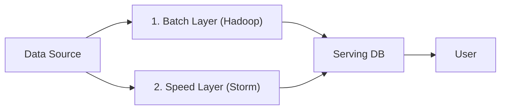

# 01. The Evolution of Stream Processing

## 1. Introduction
The transition from Batch to Streaming wasn't just about speed; it was about **Correctness**. The "Lambda Architecture" was an admission of defeat—an acknowledgment that stream processing engines were unreliable.

---

## 2. The Era of the Hack: Lambda Architecture
*   **Premise**: "Streaming is fast but error-prone. Batch is slow but correct."
*   **Design**: Run both.
    *   **Speed Layer (Storm)**: Incremental updates. $Latency \approx 100ms$. $Accuracy \approx 99\%$.
    *   **Batch Layer (Hadoop)**: Re-compute everything every night. $Latency \approx 24h$. $Accuracy = 100\%$.
    *   **Serving Layer**: Merge the views. $Query = BatchView + SpeedView$.



### The "Staff Engineer" Criticism
The Lambda Architecture violates the **DRY (Don't Repeat Yourself)** principle at a distributed system level.
1.  **Logic Divergence**: You write logic in SQL (Hive) for Batch and Java (Storm) for Speed. Over time, `calculate_fraud()` diverges.
2.  **Operational Cost**: You maintain two distinct clusters (Hadoop + Storm) with different failure modes.

---

## 3. The Unification: Kappa Architecture
The Kappa Architecture proposes: **"The Batch Layer is redundant if the Stream Layer is correct."**

### Enabling Technology: The Log (Kafka)
by retaining data in Kafka for 7-30 days, we can treat "Batch" as simply "Replaying the Stream starting from Offset 0".

### Enabling Technology: Exact-Once Engines (Flink)
Flink introduced checkpointing (Chandy-Lamport) that guaranteed state consistency equal to Batch.

```mermaid
graph LR
    Source[Data Source] --> Stream["Streaming Engine (Flink)"]
    Stream --> Serving[Serving DB]
    Stream -.->|Replay (Code Change)| Stream
```

---

## 4. Micro-Batch (Spark) vs Continuous (Flink)
Why does Flink beat Spark Streaming for low latency?

| Feature | Micro-Batch (Spark) | Continuous (Flink) |
| :--- | :--- | :--- |
| **Execution** | Schedule 1,000 tiny jobs per second. | Long-running operators passing messages. |
| **Latency Floor** | ~500ms (Scheduler Overhead). | ~1ms (Network Overhead). |
| **State** | RDD Lineage (Recompute on fail). | Local RocksDB (Reload on fail). |
| **Flow Control** | Backpressure is hard (Batch size tuning). | Credit-based Backpressure (Natural). |

**Staff Verdict**: Use Spark Streaming for simple ETL where 5s latency is fine. Use Flink for true event-driven applications (Fraud, Alerting).
