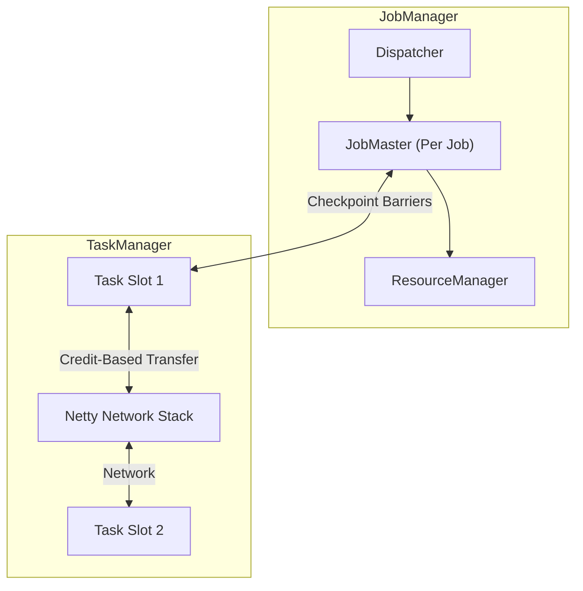
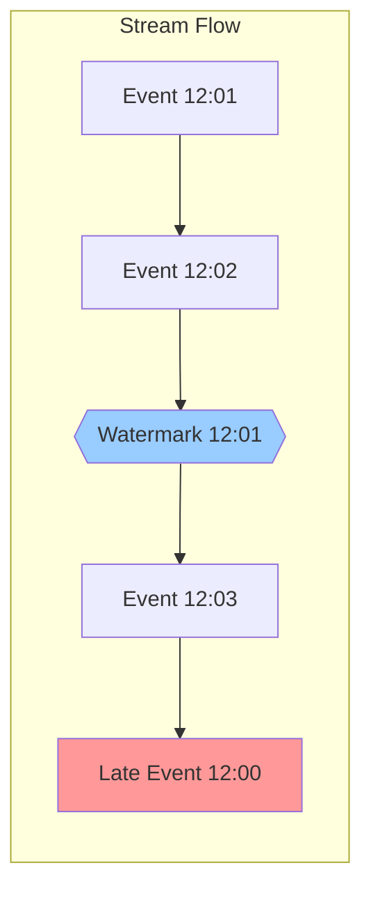
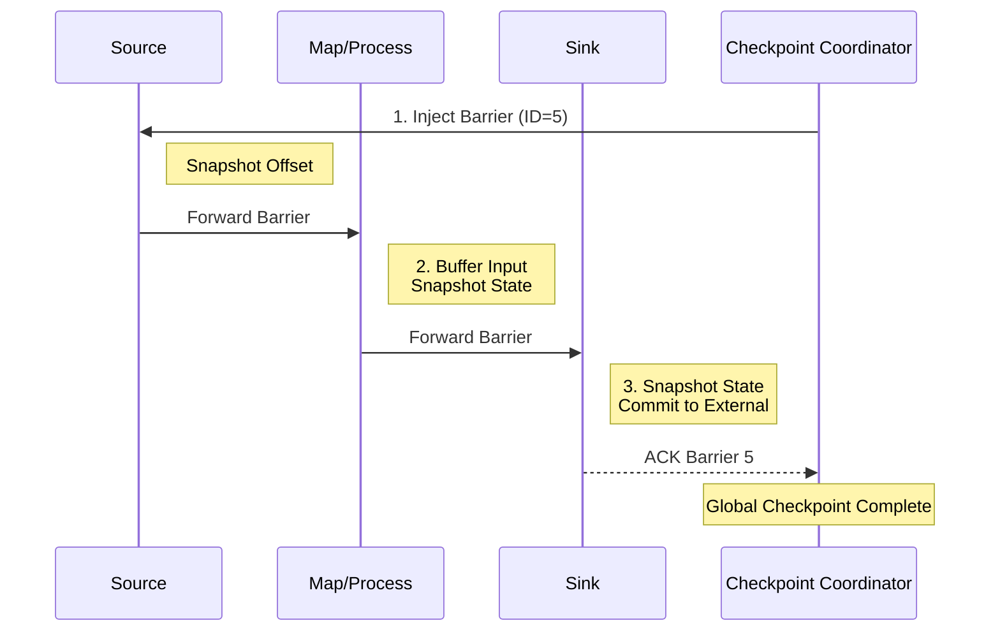
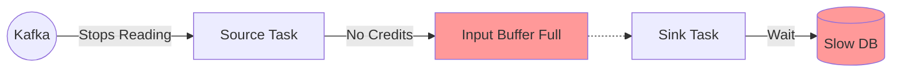

# Apache Flink: The Architecture of Infinite Streams

## Chapter 1: The Anatomy of the Runtime
A Flink cluster is not just a master and workers. It is a highly specialized distributed system designed for long-running stateful operators.

### 1. The JobManager Trinity
The "Master" is actually three distinct components working together:
*   **A. Dispatcher**: The entry point. It exposes the REST interface, accepts JobGraphs, and spins up a dedicated `JobMaster` for each job.
*   **B. ResourceManager**: The infrastructure liaison. It talks to K8s/YARN to request container slots. It doesn't care about "Jobs"; it cares about "Cpu/Ram".
*   **C. JobMaster**: The per-job brain. It holds the **Checkpoint Coordinator** (which triggers snapshots) and manages the execution graph.
    *   *Debug Note*: If checkpionts are failing, look at the JobMaster logs, not the Dispatcher.

### 2. The TaskManager: Network Stack
The TaskManager does the heavy lifting.
*   **TaskSlot**: A slice of resources (Fixed RAM). Unlike Spark Executors which share a heap, Flink TaskSlots enforce clearer boundaries.
*   **The Network Stack (Netty)**: This is where backpressure happens.
    *   **Credit-Based Flow Control**: A downstream operator (Consumer) must grant "credits" (buffer space) to the upstream operator (Producer) before data is sent.
    *   *Debug Note*: If a job stalls without CPU usage, it's likely a **Backpressure Deadlock**. The downstream is out of credits (stuck writing to DB), so the upstream stops reading from Kafka.

---

## Chapter 2: The Relativity of Time (Event vs Processing)
In stream processing, time is fluid. A user in a subway tunnel generates an event at 12:00, but it arrives at 12:05.

**Apache Flink** implies strict correctness using **Watermarks**. A Watermark `W(T)` is a guarantee: *"I assert no events older than T will verify."*

---

## Chapter 3: The Anatomy of State (RocksDB)
For production jobs, Flink embeds **RocksDB** on the local SSD.
1.  **MemTable**: In-memory write buffer.
2.  **SSTable**: Immutable disk file.
3.  **Compaction**: Merging SSTables in background.

**Key Architecture Note**: Because State is on Disk (Native Memory), Flink jobs are rarely heap-bound. They are **Disk I/O bound**. Monitoring IOPS is more important than monitoring GC.

---

## Chapter 4: The Promise of Correctness (Chandy-Lamport)
Flink guarantees exactly-once state using **Asynchronous Barrier Snapshots**.

---

## Chapter 5: The Transactional Sink (2PC)
To guarantee Exactly-Once Output to Kafka:
1.  **Phase 1 (Pre-Commit)**: Flink writes "Uncommitted" messages to Kafka during processing.
2.  **Phase 2 (Commit)**: When the Global Checkpoint completes, Flink sends `commitTransaction()`.

---

## Chapter 6: The Control Panel (Configuration)

| Configuration | Recommendation | Why? |
| :--- | :--- | :--- |
| `state.backend` | `rocksdb` | Heap is dangerous for large state. |
| `execution.checkpointing.unaligned` | `true` | **Crucial**. Allows barriers to skip queued data, preventing timeouts during backpressure. |
| `taskmanager.memory.network.fraction` | `0.1` | Increase if backpressure errors occur. |

---

## Chapter 7: End-to-End Walkthrough: The Flow of the Stream

Let's trace a Flink Job from submission to processing to see how the "Trinity" and "Stack" interact.

### 1. Submission Phase
*   **User**: Runs `flink run -d my-job.jar`.
*   **Dispatcher**: Receives the `JobGraph`. Spins up a **JobMaster**.
*   **ResourceManager**: Asks K8s for Pods. Allocates **TaskSlots**.

### 2. Execution Phase
*   **JobMaster**: Deploys tasks to TaskSlots.
*   **TaskSlot**:
    *   Allocates Memory (Managed Memory & Network Buffers).
    *   Starts the Operator Chain: `Source -> Map -> Window -> Sink`.

### 3. The Processing Loop
*   **Source**: Reads from Kafka.
*   **Network Stack**:
    *   Serializes record into specific **Netty Buffers** (32KB chunks).
    *   **Credit Check**: Asks downstream: "Do you have space?"
    *   **Transfer**: If Yes, sends buffer. If No, waits (Backpressure).

---

## Chapter 8: Failure Scenarios (The Senior View)

### 1. Failure Scenario A: The Backpressure Deadlock
**Symptom**: Job is running (Green in UI), but Throughput is 0.
**Cause**: Downstream Sink (e.g., Postgres) is slow.
**Mechanism**:
1.  **Sink** fills its input buffers.
2.  **Netty** stops sending credits upstream.
3.  **Source** fills its output buffers and stops reading from Kafka.
**Visual**:

### 2. Failure Scenario B: The Barrier Alignment Timeout
**Symptom**: `CheckpointExpiredException`.
**Cause**: **Data Skew**. One operator instance is processing 90% of data.
**Mechanism**:
1.  **Checkpoint Coordinator** sends Barrier ID=5.
2.  **Fast Task** processes Barrier 5 and waits.
3.  **Slow Task** (Skewed) has 1GB of data *before* Barrier 5 in its queue.
4.  **Result**: Fast Task waits for minutes. Checkpoint times out before Slow Task sees Barrier 5.
**Fix**: Use `execution.checkpointing.unaligned = true` to let Barriers jump the queue.
