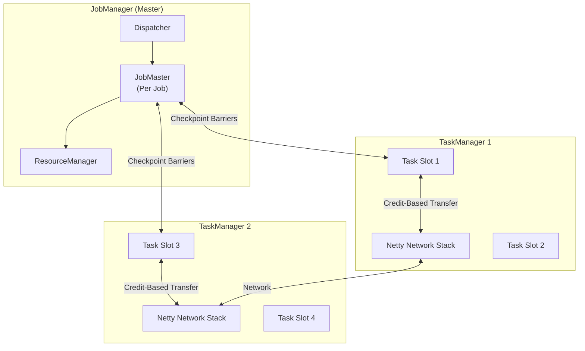
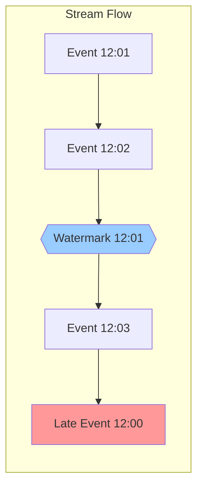
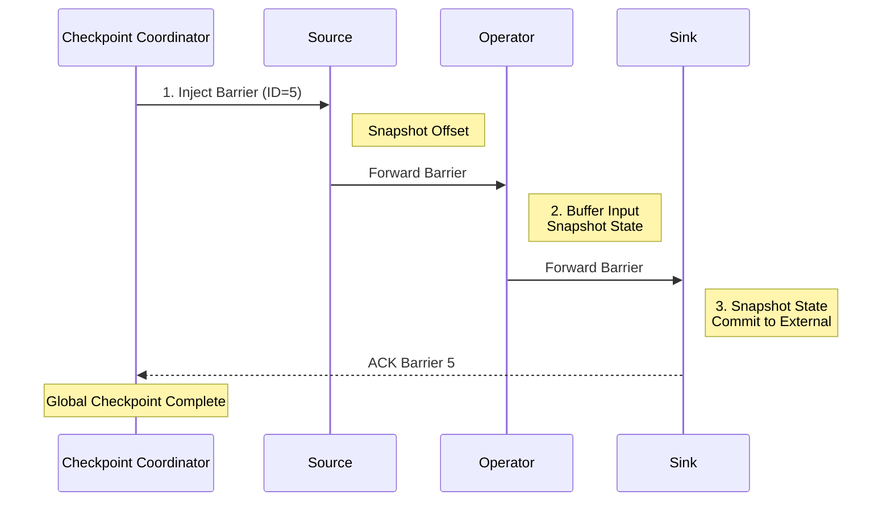
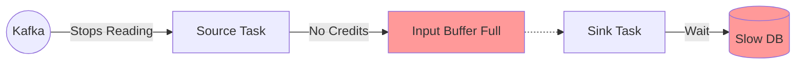

# Apache Flink: The Architecture of Infinite Streams

## 1. Introduction
Apache Flink is an **open-source stream processing framework** designed for **stateful computations over unbounded and bounded data streams**. Unlike Spark (which is batch-first with streaming bolt-on), Flink is **stream-native** from the ground up.

It provides **exactly-once processing guarantees**, **event-time processing**, and **low-latency** (sub-second) execution, making it the de facto choice for real-time analytics, fraud detection, and complex event processing.

---

## 2. Core Architecture

Flink follows a **master-worker** architecture, but with a unique "Trinity" structure.

### Key Components
1.  **JobManager Trinity**: The control plane (Dispatcher, JobMaster, ResourceManager).
2.  **TaskManager**: The data plane that runs the actual stream processing operators.
3.  **TaskSlot**: A fixed slice of resources (RAM + CPU) for running tasks.
4.  **Netty Network Stack**: Credit-based flow control prevents backpressure deadlocks.

---

## 3. How It Works: Time and State

### A. The Relativity of Time (Event vs Processing)
In stream processing, time is fluid. A user in a subway tunnel generates an event at 12:00, but it arrives at 12:05.

**Apache Flink** enforces strict correctness using **Watermarks**. A Watermark `W(T)` is a guarantee: *"I assert no events older than T will arrive."*

### B. The Anatomy of State (RocksDB)
Flink operators are **stateful**. Unlike Spark (which is mostly stateless), Flink must remember:
*   **Window Aggregates**: "Sum of purchases in the last 5 minutes."
*   **Session State**: "User's shopping cart state."

**Storage**: RocksDB (Embedded LSM-Tree).
*   **Off-Heap**: Lives outside JVM heap to avoid GC pauses.
*   **Disk-Backed**: Can hold TB-scale state on local SSD.

---

## 4. Deep Dive: Internal Implementation

### A. The JobManager Trinity

#### 1. Dispatcher
The entry point. It exposes the REST interface, accepts JobGraphs, and spins up a dedicated `JobMaster` for each job.

#### 2. ResourceManager
The infrastructure liaison. It talks to K8s/YARN to request container slots. It doesn't care about "Jobs"; it cares about "CPU/RAM".

#### 3. JobMaster (Per-Job Brain)
*   Holds the **Checkpoint Coordinator** (which triggers snapshots).
*   Manages the execution graph.
*   **Debug Note**: If checkpoints are failing, look at the JobMaster logs, not the Dispatcher.

### B. The TaskManager: Network Stack

The TaskManager does the heavy lifting.

#### 1. TaskSlot
A slice of resources (Fixed RAM). Unlike Spark Executors which share a heap, Flink TaskSlots enforce clearer boundaries.

#### 2. The Network Stack (Netty)
This is where backpressure happens.
*   **Credit-Based Flow Control**: A downstream operator (Consumer) must grant "credits" (buffer space) to the upstream operator (Producer) before data is sent.
*   **Debug Note**: If a job stalls without CPU usage, it's likely a **Backpressure Deadlock**. The downstream is out of credits (stuck writing to DB), so the upstream stops reading from Kafka.

### C. The Checkpoint Mechanism (Chandy-Lamport)

Flink uses a distributed snapshot algorithm called **Chandy-Lamport**.

**The Mechanism**:
1.  **Checkpoint Coordinator** (in JobMaster) sends a **Barrier** with ID (e.g., Barrier 5) to all source operators.
2.  **Source Operator**: Snapshots its state (current Kafka offset), forwards the Barrier downstream.
3.  **Intermediate Operator**: When Barrier 5 arrives on *all* input streams, it snapshots state and forwards.
4.  **Sink Operator**: Snapshots state, sends ACK to Coordinator.
5.  **Global Checkpoint Complete**: All operators have confirmed.

### D. The Transactional Sink (2PC)
To guarantee **Exactly-Once Output** to Kafka:
1.  **Phase 1 (Pre-Commit)**: Flink writes "Uncommitted" messages to Kafka during processing.
2.  **Phase 2 (Commit)**: When the Global Checkpoint completes, Flink sends `commitTransaction()`.

---

## 5. End-to-End Walkthrough: The Flow of the Stream

Let's trace a Flink Job from submission to processing.

### Step 1: Submission Phase
*   **User**: Runs `flink run -d my-job.jar`.
*   **Dispatcher**: Receives the `JobGraph`. Spins up a **JobMaster**.
*   **ResourceManager**: Asks K8s for Pods. Allocates **TaskSlots**.

### Step 2: Execution Phase
*   **JobMaster**: Deploys tasks to TaskSlots.
*   **TaskSlot**:
    *   Allocates Memory (Managed Memory & Network Buffers).
    *   Starts the Operator Chain: `Source -> Map -> Window -> Sink`.

### Step 3: The Processing Loop
*   **Source**: Reads from Kafka.
*   **Network Stack**:
    *   Serializes record into specific **Netty Buffers** (32KB chunks).
    *   **Credit Check**: Asks downstream: "Do you have space?"
    *   **Transfer**: If Yes, sends buffer. If No, waits (Backpressure).

### Step 4: Checkpointing
*   **Checkpoint Coordinator**: Every 60s, injects Barrier into the stream.
*   **Operators**: Snapshot state to RocksDB, then to S3/HDFS.
*   **Completion**: JobMaster marks Checkpoint 5 as complete.

---

## 6. Failure Scenarios (The Senior View)

### Scenario A: The Backpressure Deadlock
**Symptom**: Job is running (Green in UI), but Throughput is 0.
**Cause**: Downstream Sink (e.g., Postgres) is slow.

**Mechanism**:
1.  **Sink** fills its input buffers.
2.  **Netty** stops sending credits upstream.
3.  **Source** fills its output buffers and stops reading from Kafka.

**The Fix**: Scale the sink (more parallel instances) or use async I/O.

### Scenario B: The Barrier Alignment Timeout
**Symptom**: `CheckpointExpiredException`.
**Cause**: **Data Skew**. One operator instance is processing 90% of data.

**Mechanism**:
1.  **Checkpoint Coordinator** sends Barrier ID=5.
2.  **Fast Task** processes Barrier 5 and waits.
3.  **Slow Task** (Skewed) has 1GB of data *before* Barrier 5 in its queue.
4.  **Result**: Fast Task waits for minutes. Checkpoint times out before Slow Task sees Barrier 5.

**The Fix**: Use `execution.checkpointing.unaligned = true` to let Barriers jump the queue.

---

## 7. Performance Tuning & Configuration

| Configuration | Recommendation | Why? |
| :--- | :--- | :--- |
| `state.backend` | `rocksdb` | Heap is dangerous for large state. |
| `execution.checkpointing.unaligned` | `true` | **Crucial**. Allows barriers to skip queued data, preventing timeouts during backpressure. |
| `taskmanager.memory.network.fraction` | `0.1` | Increase if backpressure errors occur. |
| `state.checkpoints.dir` | `s3://bucket/checkpoints` | Use distributed storage (S3/HDFS), not local disk. |
| `execution.checkpointing.interval` | `60000` (60s) | Balance between recovery time and overhead. |

---

## 8. When to Use Flink?

| Use Case | Verdict | Why? |
| :--- | :--- | :--- |
| **Real-time Analytics** | **YES** | Sub-second latency, event-time windows. |
| **Fraud Detection** | **YES** | Stateful rules + exactly-once guarantees. |
| **Stream Joins** | **YES** | Flink's stream join is more mature than Spark. |
| **Batch ETL** | **MAYBE** | Flink can do batch, but Spark is more common. |
| **Small-Scale Jobs (< 1GB/day)** | **NO** | Overhead of distributed state isn't worth it. Use Kafka Streams. |

---

## 9. Production Checklist

1.  [ ] **Checkpointing**: Enable with `execution.checkpointing.interval=60000`.
2.  [ ] **State Backend**: Use RocksDB (`state.backend: rocksdb`).
3.  [ ] **Unaligned Checkpoints**: Enable `execution.checkpointing.unaligned=true` to handle backpressure.
4.  [ ] **Filesystem**: Use S3/HDFS for `state.checkpoints.dir` (not local disk).
5.  [ ] **Metrics**: Integrate with Prometheus to monitor backpressure and checkpoint duration.
6.  [ ] **Resource Allocation**: Set `taskmanager.memory.managed.fraction=0.4` for RocksDB.
