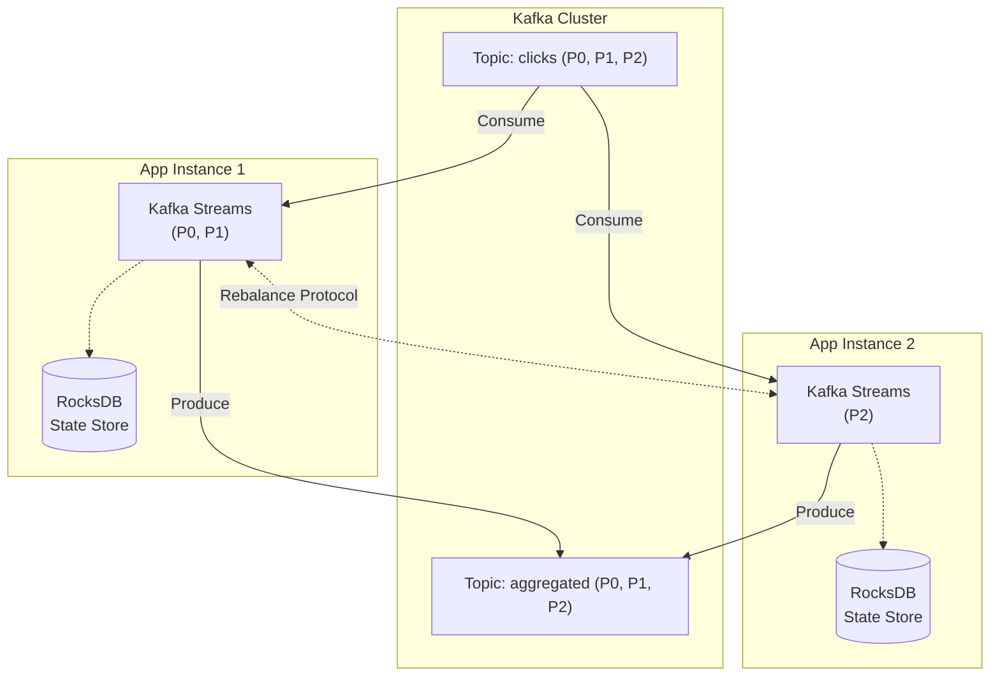

# 02. Kafka Streams: Stream Processing Without a Cluster

## 1. Introduction

**Kafka Streams** is a client library for building stream processing applications on top of Apache Kafka. Unlike Flink (which requires a separate cluster), Kafka Streams is **embedded directly into your application** - it's just a JAR dependency.

### The Problem: Flink is Overkill for Simple Use Cases

**Complexity Spectrum**:
- **Simple**: Transform Kafka topic A → topic B (map, filter)
- **Medium**: Windowed aggregations, joins between topics
- **Complex**: CEP, ML inference, multi-source joins

**Flink Overhead**:
- Deploy and manage separate cluster (JobManager, TaskManagers)
- Learn complex API (DataStream, ProcessFunction)
- Monitor additional infrastructure
- **Total Cost**: 3-5 engineers to maintain Flink cluster

**Kafka Streams Simplicity**:
- Add one JAR to your existing microservice
- No cluster to manage (scales with your app instances)
- Exactly-once semantics out of the box
- **Total Cost**: 0 additional infrastructure

### Historical Context

**Timeline**:
- **2016**: Kafka Streams 0.10 released (Confluent)
- **2017**: Production-ready (exactly-once semantics added)
- **2018**: Interactive queries (queryable state stores)
- **2020**: Improved DSL, better windowing
- **2024**: Kafka 3.6+ with enhanced exactly-once performance

**Why It Was Created**:
- Many Kafka users only needed simple transformations
- Running Flink/Storm for `map()` felt wasteful
- Tight Kafka integration enables optimizations impossible in Flink

### Key Differentiators

- **No Cluster**: Runs embedded in your application (just a library)
- **Exactly-Once by Default**: Kafka transactions ensure no duplicates
- **Elastic**: Add app instances = automatic rebalancing
- **Stateful**: Local RocksDB stores for aggregations, joins
- **Interactive Queries**: Query running application's state via REST API

### When to Use

**Kafka Streams** (library):
- Source and sink are Kafka topics
- Transformations are simple (map, filter, aggregate)
- Want to avoid managing separate cluster
- Team knows Java/Scala (or Python via ksqlDB)

**Apache Flink** (cluster):
- Multiple sources (Kafka + databases + files)
- Complex CEP patterns
- ML inference requiring GPU
- Sub-10ms latency requirements
- Need SQL interface without ksqlDB

### Industry Adoption

- **Pinterest**: Real-time spam detection
- **Zalando**: Fashion recommendations
- **New York Times**: Real-time analytics
- **Rabobank**: Fraud detection
- **Line Corp**: Messaging analytics

---

## 2. Core Architecture

Kafka Streams applications are **distributed** but **decentralized** - no master node.



### Key Components

1. **Stream**: Unbounded sequence of records from Kafka topic
2. **KStream**: Record stream (every event is independent)
3. **KTable**: Changelog stream (latest value per key)
4. **GlobalKTable**: Fully replicated table (all partitions on all instances)
5. **State Store**: Local RocksDB database for stateful operations
6. **Processor Topology**: DAG of stream transformations

### No Master Node

Unlike Flink (JobManager), Kafka Streams uses **consumer group protocol**:
- All instances join same consumer group
- Kafka coordinator assigns partitions automatically
- Rebalance when instance added/removed
- **Result**: Self-managing, no SPOF

---

## 3. How It Works: The Lifecycle

### Application Startup

**Step 1: Topology Definition** (compile time)
```java
StreamsBuilder builder = new StreamsBuilder();
KStream<String, String> clicks = builder.stream("clicks");
KTable<String, Long> counts = clicks
    .groupByKey()
    .count(Materialized.as("counts-store"));
counts.toStream().to("aggregated");
```

**Step 2: Streams Instance Creation**
```java
Properties props = new Properties();
props.put(StreamsConfig.APPLICATION_ID_CONFIG, "click-counter");
props.put(StreamsConfig.BOOTSTRAP_SERVERS_CONFIG, "kafka:9092");

KafkaStreams streams = new KafkaStreams(builder.build(), props);
streams.start(); // Non-blocking
```

**Step 3: Partition Assignment**
- Joins consumer group `click-counter`
- Kafka assigns topic partitions (e.g., P0, P1 to Instance 1)
- Creates local state stores for assigned partitions

**Step 4: Processing Loop**
- Poll records from assigned partitions
- Apply transformations
- Write to state store (if stateful)
- Produce output to Kafka
- Commit transaction (exactly-once)

### Exactly-Once Semantics

**Mechanism**: Kafka transactions (since 0.11)

```
1. Begin transaction
2. Read N records from input topic
3. Process transformations
4. Write to state store (RocksDB)
5. Produce output records
6. Commit transaction:
   - Output records visible atomically
   - Consumer offset committed
   - State store checkpoint
```

**Guarantee**: Either all succeed or all rollback (no partial results)

### Rebalancing

**Trigger**: App instance added/removed/crashed

**Process**:
1. Pause processing
2. Kafka reassigns partitions
3. New owner restores state from changelog topic
4. Resume processing

**Restoration**:
- Each state store has changelog topic in Kafka
- New partition owner replays changelog to rebuild RocksDB
- Can take minutes for large state (GB)
- **Optimization**: Standby replicas (keep state warm)

---

## 4. Deep Dive: State Management

### State Stores

Kafka Streams provides **local state stores** backed by RocksDB.

**Types**:
1. **Key-Value Store**: `counts.put("user123", 42L)`
2. **Window Store**: `clicks.put(window(2024-01-05 10:00), "user123", 5)`
3. **Session Store**: Variable-length windows based on inactivity

**Storage**:
```
/tmp/kafka-streams/
  click-counter/           # Application ID
    0_0/                   # Partition 0, Task 0
      rocksdb/
        counts-store/      # State store name
          000001.sst       # RocksDB SSTable files
          MANIFEST
```

### Changelog Topics

**Purpose**: Durability + restoration after rebalance

**Mechanism**:
```
State Store: counts-store
Changelog Topic: click-counter-counts-store-changelog

Every put() to RocksDB:
  1. Write to local RocksDB
  2. Send to changelog topic
  3. Both succeed or transaction aborts
```

**Compaction**: Changelog topics are **log-compacted**
- Only latest value per key retained
- Enables fast restoration (don't replay full history)
- Cleanup policy: `cleanup.policy=compact`

### Interactive Queries

**Problem**: State is local to each instance - how to query?

**Solution**: Key-value lookup API

```java
// In your Kafka Streams app
ReadOnlyKeyValueStore<String, Long> store = 
    streams.store(StoreQueryParameters.fromNameAndType(
        "counts-store", QueryableStoreTypes.keyValueStore()));

Long count = store.get("user123"); // Read local state
```

**REST Endpoint**:
```java
@GetMapping("/count/{userId}")
public Long getCount(@PathVariable String userId) {
    // Lookup which instance owns this key
    KeyQueryMetadata metadata = streams.queryMetadataForKey(
        "counts-store", userId, Serdes.String().serializer());
    
    if (metadata.activeHost().equals(thisHost)) {
        return localStore.get(userId); // Local read
    } else {
        return httpClient.get(metadata.activeHost(), "/count/" + userId); 
        // Proxy to correct instance
    }
}
```

---

## 5. End-to-End Walkthrough: Click Aggregation

**Scenario**: Count user clicks per 5-minute window and expose counts via REST API

### Step 1: Define the Topology

Create the processing pipeline (this is just configuration, not execution yet):

**Input**: Kafka topic `user-clicks` with events: `{userId: "user123", url: "/home", timestamp: 1704447600}`

**Transformations**:
1. Group events by `userId`
2. Create 5-minute tumbling windows
3. Count events per window
4. Store results in local state store

**Output**: Kafka topic `aggregated-clicks` with counts: `("user123@10:00:00", 42)`

### Step 2: Configure the Application

Set application-level settings:

**Application ID**: `click-aggregator`
- Acts as consumer group name
- Prefixes all internal topics (changelogs, repartition topics)

**Processing Guarantee**: `exactly_once_v2`
- Kafka transactions ensure no duplicates
- Atomic commit: output records + state + consumer offsets

**State Directory**: `/tmp/kafka-streams/click-aggregator/`
- Local RocksDB storage location
- Each partition gets its own subdirectory

### Step 3: Application Startup (t=0s)

**Join Consumer Group**:
- Application connects to Kafka cluster
- Joins consumer group `click-aggregator`
- Kafka coordinator notices new member

**Partition Assignment**:
- Coordinator assigns input topic partitions
- Example: Instance 1 gets partitions [0, 1, 2]
- Assignment based on number of instances

**State Restoration**:
- Check if local RocksDB exists for assigned partitions
- If not, replay changelog topics to rebuild state
- Restoration time: ~1 minute per 1GB of state

**Ready to Process**: Application starts polling from assigned offsets

### Step 4: Process First Event (t=10s)

**Event Arrives**:
```
Partition: 0
Offset: 1000
Key: "user123"
Value: {url: "/home", timestamp: "2024-01-05 10:00:30"}
```

**Window Assignment**:
- Event timestamp: 10:00:30
- Window start: 10:00:00 (round down to 5-min boundary)
- Window end: 10:05:00
- Window key: `user123@10:00:00`

**State Update**:
1. Read current count from RocksDB: `counts["user123@10:00:00"] = 0`
2. Increment: `0 + 1 = 1`
3. Write to RocksDB: `counts["user123@10:00:00"] = 1`
4. Send to changelog topic: `click-aggregator-click-counts-store-changelog`

**Produce Output**:
- Key: `"user123@10:00:00"`
- Value: `1`
- Topic: `aggregated-clicks`
- *Note*: Output not visible yet (transaction uncommitted)

### Step 5: Process More Events (t=11s - t=4m)

**Second Event** (same user, same window):
```
Key: "user123"
Value: {url: "/profile", timestamp: "2024-01-05 10:01:45"}
```

**Processing**:
- Same window: `user123@10:00:00`
- Read count: `1`
- Increment: `1 + 1 = 2`
- Update RocksDB: `counts["user123@10:00:00"] = 2`
- Produce: `("user123@10:00:00", 2)` ← **Updated count**

**Why Output Multiple Times?**
- KTable semantics: Emit on every update
- Downstream consumers see progressive updates
- Final value at window close is authoritative

### Step 6: Transaction Commit (t=1s intervals)

Every `commit.interval.ms` (default: 1000ms), Kafka Streams commits:

**Atomic Commit**:
1. All output records produced in last 1 second
2. All state store updates
3. Consumer offset advancement

**Kafka Transaction**:
- `BEGIN TRANSACTION`
- Write 50 output records to `aggregated-clicks`
- Write 50 state updates to changelog
- Commit offset=1050 for partition 0
- `COMMIT TRANSACTION`

**Result**: Either all visible or none (no partial results)

### Step 7: Window Close (t=10:05:00)

**Event with Later Timestamp**:
```
Key: "user456"
timestamp: "2024-01-05 10:05:30" ← New window
```

**Watermark Advancement**:
- Previous window [10:00:00 - 10:05:00] is now closed
- No more events can arrive for this window (no grace period in this example)
- State retained for querying

**Final Count**:
- `user123@10:00:00`: 42 clicks (final)
- Output record with final=true flag (if configured)

### Step 8: Interactive Query (t=10:06:00)

**REST API Request**: `GET /count/user123?window=2024-01-05T10:00:00`

**Processing**:
1. Hash `user123` to determine partition owner
2. Partition 0 → owned by Instance 1 (this instance)
3. Read from local RocksDB: `counts["user123@10:00:00"]`
4. Return: `{count: 42, window: "10:00:00-10:05:00"}`

**If Different Instance**:
- Hash determines Instance 2 owns the key
- Proxy request: `HTTP GET http://instance-2:8080/count/user123`
- Instance 2 reads its local RocksDB
- Return result to client

### Step 9: Rebalance Event (t=15m)

**Trigger**: New application instance added (Instance 3 joins)

**Rebalance Process**:
1. **Pause Processing**: All instances stop polling
2. **Revoke Partitions**: Instance 1 releases partition 2
3. **Assign Partitions**: Partition 2 → Instance 3
4. **Restore State**: Instance 3 replays `partition-2` changelog
   - Reads from offset 0 to latest
   - Rebuilds RocksDB locally
   - Time: 30 seconds for 100MB state
5. **Resume**: All instances resume processing

**Exactly-Once Preserved**: No records lost or duplicated during rebalance

### Step 10: Failure Recovery (Instance 1 Crashes)

**Detection**:
- Instance 1 misses heartbeat (10s default)
- Kafka coordinator marks it dead
- Triggers rebalance

**Partition Reassignment**:
- Partitions [0, 1, 2] previously owned by Instance 1
- Reassigned to Instances 2 and 3
- Each restores their new partitions from changelog

**Transaction Rollback**:
- Instance 1's uncommitted transaction is aborted
- Last committed offset: 1050
- New owner starts from offset 1050 (no gaps)

**State Recovery**:
- Instance 2 replays `partition-0` changelog
- Rebuilds exact state Instance 1 had at offset 1050
- Processing resumes with zero data loss

### Performance Summary

| Phase | Duration | Bottleneck |
|:------|:---------|:-----------|
| Startup & Join | 2s | Kafka coordinator election |
| State Restoration | 30s | Changelog replay (100MB @ 3MB/s) |
| Steady State Processing | Ongoing | Disk writes to RocksDB |
| Transaction Commit | 10ms | Kafka broker write latency |
| Rebalance | 35s | State restoration on new owner |
| Interactive Query | <1ms | Local RocksDB read |

**Throughput**: ~10,000 events/sec per instance (single thread)

---

## 6. Failure Scenarios

### Scenario A: Instance Crash

**Symptom**: App crashes mid-processing

**Mechanism**:
1. Consumer group detects missing heartbeat (30s default)
2. Kafka triggers rebalance
3. Surviving instances claim orphaned partitions
4. Restore state from changelog topic
5. Resume from last committed offset

**Exactly-Once Guarantee**: Transaction uncommitted → rolled back, no duplicates

### Scenario B: Slow Restoration

**Symptom**: Rebalance takes 10+ minutes due to large state

**Cause**: New partition owner must replay entire changelog (100GB+)

**Fix**:
```java
props.put(StreamsConfig.NUM_STANDBY_REPLICAS_CONFIG, 1);
```
- Maintains hot standby replicas on other instances
- Standby already has state → instant takeover
- Trade-off: 2× memory usage

### Scenario C: Kafka Unavailable

**Symptom**: Kafka cluster unreachable

**Behavior**:
- Streams app retries indefinitely (configurable)
- Processing paused
- State not lost (local RocksDB intact)
- Resumes when Kafka returns

---

## 7. Performance Tuning

| Configuration | Recommended | Purpose |
|:--------------|:------------|:--------|
| `num.stream.threads` | 2-4 per instance | Parallelism within instance |
| `commit.interval.ms` | 1000 (1s) | Transaction frequency (latency vs throughput) |
| `cache.max.bytes.buffering` | 10MB | In-memory cache before RocksDB write |
| `num.standby.replicas` | 1 | Fast rebalancing for stateful apps |
| `rocksdb.block.cache.size` | 50MB per store | RocksDB read cache |

### Scalability

**Horizontal Scaling**:
- Add app instances → Kafka automatically rebalances
- Max parallelism = input topic partition count
- Example: 12 partitions = max 12 app instances

**Optimization**:
- Use`repartition()` to increase parallelism mid-topology
- Avoid `GlobalKTable` for large datasets (full replication)

---

## 8. Constraints & Limitations

| Constraint | Limit | Why? |
|:-----------|:------|:-----|
| **Kafka Only** | Cannot read from databases, files | Tied to Kafka ecosystem |
| **Java/Scala** | No native Python (use ksqlDB or PyFlink) | JVM library |
| **State Size** | Limited by disk on instance | RocksDB local storage |
| **Latency** | 10-100ms typical | Transaction commit overhead |
| **Single Cluster** | One Kafka cluster per app | No multi-cluster joins |

---

## 9. When to Use Kafka Streams?

| Use Case | Verdict | Why? |
|:---------|:--------|:-----|
| **Kafka → Transform → Kafka** | ✅ **YES** | Perfect fit, no cluster needed |
| **Stateless ETL** | ✅ **YES** | Simple map/filter operations |
| **Windowed Aggregations** | ✅ **YES** | Built-in windowing support |
| **Stream-Table Joins** | ✅ **YES** | `KStream.join(KTable)` optimized |
| **Multiple Sources (DB + Kafka)** | ❌ **NO** | Use Flink (supports JDBC, files, etc.) |
| **Complex CEP** | ❌ **NO** | Use Flink (richer pattern matching) |
| **Sub-10ms Latency** | ❌ **NO** | Transaction commits add ~10ms overhead |
| **Team Prefers SQL** | ⚠️ **MAYBE** | Use ksqlDB (Kafka Streams under the hood) |

---

## 10. Production Checklist

1. [ ] **Enable Exactly-Once**: Set `processing.guarantee=exactly_once_v2`
2. [ ] **Configure Standby Replicas**: Set `num.standby.replicas=1` for stateful apps
3. [ ] **Tune Commit Interval**: Balance latency (`500ms`) vs throughput (`5000ms`)
4. [ ] **Monitor Lag**: Track consumer lag per partition
5. [ ] **Disk Space**: Allocate 2× expected state size for RocksDB + changelog
6. [ ] **Graceful Shutdown**: Use shutdown hooks to close streams cleanly
7. [ ] **Changelog Compaction**: Verify changelog topics have `cleanup.policy=compact`
8. [ ] **Partition Count**: Ensure input topics have enough partitions for scaling

**Critical Metrics**:

```
kafka_streams_commit_latency_avg:
  Description: Average transaction commit time
  Target: < 100ms
  Alert: if > 500ms
  Why: High commit latency = pipeline backup

kafka_streams_restore_time_total:
  Description: Time to restore state after rebalance
  Target: < 60s
  Alert: if > 300s
  Why: Long restoration = app unavailable
  Fix: Enable standby replicas

kafka_streams_state_store_size_bytes:
  Description: Local RocksDB size per store
  Target: Monitor growth trend
  Alert: if > 80% of allocated disk
  Why: Out of disk = crash

kafka_streams_failed_stream_threads:
  Description: Count of stream threads that died
  Target: 0
  Alert: if > 0
  Why: Indicates bugs or resource exhaustion
```
