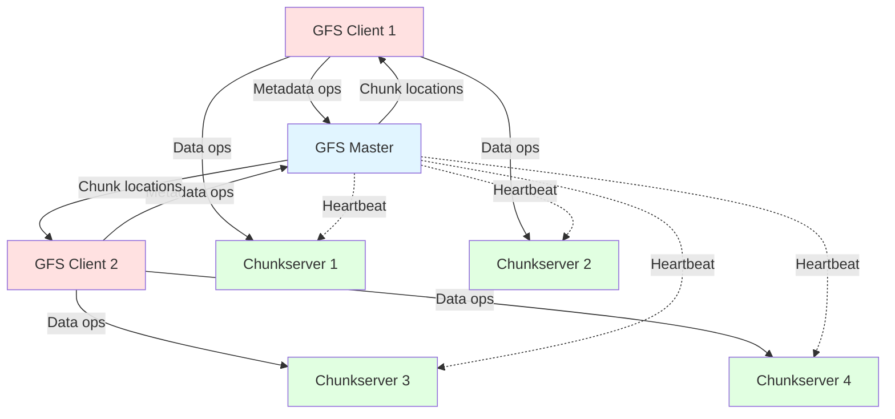
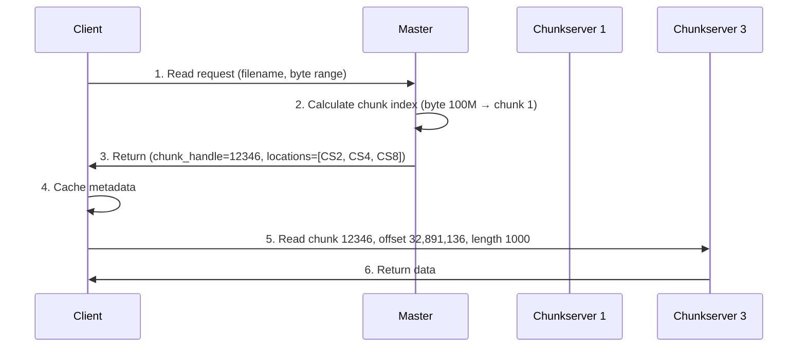
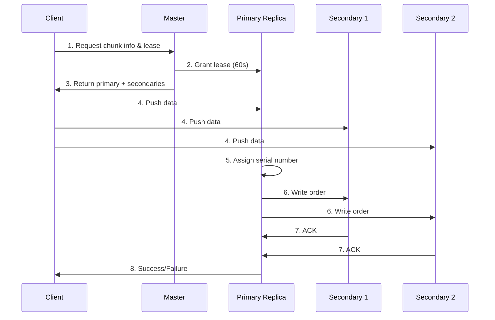
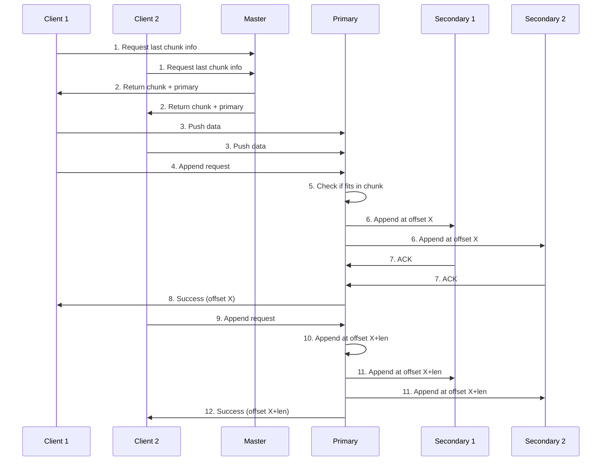

# Google File System (GFS) Internals: How It Works Behind the Scenes

This guide explains how Google File System manages petabytes of data across thousands of machines, covering architecture, replication, fault tolerance, and operation flows.

## Table of Contents
1. [GFS Architecture Overview](#gfs-architecture-overview)
2. [Components Deep Dive](#components-deep-dive)
3. [Chunk Organization](#chunk-organization)
4. [File Operations: Read, Write, Append](#file-operations-read-write-append)
5. [Replication and Fault Tolerance](#replication-and-fault-tolerance)
6. [Master Operations](#master-operations)
7. [Consistency Model](#consistency-model)
8. [Garbage Collection](#garbage-collection)

---

## GFS Architecture Overview

Google File System is a **distributed file system** designed for:
- **Large files** (multi-GB files are common)
- **Append-heavy workloads** (most writes are appends, not random writes)
- **High throughput** over low latency
- **Fault tolerance** (component failures are the norm, not the exception)

### Key Design Principles

> [!IMPORTANT]
> **Core Assumptions:**
> - Component failures are common (disks, machines, network)
> - Files are huge (multi-GB is typical)
> - Most mutations are appends, not overwrites
> - Co-designing applications and file system API benefits overall system

### High-Level Architecture



**Key separation:**
- **Control flow** (metadata): Client ↔ Master
- **Data flow**: Client ↔ Chunkservers (bypasses Master!)

---

## Components Deep Dive

### 1. GFS Master (Single Master)

**Responsibilities:**
- Maintains all **file system metadata**
- Manages **namespace** (directory hierarchy)
- Tracks **chunk locations** for each file
- Makes **chunk placement** decisions
- Coordinates **garbage collection**
- Handles **chunk migration** for load balancing

**Metadata stored in memory:**

| Metadata Type | Description | Persistent? |
|---------------|-------------|-------------|
| **Namespace** | File and directory names | Yes (operation log) |
| **File-to-chunk mapping** | Which chunks belong to which file | Yes (operation log) |
| **Chunk locations** | Which chunkservers have each chunk | No (rebuilt at startup) |

**Why single master?**
- Simplifies design (no distributed consensus needed)
- All metadata fits in memory (64 bytes per 64MB chunk)
- Clients cache metadata, reducing master load

**Master persistence:**
```
/master/
├── operation_log          # All metadata mutations (persistent)
├── checkpoint            # Periodic snapshot of namespace
└── memory/
    ├── namespace_tree    # In-memory file/directory tree
    ├── file_to_chunks    # In-memory mapping
    └── chunk_locations   # In-memory (rebuilt from chunkservers)
```

### 2. Chunkservers

**Responsibilities:**
- Store **64MB chunks** as Linux files
- Serve **read/write requests** from clients
- Send **heartbeat** messages to master
- Report **chunk inventory** to master
- Perform **chunk replication** as directed by master

**Storage layout:**
```
/chunkserver/data/
├── chunk_12345.dat       # 64MB chunk file
├── chunk_12346.dat
├── chunk_12347.dat
└── chunk_12348.dat
```

Each chunk is stored as a **plain Linux file** with a unique 64-bit chunk handle.

### 3. GFS Client

**Responsibilities:**
- Implements **file system API** (open, read, write, append, close)
- Caches **metadata** from master
- Communicates with **chunkservers** for data operations
- **Never caches data** (to avoid cache coherence issues)

---

## Chunk Organization

### Chunk Basics

**Chunk size:** 64 MB (much larger than typical file systems)

**Why 64MB?**
- ✅ Reduces metadata size (fewer chunks per file)
- ✅ Reduces client-master interaction (one request covers more data)
- ✅ Reduces network overhead (persistent TCP connections)
- ❌ Can waste space for small files (internal fragmentation)

### File-to-Chunk Mapping

**Example file:**
```
File: /data/logs/access.log (200 MB)

Chunks:
├── Chunk 0 (handle: 12345): bytes 0-67,108,863
├── Chunk 1 (handle: 12346): bytes 67,108,864-134,217,727
└── Chunk 2 (handle: 12347): bytes 134,217,728-199,999,999
```

**Master metadata:**
```json
{
  "filename": "/data/logs/access.log",
  "chunks": [
    {
      "chunk_handle": 12345,
      "chunk_index": 0,
      "version": 5,
      "locations": ["chunkserver1", "chunkserver3", "chunkserver7"]
    },
    {
      "chunk_handle": 12346,
      "chunk_index": 1,
      "version": 5,
      "locations": ["chunkserver2", "chunkserver4", "chunkserver8"]
    },
    {
      "chunk_handle": 12347,
      "chunk_index": 2,
      "version": 3,
      "locations": ["chunkserver1", "chunkserver5", "chunkserver9"]
    }
  ]
}
```

### Chunk Replication

**Default replication factor:** 3 copies

**Replica placement strategy:**
- Spread across **racks** (survive rack failure)
- Spread across **machines** (survive machine failure)
- Balance **disk utilization**

**Example placement:**
```
Chunk 12345 (3 replicas):
├── Primary: Rack A, Machine 1, Disk /dev/sda
├── Replica 1: Rack B, Machine 5, Disk /dev/sdb
└── Replica 2: Rack C, Machine 9, Disk /dev/sdc
```

---

## File Operations: Read, Write, Append

### READ Operation

**Scenario:** Client wants to read bytes 100,000,000 to 100,001,000 from `/data/logs/access.log`

**Step-by-step flow:**



**Detailed steps:**

1. **Client → Master**: "I need bytes 100,000,000-100,001,000 of `/data/logs/access.log`"
   
2. **Master calculates**:
   - Byte 100,000,000 ÷ 64MB = Chunk index 1
   - Chunk handle: 12346
   - Locations: [chunkserver2, chunkserver4, chunkserver8]

3. **Master → Client**: Returns chunk handle and locations

4. **Client caches** this metadata (future reads won't need master)

5. **Client → Chunkserver**: Picks closest chunkserver (e.g., chunkserver2)
   - Request: "Read chunk 12346, offset 32,891,136, length 1000"
   - Offset calculation: 100,000,000 - (1 × 64MB) = 32,891,136

6. **Chunkserver → Client**: Returns requested data

**Optimization:** Client caches chunk locations, so subsequent reads to the same chunk bypass the master entirely!

---

### WRITE Operation (Random Write)

**Scenario:** Client wants to write 1000 bytes at offset 50,000,000

> [!WARNING]
> Random writes are **rare** in GFS. Most workloads use **record appends** instead.

**Step-by-step flow:**



**Detailed steps:**

1. **Client → Master**: "I want to write to chunk 12345"

2. **Master grants lease**:
   - Picks one replica as **primary** (holds lease for 60 seconds)
   - Primary determines **serial order** for all mutations
   - Returns primary + secondary locations to client

3. **Client pushes data** to all replicas (pipelined):
   - Data flows: Client → Closest replica → Next replica → ...
   - Data is **buffered** in LRU cache, not yet written to disk

4. **Client sends write request** to primary:
   - "Write the buffered data at offset 50,000,000"

5. **Primary assigns serial number** and applies mutation

6. **Primary forwards write order** to all secondaries

7. **Secondaries apply mutation** in the same order

8. **Secondaries reply** to primary

9. **Primary replies** to client (success or failure)

**If any replica fails:**
- Client retries from step 4
- May result in inconsistent replicas (some have the write, some don't)
- GFS consistency model allows this!

---

### RECORD APPEND Operation (Most Common)

**Scenario:** Client wants to append a log record to `/data/logs/access.log`

**Why record append?**
- **Concurrent appends** from multiple clients
- **At-least-once semantics** (may have duplicates, but no lost data)
- **High throughput** (optimized for this workload)

**Step-by-step flow:**



**Detailed steps:**

1. **Client → Master**: "I want to append to `/data/logs/access.log`"

2. **Master**:
   - Identifies last chunk of file
   - If last chunk is full (>64MB), creates new chunk
   - Returns chunk handle + primary replica

3. **Client pushes data** to all replicas (pipelined)

4. **Client → Primary**: "Append this data"

5. **Primary checks** if data fits in current chunk:
   - If yes: Appends at current end offset
   - If no: Pads chunk to 64MB, tells client to retry with new chunk

6. **Primary appends** and forwards to secondaries

7. **Secondaries append** at the **same offset**

8. **Primary replies** with success and the **offset** where data was written

**Key difference from write:**
- **Primary chooses offset** (not client)
- Guarantees **atomic append** (all replicas have data at same offset)
- If failure occurs, client retries → may result in **duplicates**

**Handling failures:**

```
Scenario: Secondary 2 fails during append

Result:
├── Primary: Record at offset 1000 ✅
├── Secondary 1: Record at offset 1000 ✅
└── Secondary 2: No record ❌

Client retries:
├── Primary: Record at offset 1000 + duplicate at offset 1064 ✅
├── Secondary 1: Record at offset 1000 + duplicate at offset 1064 ✅
└── Secondary 2: Record at offset 1064 ✅

Final state: Replicas are INCONSISTENT but all have the data
Application must handle duplicates!
```

---

## Replication and Fault Tolerance

### Chunk Replication Strategy

**When does replication happen?**

1. **Creation**: New chunk created with 3 replicas
2. **Re-replication**: Replica count drops below target
3. **Rebalancing**: Master balances disk usage across chunkservers

**Re-replication triggers:**

| Event | Action |
|-------|--------|
| Chunkserver dies | Re-replicate all chunks on that server |
| Disk fails | Re-replicate chunks on that disk |
| Replication factor increased | Create additional replicas |
| Corruption detected | Re-replicate from good replica |

**Re-replication priority:**

```
Priority 1: Chunks with only 1 replica (critical!)
Priority 2: Chunks with 2 replicas
Priority 3: Chunks blocking client progress
Priority 4: Load balancing
```

### Chunk Version Numbers

**Purpose:** Detect stale replicas

**How it works:**

```
Initial state:
Chunk 12345, version 5:
├── Chunkserver 1: version 5 ✅
├── Chunkserver 3: version 5 ✅
└── Chunkserver 7: version 5 ✅

Chunkserver 7 goes down:
Master grants lease to Chunkserver 1 (primary)
Master increments version: 5 → 6

After mutation:
Chunk 12345:
├── Chunkserver 1: version 6 ✅ (up-to-date)
├── Chunkserver 3: version 6 ✅ (up-to-date)
└── Chunkserver 7: version 5 ❌ (STALE)

Chunkserver 7 comes back:
Reports version 5 to master
Master detects stale replica
Master garbage collects version 5
Master re-replicates version 6 to another chunkserver
```

**Master's version tracking:**
```json
{
  "chunk_handle": 12345,
  "version": 6,
  "replicas": [
    {"chunkserver": "cs1", "version": 6, "status": "valid"},
    {"chunkserver": "cs3", "version": 6, "status": "valid"},
    {"chunkserver": "cs7", "version": 5, "status": "stale"}
  ]
}
```

### Checksums for Corruption Detection

**Each chunkserver maintains checksums:**

```
Chunk 12345 (64MB):
├── Block 0 (64KB): checksum = 0xABCD1234
├── Block 1 (64KB): checksum = 0xEF567890
├── Block 2 (64KB): checksum = 0x12345678
...
└── Block 1023 (64KB): checksum = 0x9ABCDEF0
```

**On read:**
1. Chunkserver reads data
2. Computes checksum
3. Compares with stored checksum
4. If mismatch → reports error to client
5. Client retries from another replica
6. Master re-replicates chunk from good replica

---

## Master Operations

### Namespace Management

**Master stores namespace as a lookup table:**

```
Namespace (in-memory):
/data → directory
/data/logs → directory
/data/logs/access.log → file (chunks: [12345, 12346, 12347])
/data/logs/error.log → file (chunks: [12348, 12349])
```

**Locking:**
- Each node in namespace tree has a **read-write lock**
- Operations acquire locks in consistent order (prevent deadlock)

**Example: Creating `/data/logs/new.log`**
```
Locks acquired:
├── /data: read lock
├── /data/logs: read lock
└── /data/logs/new.log: write lock
```

### Chunk Creation

**When client creates a new chunk:**

1. **Master picks 3 chunkservers** based on:
   - Below-average disk utilization
   - Limit recent creations on each chunkserver
   - Spread across racks

2. **Master assigns chunk handle** (64-bit unique ID)

3. **Master sends create command** to chunkservers

4. **Chunkservers create empty chunk file**

5. **Master updates metadata** (in-memory + operation log)

### Lease Management

**Lease mechanism:**
- Master grants **60-second lease** to one replica (primary)
- Primary can request **extensions** (typically granted)
- If primary dies, master waits for lease to expire before granting to another replica

**Why leases?**
- Minimizes master involvement in mutations
- Primary serializes all mutations to a chunk
- Ensures consistency across replicas

---

## Consistency Model

### Consistency Guarantees

GFS provides **relaxed consistency** to achieve high performance:

| Operation | Guarantee |
|-----------|-----------|
| **File namespace mutations** (create, delete) | Atomic, serialized by master |
| **Write** | Consistent but possibly undefined (if concurrent) |
| **Record append** | At-least-once, defined interspersed with inconsistent |

### State Definitions

**Consistent:** All clients see the same data, regardless of which replica they read from

**Defined:** Consistent + clients see the mutation in its entirety

**Inconsistent:** Different clients may see different data

### Example Scenarios

**Scenario 1: Serial writes (no concurrent writes)**
```
Result: Defined ✅
All replicas have identical data
Clients see complete writes
```

**Scenario 2: Concurrent writes**
```
Client A writes "AAA" at offset 0
Client B writes "BBB" at offset 0

Possible result:
├── Replica 1: "AAABBB" (A's write, then B's write)
├── Replica 2: "BBBAAA" (B's write, then A's write)
└── Replica 3: "AABABB" (interleaved)

Result: Consistent but UNDEFINED ❌
(Replicas may differ, data is mingled)
```

**Scenario 3: Record appends**
```
Client A appends "AAA"
Client B appends "BBB"

Result:
├── Replica 1: ...AAA...BBB... ✅
├── Replica 2: ...AAA...BBB... ✅
└── Replica 3: ...AAA...BBB... ✅

Result: Defined ✅
(All replicas have both records, possibly with padding/duplicates)
```

### Application Strategies

**To handle relaxed consistency:**

1. **Use record appends** instead of random writes
2. **Include checksums** in application records
3. **Include unique IDs** to detect duplicates
4. **Write self-validating records** (can detect partial writes)

**Example record format:**
```
Record:
├── Checksum: 0xABCD1234
├── Record ID: UUID-12345
├── Length: 1000 bytes
└── Data: [actual payload]
```

---

## Garbage Collection

### Lazy Deletion

**When file is deleted:**

1. **Master renames file** to hidden name (e.g., `/data/.trash/access.log.12345`)
2. **Master sets deletion timestamp**
3. **File is NOT immediately removed**

**Background garbage collection:**

```
Master scans namespace every 3 days:
├── Find files in /trash older than 3 days
├── Remove from namespace
├── Mark chunks as deleted (in-memory metadata)

Master scans chunks periodically:
├── Find chunks not referenced by any file
├── Erase metadata for those chunks

Chunkservers report chunk inventory:
├── Master identifies chunks not in metadata
├── Master tells chunkserver to delete those chunks
```

**Benefits:**
- Simple and reliable (no complex distributed deletion protocol)
- Batched for efficiency
- Reclaims space from failed operations
- Allows undelete (within 3-day window)

### Stale Replica Detection

**Master detects stale replicas using version numbers:**

```
Chunkserver heartbeat:
Chunkserver → Master: "I have chunk 12345 version 5"
Master checks: Current version is 6
Master marks replica as stale
Master will NOT give this location to clients
Master will garbage collect this replica
```

---

## Key Takeaways

| Aspect | How It Works |
|--------|--------------|
| **Architecture** | Single master + many chunkservers |
| **Chunk size** | 64 MB (large to reduce metadata) |
| **Replication** | 3 copies across racks |
| **Metadata** | All in master's memory (fast access) |
| **Data flow** | Client ↔ Chunkserver (bypasses master) |
| **Consistency** | Relaxed (optimized for appends) |
| **Fault tolerance** | Automatic re-replication, checksums |
| **Garbage collection** | Lazy deletion (simple, reliable) |
| **Primary workload** | Large sequential reads, record appends |

---

## Comparison: GFS vs Modern Systems

| Feature | GFS (2003) | HDFS | Cloud Storage (S3) |
|---------|------------|------|-------------------|
| **Chunk size** | 64 MB | 128 MB | Variable (multi-part) |
| **Metadata** | Single master | NameNode (single) | Distributed |
| **Replication** | 3 copies | 3 copies | 3+ zones |
| **Consistency** | Relaxed | Strong | Eventual → Strong |
| **Primary use** | Google internal | Hadoop ecosystem | General purpose |

---

## Further Reading

- [GFS Paper (SOSP 2003)](https://research.google/pubs/pub51/)
- [HDFS Architecture](https://hadoop.apache.org/docs/current/hadoop-project-dist/hadoop-hdfs/HdfsDesign.html)
- [Colossus: Successor to GFS](https://cloud.google.com/blog/products/storage-data-transfer/a-peek-behind-colossus-googles-file-system)
